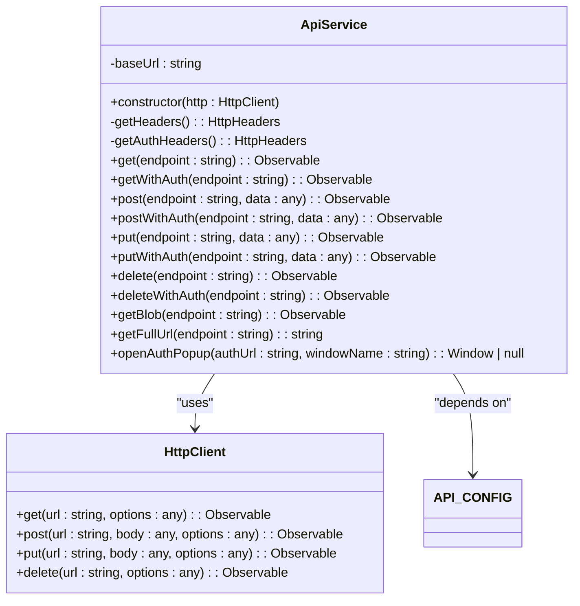
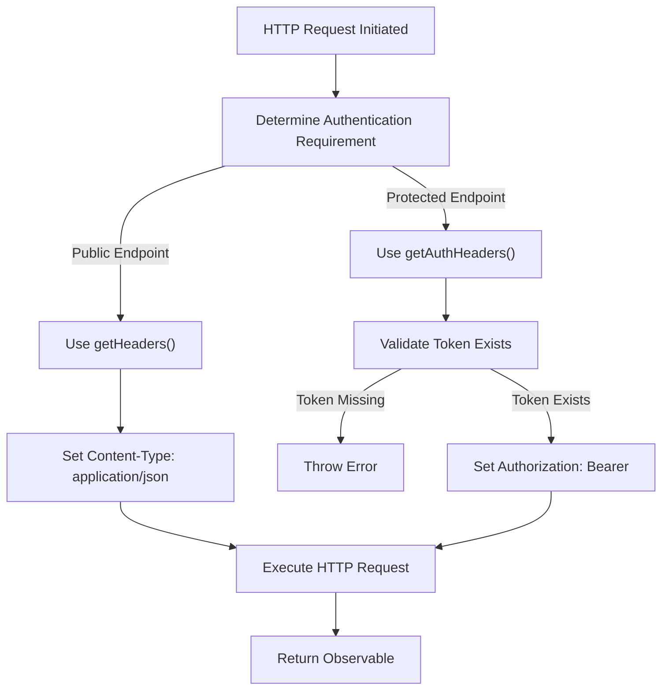
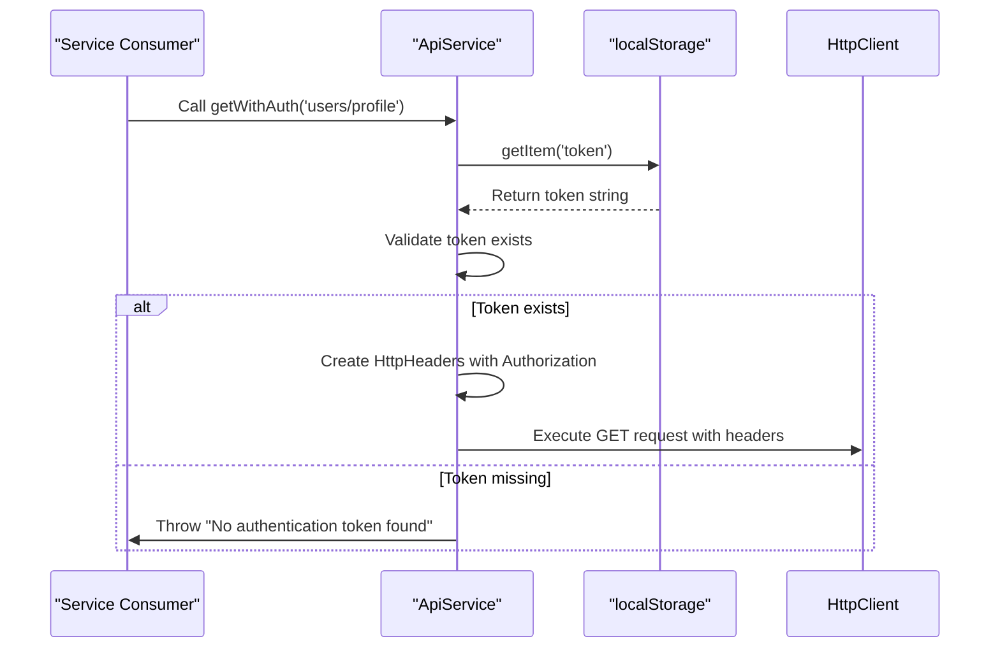
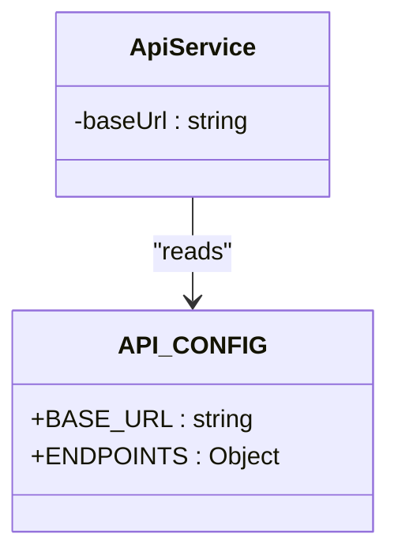
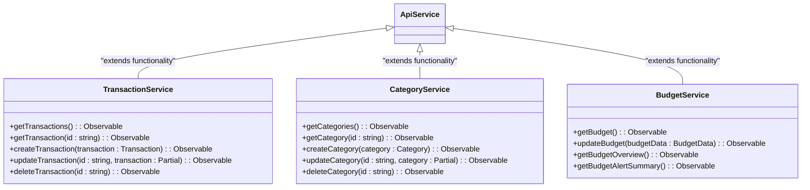
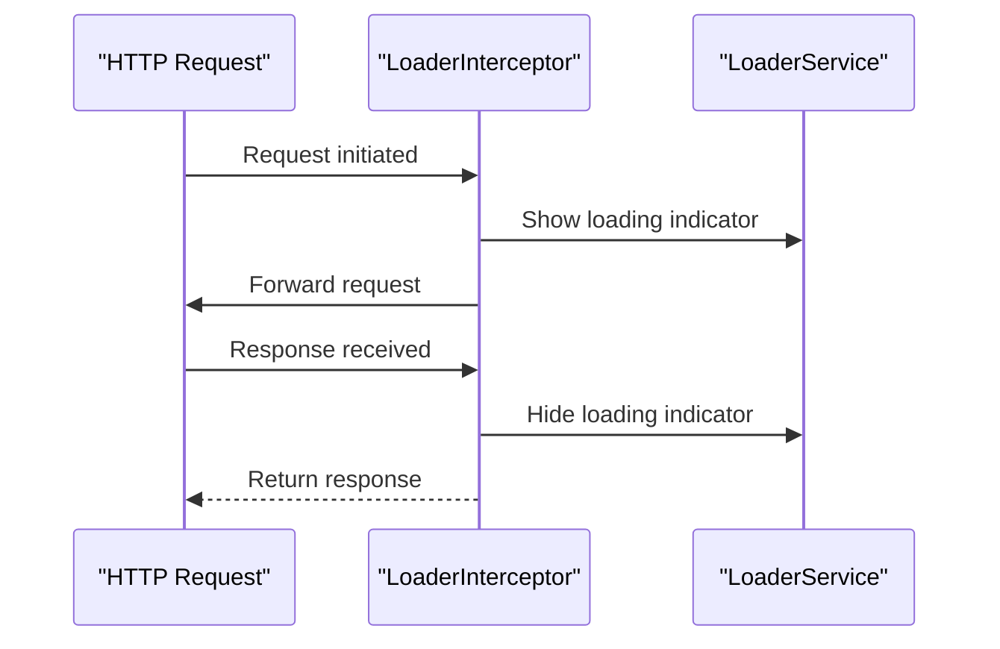
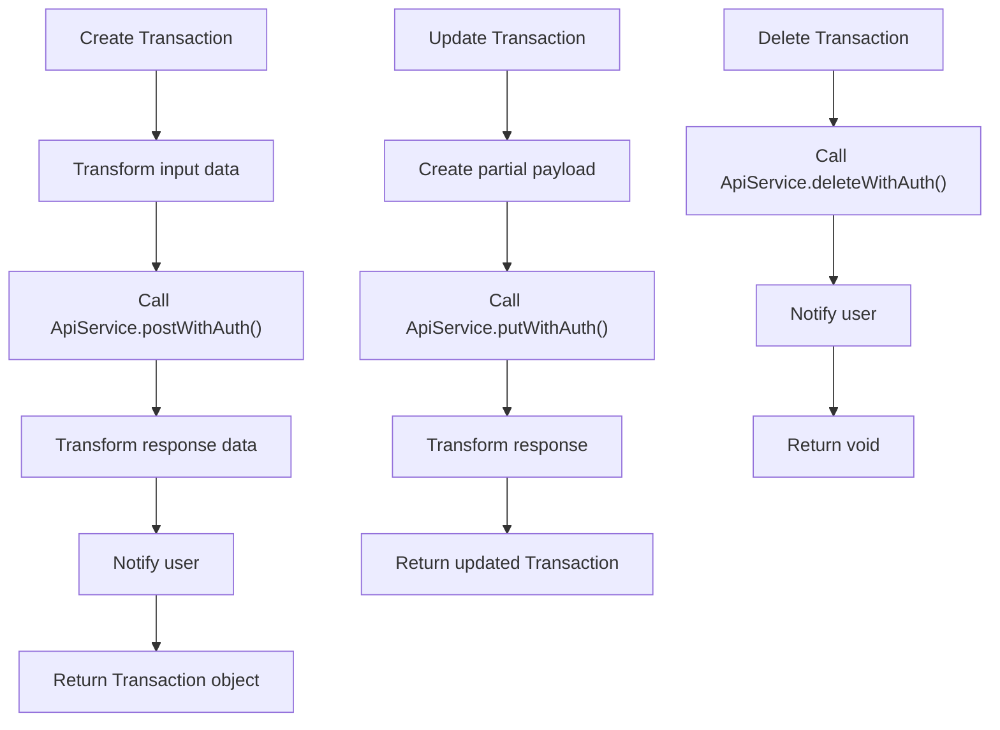
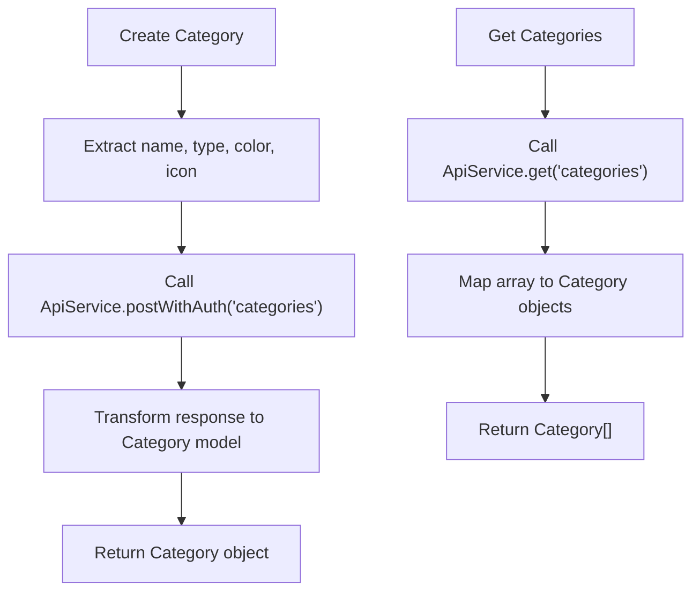
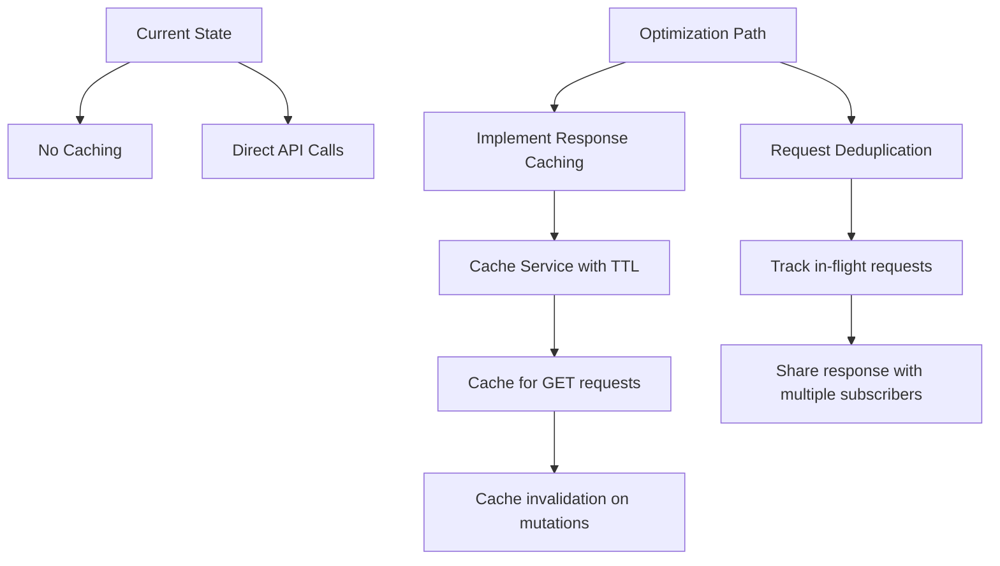

# API Integration Layer

<cite>
**Referenced Files in This Document**   
- [api.service.ts](file://src/app/shared/services/api.service.ts)
- [loader.interceptor.ts](file://src/app/shared/interceptors/loader.interceptor.ts)
- [constants.ts](file://src/app/shared/utils/constants.ts)
- [transaction.service.ts](file://src/app/shared/services/transaction.service.ts)
- [category.service.ts](file://src/app/shared/services/category.service.ts)
- [budget.service.ts](file://src/app/shared/services/budget.service.ts)
</cite>

## Table of Contents
1. [Introduction](#introduction)
2. [Core API Service Architecture](#core-api-service-architecture)
3. [HTTP Method Implementation](#http-method-implementation)
4. [Authentication and Header Management](#authentication-and-header-management)
5. [Environment and Configuration Management](#environment-and-configuration-management)
6. [Endpoint Organization and Type Safety](#endpoint-organization-and-type-safety)
7. [Service Layer Integration](#service-layer-integration)
8. [Loading State Interception](#loading-state-interception)
9. [CRUD Operations Examples](#crud-operations-examples)
10. [Security Considerations](#security-considerations)
11. [Performance and Optimization](#performance-and-optimization)

## Introduction
The ApiService serves as the central HTTP client for backend communication in the Angular application. It provides a wrapper around Angular's HttpClient with standardized configurations for headers, error handling, and base URL settings. This service enables consistent API interactions across the application while supporting authentication, type safety, and environment-specific configurations. The integration layer works in conjunction with interceptors and service classes to manage loading states, transform requests/responses, and organize endpoint access.

## Core API Service Architecture

The ApiService is implemented as an injectable Angular service that encapsulates all HTTP communication logic. It leverages Angular's dependency injection system and is provided at the root level, ensuring a single instance throughout the application lifecycle.



**Diagram sources**
- [api.service.ts](file://src/app/shared/services/api.service.ts#L1-L93)
- [constants.ts](file://src/app/shared/utils/constants.ts#L28-L54)

**Section sources**
- [api.service.ts](file://src/app/shared/services/api.service.ts#L1-L93)

## HTTP Method Implementation

The ApiService provides a comprehensive set of HTTP methods for various use cases, including standard CRUD operations and specialized methods for handling binary data. The service implements both authenticated and non-authenticated variants of each method to support different endpoint requirements.



**Diagram sources**
- [api.service.ts](file://src/app/shared/services/api.service.ts#L15-L93)

**Section sources**
- [api.service.ts](file://src/app/shared/services/api.service.ts#L15-L93)

## Authentication and Header Management

The ApiService implements a robust header management system that automatically handles authentication token injection. Two distinct header generation methods are provided to accommodate different security requirements across endpoints.

### Header Generation Process


The `getHeaders()` method conditionally includes the Authorization header only when a token is present, making it suitable for public endpoints that may accept optional authentication. In contrast, `getAuthHeaders()` enforces authentication by throwing an error if no token is found, ensuring protected endpoints cannot be accessed without proper credentials.

**Diagram sources**
- [api.service.ts](file://src/app/shared/services/api.service.ts#L15-L35)

**Section sources**
- [api.service.ts](file://src/app/shared/services/api.service.ts#L15-L35)

## Environment and Configuration Management

The ApiService relies on configuration constants defined in `constants.ts` to manage environment-specific settings. This approach enables seamless switching between development, staging, and production environments without code changes.



The `API_CONFIG` object contains the base URL for the backend API and a structured organization of endpoints grouped by functionality. This centralized configuration approach ensures consistency across the application and simplifies maintenance when endpoint URLs change.

**Diagram sources**
- [constants.ts](file://src/app/shared/utils/constants.ts#L28-L54)
- [api.service.ts](file://src/app/shared/services/api.service.ts#L6-L8)

**Section sources**
- [constants.ts](file://src/app/shared/utils/constants.ts#L28-L54)

## Endpoint Organization and Type Safety

The ApiService supports type safety through generic methods that allow consumers to specify the expected response type. This enables compile-time type checking and better developer experience with IntelliSense support.

### Endpoint Structure
The endpoint organization follows a hierarchical pattern defined in `constants.ts`:

```typescript
ENDPOINTS: {
  AUTH: {
    LOGIN: 'auth/login',
    SIGNUP: 'auth/signup',
    GOOGLE: 'auth/google'
  },
  TRANSACTIONS: {
    BASE: 'transactions',
    BY_ID: (id: string) => `transactions/${id}`
  },
  CATEGORIES: {
    BASE: 'categories',
    BY_ID: (id: string) => `categories/${id}`
  }
}
```

This structure provides type-safe access to endpoints while supporting dynamic URL generation for parameterized routes.

**Section sources**
- [constants.ts](file://src/app/shared/utils/constants.ts#L35-L54)

## Service Layer Integration

Higher-level service classes such as TransactionService, CategoryService, and BudgetService depend on ApiService to handle HTTP communications. These services add domain-specific logic, data transformation, and business rules on top of the basic HTTP operations.



**Diagram sources**
- [transaction.service.ts](file://src/app/shared/services/transaction.service.ts#L1-L121)
- [category.service.ts](file://src/app/shared/services/category.service.ts#L1-L86)
- [budget.service.ts](file://src/app/shared/services/budget.service.ts#L1-L77)

**Section sources**
- [transaction.service.ts](file://src/app/shared/services/transaction.service.ts#L1-L121)
- [category.service.ts](file://src/app/shared/services/category.service.ts#L1-L86)
- [budget.service.ts](file://src/app/shared/services/budget.service.ts#L1-L77)

## Loading State Interception

The application implements a loading state management system through the `loader.interceptor.ts` file. This interceptor is designed to track HTTP request activity and notify the UI about loading states.



Currently, the loader interceptor is implemented but does not actively manage loading states as it simply passes requests through to the next handler without modifying the loading state. A complete implementation would integrate with the LoaderService to show and hide loading indicators during HTTP requests.

**Diagram sources**
- [loader.interceptor.ts](file://src/app/shared/interceptors/loader.interceptor.ts#L1-L11)
- [loader.service.ts](file://src/app/shared/services/loader.service.ts#L1-L17)

**Section sources**
- [loader.interceptor.ts](file://src/app/shared/interceptors/loader.interceptor.ts#L1-L11)

## CRUD Operations Examples

### Transaction Management
The TransactionService demonstrates complete CRUD operations for financial transactions:



### Category Management
The CategoryService provides similar CRUD functionality for transaction categories:



**Section sources**
- [transaction.service.ts](file://src/app/shared/services/transaction.service.ts#L1-L121)
- [category.service.ts](file://src/app/shared/services/category.service.ts#L1-L86)

## Security Considerations

The ApiService implements several security measures to protect user data and ensure secure communication:

1. **Token-based Authentication**: Uses Bearer tokens stored in localStorage for API authentication
2. **Conditional Header Injection**: Only includes Authorization header when token is present
3. **Enforced Authentication**: Throws explicit errors when authentication is required but token is missing
4. **Secure Storage**: Relies on localStorage for token storage (with awareness of XSS risks)
5. **HTTPS Enforcement**: Base URL uses HTTPS protocol for secure transmission

The service follows the principle of least privilege by providing separate methods for authenticated and unauthenticated requests, ensuring that sensitive endpoints cannot be accidentally accessed without proper credentials.

**Section sources**
- [api.service.ts](file://src/app/shared/services/api.service.ts#L15-L35)
- [constants.ts](file://src/app/shared/utils/constants.ts#L28-L29)

## Performance and Optimization

While the current implementation does not include built-in caching mechanisms, the architecture supports potential performance optimizations:

### Current Performance Characteristics
- **No Client-side Caching**: Each request results in a network call
- **Request Batching**: Services can use RxJS operators like forkJoin to batch multiple requests
- **Efficient Data Transformation**: Uses RxJS pipeable operators for efficient response mapping
- **Lazy Loading**: Services are injected only when needed

### Potential Optimization Opportunities


Future enhancements could include implementing a caching layer to reduce redundant API calls, particularly for frequently accessed data like categories and budget information.

**Section sources**
- [api.service.ts](file://src/app/shared/services/api.service.ts#L1-L93)
- [transaction.service.ts](file://src/app/shared/services/transaction.service.ts#L1-L121)