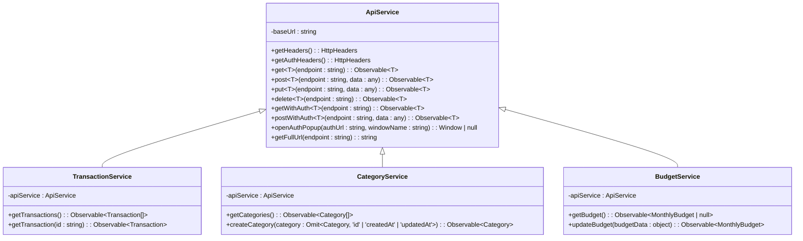
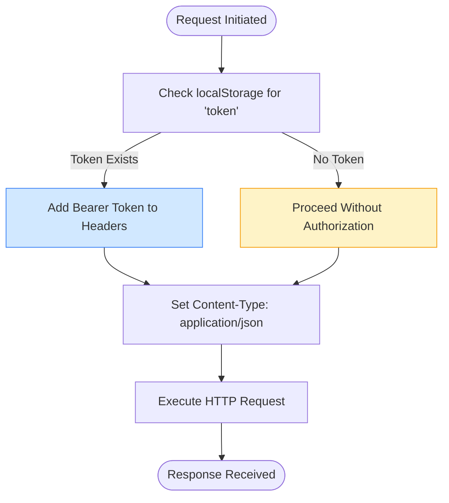
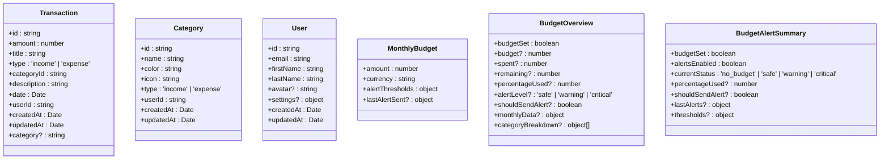

# API Service Implementation

<cite>
**Referenced Files in This Document**  
- [api.service.ts](file://src/app/shared/services/api.service.ts)
- [constants.ts](file://src/app/shared/utils/constants.ts)
- [transaction.model.ts](file://src/app/shared/models/transaction.model.ts)
- [category.model.ts](file://src/app/shared/models/category.model.ts)
- [budget.model.ts](file://src/app/shared/models/budget.model.ts)
- [user.model.ts](file://src/app/shared/models/user.model.ts)
- [transaction.service.ts](file://src/app/shared/services/transaction.service.ts)
- [category.service.ts](file://src/app/shared/services/category.service.ts)
- [budget.service.ts](file://src/app/shared/services/budget.service.ts)
</cite>

## Table of Contents
1. [Introduction](#introduction)
2. [Core Architecture](#core-architecture)
3. [Base URL and Environment Configuration](#base-url-and-environment-configuration)
4. [Header Management and Security](#header-management-and-security)
5. [CRUD Methods and Type Safety](#crud-methods-and-type-safety)
6. [Authentication and Token Handling](#authentication-and-token-handling)
7. [Blob and Binary Response Handling](#blob-and-binary-response-handling)
8. [Convenience Methods](#convenience-methods)
9. [Integration with Data Models](#integration-with-data-models)
10. [Error Handling and Resilience](#error-handling-and-resilience)
11. [Performance and Optimization Considerations](#performance-and-optimization-considerations)
12. [Usage Examples](#usage-examples)

## Introduction
The ApiService class serves as the central HTTP communication layer in the Angular application, abstracting all backend interactions through Angular's HttpClient. It provides a consistent, secure, and type-safe interface for data exchange with the backend API. The service is designed to streamline API calls across various features including transactions, categories, budgets, and user management, while enforcing standardized request formatting and authentication practices.

## Core Architecture
The ApiService is implemented as an injectable Angular service with root-level provisioning, ensuring a single shared instance across the application. It encapsulates HttpClient functionality with enhanced behaviors for headers, authentication, and endpoint resolution. The service acts as a foundational dependency for higher-level domain services such as TransactionService, CategoryService, and BudgetService.

**Diagram sources**
- [api.service.ts](file://src/app/shared/services/api.service.ts#L1-L93)
- [transaction.service.ts](file://src/app/shared/services/transaction.service.ts#L1-L53)
- [category.service.ts](file://src/app/shared/services/category.service.ts#L1-L94)
- [budget.service.ts](file://src/app/shared/services/budget.service.ts#L1-L77)

**Section sources**
- [api.service.ts](file://src/app/shared/services/api.service.ts#L1-L93)

## Base URL and Environment Configuration
The ApiService retrieves its base URL from the API_CONFIG constant defined in constants.ts, enabling environment-specific API endpoint configuration. The current implementation points to a production backend hosted on Vercel, with commented alternatives for local development. This centralized configuration allows seamless switching between environments without modifying service logic.

**Section sources**
- [constants.ts](file://src/app/shared/utils/constants.ts#L30-L54)
- [api.service.ts](file://src/app/shared/services/api.service.ts#L8-L10)

## Header Management and Security
The service implements two header generation methods to handle authenticated and unauthenticated requests. The getHeaders() method conditionally includes the Authorization header when a token exists in localStorage, while always setting Content-Type to application/json. The getAuthHeaders() method enforces authentication by throwing an error if no token is present, ensuring secure access to protected endpoints.

**Diagram sources**
- [api.service.ts](file://src/app/shared/services/api.service.ts#L12-L28)

**Section sources**
- [api.service.ts](file://src/app/shared/services/api.service.ts#L12-L28)

## CRUD Methods and Type Safety
The ApiService provides generic implementations of core HTTP methods (GET, POST, PUT, DELETE) with TypeScript generics for type safety. Each method returns an Observable of the specified type, enabling compile-time type checking when consuming API responses. The service supports both authenticated and unauthenticated variants of each method, allowing flexible access control based on endpoint requirements.

**Section sources**
- [api.service.ts](file://src/app/shared/services/api.service.ts#L30-L75)

## Authentication and Token Handling
Authentication is managed through localStorage persistence of JWT tokens, which are automatically injected into request headers when present. The service distinguishes between optional authentication (get/post/put/delete) and required authentication (getWithAuth/postWithAuth/etc.), providing appropriate error handling for unauthorized access attempts. This pattern ensures that sensitive operations cannot proceed without valid credentials.

**Section sources**
- [api.service.ts](file://src/app/shared/services/api.service.ts#L20-L28)

## Blob and Binary Response Handling
The service includes specialized methods for handling binary responses, particularly for file downloads and report generation. The getBlob and getBlobWithResponse methods configure HttpClient to expect blob responses, making them suitable for downloading reports or other binary assets from endpoints like the monthly report download functionality.

**Section sources**
- [api.service.ts](file://src/app/shared/services/api.service.ts#L50-L65)

## Convenience Methods
The ApiService provides utility methods to simplify common operations. The openAuthPopup method facilitates OAuth authentication flows by opening popup windows with standardized dimensions for third-party login providers. The getFullUrl method enables clients to obtain complete absolute URLs for API endpoints, useful for direct navigation or external sharing.

**Section sources**
- [api.service.ts](file://src/app/shared/services/api.service.ts#L85-L93)

## Integration with Data Models
The service works in conjunction with strongly-typed data models to ensure type consistency across the application. Domain services transform raw API responses into properly typed instances of Transaction, Category, Budget, and User models, handling date conversions and field mappings from backend conventions (e.g., _id) to frontend standards (id).

**Diagram sources**
- [transaction.model.ts](file://src/app/shared/models/transaction.model.ts#L1-L12)
- [category.model.ts](file://src/app/shared/models/category.model.ts#L1-L9)
- [user.model.ts](file://src/app/shared/models/user.model.ts#L1-L15)
- [budget.model.ts](file://src/app/shared/models/budget.model.ts#L1-L59)

**Section sources**
- [transaction.model.ts](file://src/app/shared/models/transaction.model.ts#L1-L12)
- [category.model.ts](file://src/app/shared/models/category.model.ts#L1-L9)
- [user.model.ts](file://src/app/shared/models/user.model.ts#L1-L15)
- [budget.model.ts](file://src/app/shared/models/budget.model.ts#L1-L59)

## Error Handling and Resilience
While the ApiService itself does not implement direct error handling, it enables robust error management in consuming services through RxJS operators. Services like TransactionService and CategoryService use catchError to provide fallback behavior (e.g., mock data) when API calls fail, ensuring application resilience during development or backend outages.

**Section sources**
- [transaction.service.ts](file://src/app/shared/services/transaction.service.ts#L18-L25)
- [category.service.ts](file://src/app/shared/services/category.service.ts#L15-L22)

## Performance and Optimization Considerations
The current implementation prioritizes simplicity and reliability over advanced performance optimizations. While no caching mechanism is currently implemented, the service architecture supports future enhancements such as request deduplication, response caching, or request batching. The use of HttpClient's built-in features ensures efficient connection management and proper resource cleanup.

**Section sources**
- [api.service.ts](file://src/app/shared/services/api.service.ts#L1-L93)

## Usage Examples
The ApiService is consumed by domain-specific services that provide business logic and data transformation. For example, the TransactionService uses get() to retrieve transactions and maps the response to properly typed Transaction objects with correct Date instances. Similarly, the CategoryService uses postWithAuth() to create new categories and putWithAuth() to update existing ones, demonstrating the service's role in implementing CRUD operations across different data models.

**Section sources**
- [transaction.service.ts](file://src/app/shared/services/transaction.service.ts#L15-L53)
- [category.service.ts](file://src/app/shared/services/category.service.ts#L49-L94)
- [budget.service.ts](file://src/app/shared/services/budget.service.ts#L38-L77)