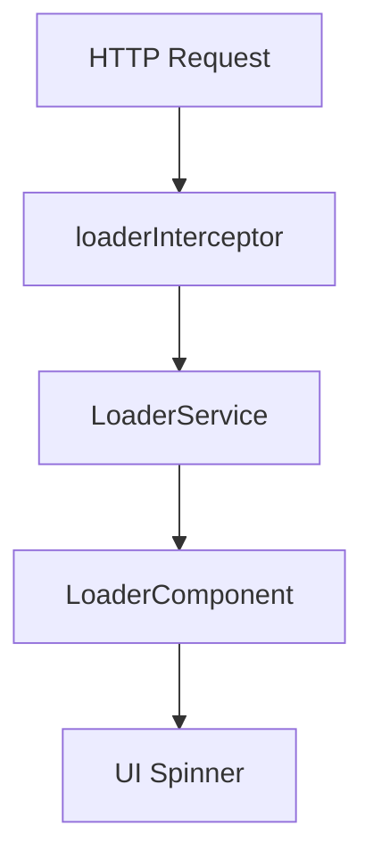
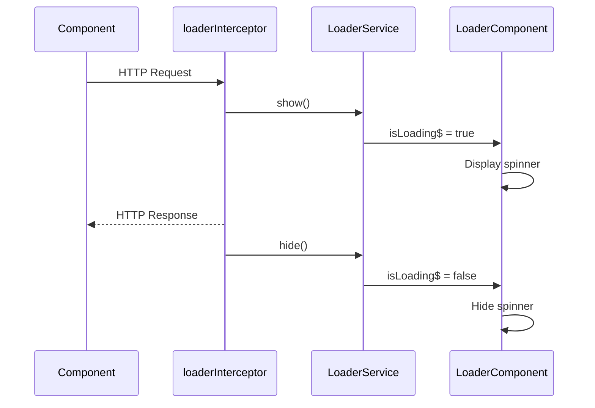
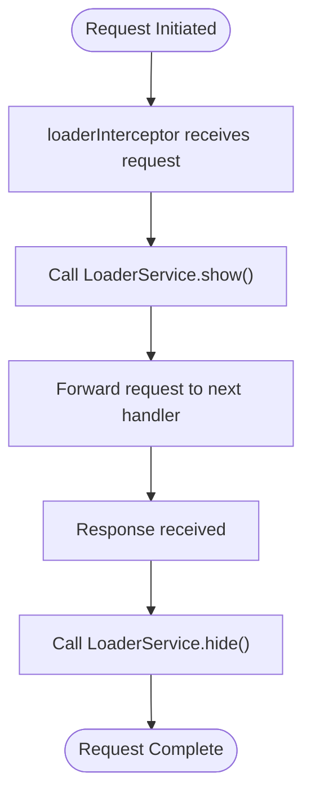
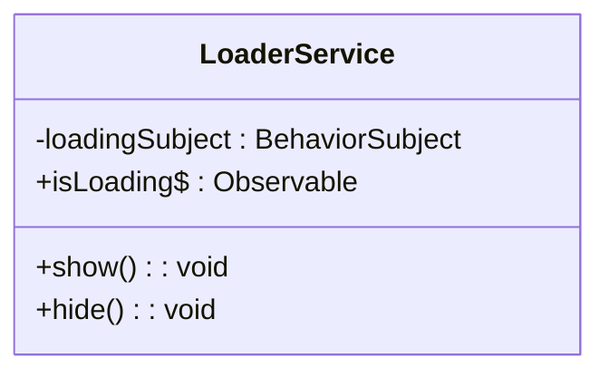
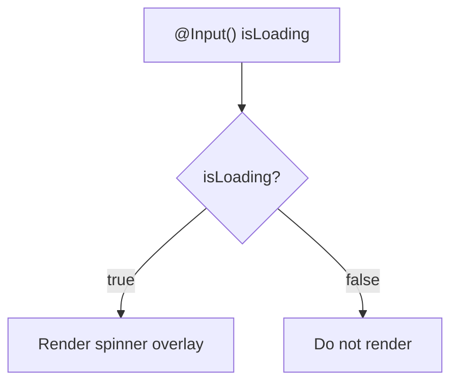
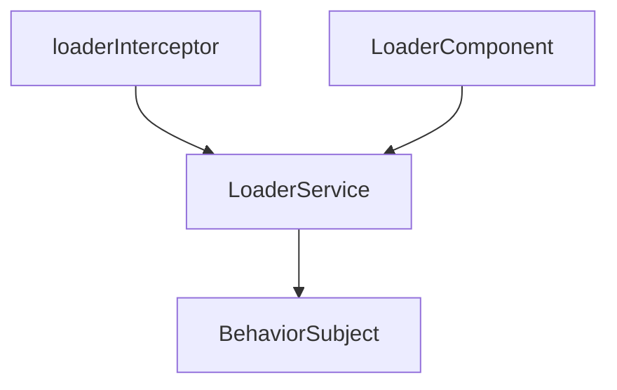

# Request Lifecycle & Interception

<cite>
**Referenced Files in This Document**   
- [loader.interceptor.ts](file://src/app/shared/interceptors/loader.interceptor.ts)
- [loader.service.ts](file://src/app/shared/services/loader.service.ts)
- [loader.component.ts](file://src/app/shared/components/loader/loader.component.ts)
- [loader.component.html](file://src/app/shared/components/loader/loader.component.html)
- [app.config.ts](file://src/app/app.config.ts)
</cite>

## Table of Contents
1. [Introduction](#introduction)
2. [Project Structure](#project-structure)
3. [Core Components](#core-components)
4. [Architecture Overview](#architecture-overview)
5. [Detailed Component Analysis](#detailed-component-analysis)
6. [Dependency Analysis](#dependency-analysis)
7. [Performance Considerations](#performance-considerations)
8. [Troubleshooting Guide](#troubleshooting-guide)
9. [Conclusion](#conclusion)

## Introduction
This document provides a comprehensive analysis of the request lifecycle management system in the Angular application, focusing on the implementation and integration of the `HttpInterceptor` pattern for handling global loading states. The system leverages Angular's `HttpClient` module and interceptors to monitor HTTP requests and responses, enabling a centralized mechanism for managing UI loading indicators. The design promotes separation of concerns by decoupling loading state logic from individual components, ensuring consistent user experience across the application.

## Project Structure
The request lifecycle management system is organized under the `shared` module, which contains reusable components, services, and interceptors. The relevant files are structured as follows:
- `interceptors/loader.interceptor.ts`: Implements the HTTP interceptor to track request events
- `services/loader.service.ts`: Provides a shared state for loading status using RxJS observables
- `components/loader/`: Contains the UI component that displays the loading spinner
- Configuration in `app.config.ts` registers the interceptor in the application's dependency injection system

**Diagram sources**
- [loader.interceptor.ts](file://src/app/shared/interceptors/loader.interceptor.ts#L8-L11)
- [loader.service.ts](file://src/app/shared/services/loader.service.ts#L6-L16)
- [loader.component.ts](file://src/app/shared/components/loader/loader.component.ts#L1-L13)

**Section sources**
- [loader.interceptor.ts](file://src/app/shared/interceptors/loader.interceptor.ts#L1-L11)
- [loader.service.ts](file://src/app/shared/services/loader.service.ts#L1-L18)
- [loader.component.ts](file://src/app/shared/components/loader/loader.component.ts#L1-L13)

## Core Components
The system consists of three core components that work together to manage loading states:
- **LoaderInterceptor**: Listens to HTTP events and triggers loading state changes
- **LoaderService**: Centralized service that maintains and broadcasts loading state
- **LoaderComponent**: UI component that reacts to loading state changes and displays the spinner

These components follow the dependency injection pattern in Angular, allowing loose coupling and easy testing.

**Section sources**
- [loader.interceptor.ts](file://src/app/shared/interceptors/loader.interceptor.ts#L8-L11)
- [loader.service.ts](file://src/app/shared/services/loader.service.ts#L6-L16)
- [loader.component.ts](file://src/app/shared/components/loader/loader.component.ts#L1-L13)

## Architecture Overview
The architecture follows a reactive programming model using RxJS observables. When an HTTP request is initiated, the interceptor captures the event and notifies the `LoaderService`, which updates its internal state. The `LoaderComponent` subscribes to this state and conditionally renders the loading spinner. This pattern ensures that all HTTP requests are automatically tracked without requiring manual intervention in individual components.

**Diagram sources**
- [loader.interceptor.ts](file://src/app/shared/interceptors/loader.interceptor.ts#L8-L11)
- [loader.service.ts](file://src/app/shared/services/loader.service.ts#L6-L16)
- [loader.component.ts](file://src/app/shared/components/loader/loader.component.ts#L1-L13)

## Detailed Component Analysis

### Loader Interceptor Analysis
The `loaderInterceptor` function is designed to intercept HTTP requests and responses. Currently, it passes through the request without modification, but it has the capability to listen for different types of HTTP events (request start, response, error). The interceptor should be enhanced to call `LoaderService.show()` when a request begins and `LoaderService.hide()` when it completes or fails.

**Diagram sources**
- [loader.interceptor.ts](file://src/app/shared/interceptors/loader.interceptor.ts#L8-L11)

**Section sources**
- [loader.interceptor.ts](file://src/app/shared/interceptors/loader.interceptor.ts#L8-L11)

### Loader Service Analysis
The `LoaderService` uses a `BehaviorSubject` to maintain the loading state, which ensures that new subscribers immediately receive the current state. The service provides `show()` and `hide()` methods to update the state, and exposes an observable `isLoading$` for components to subscribe to.

**Diagram sources**
- [loader.service.ts](file://src/app/shared/services/loader.service.ts#L6-L16)

**Section sources**
- [loader.service.ts](file://src/app/shared/services/loader.service.ts#L1-L18)

### Loader Component Analysis
The `LoaderComponent` is a simple UI component that displays a spinner when `isLoading` is true. It uses Angular's `*ngIf` directive to conditionally render the loading overlay. The component is designed to be reusable and can be included in any part of the application.

**Diagram sources**
- [loader.component.ts](file://src/app/shared/components/loader/loader.component.ts#L1-L13)
- [loader.component.html](file://src/app/shared/components/loader/loader.component.html#L1-L4)

**Section sources**
- [loader.component.ts](file://src/app/shared/components/loader/loader.component.ts#L1-L13)
- [loader.component.html](file://src/app/shared/components/loader/loader.component.html#L1-L4)

## Dependency Analysis
The components are connected through Angular's dependency injection system. The `loaderInterceptor` depends on `LoaderService`, and the `LoaderComponent` also depends on the same service instance due to its `providedIn: 'root'` configuration. This ensures that all parts of the application share the same loading state.

**Diagram sources**
- [loader.interceptor.ts](file://src/app/shared/interceptors/loader.interceptor.ts#L8-L11)
- [loader.service.ts](file://src/app/shared/services/loader.service.ts#L6-L16)
- [loader.component.ts](file://src/app/shared/components/loader/loader.component.ts#L1-L13)

**Section sources**
- [loader.interceptor.ts](file://src/app/shared/interceptors/loader.interceptor.ts#L8-L11)
- [loader.service.ts](file://src/app/shared/services/loader.service.ts#L6-L16)
- [loader.component.ts](file://src/app/shared/components/loader/loader.component.ts#L1-L13)

## Performance Considerations
The current implementation has minimal overhead since it only involves simple state changes. However, in high-frequency API call scenarios, rapid toggling of the loading state might cause flickering. To mitigate this, a debounce mechanism could be implemented in the `LoaderService` to ensure the spinner remains visible for a minimum duration. Additionally, for multiple concurrent requests, the service should maintain a request counter to prevent premature hiding of the loader.

## Troubleshooting Guide
Common issues include:
- Loading spinner not appearing: Verify that the interceptor is properly registered in `app.config.ts`
- Spinner not hiding: Check for unhandled HTTP errors that might prevent the `hide()` call
- Multiple spinners: Ensure only one instance of `LoaderComponent` is present in the DOM
- Delayed response: Consider implementing a minimum display time for the spinner to avoid flickering

**Section sources**
- [loader.interceptor.ts](file://src/app/shared/interceptors/loader.interceptor.ts#L8-L11)
- [loader.service.ts](file://src/app/shared/services/loader.service.ts#L6-L16)
- [loader.component.ts](file://src/app/shared/components/loader/loader.component.ts#L1-L13)

## Conclusion
The request lifecycle management system provides a robust foundation for handling loading states in Angular applications. By leveraging interceptors and reactive programming, it achieves a clean separation of concerns and promotes reusability. Future enhancements should focus on improving the interceptor logic to properly handle request counting and error cases, ensuring a seamless user experience during API interactions.