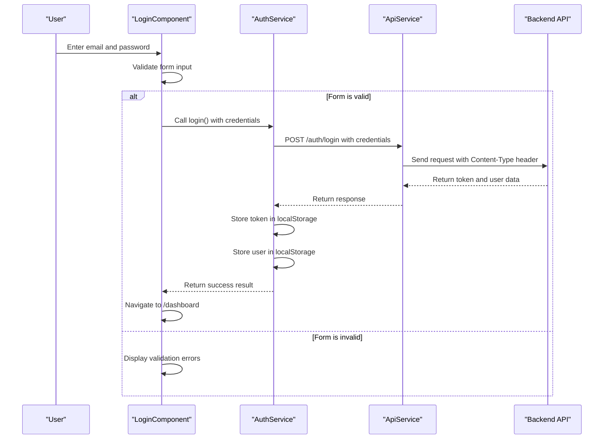
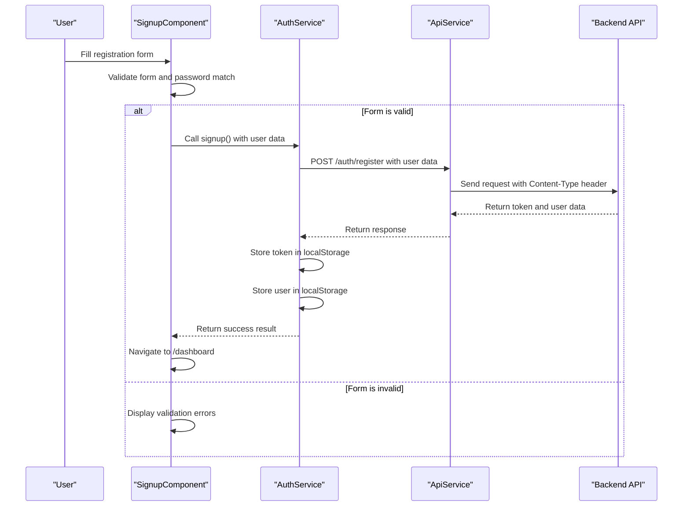
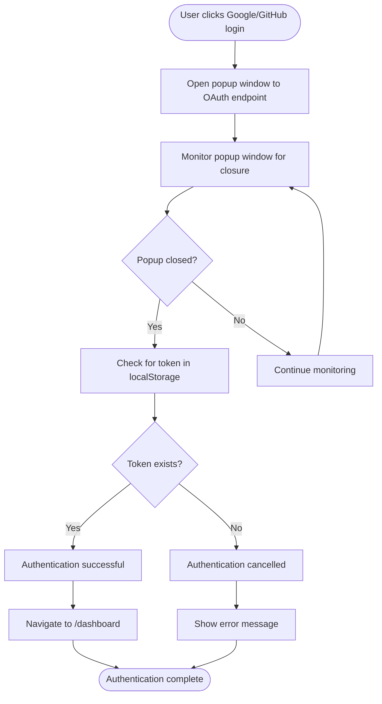
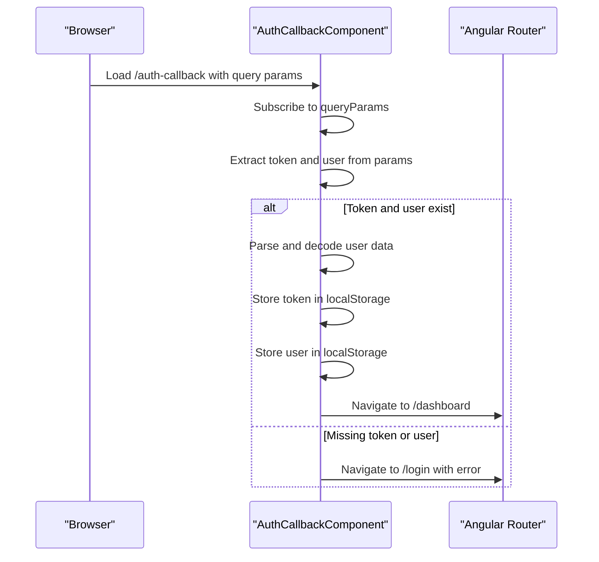
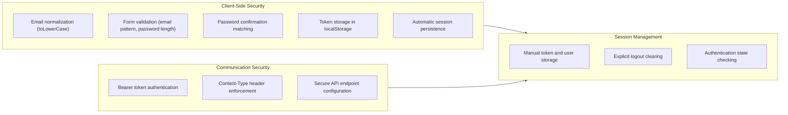
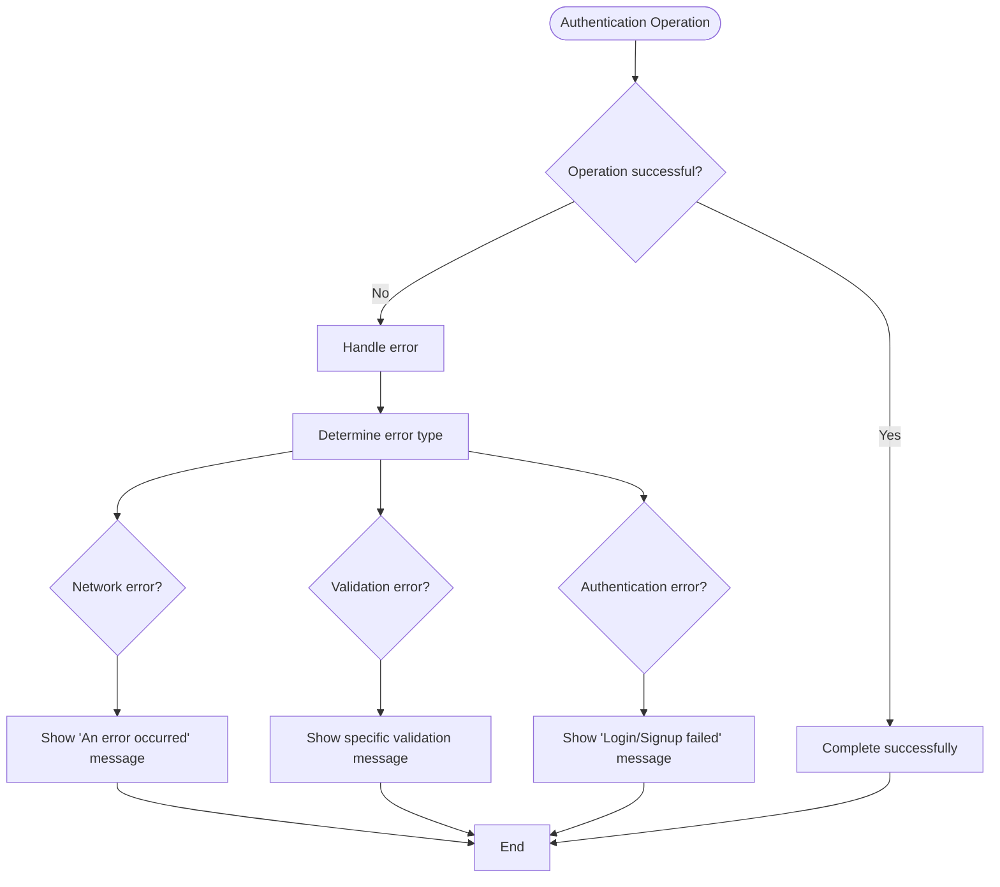

# Authentication System

<cite>
**Referenced Files in This Document**   
- [auth.service.ts](file://src/app/auth/auth.service.ts)
- [login.component.ts](file://src/app/auth/login/login.component.ts)
- [signup.component.ts](file://src/app/auth/signup/signup.component.ts)
- [auth-callback.component.ts](file://src/app/auth/auth-callback/auth-callback.component.ts)
- [api.service.ts](file://src/app/shared/services/api.service.ts)
- [constants.ts](file://src/app/shared/utils/constants.ts)
- [user.model.ts](file://src/app/shared/models/user.model.ts)
</cite>

## Table of Contents
1. [Introduction](#introduction)
2. [Core Components](#core-components)
3. [AuthService Implementation](#authservice-implementation)
4. [Login and Signup Workflows](#login-and-signup-workflows)
5. [OAuth Integration](#oauth-integration)
6. [Auth Callback Processing](#auth-callback-processing)
7. [Security Aspects](#security-aspects)
8. [Error Handling and Troubleshooting](#error-handling-and-troubleshooting)
9. [Best Practices](#best-practices)

## Introduction
The authentication system in this Angular application provides secure user access through multiple methods including email/password login, registration, and OAuth integration with Google and GitHub. The system is built around a centralized `AuthService` that manages user sessions, token storage, and authentication state across the application. This document details the implementation, workflows, security considerations, and troubleshooting guidance for the complete authentication flow.

## Core Components

The authentication system consists of several key components working together to provide a seamless and secure user experience:

- **AuthService**: Central service managing authentication logic, token handling, and user session
- **LoginComponent**: Handles email/password login with form validation and error handling
- **SignupComponent**: Manages user registration with password confirmation and validation
- **AuthCallbackComponent**: Processes OAuth redirect results and completes authentication
- **ApiService**: Provides HTTP communication layer with proper headers and authentication
- **User Model**: Defines the structure of authenticated user data

**Section sources**
- [auth.service.ts](file://src/app/auth/auth.service.ts#L1-L120)
- [login.component.ts](file://src/app/auth/login/login.component.ts#L1-L88)
- [signup.component.ts](file://src/app/auth/signup/signup.component.ts#L1-L105)
- [auth-callback.component.ts](file://src/app/auth/auth-callback/auth-callback.component.ts#L1-L41)
- [api.service.ts](file://src/app/shared/services/api.service.ts#L1-L93)
- [user.model.ts](file://src/app/shared/models/user.model.ts#L1-L15)

## AuthService Implementation

The `AuthService` is the central component responsible for managing authentication state, token persistence, and user session data. It provides methods for login, signup, logout, and OAuth authentication.

```mermaid
classDiagram
class AuthService {
-currentUser : User | null
+login(email : string, password : string) : Observable~{ success : boolean; user? : User; message? : string }~
+signup(userData : any) : Observable~{ success : boolean; user? : User; message? : string }~
+logout() : void
+isAuthenticated() : boolean
+getCurrentUser() : User | null
+getToken() : string | null
+loginWithGoogle() : Observable~{ success : boolean; user? : User; message? : string }~
+loginWithGitHub() : Observable~{ success : boolean; user? : User; message? : string }~
}
class ApiService {
+post<T>(endpoint : string, data : any) : Observable<T>
+openAuthPopup(authUrl : string, windowName : string) : Window | null
}
class User {
id : string
email : string
firstName : string
lastName : string
createdAt : Date
updatedAt : Date
}
AuthService --> ApiService : "uses"
AuthService --> User : "manages"
AuthService ..> "localStorage" : "stores token and user"
```

**Diagram sources**
- [auth.service.ts](file://src/app/auth/auth.service.ts#L1-L120)
- [api.service.ts](file://src/app/shared/services/api.service.ts#L1-L93)
- [user.model.ts](file://src/app/shared/models/user.model.ts#L1-L15)

**Section sources**
- [auth.service.ts](file://src/app/auth/auth.service.ts#L1-L120)

## Login and Signup Workflows

The login and signup components implement form-based authentication with comprehensive validation and error handling.

### Login Component Analysis
The login component provides email/password authentication with client-side validation for email format and password length.



**Diagram sources**
- [login.component.ts](file://src/app/auth/login/login.component.ts#L1-L88)
- [auth.service.ts](file://src/app/auth/auth.service.ts#L15-L35)

### Signup Component Analysis
The signup component handles user registration with additional validation for name fields and password confirmation.



**Diagram sources**
- [signup.component.ts](file://src/app/auth/signup/signup.component.ts#L1-L105)
- [auth.service.ts](file://src/app/auth/auth.service.ts#L37-L57)

**Section sources**
- [login.component.ts](file://src/app/auth/login/login.component.ts#L1-L88)
- [signup.component.ts](file://src/app/auth/signup/signup.component.ts#L1-L105)

## OAuth Integration

The system supports OAuth authentication with Google and GitHub through popup windows, providing a seamless third-party login experience.

### OAuth Flow Analysis
The OAuth integration uses popup authentication to maintain the main application context while authenticating with external providers.



**Diagram sources**
- [auth.service.ts](file://src/app/auth/auth.service.ts#L95-L115)
- [login.component.ts](file://src/app/auth/login/login.component.ts#L65-L85)
- [signup.component.ts](file://src/app/auth/signup/signup.component.ts#L85-L105)

**Section sources**
- [auth.service.ts](file://src/app/auth/auth.service.ts#L95-L115)

## Auth Callback Processing

The auth-callback component handles the final stage of OAuth authentication by processing redirect parameters and completing the authentication flow.



**Diagram sources**
- [auth-callback.component.ts](file://src/app/auth/auth-callback/auth-callback.component.ts#L1-L41)

**Section sources**
- [auth-callback.component.ts](file://src/app/auth/auth-callback/auth-callback.component.ts#L1-L41)

## Security Aspects

The authentication system implements several security measures to protect user data and maintain session integrity.

### Security Implementation


Key security features include:
- **Password hashing**: Handled on the server side (implied by backend API)
- **Token storage**: JWT tokens stored in localStorage for session persistence
- **Client-side validation**: Email format and password length validation
- **Session expiration**: Managed by token expiration on the backend
- **Secure headers**: Authorization headers with Bearer tokens for API requests

**Section sources**
- [auth.service.ts](file://src/app/auth/auth.service.ts#L1-L120)
- [api.service.ts](file://src/app/shared/services/api.service.ts#L1-L93)
- [constants.ts](file://src/app/shared/utils/constants.ts#L1-L54)

## Error Handling and Troubleshooting

The authentication system includes comprehensive error handling for various failure scenarios.

### Common Authentication Issues
| Issue | Possible Cause | Solution |
|------|---------------|----------|
| Login fails with "Login failed" message | Invalid credentials or server error | Verify email/password, check network connection |
| OAuth login doesn't complete | Popup blocked or closed prematurely | Disable popup blockers, ensure popup remains open |
| Page redirects to login after refresh | Session not properly persisted | Verify localStorage contains token and currentUser |
| Password confirmation mismatch | Passwords don't match in signup form | Ensure both password fields contain identical values |
| API requests fail after login | Token not properly attached to requests | Verify AuthService sets token in localStorage correctly |

### Error Flow Analysis


**Section sources**
- [auth.service.ts](file://src/app/auth/auth.service.ts#L25-L35)
- [login.component.ts](file://src/app/auth/login/login.component.ts#L50-L60)
- [signup.component.ts](file://src/app/auth/signup/signup.component.ts#L70-L80)

## Best Practices

### Recommended Implementation Practices
1. **Token Security**: Consider using httpOnly cookies instead of localStorage for token storage in production
2. **Session Management**: Implement token refresh mechanisms to handle expiration gracefully
3. **Input Sanitization**: Add additional client-side sanitization for user inputs
4. **Error Logging**: Implement proper error logging for authentication failures
5. **Rate Limiting**: Ensure backend implements rate limiting for authentication endpoints
6. **Two-Factor Authentication**: Consider implementing 2FA for enhanced security
7. **Password Policies**: Enforce stronger password requirements on both client and server

### Security Recommendations
- Regularly update OAuth provider configurations
- Implement proper logout functionality across all devices
- Monitor for suspicious login attempts
- Use HTTPS for all authentication requests
- Validate and sanitize all user inputs
- Implement proper CORS policies on the backend
- Regularly audit authentication logs

**Section sources**
- [auth.service.ts](file://src/app/auth/auth.service.ts#L1-L120)
- [api.service.ts](file://src/app/shared/services/api.service.ts#L1-L93)
- [constants.ts](file://src/app/shared/utils/constants.ts#L1-L54)