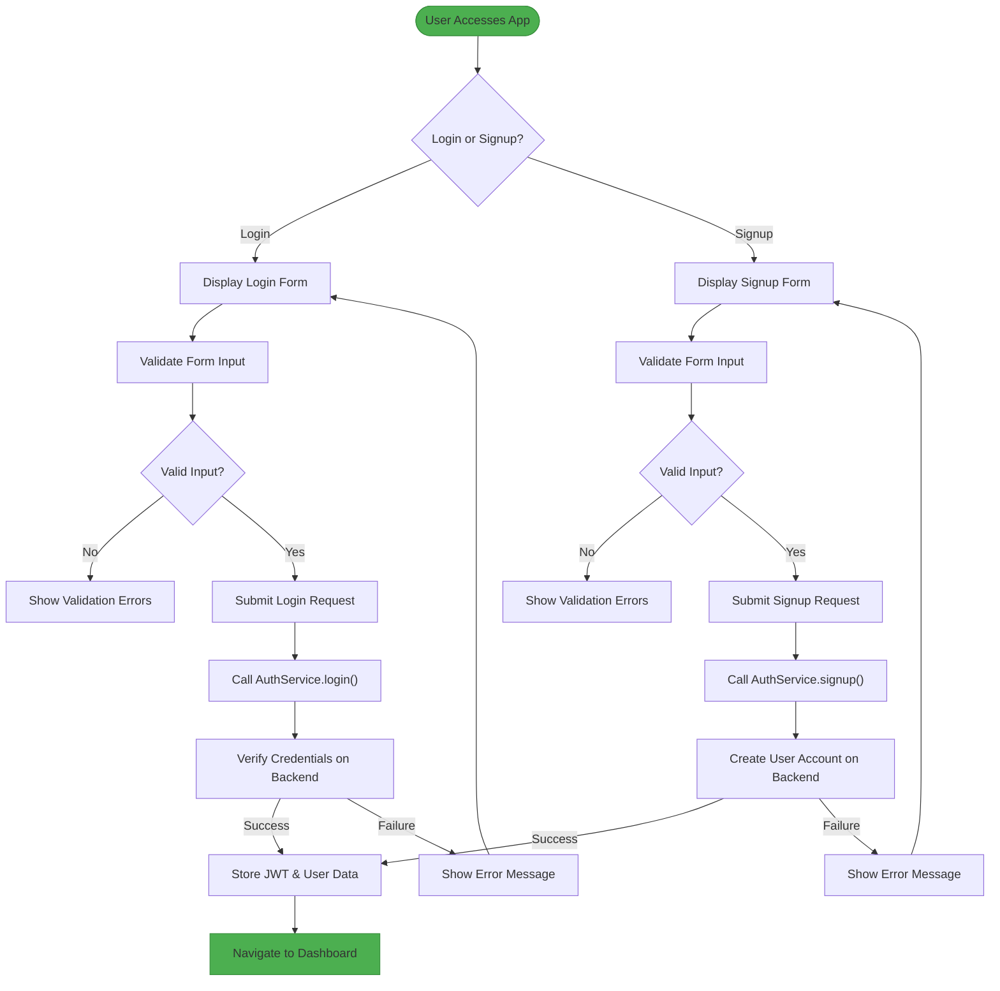
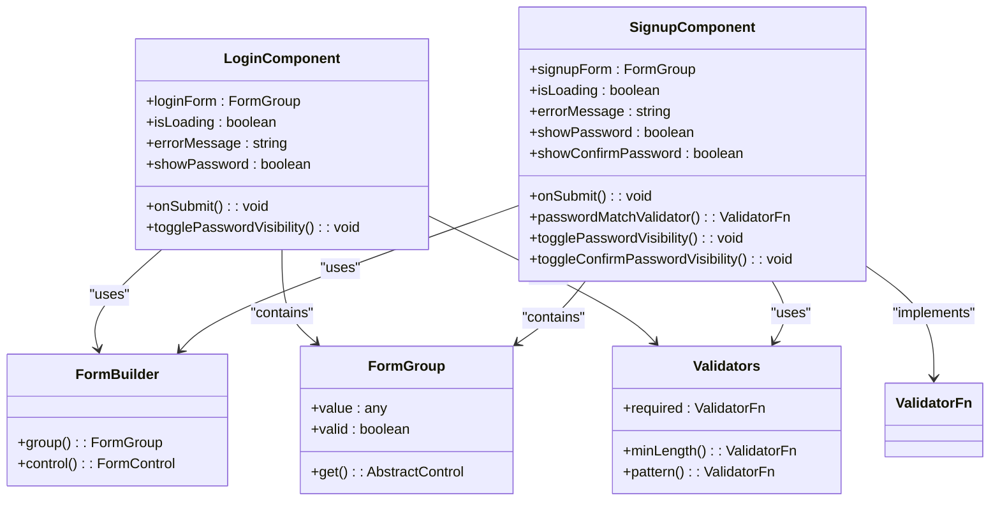
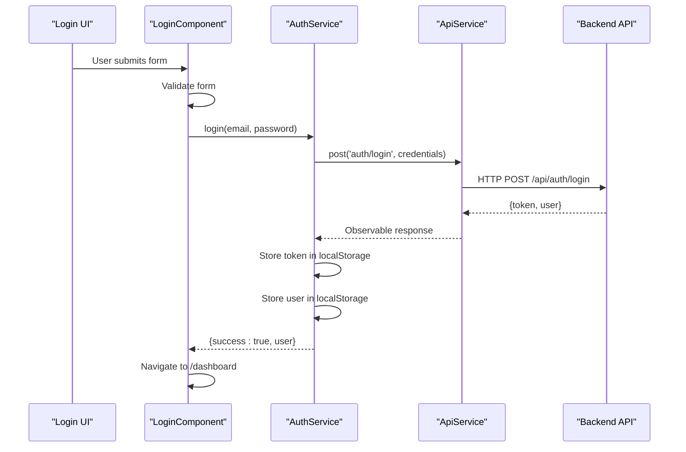
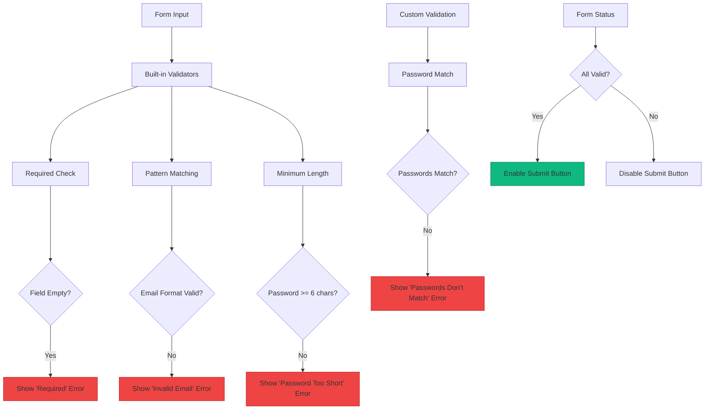
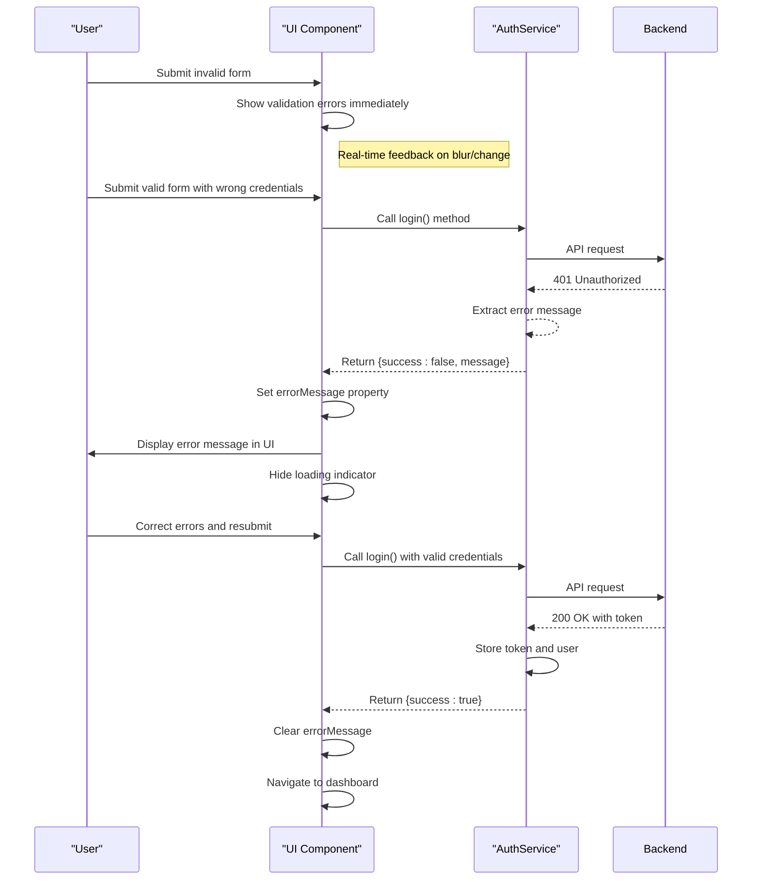
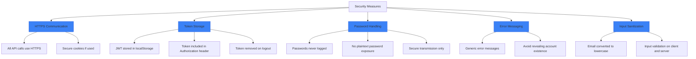
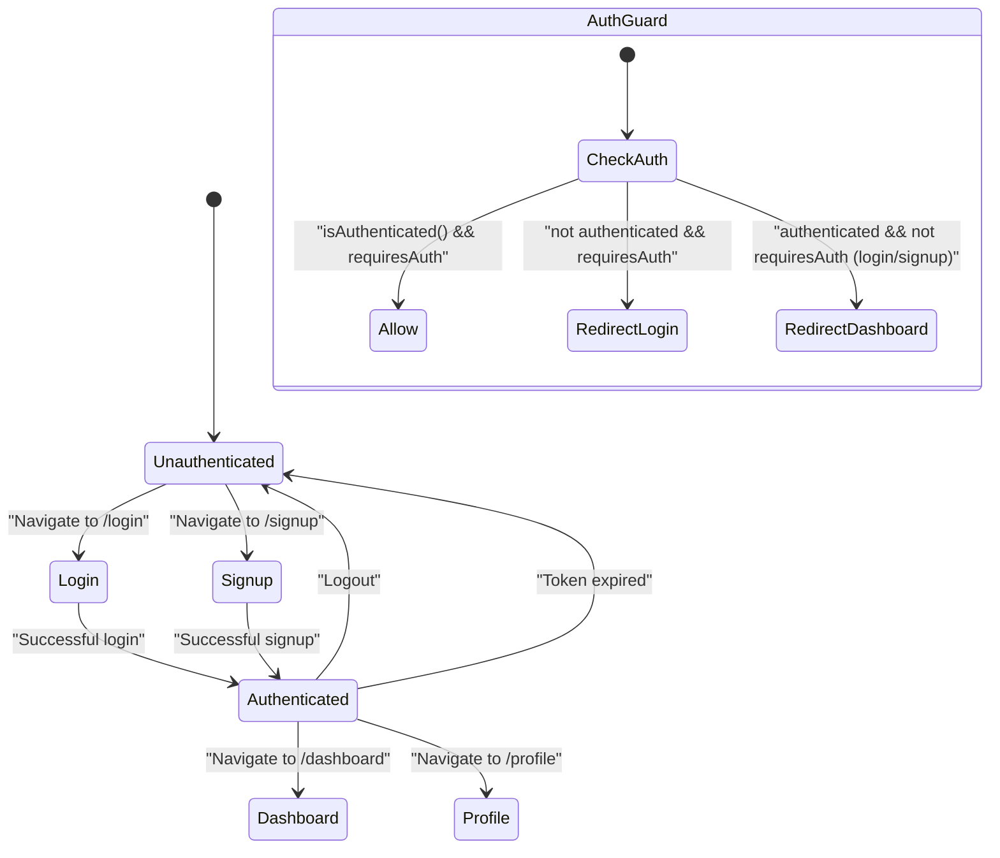

# Email & Password Authentication

<cite>
**Referenced Files in This Document**   
- [auth.service.ts](file://src/app/auth/auth.service.ts)
- [login.component.ts](file://src/app/auth/login/login.component.ts)
- [signup.component.ts](file://src/app/auth/signup/signup.component.ts)
- [api.service.ts](file://src/app/shared/services/api.service.ts)
- [user.model.ts](file://src/app/shared/models/user.model.ts)
- [auth.guard.ts](file://src/app/shared/services/auth.guard.ts)
- [constants.ts](file://src/app/shared/utils/constants.ts)
</cite>

## Table of Contents
1. [Introduction](#introduction)
2. [Authentication Flow Overview](#authentication-flow-overview)
3. [Core Components](#core-components)
4. [Reactive Form Implementation](#reactive-form-implementation)
5. [AuthService Methods](#authservice-methods)
6. [Client-Side Validation](#client-side-validation)
7. [Error Handling and UI Feedback](#error-handling-and-ui-feedback)
8. [Security Considerations](#security-considerations)
9. [Integration with AuthGuard and Routing](#integration-with-authguard-and-routing)
10. [Conclusion](#conclusion)

## Introduction
This document details the implementation of email and password authentication in the Angular application. It covers the login and signup flows, including reactive form validation, error handling, UI feedback mechanisms, and integration with backend services. The authentication system is built using Angular's reactive forms, HTTP client, and routing modules, with secure communication via HTTPS and token-based authentication.

## Authentication Flow Overview

**Diagram sources**
- [auth.service.ts](file://src/app/auth/auth.service.ts#L20-L60)
- [login.component.ts](file://src/app/auth/login/login.component.ts#L30-L60)
- [signup.component.ts](file://src/app/auth/signup/signup.component.ts#L30-L70)

## Core Components

The authentication system consists of several key components:
- **LoginComponent**: Handles user login with email and password
- **SignupComponent**: Manages user registration with form validation
- **AuthService**: Central service for authentication operations
- **ApiService**: Communicates with the backend API
- **AuthGuard**: Protects routes requiring authentication

These components work together to provide a secure and user-friendly authentication experience.

**Section sources**
- [auth.service.ts](file://src/app/auth/auth.service.ts#L1-L120)
- [login.component.ts](file://src/app/auth/login/login.component.ts#L1-L88)
- [signup.component.ts](file://src/app/auth/signup/signup.component.ts#L1-L105)

## Reactive Form Implementation

**Diagram sources**
- [login.component.ts](file://src/app/auth/login/login.component.ts#L10-L25)
- [signup.component.ts](file://src/app/auth/signup/signup.component.ts#L10-L35)

### Login Form Structure
The login component implements a reactive form with the following fields:
- **email**: Required field with email pattern validation
- **password**: Required field with minimum length of 6 characters

The form is initialized in the constructor using FormBuilder and bound to the template via `formGroup` directive.

### Signup Form Structure
The signup component includes additional validation requirements:
- **firstName** and **lastName**: Required fields
- **email**: Validated with pattern matching
- **password**: Minimum 6 characters
- **confirmPassword**: Must match password field using custom validator

The component implements a cross-field validator to ensure password confirmation matches.

**Section sources**
- [login.component.ts](file://src/app/auth/login/login.component.ts#L20-L30)
- [signup.component.ts](file://src/app/auth/signup/signup.component.ts#L20-L45)

## AuthService Methods

**Diagram sources**
- [auth.service.ts](file://src/app/auth/auth.service.ts#L20-L40)
- [login.component.ts](file://src/app/auth/login/login.component.ts#L50-L70)

### login() Method
The `login()` method in AuthService handles user authentication:
1. Sends POST request to `/auth/login` endpoint via ApiService
2. On successful response:
   - Stores JWT token in localStorage
   - Maps user data from response to User interface
   - Stores user object in localStorage
   - Returns success status with user data
3. On error:
   - Catches HTTP errors
   - Returns failure status with error message
   - Prevents token storage

### signup() Method
The `signup()` method manages user registration:
1. Transforms form data to match API requirements
2. Sends POST request to `/auth/register` endpoint
3. On success:
   - Stores received JWT token
   - Creates User object with form data
   - Persists user data in localStorage
   - Returns success status
4. On failure:
   - Handles error response
   - Returns appropriate error message

**Section sources**
- [auth.service.ts](file://src/app/auth/auth.service.ts#L20-L60)

## Client-Side Validation

**Diagram sources**
- [signup.component.ts](file://src/app/auth/signup/signup.component.ts#L35-L45)

### Validation Rules
The application implements the following client-side validation:

**Email Field**
- Required: Cannot be empty
- Pattern: Must match standard email format using regex `/^[a-zA-Z0-9._%+-]+@[a-zA-Z0-9.-]+\.[a-zA-Z]{2,}$/`

**Password Field**
- Required: Cannot be empty
- Minimum length: At least 6 characters

**Additional Signup Validation**
- First and last name: Required fields
- Password confirmation: Custom validator ensures both password fields match

All forms automatically convert email input to lowercase before submission to ensure consistency.

**Section sources**
- [login.component.ts](file://src/app/auth/login/login.component.ts#L25-L30)
- [signup.component.ts](file://src/app/auth/signup/signup.component.ts#L25-L45)

## Error Handling and UI Feedback

**Diagram sources**
- [login.component.ts](file://src/app/auth/login/login.component.ts#L50-L75)
- [auth.service.ts](file://src/app/auth/auth.service.ts#L30-L40)

The authentication components provide comprehensive error handling:
- **Form-level errors**: Displayed in real-time as users interact with form fields
- **Submission errors**: Shown when API returns failure response
- **Loading state**: Visual feedback during API requests
- **Password visibility**: Toggle to help users verify input

Error messages are displayed prominently below the form and cleared on successful submission or form reset.

**Section sources**
- [login.component.ts](file://src/app/auth/login/login.component.ts#L50-L75)
- [signup.component.ts](file://src/app/auth/signup/signup.component.ts#L60-L85)

## Security Considerations

**Diagram sources**
- [auth.service.ts](file://src/app/auth/auth.service.ts#L20-L60)
- [api.service.ts](file://src/app/shared/services/api.service.ts#L10-L30)

The authentication system implements several security best practices:
- **HTTPS**: All API communications occur over encrypted connections
- **Token-based authentication**: JWT tokens are stored in localStorage and sent in Authorization headers
- **Password protection**: Passwords are never exposed in client-side logs or UI
- **Secure error handling**: Error messages avoid revealing whether an email exists in the system
- **Input sanitization**: Email addresses are normalized to lowercase
- **Proper token management**: Tokens are removed from storage during logout

The ApiService automatically includes the Authorization header with valid tokens for authenticated requests.

**Section sources**
- [auth.service.ts](file://src/app/auth/auth.service.ts#L20-L60)
- [api.service.ts](file://src/app/shared/services/api.service.ts#L10-L50)

## Integration with AuthGuard and Routing

**Diagram sources**
- [auth.guard.ts](file://src/app/shared/services/auth.guard.ts#L1-L30)
- [auth.service.ts](file://src/app/auth/auth.service.ts#L80-L100)

The AuthGuard protects routes that require authentication:
- **Authenticated users**: Can access protected routes (dashboard, profile, etc.)
- **Unauthenticated users**: Redirected to login page when accessing protected routes
- **Login/Signup pages**: AuthGuard redirects authenticated users away from authentication pages

The guard checks authentication status via AuthService and makes routing decisions based on the `requiresAuth` route data parameter. After successful authentication, users are navigated to the dashboard route.

**Section sources**
- [auth.guard.ts](file://src/app/shared/services/auth.guard.ts#L1-L30)
- [auth.service.ts](file://src/app/auth/auth.service.ts#L80-L100)

## Conclusion
The email and password authentication system provides a secure and user-friendly way for users to access the application. Key features include reactive form validation, comprehensive error handling, secure token management, and seamless integration with Angular's routing system. The separation of concerns between components and services ensures maintainability and testability. By following security best practices and providing clear user feedback, the authentication flow creates a positive user experience while protecting user data.