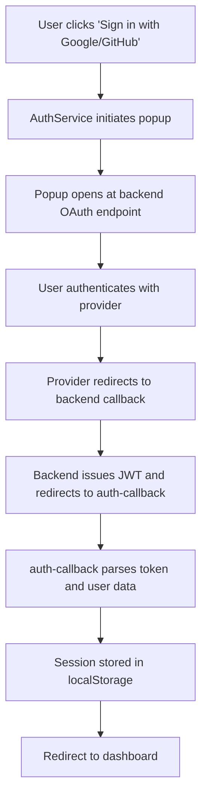
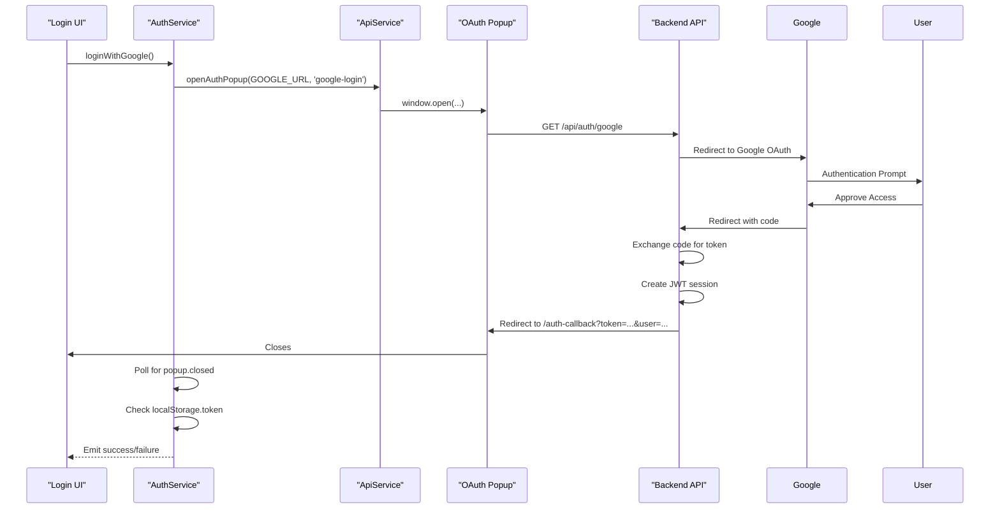
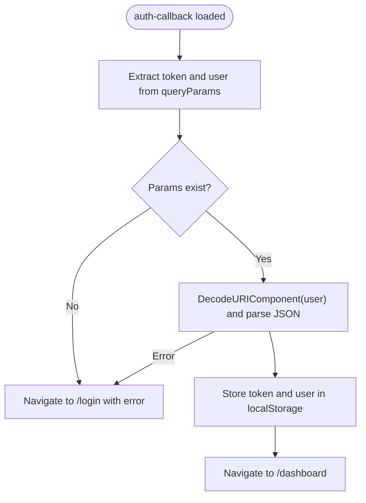
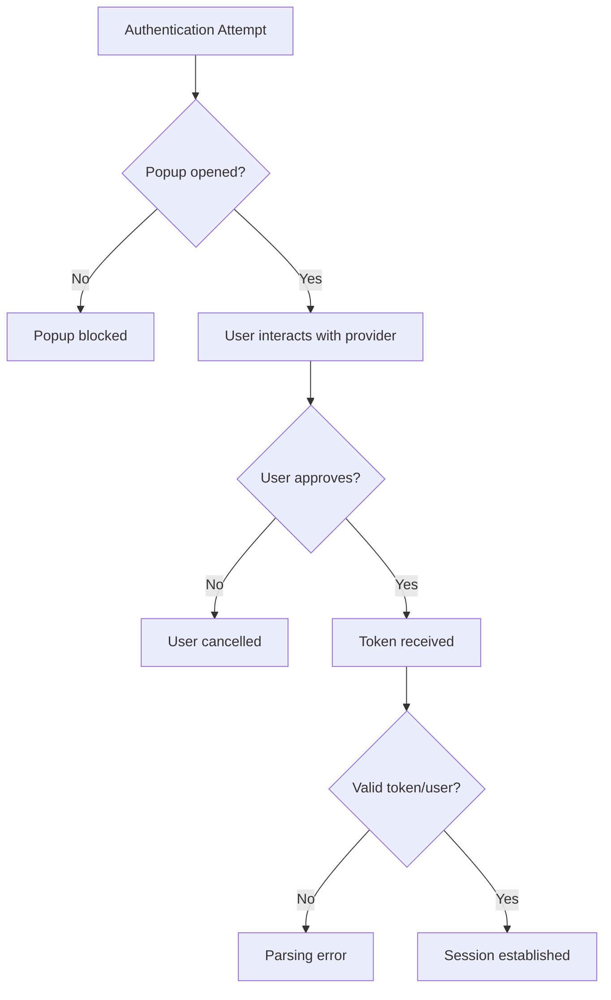

# OAuth Integration (Google & GitHub)

<cite>
**Referenced Files in This Document**   
- [auth.service.ts](file://src/app/auth/auth.service.ts)
- [auth-callback.component.ts](file://src/app/auth/auth-callback/auth-callback.component.ts)
- [api.service.ts](file://src/app/shared/services/api.service.ts)
- [constants.ts](file://src/app/shared/utils/constants.ts)
</cite>

## Table of Contents
1. [Introduction](#introduction)
2. [OAuth Flow Overview](#oauth-flow-overview)
3. [AuthService Implementation](#authservice-implementation)
4. [Popup-Based Authentication Mechanism](#popup-based-authentication-mechanism)
5. [Auth Callback Handling](#auth-callback-handling)
6. [Configuration and Environment Setup](#configuration-and-environment-setup)
7. [Error and Edge Case Handling](#error-and-edge-case-handling)
8. [Security Considerations](#security-considerations)
9. [Cross-Browser and Mobile Compatibility](#cross-browser-and-mobile-compatibility)
10. [Conclusion](#conclusion)

## Introduction
This document provides a comprehensive analysis of the OAuth 2.0 integration for Google and GitHub authentication within the Angular application. It details the implementation of popup-based OAuth flows, redirect handling via the `auth-callback` component, token management, and session setup. The system leverages external backend endpoints for OAuth processing and uses localStorage for client-side session persistence. Configuration, security practices, and compatibility considerations are also covered.

## OAuth Flow Overview



**Diagram sources**
- [auth.service.ts](file://src/app/auth/auth.service.ts#L75-L120)
- [auth-callback.component.ts](file://src/app/auth/auth-callback/auth-callback.component.ts#L15-L40)

## AuthService Implementation

The `AuthService` class provides methods for initiating Google and GitHub OAuth flows through popup windows. These methods return observables that resolve based on the authentication outcome.

### signInWithGoogle() and signInWithGitHub()
Both methods follow the same pattern:
- Open a popup window pointing to the respective backend OAuth endpoint
- Poll the popup window for closure
- Check localStorage for authentication token upon closure
- Emit success or failure based on token presence

These methods abstract the complexity of OAuth flow management and provide a clean interface for components to initiate authentication.

**Section sources**
- [auth.service.ts](file://src/app/auth/auth.service.ts#L75-L120)

## Popup-Based Authentication Mechanism



**Diagram sources**
- [auth.service.ts](file://src/app/auth/auth.service.ts#L75-L120)
- [api.service.ts](file://src/app/shared/services/api.service.ts#L85-L93)

## Auth Callback Handling

The `AuthCallbackComponent` handles the final stage of OAuth authentication by parsing query parameters and establishing the user session.

### URL Parsing and Token Extraction
When the OAuth popup redirects to the `/auth-callback` route:
- The component subscribes to queryParams
- Extracts `token` and `user` parameters from the URL
- Decodes and parses the user data from the URL-encoded JSON string
- Stores both token and user object in localStorage
- Redirects to the dashboard on success or login with error on failure

This component acts as the authentication completion endpoint, ensuring secure transfer of credentials from the OAuth flow to the main application context.



**Diagram sources**
- [auth-callback.component.ts](file://src/app/auth/auth-callback/auth-callback.component.ts#L15-L40)

**Section sources**
- [auth-callback.component.ts](file://src/app/auth/auth-callback/auth-callback.component.ts#L15-L40)

## Configuration and Environment Setup

OAuth integration requires proper configuration of endpoints and URLs.

### API Configuration
The `API_CONFIG` constant defines the base URL and OAuth endpoints:

```typescript
export const API_CONFIG = {
  BASE_URL: 'https://balancio-backend.vercel.app/api',
  ENDPOINTS: {
    AUTH: {
      GOOGLE: 'auth/google',
      GITHUB: 'auth/github'
    }
  }
};
```

### Required Configuration
- **Backend OAuth Endpoints**: Must be configured to handle Google/GitHub OAuth flows
- **Redirect URIs**: Backend must be configured with correct redirect URIs pointing to `/auth-callback`
- **Client IDs**: Google and GitHub OAuth applications must be created with appropriate credentials
- **Environment Variables**: Client secrets and other sensitive data should be stored server-side

The current implementation uses a production backend URL, but could be extended with environment-specific configurations.

**Section sources**
- [constants.ts](file://src/app/shared/utils/constants.ts#L30-L54)

## Error and Edge Case Handling

The system implements several mechanisms to handle common OAuth issues.

### Popup Blocking
If popup blockers prevent the authentication window from opening:
- The `window.open()` call returns null
- The polling mechanism will detect a closed/null popup immediately
- The observable emits a failure with "Login cancelled" message
- The UI should display an appropriate error and suggest alternative login methods

### User Cancellation
When users cancel the OAuth flow:
- The popup closes without authentication
- No token is set in localStorage
- The polling mechanism detects closure and emits failure
- User is informed of cancellation and can retry

### Network and Parsing Errors
The auth-callback component handles:
- Missing query parameters
- Invalid JSON in user parameter
- Failed localStorage operations
- Redirects to login with error state



**Section sources**
- [auth.service.ts](file://src/app/auth/auth.service.ts#L75-L120)
- [auth-callback.component.ts](file://src/app/auth/auth-callback/auth-callback.component.ts#L15-L40)

## Security Considerations

The OAuth implementation addresses several security aspects.

### Token Storage
- JWT tokens are stored in localStorage, which is accessible to JavaScript
- This approach is convenient but vulnerable to XSS attacks
- For higher security, consider httpOnly cookies (though this complicates popup flows)

### State Parameter
The current client-side implementation does not explicitly handle OAuth state parameters, which are typically managed by the backend to prevent CSRF attacks. The backend should:
- Generate and validate state parameters
- Ensure they are tied to user sessions
- Reject requests without valid state

### CSRF Protection
The backend should implement CSRF protection for OAuth endpoints, especially for state management and token issuance.

### Redirect URI Validation
The backend must strictly validate redirect URIs to prevent open redirect vulnerabilities.

**Section sources**
- [auth.service.ts](file://src/app/auth/auth.service.ts#L75-L120)
- [auth-callback.component.ts](file://src/app/auth/auth-callback/auth-callback.component.ts#L15-L40)

## Cross-Browser and Mobile Compatibility

### Browser Compatibility
The popup-based approach works across modern browsers but may be blocked by aggressive popup blockers. The implementation:
- Uses standard window.open() with specified dimensions
- Implements polling to detect closure
- Provides fallback messaging for blocked popups

### Mobile Considerations
On mobile devices:
- Popup windows may open in new tabs instead of popups
- The polling mechanism still works as tab closure is detectable
- User experience may be less seamless than on desktop
- Consider implementing deep linking or app switch patterns for native mobile apps

### Alternative Approaches
For better mobile compatibility, consider:
- Redirect-based authentication instead of popups
- Using Capacitor or Cordova plugins for native OAuth
- Implementing universal links or app links for seamless app switching

**Section sources**
- [auth.service.ts](file://src/app/auth/auth.service.ts#L75-L120)
- [api.service.ts](file://src/app/shared/services/api.service.ts#L85-L93)

## Conclusion
The OAuth integration for Google and GitHub provides a user-friendly authentication experience through popup-based flows. The system effectively manages the authentication lifecycle from initiation to session establishment, with proper error handling and security considerations. While the current implementation relies on localStorage and popup windows, it provides a solid foundation that could be extended with additional security measures and mobile optimizations. The separation of concerns between AuthService, ApiService, and AuthCallbackComponent ensures maintainability and clear responsibility boundaries.