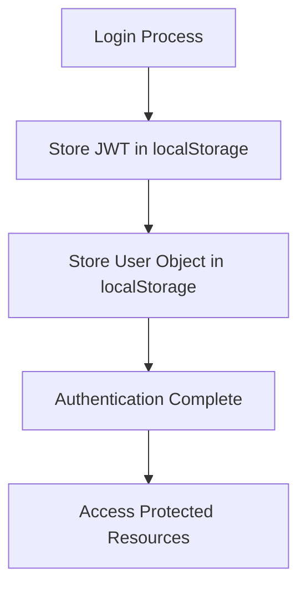
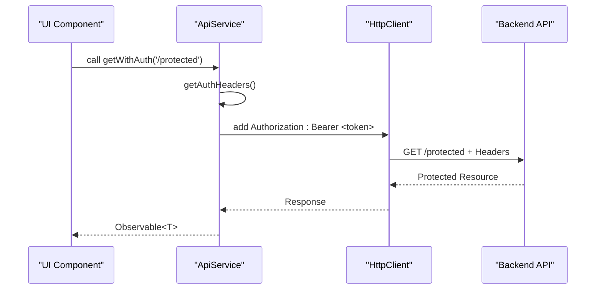
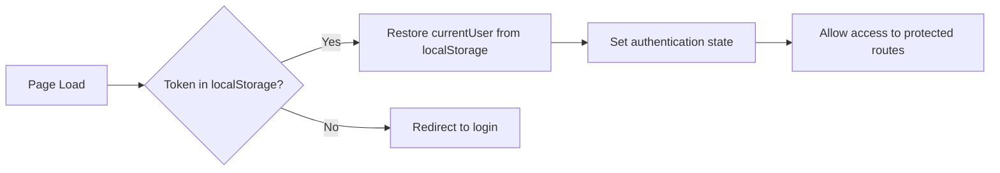
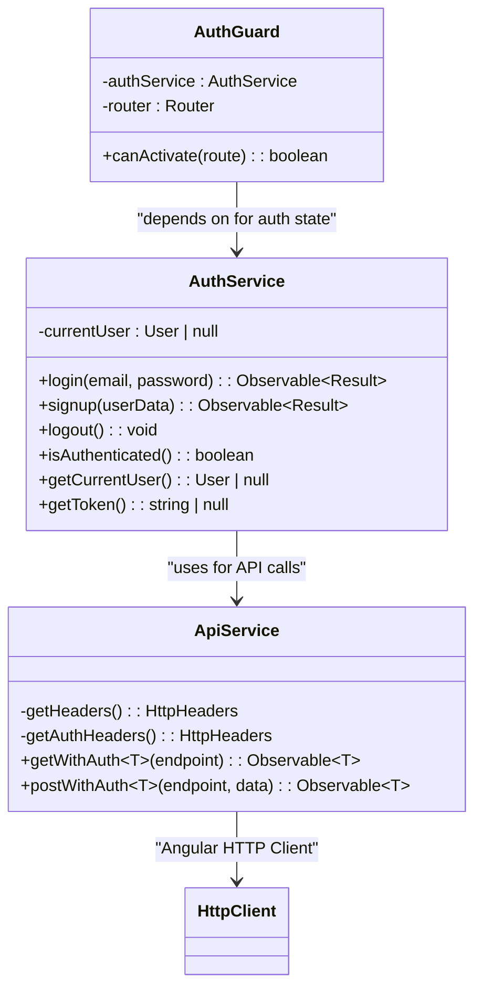
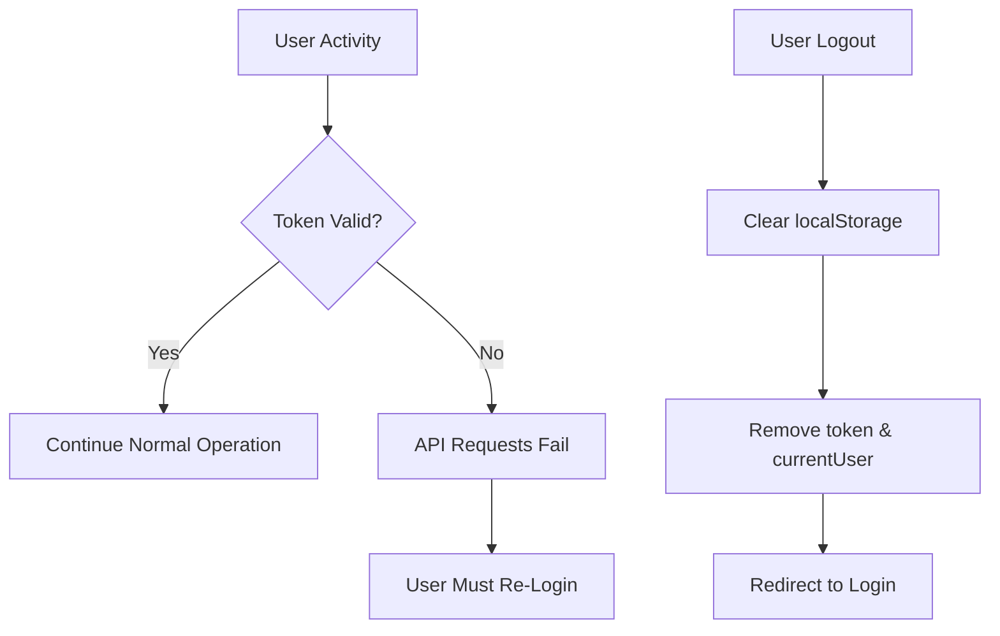
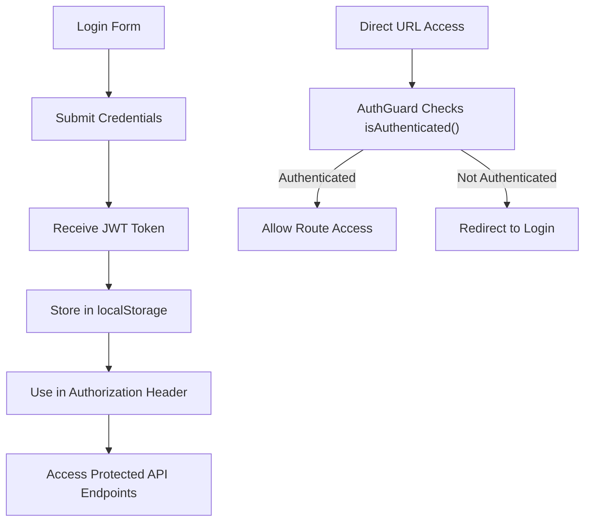

# Token Management & Session Handling

<cite>
**Referenced Files in This Document**   
- [auth.service.ts](file://src/app/auth/auth.service.ts)
- [api.service.ts](file://src/app/shared/services/api.service.ts)
- [auth.guard.ts](file://src/app/shared/services/auth.guard.ts)
- [auth-callback.component.ts](file://src/app/auth/auth-callback/auth-callback.component.ts)
- [constants.ts](file://src/app/shared/utils/constants.ts)
</cite>

## Table of Contents
1. [Introduction](#introduction)
2. [Token Storage & Retrieval](#token-storage--retrieval)
3. [HTTP Interceptor Integration](#http-interceptor-integration)
4. [Session Persistence Across Page Reloads](#session-persistence-across-page-reloads)
5. [Authentication State Management](#authentication-state-management)
6. [Token Expiration & Auto-Logout](#token-expiration--auto-logout)
7. [Security Best Practices](#security-best-practices)
8. [Troubleshooting Common Issues](#troubleshooting-common-issues)
9. [Conclusion](#conclusion)

## Introduction
This document provides a comprehensive overview of JWT token management and user session lifecycle in the Angular application. It details how authentication tokens are stored, retrieved, and used across the application, including integration with HTTP interceptors, route protection, and third-party authentication flows. The implementation leverages localStorage for persistent session management while ensuring secure handling of sensitive credentials.

## Token Storage & Retrieval

The `AuthService` manages JWT tokens using the browser's localStorage mechanism, providing methods to set, retrieve, and remove authentication tokens securely.

Key methods include:
- `setToken()` - Implicitly called during login/signup via `localStorage.setItem('token', response.token)`
- `getToken()` - Retrieves the current JWT token from localStorage
- `removeToken()` - Called during logout via `localStorage.removeItem('token')`

User session data is also persisted in localStorage as a serialized User object under the key `currentUser`, enabling session continuity across page reloads.

**Diagram sources**
- [auth.service.ts](file://src/app/auth/auth.service.ts#L15-L25)
- [auth.service.ts](file://src/app/auth/auth.service.ts#L55-L60)

**Section sources**
- [auth.service.ts](file://src/app/auth/auth.service.ts#L15-L30)
- [auth.service.ts](file://src/app/auth/auth.service.ts#L70-L75)

## HTTP Interceptor Integration

The application integrates token-based authentication into HTTP requests through header injection in the `ApiService`. All outgoing requests automatically include the Authorization header when a token is present.

The `getHeaders()` and `getAuthHeaders()` methods in `ApiService` ensure that:
- JWT tokens are attached as `Bearer` tokens
- Content-Type is set to `application/json`
- Authenticated requests use proper authorization headers

This integration applies to all HTTP methods (GET, POST, PUT, DELETE) through wrapper methods like `getWithAuth()`, `postWithAuth()`, etc.

**Diagram sources**
- [api.service.ts](file://src/app/shared/services/api.service.ts#L15-L25)
- [api.service.ts](file://src/app/shared/services/api.service.ts#L35-L40)

**Section sources**
- [api.service.ts](file://src/app/shared/services/api.service.ts#L10-L45)

## Session Persistence Across Page Reloads

User sessions persist across page reloads and tab sessions through localStorage persistence. When the application initializes, the authentication state is restored from stored data.

The `isAuthenticated()` method in `AuthService` checks for:
1. Presence of JWT token in localStorage
2. Existence of currentUser object
3. Deserialization of user data into the service's private `currentUser` property

Third-party authentication callbacks (Google, GitHub) also restore session state by capturing tokens and user data from query parameters and storing them in localStorage.

**Diagram sources**
- [auth.service.ts](file://src/app/auth/auth.service.ts#L60-L65)
- [auth-callback.component.ts](file://src/app/auth/auth-callback/auth-callback.component.ts#L25-L35)

**Section sources**
- [auth.service.ts](file://src/app/auth/auth.service.ts#L60-L70)
- [auth-callback.component.ts](file://src/app/auth/auth-callback/auth-callback.component.ts#L20-L40)

## Authentication State Management

The `AuthService` maintains authentication state through:
- In-memory `currentUser` property for reactive access
- localStorage persistence for cross-session continuity
- Public methods for state interrogation and manipulation

Key state management methods:
- `isAuthenticated()` - Checks for valid session
- `getCurrentUser()` - Returns current user object
- `logout()` - Clears both memory and storage state

The `AuthGuard` service protects routes by evaluating authentication state and redirecting users appropriately based on route requirements.

**Diagram sources**
- [auth.service.ts](file://src/app/auth/auth.service.ts#L10-L120)
- [auth.guard.ts](file://src/app/shared/services/auth.guard.ts#L5-L15)

**Section sources**
- [auth.service.ts](file://src/app/auth/auth.service.ts#L10-L120)
- [auth.guard.ts](file://src/app/shared/services/auth.guard.ts#L1-L30)

## Token Expiration & Auto-Logout

The application handles token expiration through:
- Implicit expiration detection (failed API calls due to invalid token)
- Manual logout via user action
- Session cleanup in localStorage

When a token expires or becomes invalid:
1. Subsequent API requests will fail due to invalid/missing Authorization header
2. The user must re-authenticate to obtain a new token
3. No silent refresh mechanism is currently implemented

The logout process clears both the JWT token and currentUser data from localStorage, ensuring complete session termination.

**Diagram sources**
- [auth.service.ts](file://src/app/auth/auth.service.ts#L50-L55)
- [api.service.ts](file://src/app/shared/services/api.service.ts#L15-L25)

**Section sources**
- [auth.service.ts](file://src/app/auth/auth.service.ts#L50-L60)

## Security Best Practices

The application follows key security practices for token management:

### Storage Security
- **localStorage usage**: Tokens are stored in localStorage rather than cookies, preventing CSRF attacks
- **No cookie storage**: Avoids automatic transmission of credentials with every request
- **Sensitive route protection**: AuthGuard ensures only authenticated users access protected routes

### Data Protection
- **Bearer token format**: JWTs are transmitted using standard Bearer scheme
- **Content-Type enforcement**: All requests specify application/json
- **No plaintext storage**: User passwords are never stored client-side

### Route Protection
Protected routes use data-driven authentication requirements via route configuration, with AuthGuard evaluating access based on authentication state.

**Diagram sources**
- [auth.service.ts](file://src/app/auth/auth.service.ts#L15-L25)
- [api.service.ts](file://src/app/shared/services/api.service.ts#L15-L25)
- [auth.guard.ts](file://src/app/shared/services/auth.guard.ts#L10-L15)

**Section sources**
- [auth.service.ts](file://src/app/auth/auth.service.ts#L10-L120)
- [api.service.ts](file://src/app/shared/services/api.service.ts#L10-L45)
- [auth.guard.ts](file://src/app/shared/services/auth.guard.ts#L1-L30)

## Troubleshooting Common Issues

### Invalid Token Issues
- **Symptoms**: API calls return 401/403 errors
- **Causes**: Token corruption, manual localStorage editing
- **Resolution**: Clear localStorage and re-authenticate

### Expired Session Issues
- **Symptoms**: Sudden loss of access to protected resources
- **Causes**: Token expiration (server-side), browser restart without persistent login
- **Resolution**: Implement token refresh mechanism or re-login

### Race Conditions
- **Symptoms**: Inconsistent authentication state, flickering UI
- **Causes**: Async operations in `isAuthenticated()` checking localStorage
- **Resolution**: Ensure proper sequencing of auth state initialization

### Third-Party Authentication Failures
- **Symptoms**: Google/GitHub login popup closes without authentication
- **Causes**: Popup blocked, network issues, server-side failure
- **Resolution**: Check browser popup settings, verify network connectivity

**Section sources**
- [auth.service.ts](file://src/app/auth/auth.service.ts#L85-L120)
- [auth-callback.component.ts](file://src/app/auth/auth-callback/auth-callback.component.ts#L20-L40)

## Conclusion
The application implements a robust JWT-based authentication system using localStorage for session persistence. Token management is handled through the `AuthService`, with automatic header injection via `ApiService` and route protection through `AuthGuard`. While the current implementation provides solid foundation for authentication, considerations for future enhancement include implementing token refresh mechanisms and adding additional security layers such as token validation and expiration checks. The separation of concerns between authentication logic, HTTP handling, and route protection demonstrates a well-architected approach to session management in Angular applications.