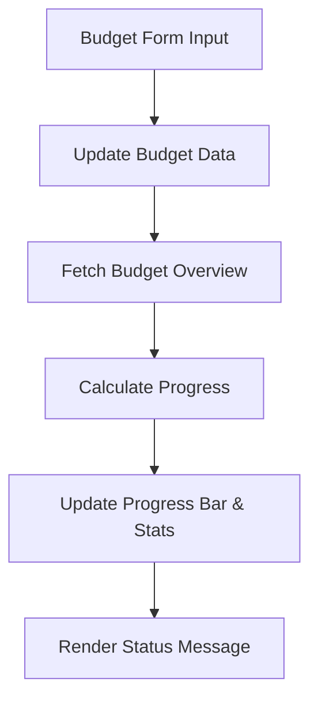
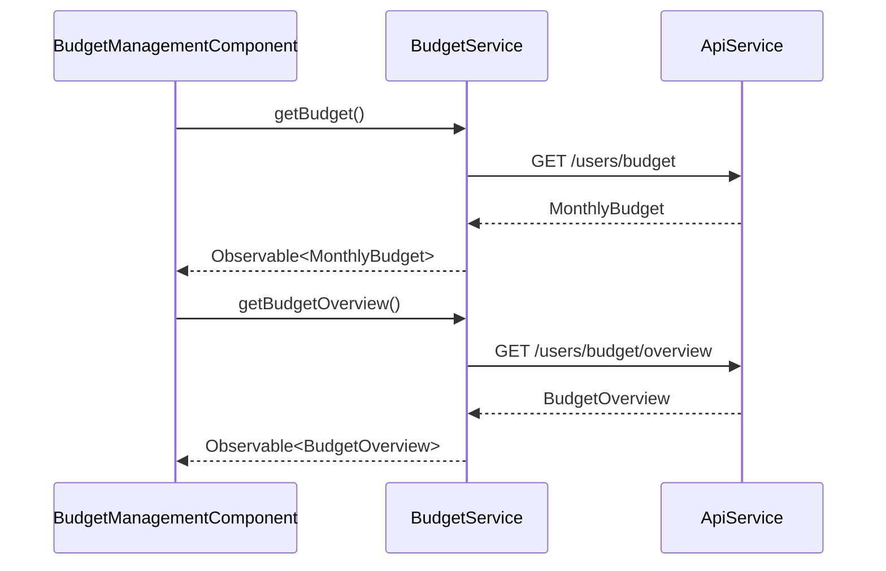
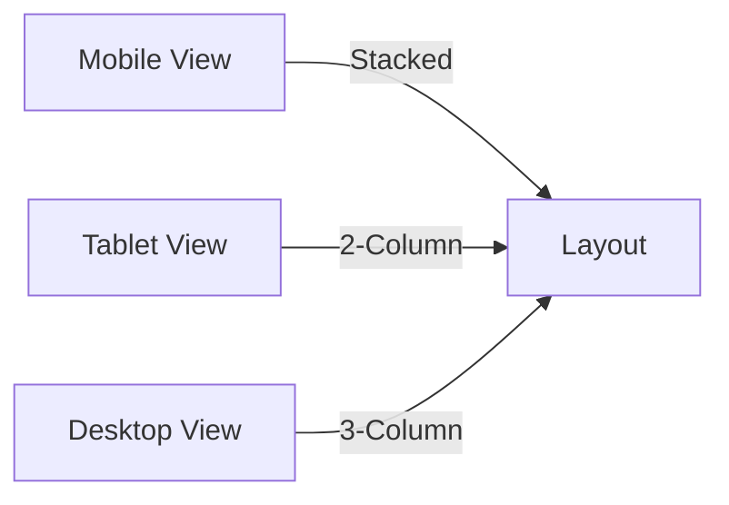

# Budget Management Component

<cite>
**Referenced Files in This Document**  
- [budget-management.component.ts](file://src/app/shared/components/budget-management/budget-management.component.ts)
- [budget.model.ts](file://src/app/shared/models/budget.model.ts)
- [budget.service.ts](file://src/app/shared/services/budget.service.ts)
- [transaction.service.ts](file://src/app/shared/services/transaction.service.ts)
</cite>

## Table of Contents
1. [Introduction](#introduction)
2. [Visual Representation and UI Elements](#visual-representation-and-ui-elements)
3. [Input Properties and Event Outputs](#input-properties-and-event-outputs)
4. [Integration with BudgetService and Real-Time Updates](#integration-with-budgetservice-and-real-time-updates)
5. [Transaction Data Integration](#transaction-data-integration)
6. [Usage Examples](#usage-examples)
7. [Styling with Tailwind CSS](#styling-with-tailwind-css)
8. [Responsive Design Considerations](#responsive-design-considerations)
9. [Accessibility Features](#accessibility-features)
10. [Animation States and Threshold Alerts](#animation-states-and-threshold-alerts)
11. [Customization Options for Budget Periods](#customization-options-for-budget-periods)
12. [Common Issues and Troubleshooting](#common-issues-and-troubleshooting)
13. [Conclusion](#conclusion)

## Introduction
The `BudgetManagementComponent` is a central UI element in the financial dashboard that enables users to set, monitor, and manage their monthly spending budgets. It provides real-time visual feedback through progress indicators, remaining balance displays, and dynamic threshold alerts. The component integrates with the `BudgetService` to reflect live updates and pulls transaction data to calculate current spending levels. Designed with accessibility, responsiveness, and user experience in mind, it supports multiple currencies, customizable alert thresholds, and smooth visual transitions.

**Section sources**
- [budget-management.component.ts](file://src/app/shared/components/budget-management/budget-management.component.ts#L1-L433)

## Visual Representation and UI Elements
The component presents a clean, card-based interface with distinct sections for budget status, form input, and usage tips. Key visual elements include:

- **Progress Bar**: A horizontal bar showing the percentage of the budget used, dynamically colored based on spending level (green for safe, yellow for warning, red for critical).
- **Budget Stats Grid**: A three-column layout displaying total budget, amount spent, and remaining balance, with color-coded values.
- **Status Message**: A contextual alert banner that changes color and content based on current budget health.
- **Form Controls**: Input fields for setting budget amount, currency, and alert thresholds (warning and critical).

These elements are updated in real time as the user interacts with the form or as backend data changes.



**Diagram sources**
- [budget-management.component.ts](file://src/app/shared/components/budget-management/budget-management.component.ts#L1-L433)
- [budget.service.ts](file://src/app/shared/services/budget.service.ts#L50-L80)

## Input Properties and Event Outputs
The `BudgetManagementComponent` does not expose input properties or event outputs as it is a self-contained standalone component. However, it internally manages state through reactive forms and emits changes via service calls rather than direct output events.

- **Internal State Management**: Uses `ReactiveFormsModule` with a `FormGroup` (`budgetForm`) to manage form inputs.
- **Form Controls**:
  - `amount`: Required, minimum 0.01
  - `currency`: Dropdown with USD, EUR, GBP, CAD, AUD
  - `warningThreshold`: Percentage (0–100), default 80
  - `criticalThreshold`: Percentage (0–100), default 95
- **Validation**: Thresholds are validated to ensure warning < critical; form disables submission if invalid.

User actions trigger internal methods:
- `onSubmit()`: Updates budget via `BudgetService`
- `clearBudget()`: Resets budget to zero with confirmation

**Section sources**
- [budget-management.component.ts](file://src/app/shared/components/budget-management/budget-management.component.ts#L100-L150)

## Integration with BudgetService and Real-Time Updates
The component subscribes to `BudgetService` observables to maintain real-time synchronization with the backend:

- **OnInit Lifecycle**: Calls `loadBudgetData()` which uses `forkJoin` to concurrently fetch:
  - `budgetService.getBudget()`: Current monthly budget settings
  - `budgetService.getBudgetOverview()`: Aggregated spending data and status
- **Automatic Updates**: After form submission, `loadBudgetData()` is called again to refresh the overview.
- **Unsubscribe Pattern**: Uses `takeUntil(this.destroy$)` in subscriptions to prevent memory leaks on component destruction.

The `BudgetService` provides helper methods used in the template:
- `getBudgetProgressColor()`: Returns Tailwind class for progress bar
- `getBudgetStatusColor()`: Colors the percentage text
- `getBudgetStatusMessage()`: Generates contextual alert text



**Diagram sources**
- [budget-management.component.ts](file://src/app/shared/components/budget-management/budget-management.component.ts#L160-L200)
- [budget.service.ts](file://src/app/shared/services/budget.service.ts#L10-L50)

## Transaction Data Integration
While the component does not directly subscribe to `TransactionService`, it relies on `BudgetService.getBudgetOverview()` which internally aggregates transaction data to compute:
- Total spent amount
- Remaining budget
- Percentage used
- Category-wise breakdown

The `BudgetOverview` model includes `monthlyData.totalExpenses`, which is derived from transaction records within the current billing period. This ensures the progress bar and stats reflect actual spending behavior.

**Section sources**
- [budget.model.ts](file://src/app/shared/models/budget.model.ts#L20-L50)
- [budget.service.ts](file://src/app/shared/services/budget.service.ts#L60-L80)

## Usage Examples
### Basic Usage
The component is used as a standalone element in parent templates:

```html
<app-budget-management></app-budget-management>
```

It requires no inputs and automatically handles data loading and form submission.

### Programmatic Budget Update
While not exposed via outputs, the component can be extended to emit events by adding `EventEmitter` properties. Example enhancement:

```ts
@Output() budgetUpdated = new EventEmitter<MonthlyBudget>();
// Inside onSubmit(): this.budgetUpdated.emit(updatedBudget);
```

## Styling with Tailwind CSS
The component uses Tailwind CSS for responsive, utility-first styling:

- **Layout**: `grid`, `flex`, `gap`, `p-6`, `rounded-lg`, `shadow-md`
- **Colors**: Semantic classes like `text-green-600`, `bg-yellow-100`, `border-blue-200`
- **Typography**: `text-2xl`, `font-bold`, `text-sm`
- **Form Styling**: Focus rings (`focus:ring-2 focus:ring-blue-500`), padding, borders
- **Progress Bar**: Animated with `transition-all duration-300 ease-in-out`

All styles are scoped within the component’s template using Tailwind’s atomic classes.

**Section sources**
- [budget-management.component.ts](file://src/app/shared/components/budget-management/budget-management.component.ts#L10-L50)

## Responsive Design Considerations
The component is fully responsive using Tailwind’s breakpoint system:

- **Mobile**: Single-column layout for form fields and budget stats
- **Medium+ Screens**: `md:grid-cols-2` and `md:grid-cols-3` for side-by-side layout of thresholds and stats
- **Flexible Buttons**: `flex-1` ensures equal width on small screens, `sm:flex-none` allows natural width on larger screens
- **Text Wrapping**: Labels and inputs adapt to screen width with proper spacing



**Diagram sources**
- [budget-management.component.ts](file://src/app/shared/components/budget-management/budget-management.component.ts#L50-L100)

## Accessibility Features
The component includes several accessibility enhancements:

- **Semantic HTML**: Proper use of `label`, `input`, `aria`-implied roles
- **Form Labels**: All inputs have associated `<label>` with `for` attribute
- **Error Messaging**: Validation errors are displayed below fields with `text-red-600`
- **Focus States**: Visible focus rings on interactive elements
- **Screen Reader Support**: Text content is meaningful and status messages are descriptive
- **Keyboard Navigation**: Full tab order support through form controls and buttons

**Section sources**
- [budget-management.component.ts](file://src/app/shared/components/budget-management/budget-management.component.ts#L50-L100)

## Animation States and Threshold Alerts
The component uses subtle animations and dynamic styling to enhance user feedback:

- **Progress Bar Animation**: `transition-all duration-300 ease-in-out` provides smooth width changes
- **Loading State**: Spinner animation using `animate-spin` during API calls
- **Threshold Alerts**:
  - Warning (≥80%): Yellow background and text
  - Critical (≥95%): Red background and text
  - Safe (<80%): Green styling
- **Status Message**: Dynamically updates with emoji and color based on spending level

The `getStatusMessage()` method in `BudgetService` generates context-aware messages such as:
- "✅ You're on track!"
- "⚠️ You're approaching your budget limit."
- "⚠️ You've exceeded your critical spending threshold!"

**Section sources**
- [budget-management.component.ts](file://src/app/shared/components/budget-management/budget-management.component.ts#L300-L350)
- [budget.service.ts](file://src/app/shared/services/budget.service.ts#L120-L150)

## Customization Options for Budget Periods
Currently, the component is focused on **monthly budgets**. However, the underlying `BudgetOverview` model includes `monthlyData.period.startDate` and `endDate`, indicating support for period-based calculations.

Potential extensions:
- Add a period selector (weekly, bi-weekly, monthly)
- Modify `BudgetService` to accept period parameters
- Adjust progress calculation based on time elapsed in period

While not implemented in the current UI, the data model supports future expansion.

**Section sources**
- [budget.model.ts](file://src/app/shared/models/budget.model.ts#L40-L50)

## Common Issues and Troubleshooting
### Rendering Delays
- **Cause**: Asynchronous data loading from multiple observables
- **Solution**: Use `*ngIf="budgetOverview"` to conditionally render only when data is ready

### Incorrect Progress Calculations
- **Cause**: Mismatch between transaction dates and budget period
- **Solution**: Ensure `BudgetService` correctly filters transactions by `startDate` and `endDate`

### Theme Inconsistency
- **Cause**: Missing Tailwind classes or conflicting global styles
- **Solution**: Audit component styles and ensure consistent use of Tailwind palette

### Form Validation Errors
- **Cause**: Thresholds not properly validated (warning ≥ critical)
- **Solution**: The component already implements `validateThresholds()` to prevent submission

### Loading State Not Reflecting
- **Cause**: `isLoading` flag not reset on error
- **Solution**: Ensure `isLoading = false` in both success and error callbacks

**Section sources**
- [budget-management.component.ts](file://src/app/shared/components/budget-management/budget-management.component.ts#L200-L300)

## Conclusion
The `BudgetManagementComponent` is a robust, user-friendly interface for managing monthly budgets. It effectively combines real-time data from `BudgetService`, visual progress tracking, and responsive design to deliver a seamless experience. With strong accessibility support, clear feedback mechanisms, and extensible architecture, it serves as a foundational element for financial planning in the application. Future enhancements could include multi-period support, deeper transaction filtering, and enhanced alerting options.