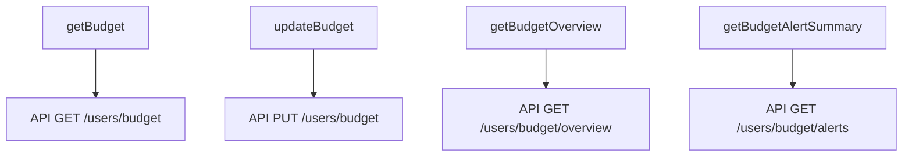
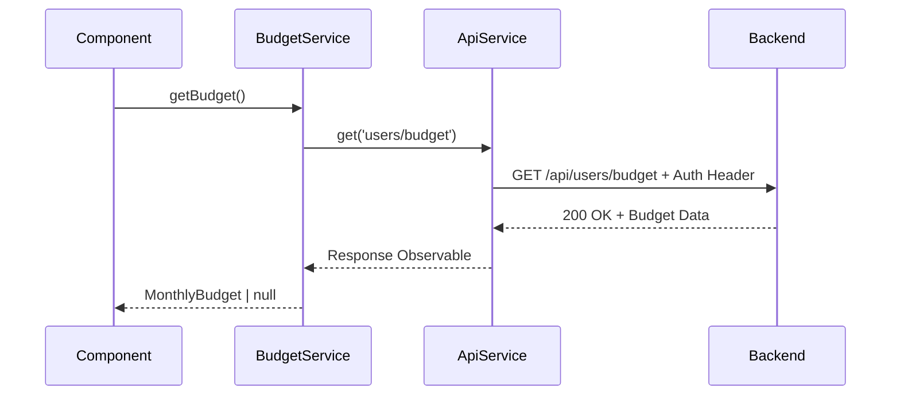
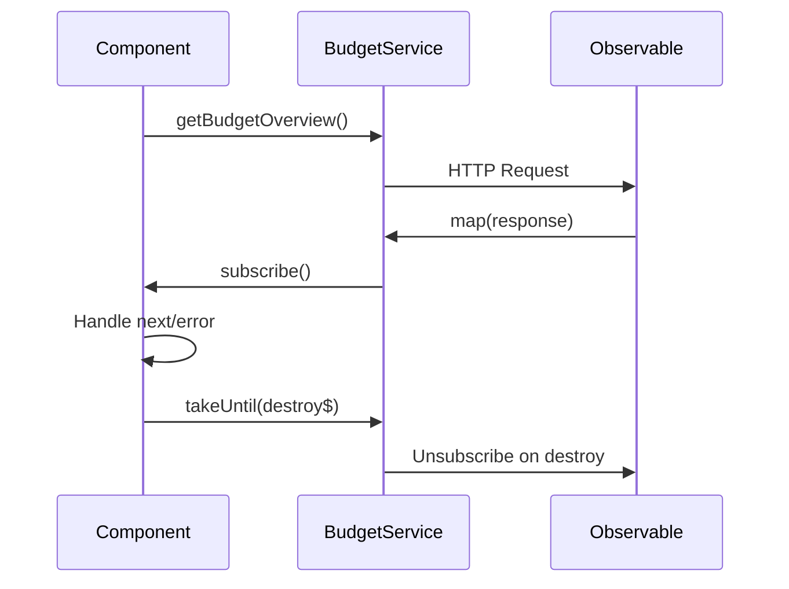
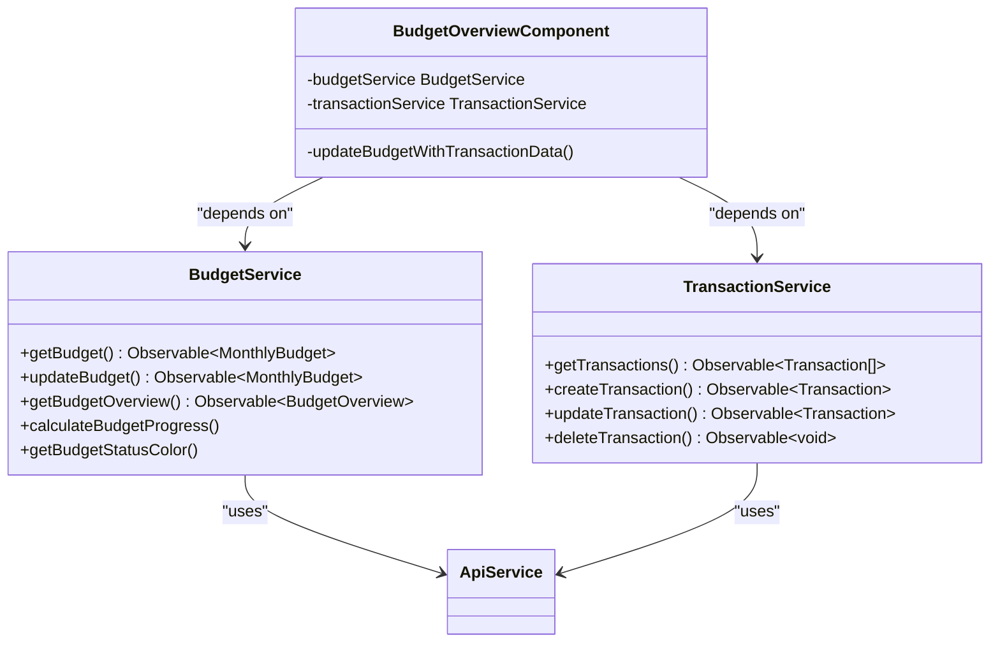
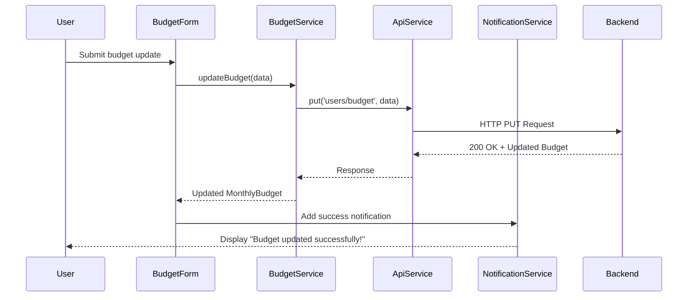

# Budget Service

<cite>
**Referenced Files in This Document**   
- [budget.service.ts](file://src/app/shared/services/budget.service.ts)
- [api.service.ts](file://src/app/shared/services/api.service.ts)
- [budget.model.ts](file://src/app/shared/models/budget.model.ts)
- [transaction.service.ts](file://src/app/shared/services/transaction.service.ts)
- [budget-management.component.ts](file://src/app/shared/components/budget-management/budget-management.component.ts)
- [budget-card.component.ts](file://src/app/dashboard/components/budget-card/budget-card.component.ts)
- [profile-edit.component.ts](file://src/app/profile/profile-edit/profile-edit.component.ts)
- [profile-view.component.ts](file://src/app/profile/profile-view/profile-view.component.ts)
- [dashboard.component.ts](file://src/app/dashboard/dashboard.component.ts)
</cite>

## Table of Contents
1. [Introduction](#introduction)
2. [Core Methods](#core-methods)
3. [Integration with ApiService](#integration-with-apiservice)
4. [Budget Calculation and Alert Logic](#budget-calculation-and-alert-logic)
5. [Observable Data Flow with RxJS](#observable-data-flow-with-rxjs)
6. [Error Handling Patterns](#error-handling-patterns)
7. [Integration with TransactionService](#integration-with-transactionservice)
8. [Common Issues and Solutions](#common-issues-and-solutions)
9. [Component Usage Examples](#component-usage-examples)
10. [Conclusion](#conclusion)

## Introduction
The BudgetService is a central component in the financial management application, responsible for handling all budget-related operations including creation, retrieval, and updates. It serves as an intermediary between the frontend components and the backend API, providing a clean interface for budget management functionality. The service integrates with other core services to provide comprehensive budget tracking, spending analysis, and alerting capabilities.

**Section sources**
- [budget.service.ts](file://src/app/shared/services/budget.service.ts#L1-L157)

## Core Methods
The BudgetService exposes several key methods for budget management operations:

- **getBudget()**: Retrieves the user's current monthly budget configuration from the backend API
- **updateBudget()**: Updates or creates a new monthly budget with specified amount, currency, and alert thresholds
- **getBudgetOverview()**: Fetches comprehensive budget data including spending analysis and current status
- **getBudgetAlertSummary()**: Retrieves information about budget alerts and their current status

These methods return Observable objects, enabling reactive programming patterns throughout the application.



**Diagram sources**
- [budget.service.ts](file://src/app/shared/services/budget.service.ts#L15-L77)

**Section sources**
- [budget.service.ts](file://src/app/shared/services/budget.service.ts#L15-L77)

## Integration with ApiService
The BudgetService relies on the ApiService to communicate with the backend API using HTTP methods. It uses dependency injection to access the ApiService instance and makes HTTP requests through its methods:

- **GET requests** are used for retrieving budget data via ApiService.get() method
- **PUT requests** are used for updating budget information via ApiService.put() method
- The service automatically includes authentication headers using the token stored in localStorage
- All API endpoints are prefixed with the base URL configured in the application

The integration ensures consistent error handling, authentication, and request formatting across all API communications.



**Diagram sources**
- [budget.service.ts](file://src/app/shared/services/budget.service.ts#L15-L37)
- [api.service.ts](file://src/app/shared/services/api.service.ts#L1-L94)

**Section sources**
- [budget.service.ts](file://src/app/shared/services/budget.service.ts#L15-L37)
- [api.service.ts](file://src/app/shared/services/api.service.ts#L1-L94)

## Budget Calculation and Alert Logic
The BudgetService includes several helper methods for calculating budget metrics and determining alert status:

- **calculateBudgetProgress()**: Calculates the percentage of budget used based on spent amount and total budget
- **getBudgetStatusColor()**: Determines the appropriate text color based on budget usage percentage and threshold levels
- **getBudgetProgressColor()**: Determines the progress bar color for visual representation of budget status
- **getBudgetStatusMessage()**: Generates user-friendly messages describing the current budget situation

The service uses configurable threshold percentages (default: 80% warning, 95% critical) to determine alert levels and status indicators.

```mermaid
flowchart TD
Start([Budget Usage]) --> Progress{Calculate Progress}
Progress --> |percentage = (spent/budget)*100| Status{Check Thresholds}
Status --> |percentage >= 95%| Critical[Critical Status: Red]
Status --> |percentage >= 80%| Warning[Warning Status: Yellow]
Status --> |percentage < 80%| Safe[Safe Status: Green]
Critical --> Message1["⚠️ Exceeded critical threshold!"]
Warning --> Message2["⚠️ Approaching budget limit"]
Safe --> Message3["✅ On track with budget"]
```

**Diagram sources**
- [budget.service.ts](file://src/app/shared/services/budget.service.ts#L79-L148)

**Section sources**
- [budget.service.ts](file://src/app/shared/services/budget.service.ts#L79-L148)

## Observable Data Flow with RxJS
The BudgetService leverages RxJS observables to manage asynchronous data flow throughout the application:

- All methods return Observable objects that can be subscribed to by components
- The service uses the map operator to transform API responses and ensure proper data typing
- Date objects are properly instantiated from string timestamps in API responses
- The takeUntil operator is used in components to prevent memory leaks by unsubscribing from observables
- forkJoin is used to combine multiple observable streams when loading related data

This reactive approach enables real-time updates and efficient data handling across the application.



**Diagram sources**
- [budget.service.ts](file://src/app/shared/services/budget.service.ts#L55-L77)
- [budget-card.component.ts](file://src/app/dashboard/components/budget-card/budget-card.component.ts#L120-L135)

**Section sources**
- [budget.service.ts](file://src/app/shared/services/budget.service.ts#L55-L77)
- [budget-card.component.ts](file://src/app/dashboard/components/budget-card/budget-card.component.ts#L120-L135)

## Error Handling Patterns
The BudgetService implements robust error handling patterns to ensure application stability:

- The getBudget() method returns null if no budget is set or amount is zero, providing a consistent interface
- API errors are propagated to components for appropriate user feedback
- Components handle errors by logging to console and displaying notifications
- Loading states are properly managed to prevent UI freezes during API requests
- The service assumes API availability but components may fall back to mock data if needed

Error handling is implemented at both the service and component levels to provide comprehensive coverage.

**Section sources**
- [budget.service.ts](file://src/app/shared/services/budget.service.ts#L15-L37)
- [budget-card.component.ts](file://src/app/dashboard/components/budget-card/budget-card.component.ts#L136-L145)

## Integration with TransactionService
The BudgetService works in conjunction with the TransactionService to provide accurate budget calculations:

- Budget overview data is enhanced with actual transaction data from the TransactionService
- Components combine budget information with transaction records to calculate current spending
- The updateBudgetWithTransactionData() method synchronizes budget remaining amounts with actual expenses
- Both services are injected into components that require comprehensive financial data
- Transaction creation triggers budget data refresh to maintain consistency

This integration ensures that budget calculations reflect real transaction data rather than relying solely on API-provided estimates.



**Diagram sources**
- [budget.service.ts](file://src/app/shared/services/budget.service.ts#L1-L157)
- [transaction.service.ts](file://src/app/shared/services/transaction.service.ts#L1-L129)
- [dashboard.component.ts](file://src/app/dashboard/dashboard.component.ts#L126-L151)

**Section sources**
- [budget.service.ts](file://src/app/shared/services/budget.service.ts#L1-L157)
- [transaction.service.ts](file://src/app/shared/services/transaction.service.ts#L1-L129)
- [dashboard.component.ts](file://src/app/dashboard/dashboard.component.ts#L126-L151)

## Common Issues and Solutions
The application addresses several common issues related to budget management:

- **Stale budget data**: Solved by refreshing budget data after updates and using observables for real-time updates
- **Race conditions during updates**: Mitigated by using loading states and disabling forms during API calls
- **Synchronization across components**: Achieved through the singleton service pattern and observable data streams
- **Threshold validation**: Implemented in forms to ensure warning threshold is less than critical threshold
- **Data consistency**: Maintained by combining API budget data with actual transaction records

Components use destroy$ subjects to properly unsubscribe from observables, preventing memory leaks and ensuring clean component destruction.

**Section sources**
- [budget-management.component.ts](file://src/app/shared/components/budget-management/budget-management.component.ts#L256-L300)
- [profile-edit.component.ts](file://src/app/profile/profile-edit/profile-edit.component.ts#L381-L421)
- [dashboard.component.ts](file://src/app/dashboard/dashboard.component.ts#L126-L151)

## Component Usage Examples
The BudgetService is injected and used in various components throughout the application:

- **BudgetCardComponent**: Displays budget overview data and uses service methods for formatting
- **BudgetManagementComponent**: Provides full budget management interface with form handling
- **ProfileEditComponent**: Allows users to edit budget settings in profile section
- **ProfileViewComponent**: Displays budget status and messages in user profile
- **DashboardComponent**: Integrates budget data with transaction information

Service injection follows Angular's dependency injection pattern, with the service declared in the constructor and used throughout the component lifecycle.



**Diagram sources**
- [budget-management.component.ts](file://src/app/shared/components/budget-management/budget-management.component.ts#L298-L342)
- [profile-edit.component.ts](file://src/app/profile/profile-edit/profile-edit.component.ts#L381-L421)

**Section sources**
- [budget-management.component.ts](file://src/app/shared/components/budget-management/budget-management.component.ts#L210-L433)
- [profile-edit.component.ts](file://src/app/profile/profile-edit/profile-edit.component.ts#L301-L478)
- [budget-card.component.ts](file://src/app/dashboard/components/budget-card/budget-card.component.ts#L103-L155)

## Conclusion
The BudgetService provides a comprehensive solution for managing user budgets in the financial application. It effectively handles CRUD operations for budget data, integrates with the backend API through the ApiService, and provides utility methods for budget calculations and status determination. The service's reactive design using RxJS observables enables real-time updates across components, while its integration with the TransactionService ensures accurate spending calculations. Proper error handling, loading state management, and form validation create a robust user experience. The service's architecture supports scalability and maintainability, making it a critical component of the application's financial management capabilities.