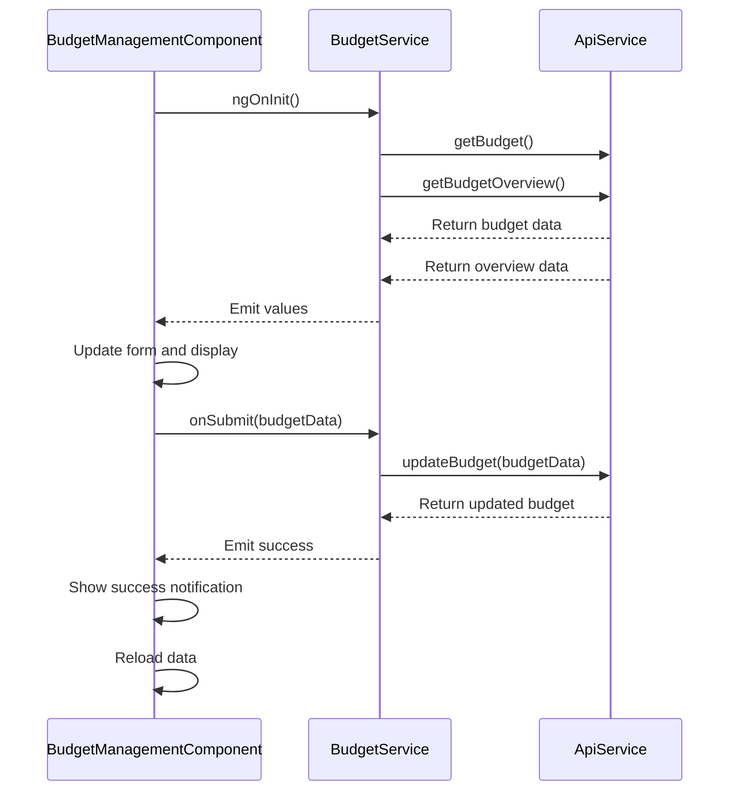

# Budget Tracking

<cite>
**Referenced Files in This Document**  
- [budget.model.ts](file://src/app/shared/models/budget.model.ts)
- [budget.service.ts](file://src/app/shared/services/budget.service.ts)
- [budget-management.component.ts](file://src/app/shared/components/budget-management/budget-management.component.ts)
- [transaction.service.ts](file://src/app/shared/services/transaction.service.ts)
- [notification.service.ts](file://src/app/shared/services/notification.service.ts)
</cite>

## Table of Contents
1. [Introduction](#introduction)
2. [Budget Data Model](#budget-data-model)
3. [BudgetService API](#budgetservice-api)
4. [Budget Management Component](#budget-management-component)
5. [Integration with Transaction Data](#integration-with-transaction-data)
6. [Budget Status Visualization](#budget-status-visualization)
7. [Notification Mechanisms](#notification-mechanisms)
8. [Edge Cases and Period Management](#edge-cases-and-period-management)
9. [Conclusion](#conclusion)

## Introduction
The budget tracking functionality enables users to set monthly spending limits, monitor actual expenses, and receive alerts when approaching or exceeding predefined thresholds. This system integrates with transaction data to provide real-time budget progress updates and supports customizable alert configurations. The implementation includes a comprehensive data model, service layer for business logic, and a reusable UI component for managing and displaying budget status.

## Budget Data Model

The budget system is built around a well-defined data model that captures essential budget parameters, spending analytics, and alert configurations.

### MonthlyBudget Interface
Represents the user's configured monthly budget:
- `amount`: The total budgeted amount for the month
- `currency`: Currency code (e.g., USD, EUR)
- `alertThresholds`: Percentage thresholds for warning and critical alerts
- `lastAlertSent`: Timestamps of the last sent alerts to prevent duplicates

### BudgetOverview Interface
Provides comprehensive spending analysis:
- `budgetSet`: Boolean indicating if a budget is configured
- `budget`, `spent`, `remaining`: Financial values for the current period
- `percentageUsed`: Current spending as a percentage of the budget
- `alertLevel`: Current status ('safe', 'warning', 'critical')
- `monthlyData`: Detailed breakdown of monthly expenses including period dates
- `categoryBreakdown`: Spending distribution across categories

### BudgetAlertSummary Interface
Specialized model for alert status:
- `currentStatus`: Overall budget health
- `thresholds`: Active warning and critical thresholds
- `lastAlerts`: Timestamps of previously sent alerts

**Section sources**
- [budget.model.ts](file://src/app/shared/models/budget.model.ts#L1-L60)

## BudgetService API

The `BudgetService` provides a complete API for managing budget settings and retrieving spending analytics.

### Core Methods

#### getBudget()
Retrieves the user's current monthly budget configuration. Returns `null` if no budget is set.

#### updateBudget()
Updates the budget with new amount, currency, and alert thresholds. Accepts partial updates and returns the complete updated budget object.

#### getBudgetOverview()
Fetches comprehensive spending analysis including current spending, remaining balance, percentage used, and category breakdown. This method integrates with transaction data to calculate actual spending.

#### getBudgetAlertSummary()
Returns a simplified view focused on alert status and thresholds, used for notification decision-making.

### Helper Methods

#### calculateBudgetProgress()
Calculates the percentage of budget used, capped at 100%.

#### getBudgetStatusColor() and getBudgetProgressColor()
Determine appropriate color classes based on spending percentage and thresholds, supporting dynamic UI feedback.

#### formatCurrency()
Formats monetary values according to the user's selected currency using `Intl.NumberFormat`.

#### getBudgetStatusMessage()
Generates user-friendly status messages that change based on budget health, providing clear guidance.

```mermaid
classDiagram
class BudgetService {
+getBudget() Observable~MonthlyBudget | null~
+updateBudget(budgetData) Observable~MonthlyBudget~
+getBudgetOverview() Observable~BudgetOverview~
+getBudgetAlertSummary() Observable~BudgetAlertSummary~
+calculateBudgetProgress(spent, budget) number
+getBudgetStatusColor(percentage, thresholds) string
+getBudgetProgressColor(percentage, thresholds) string
+formatCurrency(amount, currency) string
+getBudgetStatusMessage(overview) string
}
class MonthlyBudget {
+amount : number
+currency : string
+alertThresholds : {warning : number, critical : number}
+lastAlertSent? : {warning? : Date, critical? : Date}
}
class BudgetOverview {
+budgetSet : boolean
+budget? : number
+spent? : number
+remaining? : number
+percentageUsed? : number
+alertLevel? : 'safe' | 'warning' | 'critical'
+monthlyData? : MonthlyData
+categoryBreakdown? : CategoryBreakdown[]
}
BudgetService --> MonthlyBudget
BudgetService --> BudgetOverview
```

**Diagram sources**
- [budget.service.ts](file://src/app/shared/services/budget.service.ts#L15-L157)
- [budget.model.ts](file://src/app/shared/models/budget.model.ts#L1-L60)

**Section sources**
- [budget.service.ts](file://src/app/shared/services/budget.service.ts#L15-L157)

## Budget Management Component

The `BudgetManagementComponent` provides a user interface for setting, viewing, and managing budget configurations.

### Key Features
- Form for setting monthly budget amount and currency
- Configuration of alert thresholds (warning and critical)
- Real-time validation ensuring warning threshold < critical threshold
- Visual display of current budget status with progress bar
- Display of key metrics: budget, spent, remaining
- Dynamic status messaging based on spending level

### Implementation Details
The component uses reactive forms with Angular's `FormBuilder` and includes comprehensive validation. It loads both the current budget and spending overview on initialization using `forkJoin` to make parallel API calls. The component exposes helper methods to the template for formatting currency and determining UI colors based on budget status.

### User Experience
- Loading states during API operations
- Success and error notifications via `NotificationService`
- Confirmation dialog before clearing budget
- Helpful tips section with best practices
- Responsive design with mobile-friendly layout



**Diagram sources**
- [budget-management.component.ts](file://src/app/shared/components/budget-management/budget-management.component.ts#L1-L434)
- [budget.service.ts](file://src/app/shared/services/budget.service.ts#L15-L157)

**Section sources**
- [budget-management.component.ts](file://src/app/shared/components/budget-management/budget-management.component.ts#L1-L434)

## Integration with Transaction Data

The budget system integrates with transaction data to calculate actual spending against budgeted amounts.

### Data Flow
The `BudgetService` relies on the backend API to aggregate transaction data for the current month. While the transaction service provides access to individual transactions, the budget overview endpoint returns pre-calculated spending totals, optimizing performance.

### Transaction Service Integration
The `TransactionService` handles CRUD operations for transactions and emits notifications when transactions are created or deleted. These operations indirectly affect budget calculations by changing the total spending amount.

### Calculation Process
1. Backend determines current month period (startDate, endDate)
2. All expense transactions within the period are summed
3. Total spending is compared to budget amount
4. Percentage used is calculated and categorized by alert level
5. Results are returned in the `BudgetOverview` object

**Section sources**
- [budget.service.ts](file://src/app/shared/services/budget.service.ts#L45-L65)
- [transaction.service.ts](file://src/app/shared/services/transaction.service.ts#L1-L123)

## Budget Status Visualization

The system provides rich visual feedback about budget status through multiple UI elements.

### Progress Bar
A horizontal progress bar displays the percentage of budget used, with color changing from green to yellow to red based on thresholds. The bar animates smoothly when values change.

### Status Indicators
Three key metrics are displayed prominently:
- **Monthly Budget**: Total allocated amount
- **Spent This Month**: Actual expenses
- **Remaining**: Available balance (turns red when negative)

### Dynamic Styling
Color classes are dynamically assigned based on budget health:
- Green for safe status (below warning threshold)
- Yellow for warning status (between warning and critical thresholds)
- Red for critical status (at or above critical threshold)

### Status Messages
Contextual messages provide clear guidance:
- "No monthly budget set" when no budget is configured
- "You're on track!" for healthy spending
- Warning messages when approaching limits
- Critical alerts when thresholds are exceeded

```mermaid
flowchart TD
A[Start] --> B{Budget Set?}
B --> |No| C[Display: \"No budget set\"]
B --> |Yes| D[Calculate Percentage Used]
D --> E{Percentage < Warning Threshold?}
E --> |Yes| F[Green Status: \"On track!\"]
E --> |No| G{Percentage < Critical Threshold?}
G --> |Yes| H[Yellow Status: \"Approaching limit\"]
G --> |No| I[Red Status: \"Exceeded limit!\"]
F --> J[Display Green Progress Bar]
H --> K[Display Yellow Progress Bar]
I --> L[Display Red Progress Bar]
```

**Diagram sources**
- [budget-management.component.ts](file://src/app/shared/components/budget-management/budget-management.component.ts#L1-L434)
- [budget.service.ts](file://src/app/shared/services/budget.service.ts#L100-L150)

## Notification Mechanisms

The system includes a robust notification mechanism for budget threshold alerts.

### Alert Configuration
Users can set two threshold levels:
- **Warning Alert**: Typically at 80% of budget (configurable)
- **Critical Alert**: Typically at 95% of budget (configurable)

### Alert Suppression
The `lastAlertSent` field in the budget model prevents duplicate notifications by tracking when alerts were last sent.

### Notification Service Integration
When budget thresholds are exceeded, the system can trigger notifications through the `NotificationService`. The budget management component already uses this service for operation feedback (success/error), and the architecture supports extending it for automated threshold alerts.

### User Feedback
The component provides immediate feedback for all operations:
- Success notifications when budget is set or updated
- Error notifications for failed operations
- Loading indicators during API calls
- Visual confirmation of changes through updated metrics

**Section sources**
- [budget.model.ts](file://src/app/shared/models/budget.model.ts#L1-L60)
- [budget.service.ts](file://src/app/shared/services/budget.service.ts#L15-L157)
- [notification.service.ts](file://src/app/shared/services/notification.service.ts#L1-L30)

## Edge Cases and Period Management

The budget system handles several edge cases and periodic behaviors.

### Recurring Budgets
The current implementation uses a simple monthly budget that persists until changed by the user. The system does not automatically reset at month end, allowing users to carry over budget settings. Users must manually adjust budgets for new periods.

### Period Rollovers
At the start of a new month:
- The `monthlyData` period dates are automatically updated
- Spending total resets to zero
- `percentageUsed` recalculates based on new spending
- Previous month's data could be archived (backend responsibility)

### Zero and Negative Values
- Budget amount must be greater than zero (enforced by form validation)
- Remaining amount can be negative, indicating overspending
- Percentage used is capped at 100% for display purposes

### Currency Management
- Default currency is USD
- Users can select from multiple currency options
- Currency formatting is applied consistently across the UI
- Currency selection is stored with the budget configuration

### Empty States
The UI gracefully handles scenarios where:
- No budget is set (prompts user to set one)
- No transactions exist (shows zero spending)
- API calls fail (displays error notifications)

**Section sources**
- [budget.service.ts](file://src/app/shared/services/budget.service.ts#L1-L157)
- [budget-management.component.ts](file://src/app/shared/components/budget-management/budget-management.component.ts#L1-L434)

## Conclusion
The budget tracking functionality provides a comprehensive solution for managing monthly spending limits. The system combines a well-structured data model with a robust service layer and an intuitive user interface. Key strengths include real-time spending visualization, customizable alert thresholds, and seamless integration with transaction data. The architecture supports future enhancements such as automated monthly resets, historical budget analysis, and more sophisticated alert mechanisms. The separation of concerns between data model, service logic, and presentation components ensures maintainability and extensibility.