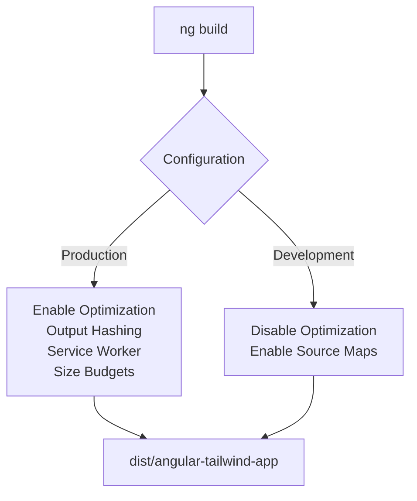
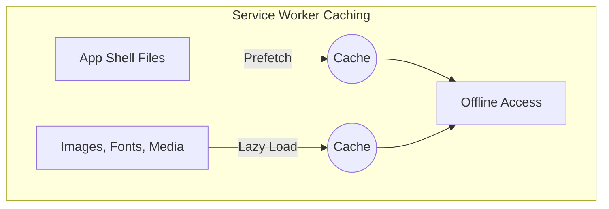

# Build & Deployment Pipeline

<cite>
**Referenced Files in This Document**  
- [angular.json](file://angular.json)
- [package.json](file://package.json)
- [ngsw-config.json](file://ngsw-config.json)
- [src/app/shared/utils/constants.ts](file://src/app/shared/utils/constants.ts)
- [src/app/app.config.ts](file://src/app/app.config.ts)
</cite>

## Table of Contents
1. [Introduction](#introduction)
2. [Angular CLI Commands](#angular-cli-commands)
3. [Build Configuration in angular.json](#build-configuration-in-angularjson)
4. [Environment Management](#environment-management)
5. [Production Optimization Features](#production-optimization-features)
6. [Progressive Web App Configuration](#progressive-web-app-configuration)
7. [Deployment Options](#deployment-options)
8. [Conclusion](#conclusion)

## Introduction
This document provides a comprehensive overview of the build and deployment pipeline for the Angular application. It covers essential Angular CLI commands, configuration settings in `angular.json`, environment variable handling, production optimizations, service worker setup for Progressive Web App (PWA) capabilities, and deployment strategies to platforms such as Firebase, Netlify, and Vercel.

**Section sources**
- [angular.json](file://angular.json#L1-L97)
- [package.json](file://package.json#L1-L46)

## Angular CLI Commands

The project utilizes standard Angular CLI commands for development, building, testing, and deployment. These are defined in the `scripts` section of `package.json`.

- **Development Server**: `npm start` or `ng serve` launches the development server with hot module replacement.
- **Production Build**: `npm run build` executes `ng build --configuration production`, producing optimized static assets.
- **Watch Mode**: `npm run watch` runs a development build in watch mode for continuous compilation.
- **Linting**: `ng lint` can be used to enforce code quality standards (though not explicitly defined in scripts, it's available via Angular CLI).
- **Testing**: `npm test` runs unit tests using Karma and Jasmine.

These commands streamline the development workflow and ensure consistent builds across environments.

**Section sources**
- [package.json](file://package.json#L3-L10)

## Build Configuration in angular.json

The `angular.json` file defines project architecture and build configurations. Key settings include:

- **Output Path**: Built files are output to `dist/angular-tailwind-app`.
- **Main Entry Point**: `src/main.ts` is used as the browser entry point.
- **Polyfills**: Zone.js is included to support Angular’s change detection.
- **TypeScript Configuration**: Uses `tsconfig.app.json` for compilation options.
- **Assets**: All files from the `public` directory are copied during build via glob pattern `**/*`.
- **Styles**: Global styles are imported from `src/styles.css`, which integrates Tailwind CSS.

Two main configurations are defined:
- **Production**: Enables hashing (`outputHashing: all`), enforces size budgets, and enables service workers via `ngsw-config.json`.
- **Development**: Disables optimization and enables source maps for debugging.

The default build configuration is set to production.



**Diagram sources**
- [angular.json](file://angular.json#L25-L97)

**Section sources**
- [angular.json](file://angular.json#L25-L97)

## Environment Management

While environment-specific files such as `environment.ts` were not found in the expected `src/environments/` directory, environment management is still handled through configuration constants.

The `APP_CONSTANTS` and `API_CONFIG` objects in `constants.ts` define application-wide settings including:
- App name, currency, date format
- Transaction types and UI colors
- API base URL and endpoint definitions

This approach centralizes configuration and allows for easy modification without requiring multiple environment files. The API base URL currently points to a production backend hosted on Vercel but includes comments suggesting potential local or alternate environment URLs.

This pattern supports environment-based behavior without relying on Angular’s default environment file system.

**Section sources**
- [src/app/shared/utils/constants.ts](file://src/app/shared/utils/constants.ts#L1-L54)

## Production Optimization Features

The Angular build process includes several production optimizations enabled through the `production` configuration:

- **Ahead-of-Time (AOT) Compilation**: Templates are compiled during the build process, improving runtime performance.
- **Tree-Shaking**: Unused code is eliminated through differential loading and ES2015+ module processing.
- **Minification**: JavaScript and CSS are minified to reduce file size.
- **Dead Code Elimination**: Enabled via optimization flag, removing unreachable code.
- **Bundle Budgets**: Enforced size limits for initial and component style bundles to prevent bloat.

These optimizations ensure fast load times and efficient execution in production.


**Diagram sources**
- [angular.json](file://angular.json#L55-L69)

## Progressive Web App Configuration

The application is configured as a Progressive Web App (PWA) using Angular Service Worker. The `ngsw-config.json` file specifies caching strategies for different asset groups:

- **App Shell (`app` group)**: Prefetched on install for offline access. Includes HTML, CSS, JS, and manifest files.
- **Assets (`assets` group)**: Images, fonts, and media files are lazily loaded and cached on demand.

Service worker is enabled in the production configuration via `"serviceWorker": "ngsw-config.json"` in `angular.json`.

This setup enables offline functionality, fast loading, and improved user experience on repeat visits.



**Diagram sources**
- [ngsw-config.json](file://ngsw-config.json#L1-L30)
- [angular.json](file://angular.json#L65)

## Deployment Options

The project includes a custom `deploy` script in `package.json` that builds the application and deploys it to Netlify:

```json
"deploy": "ng build --configuration production && netlify deploy --prod"
```

This indicates the primary deployment target is **Netlify**, with automatic deployment to production after a successful build.

### Deployment Configuration Steps

#### Netlify
1. Run `npm run deploy` to build and deploy.
2. Ensure Netlify CLI is installed (`npm install -g netlify-cli`).
3. Authenticate with `netlify login`.
4. Link the site with `netlify link`.
5. Configure environment variables if needed via Netlify UI.

#### Vercel
Although not scripted, Vercel deployment is feasible:
1. Use Vercel CLI: `vercel`
2. Set build command: `ng build --configuration production`
3. Output directory: `dist/angular-tailwind-app`
4. Define environment variables in project settings.

#### Firebase
To deploy on Firebase:
1. Install Firebase CLI: `npm install -g firebase-tools`
2. Initialize: `firebase init hosting`
3. Set public directory to `dist/angular-tailwind-app`
4. Deploy: `firebase deploy`

All platforms benefit from the PWA configuration and optimized build output.

**Section sources**
- [package.json](file://package.json#L9)
- [angular.json](file://angular.json#L40-L45)

## Conclusion

The build and deployment pipeline of this Angular application is well-structured, leveraging Angular CLI, production optimizations, and service worker-based PWA capabilities. Configuration is centralized in `angular.json` and utility constants, while deployment is streamlined for Netlify with potential for expansion to other platforms like Vercel or Firebase. The use of modern build features ensures performance, reliability, and scalability in production environments.