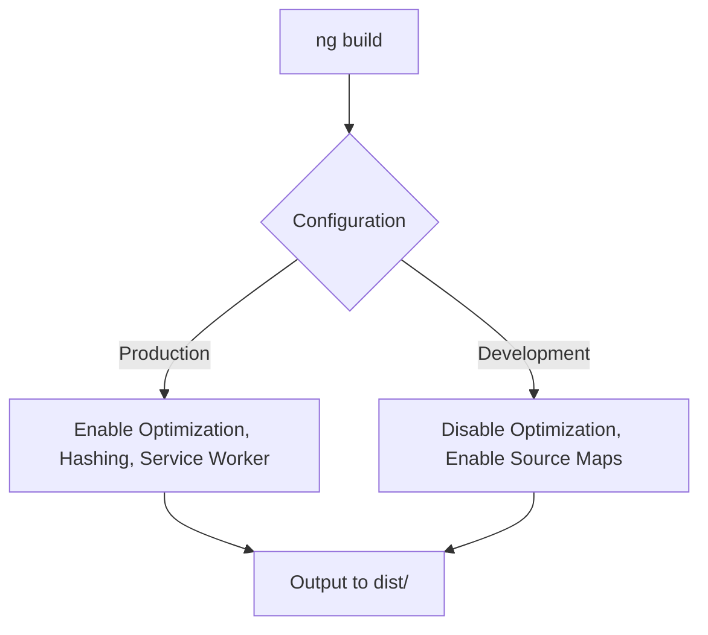
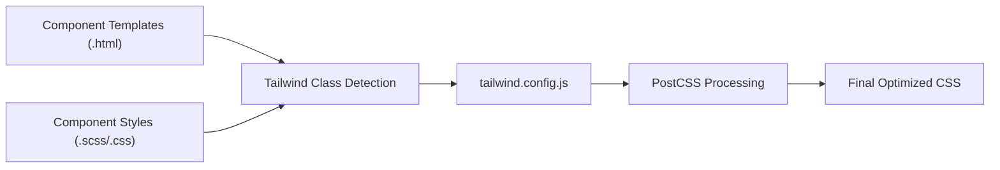
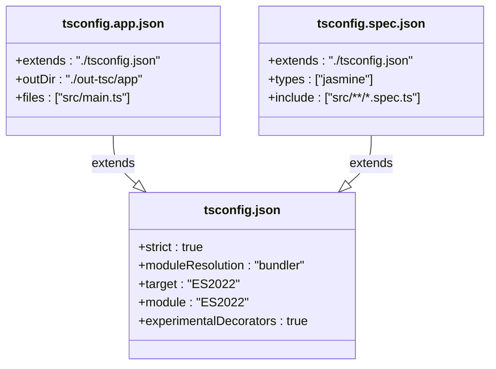
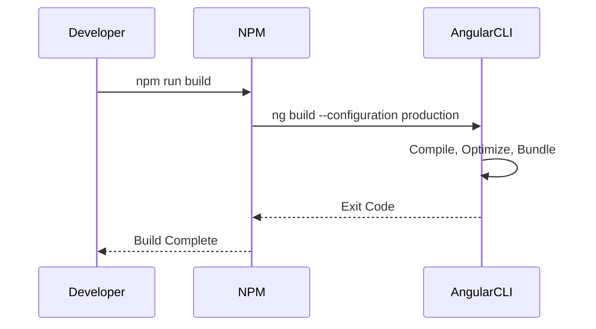

# Build Process Configuration

<cite>
**Referenced Files in This Document**   
- [angular.json](file://angular.json)
- [tailwind.config.js](file://tailwind.config.js)
- [tsconfig.json](file://tsconfig.json)
- [package.json](file://package.json)
- [src/styles.css](file://src/styles.css)
- [tsconfig.app.json](file://tsconfig.app.json)
</cite>

## Table of Contents
1. [Introduction](#introduction)
2. [Angular Build Configuration](#angular-build-configuration)
3. [Tailwind CSS Integration](#tailwind-css-integration)
4. [TypeScript Configuration](#typescript-configuration)
5. [Angular CLI Commands and Scripts](#angular-cli-commands-and-scripts)
6. [Production Optimizations](#production-optimizations)
7. [Environment-Specific Builds](#environment-specific-builds)
8. [Troubleshooting Common Build Issues](#troubleshooting-common-build-issues)
9. [Conclusion](#conclusion)

## Introduction
This document provides a comprehensive overview of the build process configuration for the Angular-based finance tracking application. It details how the application is compiled, optimized, and deployed using Angular CLI, Tailwind CSS, and TypeScript. The focus is on key configuration files such as `angular.json`, `tailwind.config.js`, and `tsconfig.json`, along with relevant scripts defined in `package.json`. This guide is intended for developers who need to understand, customize, or troubleshoot the build pipeline.

## Angular Build Configuration

The `angular.json` file serves as the central configuration hub for the Angular CLI, defining project structure, build options, asset handling, and environment-specific settings. The application uses the `@angular-devkit/build-angular:application` builder to compile and bundle the source code.

Key build options include:
- **Output Path**: Compiled assets are emitted to `dist/angular-tailwind-app`
- **Index File**: `src/index.html` is used as the base HTML template
- **Browser Entry Point**: `src/main.ts` is the application's bootstrap file
- **Polyfills**: Zone.js is included to support Angular’s change detection mechanism
- **Assets**: All files from the `public` directory are copied to the output folder during build
- **Styles**: Global styles are processed from `src/styles.css`, which integrates Tailwind directives
- **Scripts**: No global scripts are included

The build process supports different configurations through the `configurations` property:
- **Production**: Enables output hashing, service worker registration, and size budgets
- **Development**: Disables optimization and enables source maps for debugging

**Diagram sources**
- [angular.json](file://angular.json#L25-L97)

**Section sources**
- [angular.json](file://angular.json#L1-L97)

## Tailwind CSS Integration

Tailwind CSS is integrated into the build process via PostCSS and configured through `tailwind.config.js`. The configuration specifies which files should be scanned for class usage to enable tree-shaking of unused styles.

The `content` array in `tailwind.config.js` includes all `.html` and `.ts` files under `src/`, ensuring that any Tailwind classes used in templates or component logic are preserved during compilation.

During the build, the following steps occur:
1. Angular processes component styles (SCSS/CSS)
2. Tailwind processes `src/styles.css`, which contains the directives:
   - `@tailwind base;`
   - `@tailwind components;`
   - `@tailwind utilities;`
3. Final CSS is generated with only the classes used across the application

This integration ensures minimal CSS output and optimal performance.

**Diagram sources**
- [tailwind.config.js](file://tailwind.config.js#L1-L10)
- [src/styles.css](file://src/styles.css#L1-L4)

**Section sources**
- [tailwind.config.js](file://tailwind.config.js#L1-L10)
- [src/styles.css](file://src/styles.css#L1-L4)

## TypeScript Configuration

TypeScript compilation is governed by `tsconfig.json`, which defines strict type-checking rules and module resolution behavior. The configuration extends to `tsconfig.app.json` and `tsconfig.spec.json` for application and test-specific settings.

Key compiler options include:
- **Strict Mode**: Enabled via `"strict": true`, enforcing type safety
- **Module Resolution**: Set to `"bundler"` to support modern bundler workflows
- **Target**: ES2022 for modern JavaScript features
- **Module**: ES2022 for native module syntax
- **Experimental Decorators**: Enabled for Angular decorators
- **Import Helpers**: Enabled to reduce bundle size

Angular-specific compiler options enforce template type checking:
- `strictTemplates`: Enables strict type checking in templates
- `strictInjectionParameters`: Ensures injectable services are properly typed
- `strictInputAccessModifiers`: Enforces access modifiers on `@Input()` properties

**Diagram sources**
- [tsconfig.json](file://tsconfig.json#L1-L28)
- [tsconfig.app.json](file://tsconfig.app.json#L1-L14)
- [tsconfig.spec.json](file://tsconfig.spec.json#L1-L14)

**Section sources**
- [tsconfig.json](file://tsconfig.json#L1-L28)
- [tsconfig.app.json](file://tsconfig.app.json#L1-L14)

## Angular CLI Commands and Scripts

The `package.json` file defines npm scripts that wrap Angular CLI commands for common development and deployment tasks.

Available scripts:
- **start**: Runs `ng serve` for local development
- **build**: Executes `ng build --configuration production` for production builds
- **watch**: Builds in development mode with file watching enabled
- **test**: Runs unit tests using Karma
- **deploy**: Builds for production and deploys via Netlify

These scripts abstract the CLI commands and ensure consistent execution across environments.

**Diagram sources**
- [package.json](file://package.json#L1-L46)

**Section sources**
- [package.json](file://package.json#L1-L46)

## Production Optimizations

The build process includes several optimizations for production:
- **Ahead-of-Time (AOT) Compilation**: Templates are compiled during build, reducing runtime overhead
- **Tree-Shaking**: Unused code is eliminated via ES module static analysis
- **Minification**: JavaScript and CSS are minified to reduce file size
- **Differential Loading**: Separate bundles are generated for modern and legacy browsers
- **Source Map Exclusion**: Source maps are disabled in production to prevent leakage
- **Bundle Budgets**: Enforced size limits for initial and component styles

These optimizations ensure fast load times and efficient runtime performance.

**Section sources**
- [angular.json](file://angular.json#L60-L80)

## Environment-Specific Builds

The application supports environment-specific configurations through:
- **Environment Files**: Though not explicitly shown, Angular convention supports `environment.ts` and `environment.prod.ts`
- **Configuration Overrides**: Defined in `angular.json` under `configurations`
- **Service Worker**: Enabled only in production via `!isDevMode()`
- **Build Targets**: `serve` uses different build targets for development and production

Developers can create additional configurations (e.g., staging) by adding new entries in `angular.json`.

**Section sources**
- [angular.json](file://angular.json#L70-L85)
- [src/main.ts](file://src/main.ts#L1-L16)

## Troubleshooting Common Build Issues

### Module Resolution Errors
- Ensure all imports use correct paths
- Verify `tsconfig.json` includes proper `baseUrl` and `paths` if used
- Check for missing dependencies in `package.json`

### Missing Dependencies
- Run `npm install` if `node_modules` is missing
- Use `npm install --force` if dependency conflicts occur

### CSS Processing Issues
- Confirm `tailwind.config.js` content paths are correct
- Ensure `styles.css` includes all three `@tailwind` directives
- Check for syntax errors in SCSS files

### Build Performance
- Use `--watch` mode for development
- Disable source maps in development if not needed
- Consider lazy loading modules to reduce initial bundle size

**Section sources**
- [angular.json](file://angular.json#L1-L97)
- [tailwind.config.js](file://tailwind.config.js#L1-L10)
- [tsconfig.json](file://tsconfig.json#L1-L28)

## Conclusion
The build process for the finance tracking application is well-structured, leveraging Angular CLI, Tailwind CSS, and TypeScript to deliver optimized, maintainable output. Configuration files are properly organized, with clear separation between development and production settings. The integration of Tailwind ensures efficient CSS generation, while strict TypeScript settings enhance code quality. Developers can confidently customize builds for different environments and troubleshoot common issues using the documented patterns.