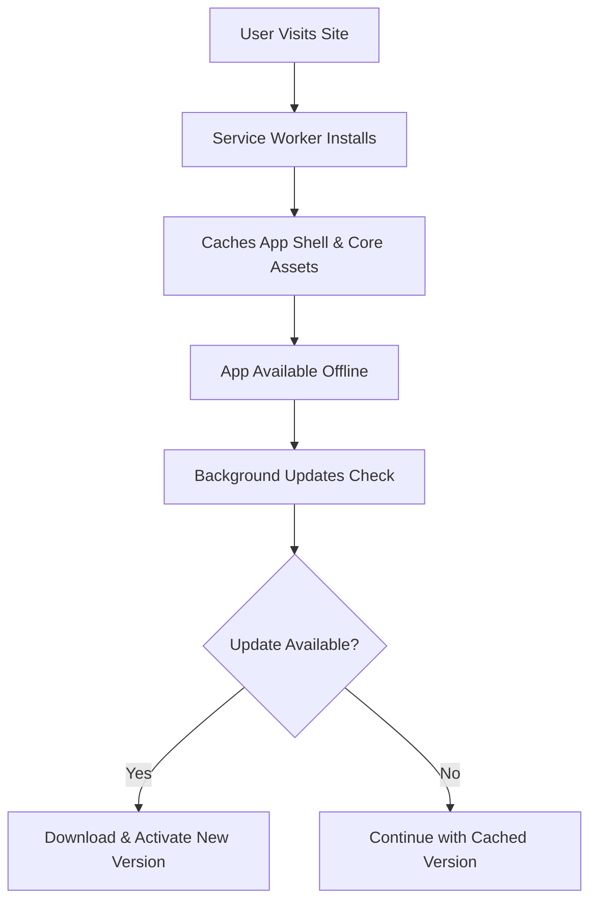
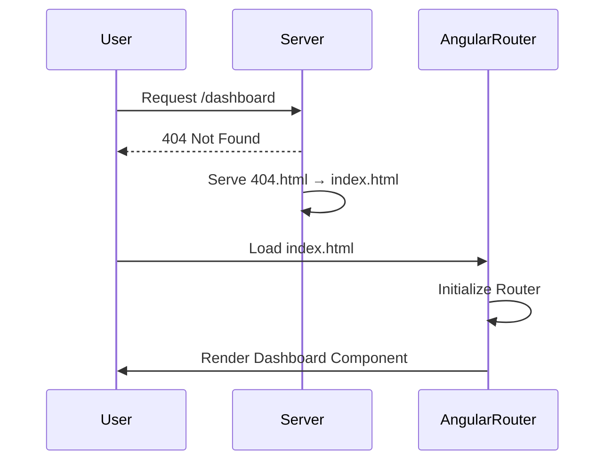

# Deployment Targets & Strategies

<cite>
**Referenced Files in This Document**   
- [angular.json](file://angular.json)
- [ngsw-config.json](file://ngsw-config.json)
- [src/app/shared/utils/constants.ts](file://src/app/shared/utils/constants.ts)
- [src/app/app.config.ts](file://src/app/app.config.ts)
- [public/404.html](file://public/404.html)
</cite>

## Table of Contents
1. [Build Output Structure](#build-output-structure)
2. [Progressive Web App (PWA) Configuration](#progressive-web-app-pwa-configuration)
3. [Environment-Specific API Configuration](#environment-specific-api-configuration)
4. [Client-Side Routing and Fallback Strategy](#client-side-routing-and-fallback-strategy)
5. [Deployment to Firebase](#deployment-to-firebase)
6. [Deployment to Netlify](#deployment-to-netlify)
7. [Deployment to Vercel](#deployment-to-vercel)
8. [Deployment to GitHub Pages](#deployment-to-github-pages)
9. [Common Deployment Issues](#common-deployment-issues)
10. [Performance Optimization Strategies](#performance-optimization-strategies)

## Build Output Structure

The Angular application build process generates static assets in the `dist/angular-tailwind-app` directory as configured in `angular.json`. This output folder contains all necessary files for static hosting, including JavaScript bundles, CSS files, images, and the `index.html` entry point. The build process applies optimization, hashing, and bundling in production mode to ensure efficient loading and cache management. Assets from the `public` directory are copied directly into the output path, preserving their structure for direct access.

**Section sources**
- [angular.json](file://angular.json#L15-L25)

## Progressive Web App (PWA) Configuration

The application is configured as a Progressive Web App using Angular Service Worker via the `ngsw-config.json` file. This configuration defines two primary asset groups: the `app` group, which is prefetched during installation, and the `assets` group, which loads lazily and updates in the background. The service worker enables offline support, fast subsequent loads, and reliable performance by caching core application files and static assets. The `serviceWorker` option in `angular.json` enables this feature specifically for production builds.

**Diagram sources**
- [ngsw-config.json](file://ngsw-config.json#L1-L30)
- [angular.json](file://angular.json#L45-L47)

**Section sources**
- [ngsw-config.json](file://ngsw-config.json#L1-L30)

## Environment-Specific API Configuration

API endpoints are managed through environment-specific variables defined in `src/app/shared/utils/constants.ts`. The `API_CONFIG.BASE_URL` is currently set to the production backend endpoint (`https://balancio-backend.vercel.app/api`), but commented alternatives suggest development and production variations. This centralized configuration allows for easy switching between environments without modifying service logic. The `ApiService` uses this base URL to construct all HTTP requests, ensuring consistency across the application.

**Section sources**
- [src/app/shared/utils/constants.ts](file://src/app/shared/utils/constants.ts#L50-L54)
- [src/app/shared/services/api.service.ts](file://src/app/shared/services/api.service.ts#L5-L10)

## Client-Side Routing and Fallback Strategy

The application uses Angular's client-side routing system defined in `app.routes.ts` and bootstrapped via `appConfig` in `app.config.ts`. To support deep linking in static hosting environments, a fallback strategy is implemented using the `404.html` file in the `public` directory. When a route is not found on the server, the hosting platform serves `404.html`, which redirects to `index.html`, allowing Angular's router to handle the route. This ensures that navigation works correctly even when users directly access or refresh deep links.

**Diagram sources**
- [public/404.html](file://public/404.html)
- [src/app/app.config.ts](file://src/app/app.config.ts#L7-L12)

**Section sources**
- [public/404.html](file://public/404.html)
- [src/app/app.config.ts](file://src/app/app.config.ts#L7-L12)

## Deployment to Firebase

To deploy to Firebase Hosting, initialize the project using `firebase init`, select Hosting, and set the public directory to `dist/angular-tailwind-app`. Configure the `firebase.json` file to redirect all requests to `index.html` for client-side routing. Run `ng build --configuration=production` followed by `firebase deploy`. Firebase automatically serves the service worker and cached assets, enabling PWA capabilities and offline access.

## Deployment to Netlify

Deploy to Netlify by connecting the repository and setting the build command to `ng build --configuration=production` and the publish directory to `dist/angular-tailwind-app`. Create a `_redirects` file in the `public` folder with the rule `/* /index.html 200` to handle client-side routing. Netlify's global CDN ensures fast asset delivery, and the service worker functions normally for offline support.

## Deployment to Vercel

For Vercel deployment, configure the project with the build command `ng build --configuration=production` and output directory `dist/angular-tailwind-app`. Add a `vercel.json` configuration with rewrites to route all non-file requests to `index.html`. Vercel’s edge network optimizes content delivery, and the PWA configuration remains fully functional with service worker registration.

## Deployment to GitHub Pages

Deploy to GitHub Pages by installing `angular-cli-ghpages`, building with `ng build --configuration=production --base-href=/angular-tailwind-app/`, and deploying via `npx angular-cli-ghpages --dir=dist/angular-tailwind-app`. Ensure the repository name matches the base href. GitHub Pages serves the `404.html` fallback, enabling client-side routing. The service worker caches assets for offline use, though cache invalidation may require manual intervention after updates.

## Common Deployment Issues

Common issues include incorrect `base href` configuration, which breaks asset loading when deployed to subdirectories. Ensure the `--base-href` flag matches the deployment path. MIME type errors typically occur when servers don't serve `.js` files with `application/javascript` content type—verify server configuration. Service worker update conflicts can arise when old caches persist; implement versioning or prompt users to reload. Additionally, ensure API endpoints in `constants.ts` match the target environment to prevent CORS or connection errors.

**Section sources**
- [src/app/shared/utils/constants.ts](file://src/app/shared/utils/constants.ts#L50-L54)
- [angular.json](file://angular.json#L45-L47)

## Performance Optimization Strategies

Optimize performance by leveraging Angular's built-in lazy loading for feature modules, reducing initial bundle size. The build process automatically performs code splitting, generating separate chunks for each route. Use a CDN to serve static assets for lower latency. Enable gzip or Brotli compression on the hosting platform. The Angular Service Worker caches static resources with efficient update strategies defined in `ngsw-config.json`, minimizing redundant downloads. Preload critical routes and use Ahead-of-Time (AOT) compilation for faster rendering.

**Section sources**
- [angular.json](file://angular.json#L30-L47)
- [ngsw-config.json](file://ngsw-config.json#L1-L30)