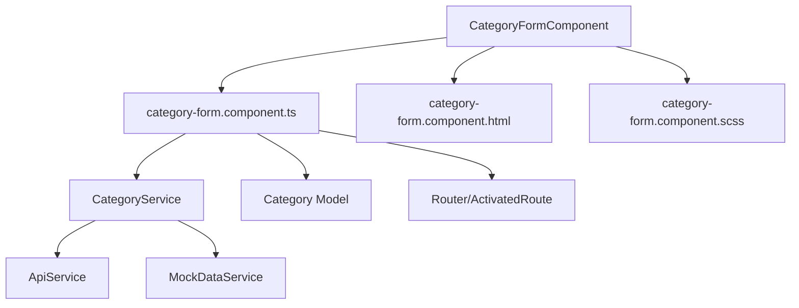
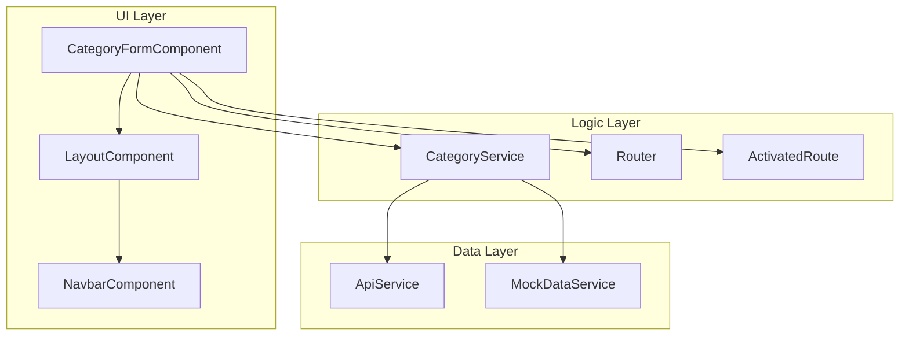
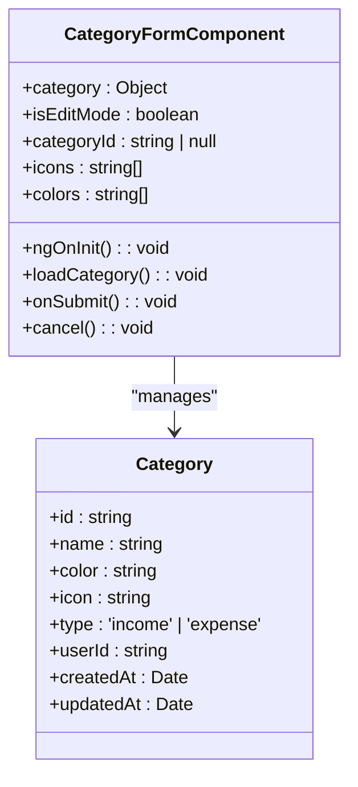
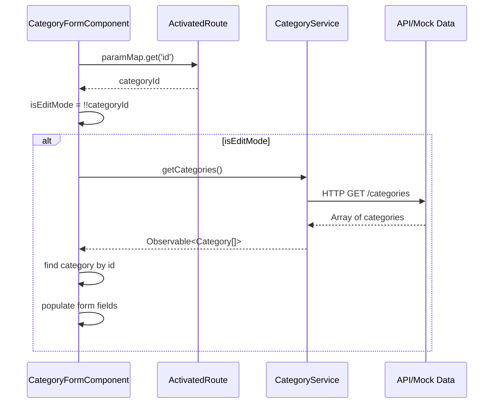
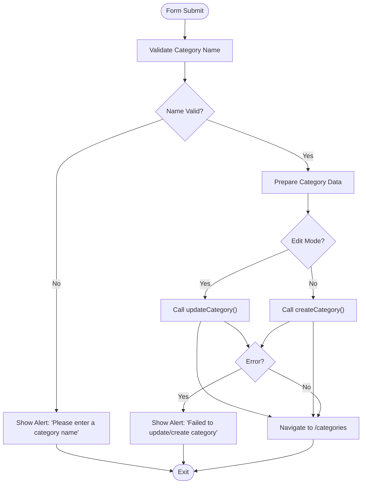
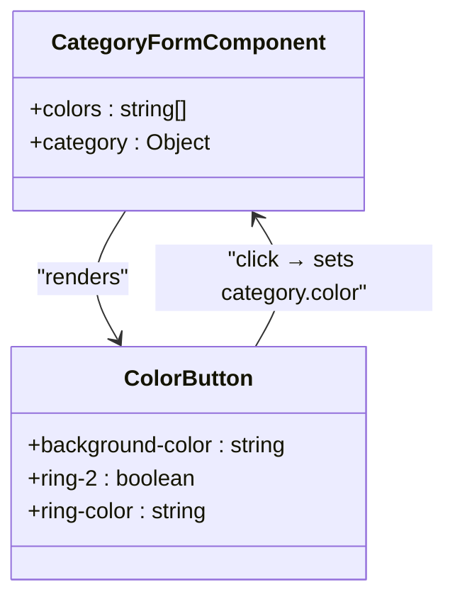
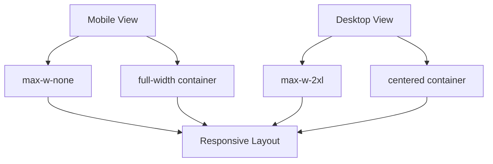
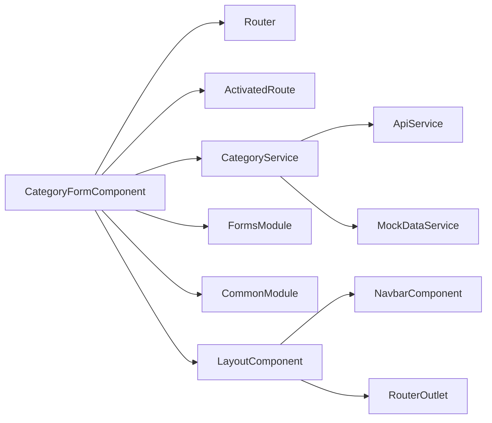

# Category Form Component

<cite>
**Referenced Files in This Document**   
- [category-form.component.ts](file://src/app/categories/category-form/category-form.component.ts)
- [category-form.component.html](file://src/app/categories/category-form/category-form.component.html)
- [category.service.ts](file://src/app/shared/services/category.service.ts)
- [category.model.ts](file://src/app/shared/models/category.model.ts)
- [layout.component.ts](file://src/app/shared/components/layout/layout.component.ts)
- [navbar.component.ts](file://src/app/shared/components/navbar/navbar.component.ts)
- [app.routes.ts](file://src/app/app.routes.ts)
</cite>

## Table of Contents
1. [Introduction](#introduction)
2. [Project Structure](#project-structure)
3. [Core Components](#core-components)
4. [Architecture Overview](#architecture-overview)
5. [Detailed Component Analysis](#detailed-component-analysis)
6. [Dependency Analysis](#dependency-analysis)
7. [Performance Considerations](#performance-considerations)
8. [Troubleshooting Guide](#troubleshooting-guide)
9. [Conclusion](#conclusion)

## Introduction
The CategoryFormComponent is a key feature in the financial management application that enables users to create and edit transaction categories. This component supports both creation and editing modes, determined by route parameters, and provides a user-friendly interface for defining category properties such as name, type (income or expense), icon, and color. Built with Angular's template-driven forms and integrated with shared layout components, it ensures consistency across the application while maintaining responsive behavior on various screen sizes.

## Project Structure
The CategoryFormComponent resides within the categories module and follows Angular's component-based architecture. It leverages shared services and models from the shared directory while maintaining its own template, styles, and logic files.

**Diagram sources**
- [category-form.component.ts](file://src/app/categories/category-form/category-form.component.ts#L1-L115)
- [category.service.ts](file://src/app/shared/services/category.service.ts#L1-L94)

**Section sources**
- [category-form.component.ts](file://src/app/categories/category-form/category-form.component.ts#L1-L115)
- [category-form.component.html](file://src/app/categories/category-form/category-form.component.html#L1-L115)

## Core Components
The CategoryFormComponent implements a template-driven form using Angular's FormsModule to manage category data. It initializes a category object with default values and provides interactive controls for name input, type selection (income/expense), icon selection from a predefined set, and color selection from a palette. The form includes client-side validation to ensure the name field is not empty before submission.

**Section sources**
- [category-form.component.ts](file://src/app/categories/category-form/category-form.component.ts#L10-L48)
- [category-form.component.html](file://src/app/categories/category-form/category-form.component.html#L1-L115)

## Architecture Overview
The component follows a clean separation of concerns, with the template handling presentation, the component class managing state and logic, and services handling data operations. It integrates with the application's routing system to determine edit mode based on the presence of an ID parameter, and uses dependency injection to access necessary services.

**Diagram sources**
- [category-form.component.ts](file://src/app/categories/category-form/category-form.component.ts#L1-L115)
- [layout.component.ts](file://src/app/shared/components/layout/layout.component.ts#L1-L69)
- [navbar.component.ts](file://src/app/shared/components/navbar/navbar.component.ts#L1-L289)

## Detailed Component Analysis

### Component Implementation
The CategoryFormComponent is implemented as a standalone Angular component that uses template-driven forms with two-way data binding via ngModel. It manages form state and validation through the ngForm directive, disabling the submit button when the form is invalid.

#### Form Initialization and Data Binding

**Diagram sources**
- [category-form.component.ts](file://src/app/categories/category-form/category-form.component.ts#L10-L48)
- [category.model.ts](file://src/app/shared/models/category.model.ts#L1-L9)

#### Mode Detection and Category Loading
The component determines its mode (create or edit) during initialization by checking the route parameters. When an ID is present, it enters edit mode and loads the corresponding category data from the CategoryService.

**Diagram sources**
- [category-form.component.ts](file://src/app/categories/category-form/category-form.component.ts#L40-L58)
- [category.service.ts](file://src/app/shared/services/category.service.ts#L10-L28)

#### Submission Flow and API Interaction
When the form is submitted, the component validates the input and calls the appropriate service method based on the current mode. It handles both success and error cases, providing user feedback and navigation.

**Diagram sources**
- [category-form.component.ts](file://src/app/categories/category-form/category-form.component.ts#L70-L115)
- [category.service.ts](file://src/app/shared/services/category.service.ts#L49-L94)

**Section sources**
- [category-form.component.ts](file://src/app/categories/category-form/category-form.component.ts#L50-L115)
- [category.service.ts](file://src/app/shared/services/category.service.ts#L49-L94)

### Color Selection Interface
The color selection interface presents a palette of predefined colors as clickable buttons. Each button displays the color as its background and provides visual feedback when selected through ring styling.

**Diagram sources**
- [category-form.component.ts](file://src/app/categories/category-form/category-form.component.ts#L25-L35)
- [category-form.component.html](file://src/app/categories/category-form/category-form.component.html#L60-L75)

### Responsive Behavior
The component is designed to be responsive, adapting to different screen sizes through Tailwind CSS utility classes. It uses a centered layout with constrained width on larger screens and full-width on mobile devices.

**Diagram sources**
- [category-form.component.html](file://src/app/categories/category-form/category-form.component.html#L2-L6)

## Dependency Analysis
The CategoryFormComponent has well-defined dependencies on various application services and components, following Angular's dependency injection pattern.

**Diagram sources**
- [category-form.component.ts](file://src/app/categories/category-form/category-form.component.ts#L1-L115)
- [category.service.ts](file://src/app/shared/services/category.service.ts#L1-L94)
- [layout.component.ts](file://src/app/shared/components/layout/layout.component.ts#L1-L69)

**Section sources**
- [category-form.component.ts](file://src/app/categories/category-form/category-form.component.ts#L1-L115)
- [app.routes.ts](file://src/app/app.routes.ts#L1-L100)

## Performance Considerations
The component maintains good performance by:
- Using OnPush change detection strategy (implied by standalone component)
- Minimizing DOM manipulation through Angular's change detection
- Efficiently handling event bindings
- Caching service references through dependency injection
- Using pure pipes and immutable data patterns where applicable

The initial load performance is optimized by lazy loading the categories module and only fetching category data when needed in edit mode.

## Troubleshooting Guide
Common issues and their solutions:

1. **Category not loading in edit mode**: Ensure the route parameter 'id' matches an existing category. Check the CategoryService.getCategories() method for proper data retrieval.

2. **Form submission failing**: Verify the name field is not empty and contains only whitespace. Check network requests in browser developer tools for API errors.

3. **Color/icon selection not working**: Ensure the click handlers are properly bound and the category object properties are correctly updated.

4. **Navigation issues**: Confirm the Router is properly injected and the navigation paths ('/categories') exist in the application routes.

5. **Responsive layout problems**: Verify Tailwind CSS is properly configured and the responsive classes are correctly applied.

**Section sources**
- [category-form.component.ts](file://src/app/categories/category-form/category-form.component.ts#L50-L115)
- [category-form.component.html](file://src/app/categories/category-form/category-form.component.html#L1-L115)

## Conclusion
The CategoryFormComponent provides a robust solution for managing transaction categories in the financial application. By leveraging Angular's template-driven forms, it offers a user-friendly interface for creating and editing categories with proper validation and error handling. The component's integration with the routing system allows seamless switching between create and edit modes, while its use of shared services ensures consistent data management across the application. The responsive design and intuitive UI elements make it accessible across various devices and screen sizes.