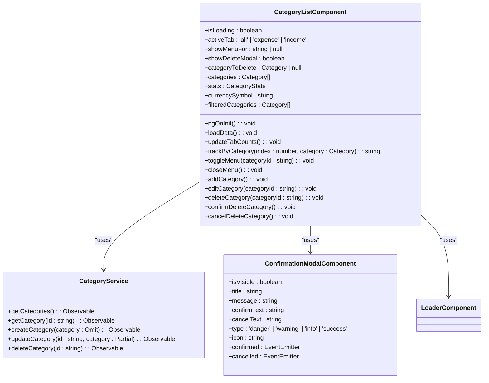
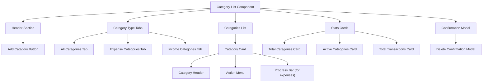
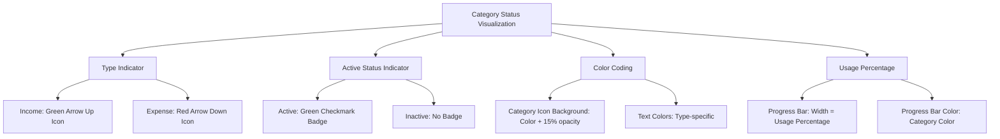
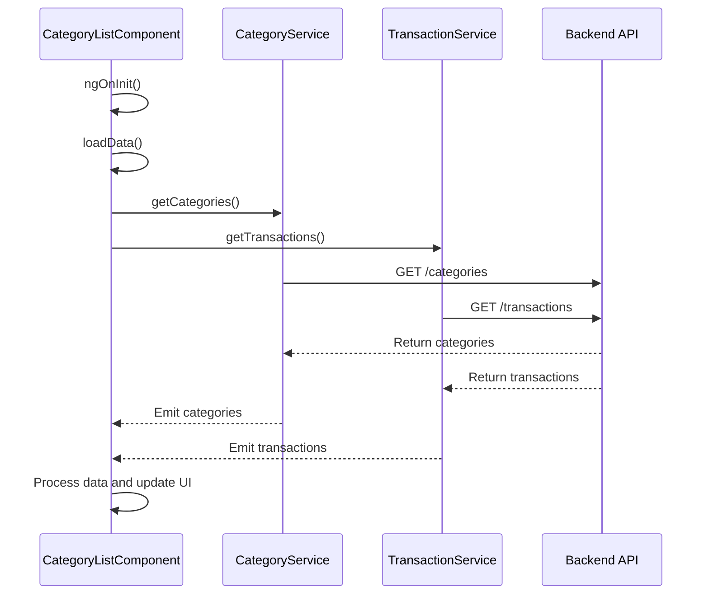
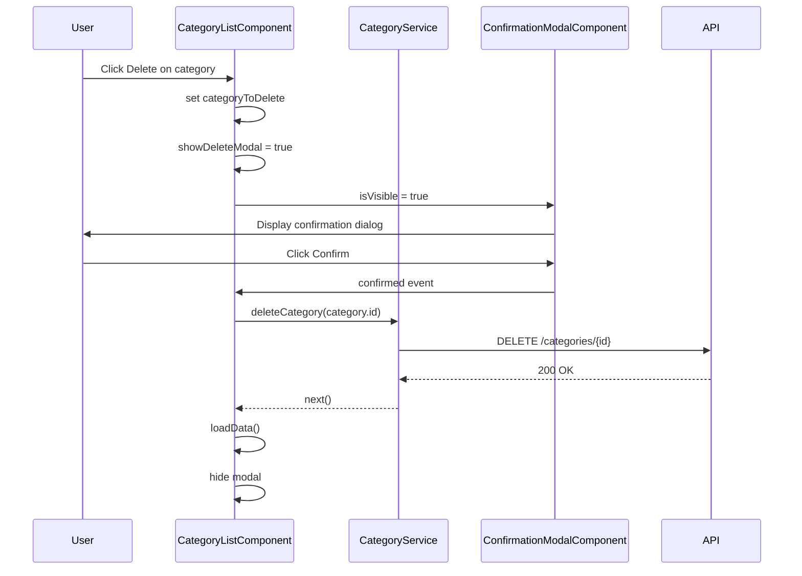
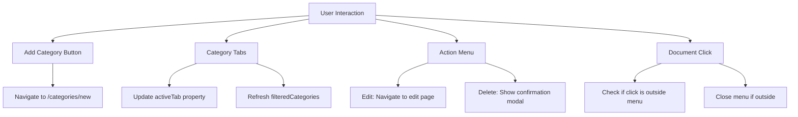
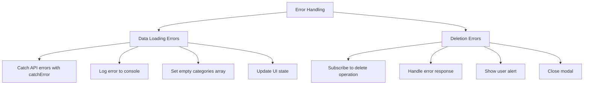

# Category List Component

<cite>
**Referenced Files in This Document**   
- [category-list.component.ts](file://src/app/categories/category-list/category-list.component.ts)
- [category-list.component.html](file://src/app/categories/category-list/category-list.component.html)
- [category.service.ts](file://src/app/shared/services/category.service.ts)
- [confirmation-modal.component.ts](file://src/app/shared/components/confirmation-modal/confirmation-modal.component.ts)
- [category.model.ts](file://src/app/shared/models/category.model.ts)
- [loader.component.ts](file://src/app/shared/components/loader/loader.component.ts)
</cite>

## Table of Contents
1. [Introduction](#introduction)
2. [Component Architecture](#component-architecture)
3. [UI Structure and Layout](#ui-structure-and-layout)
4. [Category Rendering with *ngFor](#category-rendering-with-ngfor)
5. [Status Visualization](#status-visualization)
6. [Service Integration](#service-integration)
7. [Confirmation Modal for Deletion](#confirmation-modal-for-deletion)
8. [Event Handling](#event-handling)
9. [Responsive Design with Tailwind CSS](#responsive-design-with-tailwind-css)
10. [Error Handling](#error-handling)
11. [Accessibility Considerations](#accessibility-considerations)
12. [Performance Optimization](#performance-optimization)

## Introduction
The CategoryListComponent provides a comprehensive interface for managing user-defined transaction categories within the financial application. This component enables users to view, filter, edit, and delete categories while providing visual feedback on category status and usage statistics. The implementation leverages Angular's reactive programming model and integrates with backend services through a dedicated CategoryService.

**Section sources**
- [category-list.component.ts](file://src/app/categories/category-list/category-list.component.ts#L1-L50)

## Component Architecture
The CategoryListComponent follows Angular's component-based architecture with a clear separation of concerns. It implements the OnInit lifecycle hook to initialize data upon component creation and manages its state through various properties that control loading states, active tabs, menu visibility, and modal displays.

The component imports essential dependencies including CommonModule for Angular directives, RouterModule for navigation, LoaderComponent for loading states, and ConfirmationModalComponent for deletion confirmation. It maintains state variables for tracking the active tab (all, expense, or income), menu visibility for individual categories, and deletion modal state.

**Diagram sources**
- [category-list.component.ts](file://src/app/categories/category-list/category-list.component.ts#L30-L263)
- [category.service.ts](file://src/app/shared/services/category.service.ts#L6-L94)
- [confirmation-modal.component.ts](file://src/app/shared/components/confirmation-modal/confirmation-modal.component.ts#L1-L130)

**Section sources**
- [category-list.component.ts](file://src/app/categories/category-list/category-list.component.ts#L1-L263)

## UI Structure and Layout
The component's user interface is structured into three main sections: header with action buttons, category type tabs for filtering, and the categories list with detailed information. The layout is designed to be responsive across different screen sizes using Tailwind CSS utility classes.

The header contains a hidden title section and an "Add Category" button positioned for easy access. The category type tabs allow users to filter categories by "All", "Expense", or "Income" types, with visual indicators showing the count of categories in each tab. Below the tabs, the main content area displays individual category cards with comprehensive information including name, type, transaction statistics, and financial totals.

**Diagram sources**
- [category-list.component.html](file://src/app/categories/category-list/category-list.component.html#L1-L185)

**Section sources**
- [category-list.component.html](file://src/app/categories/category-list/category-list.component.html#L1-L185)

## Category Rendering with *ngFor
The component utilizes Angular's *ngFor directive to dynamically render the list of categories, ensuring efficient DOM updates when the data changes. The directive iterates over the filteredCategories getter, which returns categories based on the currently active tab (all, expense, or income).

To optimize performance, the component implements a trackBy function that uses the category's unique ID to help Angular identify which items have changed, been added, or removed. This prevents unnecessary DOM manipulations and improves rendering performance, especially when dealing with large category lists.

The *ngFor directive is applied to a div element that creates individual category cards, each containing comprehensive information about the category. The template includes conditional rendering for expense categories, which display a progress bar indicating the usage percentage relative to the most frequently used category.

**Section sources**
- [category-list.component.ts](file://src/app/categories/category-list/category-list.component.ts#L120-L125)
- [category-list.component.html](file://src/app/categories/category-list/category-list.component.html#L70-L72)

## Status Visualization
The component provides clear visual indicators for category status and type through multiple mechanisms. Each category displays its type ("income" or "expense") with a colored badge, and active categories are marked with a green "Active" badge containing a checkmark icon.

The visual design uses color coding extensively:
- Expense categories use red tones to indicate money outflow
- Income categories use green tones to indicate money inflow
- Category icons are displayed with a semi-transparent background of the category's color
- Progress bars for expense categories use the category's color to indicate usage level

The component also calculates and displays a usage percentage for expense categories, showing how frequently each category is used relative to the most frequently used category. This is visualized with a progress bar that fills according to the calculated percentage.

**Diagram sources**
- [category-list.component.html](file://src/app/categories/category-list/category-list.component.html#L110-L115)
- [category-list.component.ts](file://src/app/categories/category-list/category-list.component.ts#L180-L190)

**Section sources**
- [category-list.component.html](file://src/app/categories/category-list/category-list.component.html#L1-L185)
- [category-list.component.ts](file://src/app/categories/category-list/category-list.component.ts#L180-L190)

## Service Integration
The CategoryListComponent integrates with multiple services to fetch and manage category data. The primary integration is with CategoryService, which handles all CRUD operations for categories. The component also uses TransactionService to fetch transaction data for calculating category statistics and CurrencyService to display the appropriate currency symbol.

During initialization, the component uses RxJS's forkJoin operator to simultaneously load categories and transactions, improving perceived performance by reducing loading time. The data loading process includes error handling with catchError operators that log errors to the console and provide fallback empty arrays to prevent application crashes.

The component subscribes to the combined observable and processes the data by mapping categories to include transaction counts and total amounts. This enriched data model provides users with comprehensive insights into their category usage patterns.

**Diagram sources**
- [category-list.component.ts](file://src/app/categories/category-list/category-list.component.ts#L130-L175)
- [category.service.ts](file://src/app/shared/services/category.service.ts#L10-L25)

**Section sources**
- [category-list.component.ts](file://src/app/categories/category-list/category-list.component.ts#L130-L175)
- [category.service.ts](file://src/app/shared/services/category.service.ts#L10-L25)

## Confirmation Modal for Deletion
The component implements a secure deletion process using the ConfirmationModalComponent to prevent accidental category removal. When a user initiates a deletion, the component sets the categoryToDelete property and shows the confirmation modal by setting showDeleteModal to true.

The confirmation modal displays a descriptive message that includes the name of the category to be deleted and warns that the action cannot be undone and will affect related transactions. The modal uses a danger type styling with a red delete icon to emphasize the irreversible nature of the action.

Upon confirmation, the component calls the CategoryService's deleteCategory method with the category's ID. If the deletion is successful, the component reloads the data to reflect the changes. If an error occurs, an alert is shown to inform the user of the failure, and the modal is closed.

**Diagram sources**
- [category-list.component.ts](file://src/app/categories/category-list/category-list.component.ts#L220-L250)
- [confirmation-modal.component.ts](file://src/app/shared/components/confirmation-modal/confirmation-modal.component.ts#L1-L130)

**Section sources**
- [category-list.component.ts](file://src/app/categories/category-list/category-list.component.ts#L220-L250)
- [confirmation-modal.component.ts](file://src/app/shared/components/confirmation-modal/confirmation-modal.component.ts#L1-L130)

## Event Handling
The component implements comprehensive event handling for various user interactions. Click events trigger navigation to category creation and editing pages, while also managing the visibility of action menus and modals.

The component listens for document click events to close action menus when users click outside the menu area, improving usability. This is implemented in the ngOnInit method by adding an event listener that checks if the clicked element is within a relative positioned element (the menu container).

Each category card includes an action menu with edit and delete options. When these actions are triggered, the component first closes any open menus and then performs the appropriate action. The edit action navigates to the category edit page, while the delete action initiates the confirmation process.

**Diagram sources**
- [category-list.component.ts](file://src/app/categories/category-list/category-list.component.ts#L100-L115)
- [category-list.component.html](file://src/app/categories/category-list/category-list.component.html#L40-L45)

**Section sources**
- [category-list.component.ts](file://src/app/categories/category-list/category-list.component.ts#L100-L115)
- [category-list.component.html](file://src/app/categories/category-list/category-list.component.html#L40-L45)

## Responsive Design with Tailwind CSS
The component utilizes Tailwind CSS to create a responsive layout that adapts to different screen sizes. The design employs a mobile-first approach with responsive breakpoints that enhance the user experience on larger screens.

Key responsive features include:
- Flexible grid layouts that adjust column counts based on screen size
- Conditional display of text (hidden on small screens, visible on larger screens)
- Responsive padding and margin values that scale with screen size
- Flexible button layouts that adapt to available space
- Responsive typography that adjusts font sizes

The component uses Tailwind's responsive prefixes (sm:, md:, lg:) to apply different styles at various breakpoints. For example, the "Add Category" button displays only an icon on small screens and includes text on larger screens. Similarly, category tabs show abbreviated labels on small screens and full labels on larger screens.

**Section sources**
- [category-list.component.html](file://src/app/categories/category-list/category-list.component.html#L1-L185)
- [category-list.component.scss](file://src/app/categories/category-list/category-list.component.scss#L1-L4)

## Error Handling
The component implements robust error handling to ensure a smooth user experience even when API calls fail. The loadData method includes comprehensive error handling through RxJS catchError operators that catch errors from both category and transaction service calls.

When an error occurs during data loading, the component logs the error to the console for debugging purposes and sets the categories array to empty while updating the tab counts. This prevents the application from crashing and provides users with a clean state rather than a broken interface.

For deletion operations, the component includes error handling in the confirmDeleteCategory method. If the deletion fails, an alert is shown to inform the user, and the modal is closed. This provides immediate feedback about the operation's status and prevents the modal from remaining open in a pending state.

**Diagram sources**
- [category-list.component.ts](file://src/app/categories/category-list/category-list.component.ts#L140-L175)
- [category-list.component.ts](file://src/app/categories/category-list/category-list.component.ts#L230-L240)

**Section sources**
- [category-list.component.ts](file://src/app/categories/category-list/category-list.component.ts#L140-L175)
- [category-list.component.ts](file://src/app/categories/category-list/category-list.component.ts#L230-L240)

## Accessibility Considerations
The component incorporates several accessibility features to ensure usability for all users. Interactive elements include appropriate ARIA attributes and keyboard navigation support. The action menu can be opened and closed using mouse clicks or keyboard interactions, and the confirmation modal traps focus to prevent users from interacting with the background content.

Visual indicators use both color and text/icons to convey information, ensuring that users with color vision deficiencies can understand the status of categories. The component uses semantic HTML elements and appropriate contrast ratios to meet accessibility standards.

Focus management is implemented through focus-visible rings on interactive elements, and the component ensures that all functionality is available through keyboard navigation. The confirmation modal includes proper heading structure and descriptive text to assist screen reader users in understanding the action they are about to perform.

**Section sources**
- [category-list.component.html](file://src/app/categories/category-list/category-list.component.html#L1-L185)

## Performance Optimization
The component implements several performance optimizations to ensure smooth operation even with large category lists. The trackBy function used with *ngFor minimizes DOM manipulations by helping Angular track individual items in the list.

Data loading is optimized through the use of forkJoin to make parallel API calls, reducing the total loading time. The component also implements memoization through computed properties like filteredCategories, which only recalculates when the activeTab or categories array changes.

The component avoids unnecessary re-renders by using OnPush change detection principles and minimizing the use of expensive operations in templates. Calculations like usage percentage are performed in methods rather than inline in templates to improve rendering performance.

For large lists, the component could be further optimized by implementing virtual scrolling, but the current implementation is efficient for typical category counts in personal finance applications.

**Section sources**
- [category-list.component.ts](file://src/app/categories/category-list/category-list.component.ts#L120-L125)
- [category-list.component.ts](file://src/app/categories/category-list/category-list.component.ts#L180-L190)