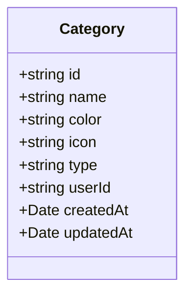
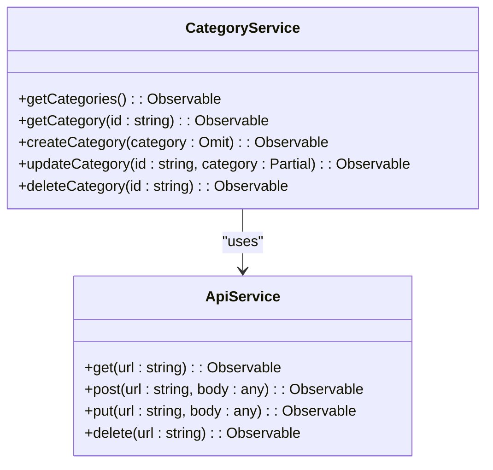
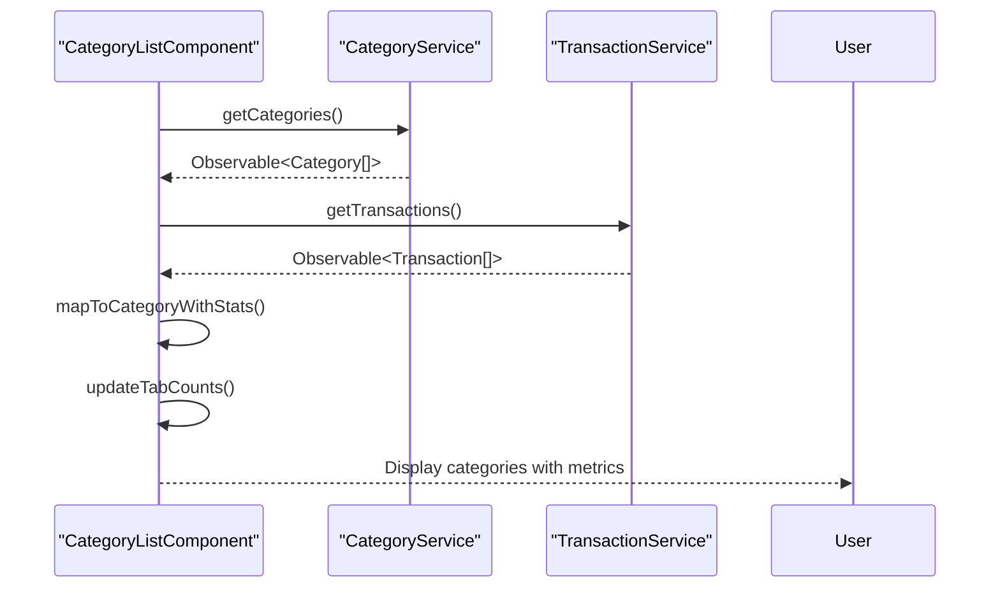
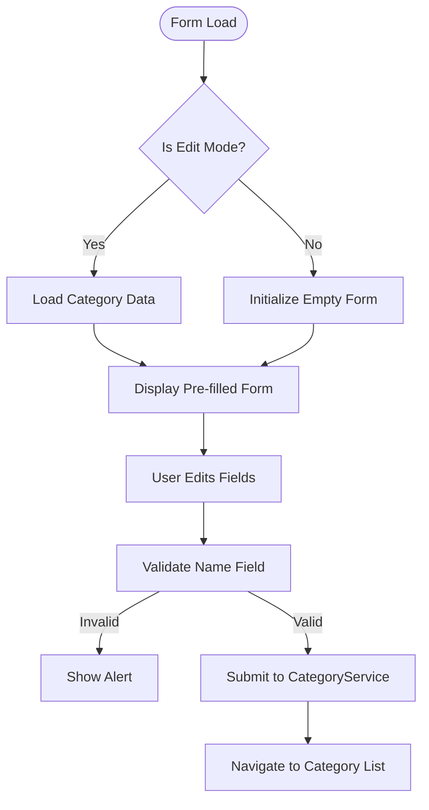
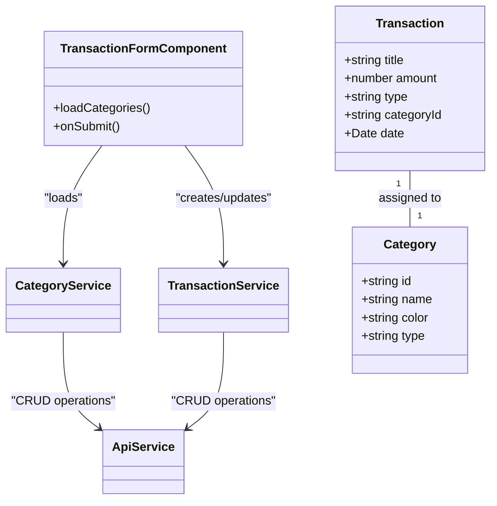
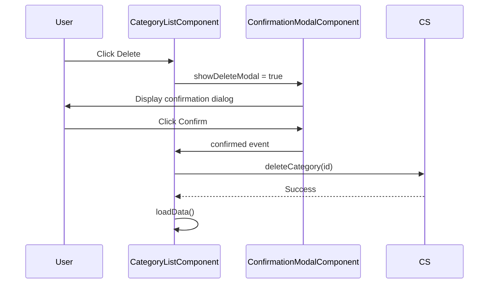

# Category Management

<cite>
**Referenced Files in This Document**  
- [category.model.ts](file://src/app/shared/models/category.model.ts)
- [category.service.ts](file://src/app/shared/services/category.service.ts)
- [category-list.component.ts](file://src/app/categories/category-list/category-list.component.ts)
- [category-form.component.ts](file://src/app/categories/category-form/category-form.component.ts)
- [transaction-form.component.ts](file://src/app/transactions/transaction-form/transaction-form.component.ts)
- [transaction.service.ts](file://src/app/shared/services/transaction.service.ts)
- [confirmation-modal.component.ts](file://src/app/shared/components/confirmation-modal/confirmation-modal.component.ts)
</cite>

## Table of Contents
1. [Introduction](#introduction)
2. [Category Data Model](#category-data-model)
3. [Category Service](#category-service)
4. [Category List Component](#category-list-component)
5. [Category Form Component](#category-form-component)
6. [Integration with Transactions](#integration-with-transactions)
7. [User Experience Considerations](#user-experience-considerations)
8. [Conclusion](#conclusion)

## Introduction
The Category Management system enables users to organize financial transactions by defining, editing, and managing categories for income and expenses. This document details the implementation of CRUD operations, status toggling, and user interface components that support category management within the application. The system integrates seamlessly with transaction creation and provides visual feedback and confirmation mechanisms to enhance user experience.

## Category Data Model

The `Category` interface defines the structure of a financial category used throughout the application. Each category includes metadata such as name, type (income or expense), color, icon, and timestamps for creation and updates.

**Diagram sources**  
- [category.model.ts](file://src/app/shared/models/category.model.ts#L1-L9)

**Section sources**  
- [category.model.ts](file://src/app/shared/models/category.model.ts#L1-L9)

## Category Service

The `CategoryService` provides methods for full CRUD operations and deletion of categories. It communicates with the backend via `ApiService` and transforms API responses into standardized `Category` objects with proper date parsing.

**Diagram sources**  
- [category.service.ts](file://src/app/shared/services/category.service.ts#L1-L86)

**Section sources**  
- [category.service.ts](file://src/app/shared/services/category.service.ts#L1-L86)

## Category List Component

The `CategoryListComponent` displays a list of all categories with filtering by type (all, income, expense), usage statistics, and action controls including edit, duplicate, toggle status, and delete. It fetches category and transaction data to compute usage metrics.

The component supports:
- Filtering via tab selection
- Context menu for individual categories
- Visual indicators for usage frequency
- Confirmation modal for deletion
- Status toggling (active/inactive)

**Section sources**  
- [category-list.component.ts](file://src/app/categories/category-list/category-list.component.ts#L1-L245)

## Category Form Component

The `CategoryFormComponent` handles both creation and editing of categories. It provides a form with fields for name, type, icon, and color selection, with validation to ensure required fields are filled.

Key features:
- Dual mode (create/edit) based on route parameters
- Icon selection from predefined list
- Color picker with 10 preset options
- Client-side validation for name field
- Navigation on success or error

**Section sources**  
- [category-form.component.ts](file://src/app/categories/category-form/category-form.component.ts#L1-L115)

## Integration with Transactions

Categories are integrated into the transaction creation workflow, allowing users to assign transactions to existing categories. The `TransactionFormComponent` retrieves the list of active categories and displays them as a selection dropdown.

**Diagram sources**  
- [transaction-form.component.ts](file://src/app/transactions/transaction-form/transaction-form.component.ts#L1-L94)
- [transaction.service.ts](file://src/app/shared/services/transaction.service.ts#L1-L122)

**Section sources**  
- [transaction-form.component.ts](file://src/app/transactions/transaction-form/transaction-form.component.ts#L1-L94)
- [transaction.service.ts](file://src/app/shared/services/transaction.service.ts#L1-L122)

## User Experience Considerations

### Confirmation Dialogs
Deletion of categories requires explicit confirmation using the `ConfirmationModalComponent`, which displays a warning message with the category name and informs users that related transactions will be affected.

**Diagram sources**  
- [category-list.component.ts](file://src/app/categories/category-list/category-list.component.ts#L1-L245)
- [confirmation-modal.component.ts](file://src/app/shared/components/confirmation-modal/confirmation-modal.component.ts#L1-L130)

### Visual Feedback
- Status changes are immediately reflected in the UI
- Loading states are indicated during data fetch operations
- Success/error alerts provide immediate feedback on operations
- Usage percentages are displayed as progress indicators
- Active/inactive states are visually distinguished

**Section sources**  
- [category-list.component.ts](file://src/app/categories/category-list/category-list.component.ts#L1-L245)
- [confirmation-modal.component.ts](file://src/app/shared/components/confirmation-modal/confirmation-modal.component.ts#L1-L130)

## Conclusion
The Category Management system provides a comprehensive solution for organizing financial transactions through a well-structured data model, robust service layer, and intuitive user interface components. The integration with transaction creation ensures data consistency, while confirmation dialogs and visual feedback enhance user experience and prevent accidental data loss. The system supports full CRUD operations with proper error handling and navigation, making it a reliable component of the financial management application.