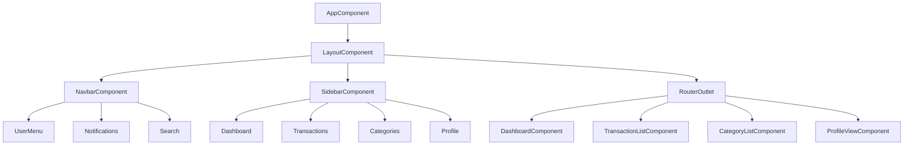
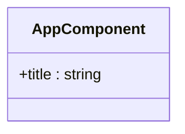
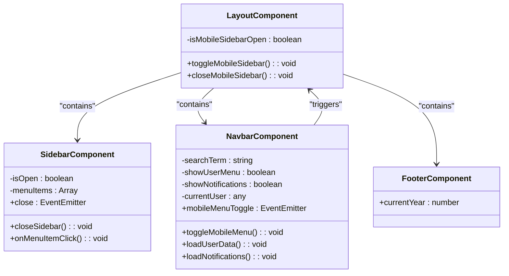
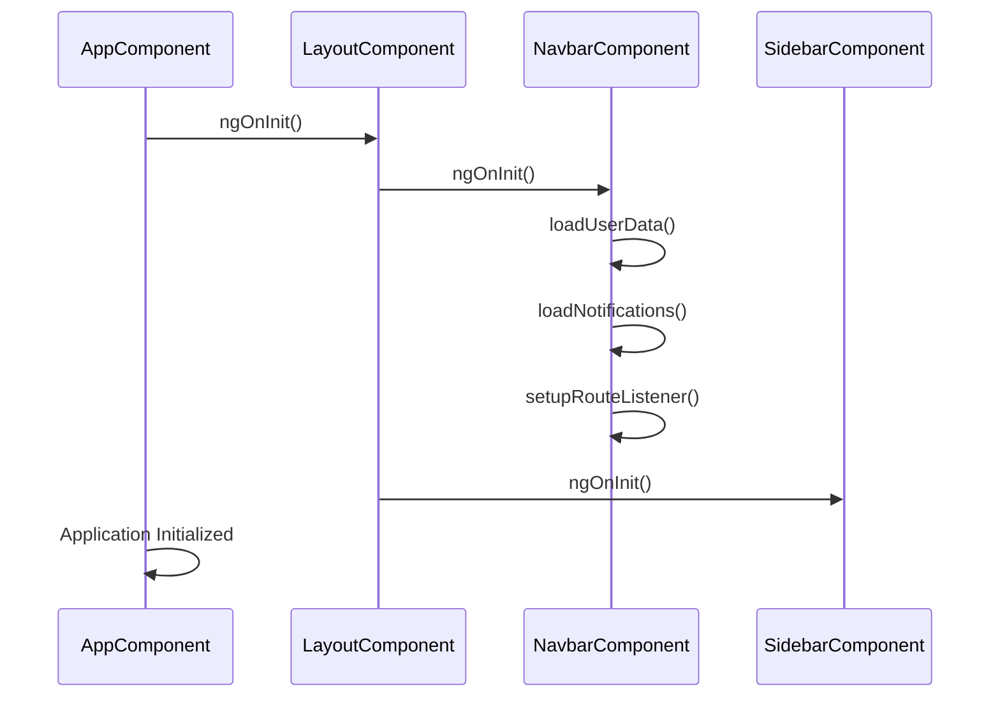
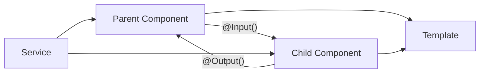
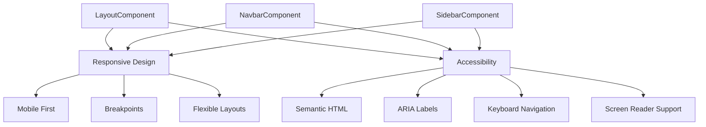
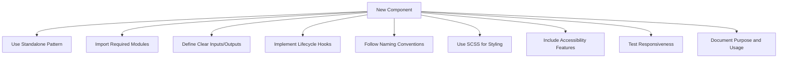

# Component Architecture

<cite>
**Referenced Files in This Document**   
- [app.component.ts](file://src/app/app.component.ts)
- [layout.component.ts](file://src/app/shared/components/layout/layout.component.ts)
- [navbar.component.ts](file://src/app/shared/components/navbar/navbar.component.ts)
- [sidebar.component.ts](file://src/app/shared/components/sidebar/sidebar.component.ts)
- [footer.component.ts](file://src/app/shared/components/footer/footer.component.ts)
</cite>

## Table of Contents
1. [Introduction](#introduction)
2. [Component Hierarchy](#component-hierarchy)
3. [Root Component](#root-component)
4. [Layout Component](#layout-component)
5. [Container vs Presentational Components](#container-vs-presentational-components)
6. [Component Lifecycle and Change Detection](#component-lifecycle-and-change-detection)
7. [Data Flow and State Management](#data-flow-and-state-management)
8. [Accessibility and Responsive Design](#accessibility-and-responsive-design)
9. [Best Practices for Component Creation](#best-practices-for-component-creation)
10. [Conclusion](#conclusion)

## Introduction
This document provides comprehensive architectural documentation for the Angular component hierarchy in the finance tracking application. It details the structural organization, composition patterns, and implementation strategies used throughout the application. The documentation focuses on the core component architecture, including the relationship between the root AppComponent and the LayoutComponent, the composition of UI shell components, and the patterns used for component design and data management.

## Component Hierarchy



**Diagram sources**
- [app.component.ts](file://src/app/app.component.ts)
- [layout.component.ts](file://src/app/shared/components/layout/layout.component.ts)
- [navbar.component.ts](file://src/app/shared/components/navbar/navbar.component.ts)
- [sidebar.component.ts](file://src/app/shared/components/sidebar/sidebar.component.ts)

**Section sources**
- [app.component.ts](file://src/app/app.component.ts)
- [layout.component.ts](file://src/app/shared/components/layout/layout.component.ts)

## Root Component

The AppComponent serves as the root component of the Angular application, providing the entry point and top-level structure. It is a minimal component that primarily acts as a container for the application's routing system.



**Diagram sources**
- [app.component.ts](file://src/app/app.component.ts)

**Section sources**
- [app.component.ts](file://src/app/app.component.ts)

## Layout Component

The LayoutComponent provides the main UI shell for authenticated users, implementing a responsive design that adapts to different screen sizes. It composes the Navbar, Sidebar, and Footer components to create a consistent application layout.



**Diagram sources**
- [layout.component.ts](file://src/app/shared/components/layout/layout.component.ts)
- [sidebar.component.ts](file://src/app/shared/components/sidebar/sidebar.component.ts)
- [navbar.component.ts](file://src/app/shared/components/navbar/navbar.component.ts)
- [footer.component.ts](file://src/app/shared/components/footer/footer.component.ts)

**Section sources**
- [layout.component.ts](file://src/app/shared/components/layout/layout.component.ts)
- [sidebar.component.ts](file://src/app/shared/components/sidebar/sidebar.component.ts)
- [navbar.component.ts](file://src/app/shared/components/navbar/navbar.component.ts)
- [footer.component.ts](file://src/app/shared/components/footer/footer.component.ts)

## Container vs Presentational Components

The application follows the container vs presentational component pattern, clearly separating components that manage state and business logic from those that focus on UI presentation.

```mermaid
flowchart TD
A[Container Components] --> B[Fetch Data]
A --> C[Manage State]
A --> D[Handle Business Logic]
A --> E[Pass Data to Presentational]
F[Presentational Components] --> G[Receive Data via @Input]
F --> H[Send Events via @Output]
F --> I[Focus on UI Rendering]
F --> J[Minimal Logic]
A --> F : "Data Flow"
F --> A : "Event Flow"
```

**Diagram sources**
- [layout.component.ts](file://src/app/shared/components/layout/layout.component.ts)
- [navbar.component.ts](file://src/app/shared/components/navbar/navbar.component.ts)
- [sidebar.component.ts](file://src/app/shared/components/sidebar/sidebar.component.ts)

**Section sources**
- [layout.component.ts](file://src/app/shared/components/layout/layout.component.ts)
- [navbar.component.ts](file://src/app/shared/components/navbar/navbar.component.ts)
- [sidebar.component.ts](file://src/app/shared/components/sidebar/sidebar.component.ts)

## Component Lifecycle and Change Detection

The components implement Angular's lifecycle hooks to manage initialization, data loading, and cleanup operations. The application uses the default change detection strategy with specific optimizations for performance.



**Diagram sources**
- [navbar.component.ts](file://src/app/shared/components/navbar/navbar.component.ts)
- [layout.component.ts](file://src/app/shared/components/layout/layout.component.ts)

**Section sources**
- [navbar.component.ts](file://src/app/shared/components/navbar/navbar.component.ts#L20-L60)
- [layout.component.ts](file://src/app/shared/components/layout/layout.component.ts#L10-L30)

## Data Flow and State Management

The application implements a unidirectional data flow pattern using @Input and @Output decorators to manage component communication. Parent components pass data down to children through inputs, while children emit events to parents through outputs.



**Diagram sources**
- [sidebar.component.ts](file://src/app/shared/components/sidebar/sidebar.component.ts)
- [navbar.component.ts](file://src/app/shared/components/navbar/navbar.component.ts)

**Section sources**
- [sidebar.component.ts](file://src/app/shared/components/sidebar/sidebar.component.ts#L5-L15)
- [navbar.component.ts](file://src/app/shared/components/navbar/navbar.component.ts#L10-L25)

## Accessibility and Responsive Design

The component architecture incorporates accessibility features and responsive design principles to ensure usability across different devices and assistive technologies.



**Diagram sources**
- [layout.component.ts](file://src/app/shared/components/layout/layout.component.ts)
- [navbar.component.ts](file://src/app/shared/components/navbar/navbar.component.ts)
- [sidebar.component.ts](file://src/app/shared/components/sidebar/sidebar.component.ts)

**Section sources**
- [layout.component.ts](file://src/app/shared/components/layout/layout.component.ts#L20-L40)
- [navbar.component.ts](file://src/app/shared/components/navbar/navbar.component.ts#L150-L180)

## Best Practices for Component Creation

When creating new components that follow existing patterns, adhere to the following best practices:



**Diagram sources**
- [app.component.ts](file://src/app/app.component.ts)
- [layout.component.ts](file://src/app/shared/components/layout/layout.component.ts)

**Section sources**
- [app.component.ts](file://src/app/app.component.ts)
- [layout.component.ts](file://src/app/shared/components/layout/layout.component.ts)

## Conclusion
The Angular component architecture in this application demonstrates a well-structured approach to UI development with clear separation of concerns, consistent composition patterns, and adherence to Angular best practices. The root AppComponent delegates UI responsibilities to the LayoutComponent, which orchestrates the main application shell through the Navbar, Sidebar, and Footer components. The container vs presentational pattern ensures maintainable code organization, while the use of lifecycle hooks and proper change detection provides efficient performance. The architecture supports accessibility and responsive design, making the application usable across various devices and user needs. New components should follow the established patterns to maintain consistency and code quality throughout the application.