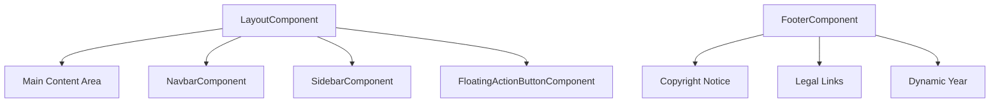
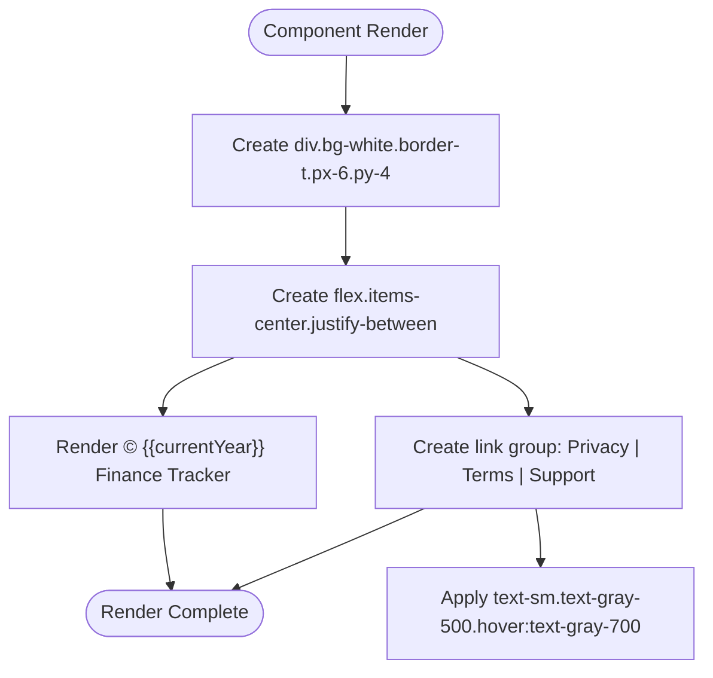
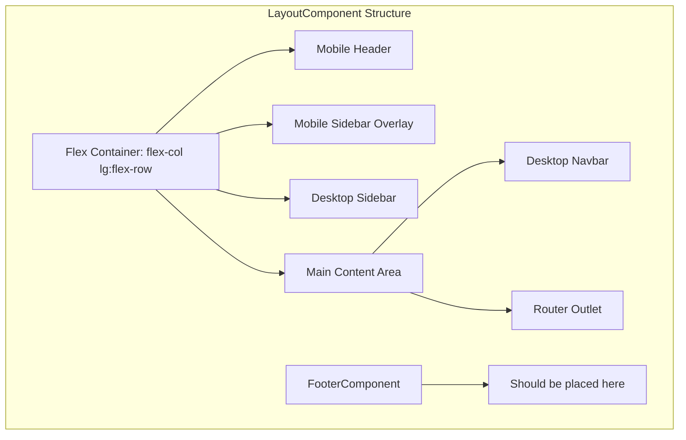
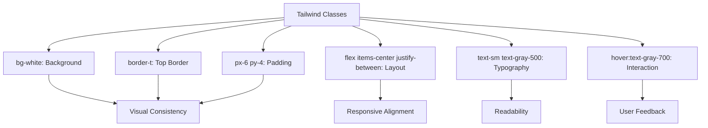
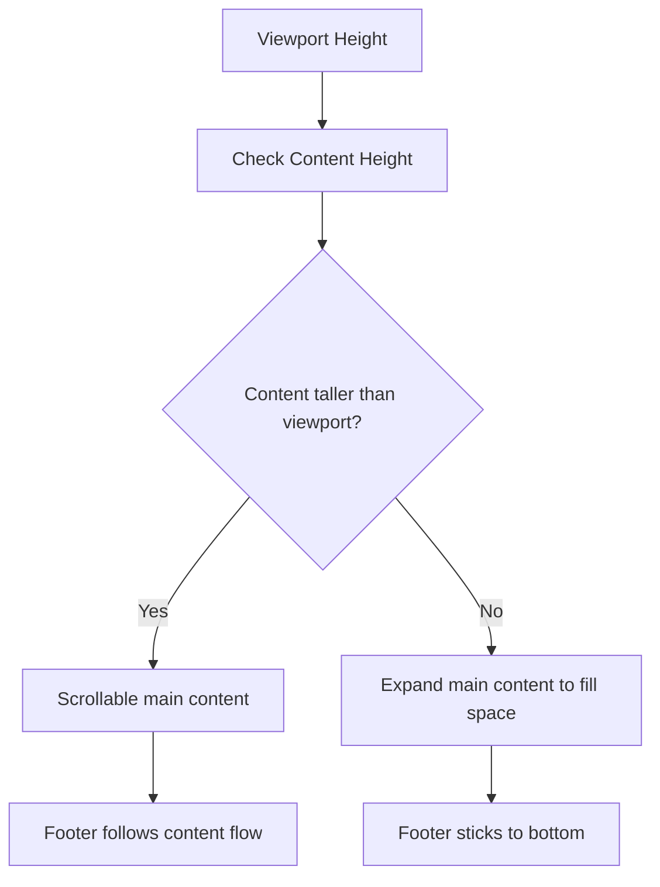

# Footer Component

<cite>
**Referenced Files in This Document**   
- [footer.component.ts](file://src/app/shared/components/footer/footer.component.ts)
- [footer.component.html](file://src/app/shared/components/footer/footer.component.html)
- [footer.component.scss](file://src/app/shared/components/footer/footer.component.scss)
- [layout.component.ts](file://src/app/shared/components/layout/layout.component.ts)
</cite>

## Table of Contents
1. [Introduction](#introduction)
2. [Core Components](#core-components)
3. [Architecture Overview](#architecture-overview)
4. [Detailed Component Analysis](#detailed-component-analysis)
5. [Layout Integration and Responsive Behavior](#layout-integration-and-responsive-behavior)
6. [Styling and Theming with Tailwind CSS](#styling-and-theming-with-tailwind-css)
7. [Accessibility Considerations](#accessibility-considerations)
8. [Customization and Environment-Specific Configuration](#customization-and-environment-specific-configuration)
9. [Layout Challenges and Solutions](#layout-challenges-and-solutions)

## Introduction
The FooterComponent is a shared UI element designed to render consistent bottom information across application views in the Angular-Tailwind financial tracking application. It provides static content such as copyright notices and legal links while supporting dynamic data like the current year. Integrated within the LayoutComponent, it ensures a uniform user experience with responsive alignment and accessibility compliance. This document details its implementation, integration, styling, and customization strategies.

## Core Components

[In-depth analysis of core components with code snippets and explanations]

**Section sources**
- [footer.component.ts](file://src/app/shared/components/footer/footer.component.ts#L1-L12)
- [footer.component.html](file://src/app/shared/components/footer/footer.component.html#L1-L11)

## Architecture Overview

The FooterComponent operates as a standalone Angular component within the shared module, designed for reuse across different application layouts. It is structured to be semantically meaningful, visually consistent, and responsive by leveraging Tailwind CSS utility classes. The component is intended to be included in page layouts but is not yet integrated into the main LayoutComponent based on current code analysis.



**Diagram sources**
- [layout.component.ts](file://src/app/shared/components/layout/layout.component.ts#L1-L70)
- [footer.component.ts](file://src/app/shared/components/footer/footer.component.ts#L1-L12)

## Detailed Component Analysis

### FooterComponent Analysis
The FooterComponent is implemented as a simple, stateless component that displays static footer content with minimal dynamic behavior. It binds the current year dynamically using JavaScript's Date object, ensuring the copyright notice remains up-to-date without manual intervention.

#### Component Structure
```mermaid
classDiagram
class FooterComponent {
+currentYear : number
+constructor()
}
FooterComponent --> "1" "Template : footer.component.html"
FooterComponent --> "1" "Styles : footer.component.scss"
```

**Diagram sources**
- [footer.component.ts](file://src/app/shared/components/footer/footer.component.ts#L1-L12)
- [footer.component.html](file://src/app/shared/components/footer/footer.component.html#L1-L11)

#### Template Implementation
The HTML template uses a flexbox layout to align content horizontally with space between the copyright text and navigation links. All text is styled with consistent typography and color using Tailwind classes, ensuring visual harmony with the application's design system.



**Diagram sources**
- [footer.component.html](file://src/app/shared/components/footer/footer.component.html#L1-L11)

**Section sources**
- [footer.component.html](file://src/app/shared/components/footer/footer.component.html#L1-L11)
- [footer.component.scss](file://src/app/shared/components/footer/footer.component.scss#L1-L1)

## Layout Integration and Responsive Behavior

Currently, the FooterComponent is defined but not projected within the LayoutComponent's template. To achieve consistent placement across views, it should be integrated into the main layout structure, ideally positioned below the main content area.

The existing LayoutComponent uses a flexbox-based layout with a fixed header and scrollable main content. Integrating the footer would require modifying the main container's flex direction and ensuring proper ordering of elements.



**Diagram sources**
- [layout.component.ts](file://src/app/shared/components/layout/layout.component.ts#L1-L70)

**Section sources**
- [layout.component.ts](file://src/app/shared/components/layout/layout.component.ts#L1-L70)

## Styling and Theming with Tailwind CSS

The FooterComponent leverages Tailwind CSS for all styling needs, adhering to the application's design system without requiring custom CSS. The component uses utility classes for background color, borders, padding, typography, and hover states.

The `bg-white` class provides a clean background, while `border-t` adds subtle separation from the main content. Text is styled with `text-sm` for compactness and `text-gray-500` for appropriate contrast, with hover states enhancing interactivity.



**Diagram sources**
- [footer.component.html](file://src/app/shared/components/footer/footer.component.html#L1-L11)
- [tailwind.config.js](file://tailwind.config.js#L1-L10)

## Accessibility Considerations

While the current implementation lacks explicit accessibility enhancements, the semantic HTML structure provides a solid foundation. The footer content is contained within a div element with appropriate heading levels implied by context.

To improve accessibility, the component should:
- Wrap the footer in a `<footer>` semantic element
- Ensure sufficient color contrast for text
- Provide focus indicators for interactive links
- Consider adding ARIA labels if complex navigation is added
- Implement keyboard navigation support

The current links have descriptive text (Privacy, Terms, Support) which is beneficial for screen readers, but lack programmatic focus management or skip-link targets.

**Section sources**
- [footer.component.html](file://src/app/shared/components/footer/footer.component.html#L1-L11)

## Customization and Environment-Specific Configuration

The FooterComponent can be customized for different environments through several approaches:

1. **Dynamic Content Injection**: The component could accept inputs for copyright name, links, and version information
2. **Environment Variables**: Configuration could be driven by Angular environment files (environment.ts, environment.prod.ts)
3. **Conditional Rendering**: Links could be toggled based on environment (e.g., showing "Beta" indicator in development)

Currently, the component displays "Finance Tracker" as the application name and includes standard legal links. These could be made configurable to support white-labeling or different branding requirements.

```mermaid
stateDiagram-v2
[*] --> Development
Development --> Production : Build Process
Development --> Staging : Deployment
Development --> "Development Footer" : Show version, debug links
Production --> "Production Footer" : Clean branding, analytics
Staging --> "Staging Footer" : Environment badge, test links
```

**Section sources**
- [footer.component.ts](file://src/app/shared/components/footer/footer.component.ts#L1-L12)

## Layout Challenges and Solutions

### Sticky Footer Implementation
To ensure the footer appears at the bottom of the viewport even with minimal content, a sticky footer pattern should be implemented:



This can be achieved by modifying the LayoutComponent to use a flexbox layout where the main content area expands to fill available space when content is short.

### Viewport Height Management
The current LayoutComponent uses `h-screen` which may cause layout issues on mobile devices with dynamic toolbars. A better approach would be to use `min-h-screen` combined with proper viewport units to ensure consistent behavior across devices.

The footer should be positioned after the main content in the DOM flow to maintain proper document structure and accessibility, while using CSS to control its visual placement.

**Section sources**
- [layout.component.ts](file://src/app/shared/components/layout/layout.component.ts#L1-L70)
- [footer.component.html](file://src/app/shared/components/footer/footer.component.html#L1-L11)