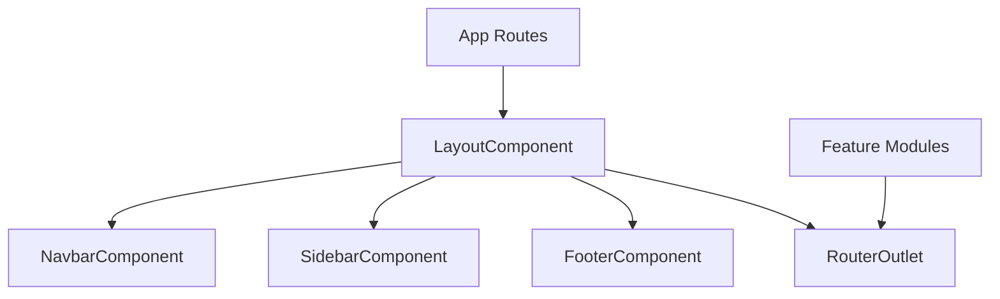
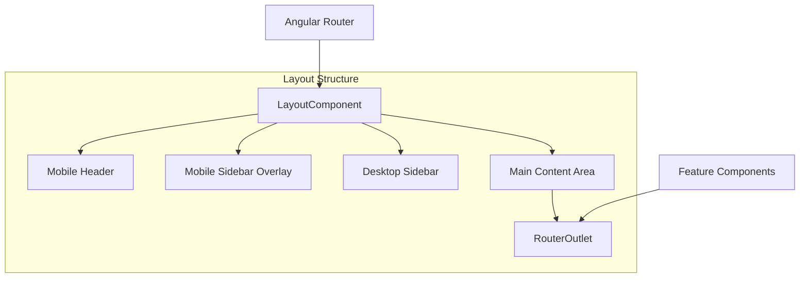
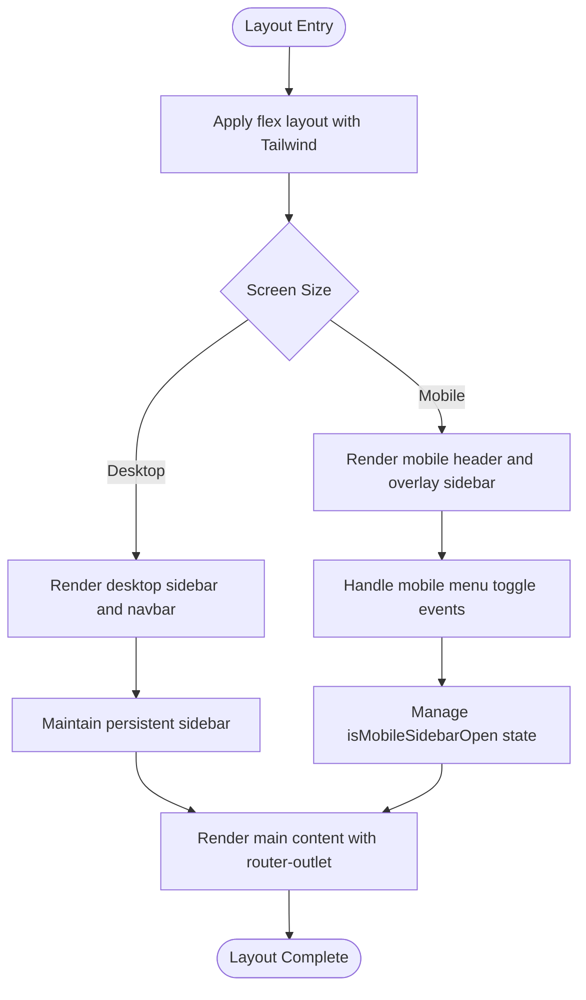
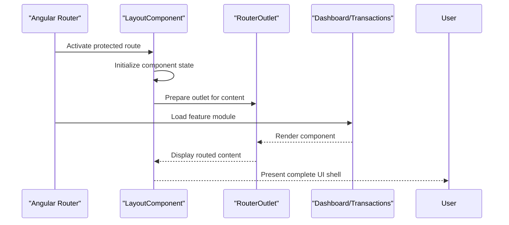
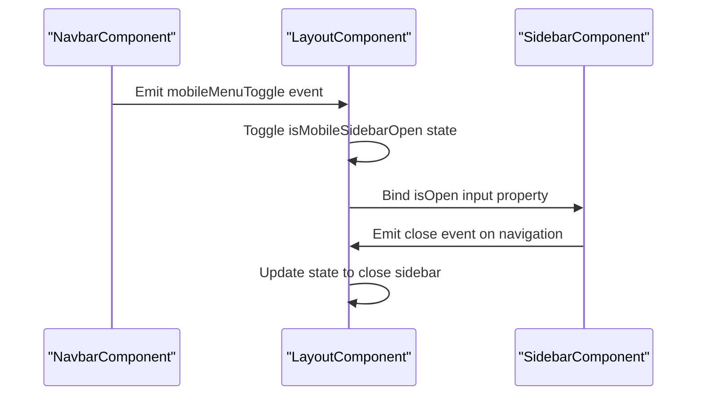
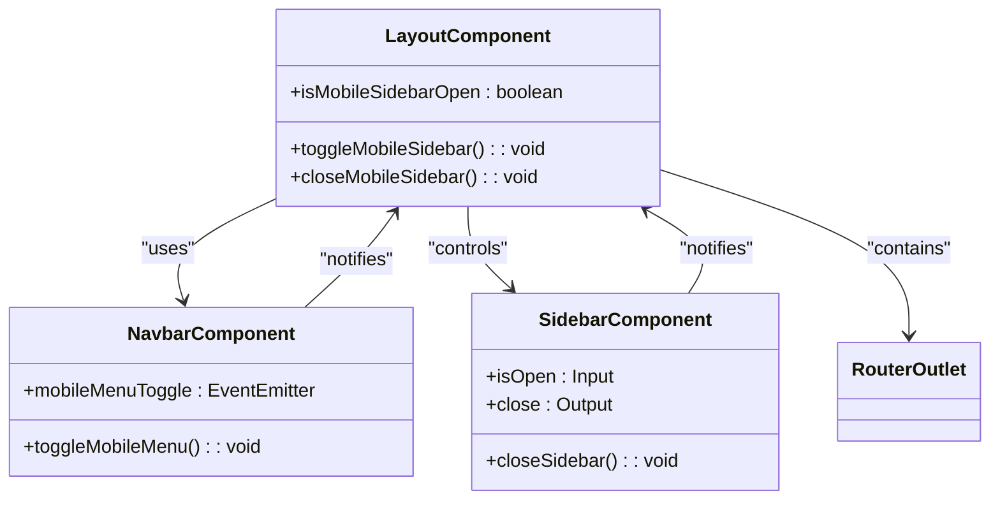

# Layout Component

<cite>
**Referenced Files in This Document**   
- [layout.component.ts](file://src/app/shared/components/layout/layout.component.ts)
- [navbar.component.ts](file://src/app/shared/components/navbar/navbar.component.ts)
- [sidebar.component.ts](file://src/app/shared/components/sidebar/sidebar.component.ts)
- [footer.component.ts](file://src/app/shared/components/footer/footer.component.ts)
- [app.routes.ts](file://src/app/app.routes.ts)
- [dashboard.component.ts](file://src/app/dashboard/dashboard.component.ts)
- [transaction-list.component.ts](file://src/app/transactions/transaction-list/transaction-list.component.ts)
</cite>

## Table of Contents
1. [Introduction](#introduction)
2. [Project Structure](#project-structure)
3. [Core Components](#core-components)
4. [Architecture Overview](#architecture-overview)
5. [Detailed Component Analysis](#detailed-component-analysis)
6. [Dependency Analysis](#dependency-analysis)
7. [Performance Considerations](#performance-considerations)
8. [Troubleshooting Guide](#troubleshooting-guide)
9. [Conclusion](#conclusion)

## Introduction
The LayoutComponent serves as the primary UI shell container for the Angular application, providing a consistent structural framework across all authenticated views. It orchestrates the composition of Navbar, Sidebar, and Footer components while managing responsive behavior and routing integration. This document details its implementation, responsive design patterns using Tailwind CSS, accessibility features, and integration with Angular Router to render feature modules such as Dashboard and Transactions within the main content area.

## Project Structure
The LayoutComponent resides in the shared components directory, indicating its reusable nature across multiple feature modules. It works in conjunction with other UI shell components to provide a cohesive dashboard interface.

**Diagram sources**
- [layout.component.ts](file://src/app/shared/components/layout/layout.component.ts)
- [app.routes.ts](file://src/app/app.routes.ts)

**Section sources**
- [layout.component.ts](file://src/app/shared/components/layout/layout.component.ts)
- [app.routes.ts](file://src/app/app.routes.ts)

## Core Components
The LayoutComponent integrates several key components to form the application's visual structure:
- **NavbarComponent**: Provides top navigation and user controls
- **SidebarComponent**: Offers primary navigation links
- **FooterComponent**: Displays application metadata
- **RouterOutlet**: Renders routed content dynamically

These components are composed using Angular's standalone component architecture and imported directly into the LayoutComponent's declaration.

**Section sources**
- [layout.component.ts](file://src/app/shared/components/layout/layout.component.ts)
- [navbar.component.ts](file://src/app/shared/components/navbar/navbar.component.ts)
- [sidebar.component.ts](file://src/app/shared/components/sidebar/sidebar.component.ts)
- [footer.component.ts](file://src/app/shared/components/footer/footer.component.ts)

## Architecture Overview
The LayoutComponent implements a responsive dashboard layout that adapts to different screen sizes using Tailwind CSS utility classes. It manages state for mobile sidebar visibility and coordinates navigation between components.

**Diagram sources**
- [layout.component.ts](file://src/app/shared/components/layout/layout.component.ts)
- [app.routes.ts](file://src/app/app.routes.ts)

## Detailed Component Analysis

### Layout Component Analysis
The LayoutComponent implements a responsive dashboard shell that conditionally renders components based on screen size. It uses Tailwind's responsive prefixes (lg:) to toggle visibility between mobile and desktop layouts.

#### Template Structure and Responsive Design

**Diagram sources**
- [layout.component.ts](file://src/app/shared/components/layout/layout.component.ts)

#### Component Composition and Routing Integration
The LayoutComponent serves as a container for routed content, using Angular's RouterOutlet directive to render feature modules. The routing configuration in app.routes.ts specifies that protected routes use this layout component as their shell.

**Diagram sources**
- [layout.component.ts](file://src/app/shared/components/layout/layout.component.ts)
- [app.routes.ts](file://src/app/app.routes.ts)

**Section sources**
- [layout.component.ts](file://src/app/shared/components/layout/layout.component.ts)
- [app.routes.ts](file://src/app/app.routes.ts)

### Navbar and Sidebar Integration
The LayoutComponent tightly integrates with Navbar and Sidebar components through event binding and state sharing.

#### Navigation Event Flow

**Diagram sources**
- [layout.component.ts](file://src/app/shared/components/layout/layout.component.ts)
- [navbar.component.ts](file://src/app/shared/components/navbar/navbar.component.ts)
- [sidebar.component.ts](file://src/app/shared/components/sidebar/sidebar.component.ts)

**Section sources**
- [layout.component.ts](file://src/app/shared/components/layout/layout.component.ts)
- [navbar.component.ts](file://src/app/shared/components/navbar/navbar.component.ts)
- [sidebar.component.ts](file://src/app/shared/components/sidebar/sidebar.component.ts)

## Dependency Analysis
The LayoutComponent has well-defined dependencies on other shared components and Angular's routing system.

**Diagram sources**
- [layout.component.ts](file://src/app/shared/components/layout/layout.component.ts)
- [navbar.component.ts](file://src/app/shared/components/navbar/navbar.component.ts)
- [sidebar.component.ts](file://src/app/shared/components/sidebar/sidebar.component.ts)

**Section sources**
- [layout.component.ts](file://src/app/shared/components/layout/layout.component.ts)
- [navbar.component.ts](file://src/app/shared/components/navbar/navbar.component.ts)
- [sidebar.component.ts](file://src/app/shared/components/sidebar/sidebar.component.ts)

## Performance Considerations
The LayoutComponent implements efficient change detection by using OnPush strategy implicitly through its standalone nature. The mobile sidebar is conditionally rendered using *ngIf, preventing unnecessary DOM elements on desktop views. Event handling is optimized by delegating click interception to specific components rather than global listeners.

The component avoids content projection performance issues by using router-outlet instead of @ContentChildren, resulting in better lazy loading characteristics and reduced initial bundle size for feature modules.

**Section sources**
- [layout.component.ts](file://src/app/shared/components/layout/layout.component.ts)

## Troubleshooting Guide
Common issues with the LayoutComponent typically involve routing configuration or mobile responsiveness. Ensure that protected routes in app.routes.ts correctly reference the LayoutComponent and that the RouterOutlet is properly configured. For mobile sidebar issues, verify that event propagation is correctly managed between Navbar and Sidebar components.

When adding new routes, confirm they are included in the children array of the layout route configuration and that required permissions are properly set through the AuthGuard.

**Section sources**
- [layout.component.ts](file://src/app/shared/components/layout/layout.component.ts)
- [app.routes.ts](file://src/app/app.routes.ts)

## Conclusion
The LayoutComponent provides a robust foundation for the application's user interface, effectively managing navigation, responsive design, and content rendering. Its implementation leverages Angular's component architecture and Tailwind CSS to create a flexible, accessible, and maintainable UI shell that supports the application's growth and evolving requirements.