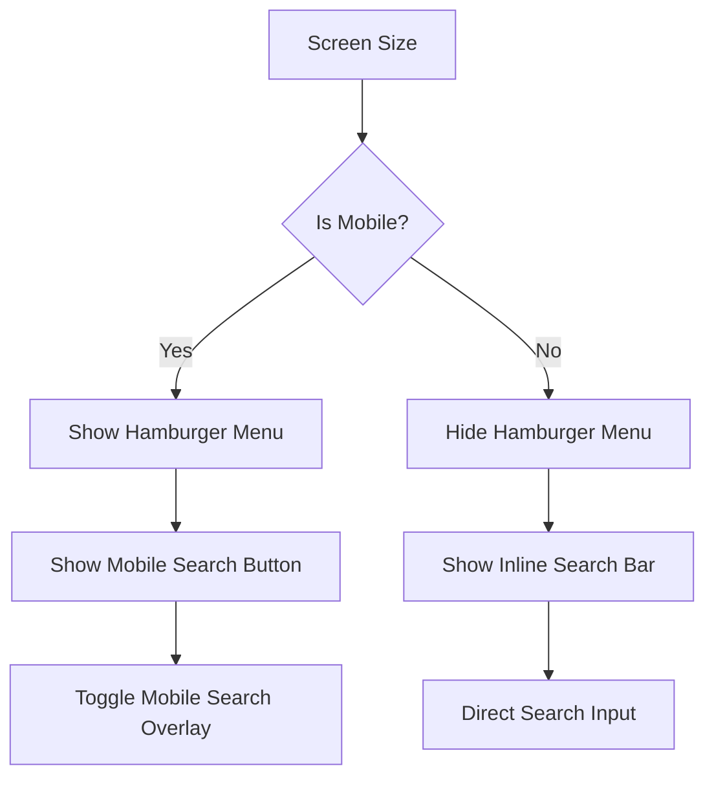
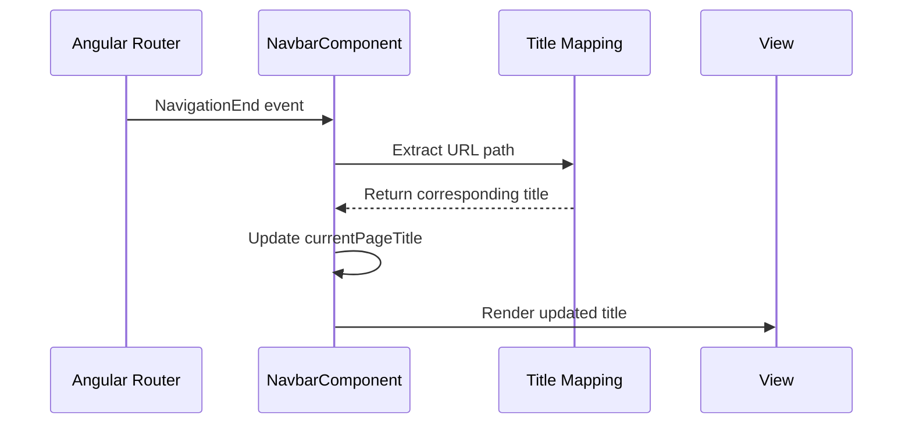
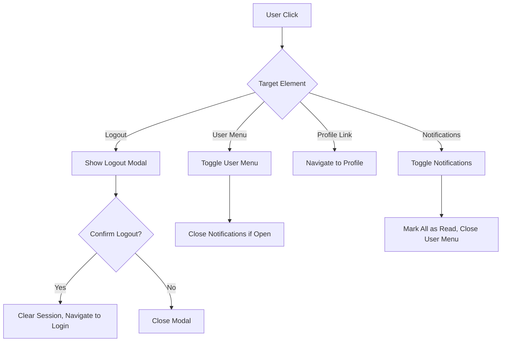
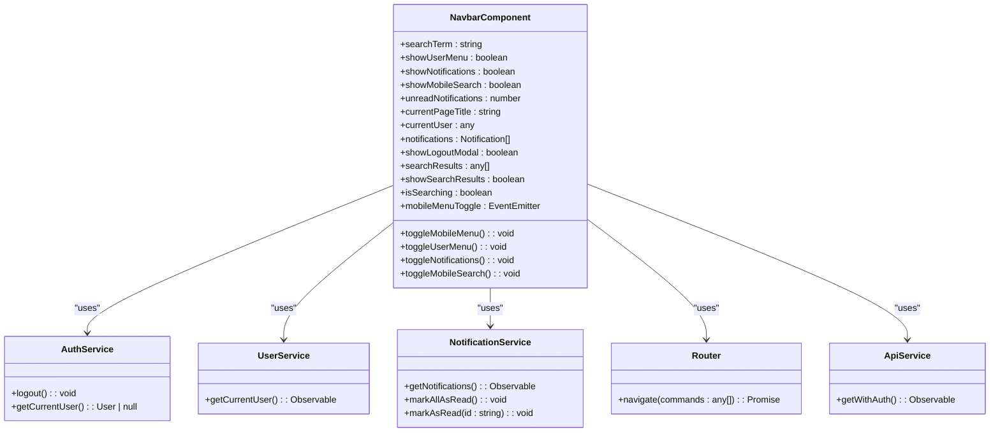
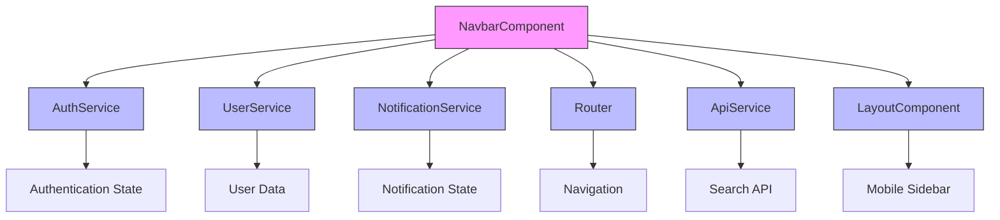

# Navbar Component

<cite>
**Referenced Files in This Document**   
- [navbar.component.ts](file://src/app/shared/components/navbar/navbar.component.ts)
- [navbar.component.html](file://src/app/shared/components/navbar/navbar.component.html)
- [navbar.component.scss](file://src/app/shared/components/navbar/navbar.component.scss)
- [layout.component.ts](file://src/app/shared/components/layout/layout.component.ts)
- [notification.service.ts](file://src/app/shared/services/notification.service.ts)
- [auth.service.ts](file://src/app/auth/auth.service.ts)
- [user.service.ts](file://src/app/shared/services/user.service.ts)
</cite>

## Table of Contents
1. [Introduction](#introduction)
2. [Visual Design with Tailwind CSS](#visual-design-with-tailwind-css)
3. [Responsive Behavior](#responsive-behavior)
4. [Angular Router Integration](#angular-router-integration)
5. [Event Handling](#event-handling)
6. [Input/Output Bindings](#inputoutput-bindings)
7. [Accessibility Practices](#accessibility-practices)
8. [Extending the Navbar](#extending-the-navbar)
9. [Common Issues](#common-issues)
10. [Architecture Overview](#architecture-overview)

## Introduction
The NavbarComponent provides top navigation across authenticated views in the Angular application. It features a responsive design built with Tailwind CSS, integrates with Angular Router for navigation, and includes user profile interactions, notifications, and mobile responsiveness. The component displays the current route state through dynamic page titles and welcome messages, while maintaining user session data and notification state.

**Section sources**
- [navbar.component.ts](file://src/app/shared/components/navbar/navbar.component.ts#L1-L32)
- [navbar.component.html](file://src/app/shared/components/navbar/navbar.component.html#L1-L15)

## Visual Design with Tailwind CSS
The navbar employs Tailwind CSS utility classes to create a clean, modern interface with proper spacing, typography, and visual hierarchy. The design features a white background with a subtle border bottom, sticky positioning, and appropriate padding across breakpoints.

Key visual elements include:
- **Typography**: Responsive text sizing using Tailwind's responsive prefixes (text-lg sm:text-xl lg:text-2xl)
- **Spacing**: Consistent padding with responsive adjustments (px-3 sm:px-4 lg:px-6)
- **Colors**: Gray-scale palette with blue accents for interactive elements
- **Layout**: Flexbox-based layout with proper alignment and spacing
- **Interactive States**: Hover effects using hover:bg-gray-100 and focus states with focus:ring-2 focus:ring-blue-500

The component maintains visual consistency with the application's design system through the use of standardized spacing, typography, and color schemes.

**Section sources**
- [navbar.component.html](file://src/app/shared/components/navbar/navbar.component.html#L1-L20)
- [navbar.component.scss](file://src/app/shared/components/navbar/navbar.component.scss#L1-L3)

## Responsive Behavior
The navbar implements comprehensive responsive behavior to ensure optimal user experience across device sizes. The component adapts its layout and functionality based on screen width using Tailwind's responsive prefixes.

### Mobile View (under lg breakpoint)
- Hamburger menu button appears for toggling the sidebar
- Search functionality collapses into a dedicated mobile search overlay
- User menu and notifications maintain dropdown behavior
- Reduced padding and font sizes for better mobile usability

### Desktop View (lg and above)
- Hamburger menu button is hidden
- Search bar displays inline with fixed width
- Full user information displays in the user menu
- Increased spacing and font sizes for desktop readability

The mobile menu functionality is implemented through the `showMobileSearch` state variable and corresponding toggle methods, allowing users to expand the search functionality when needed on smaller screens.



**Diagram sources**
- [navbar.component.ts](file://src/app/shared/components/navbar/navbar.component.ts#L270-L289)
- [navbar.component.html](file://src/app/shared/components/navbar/navbar.component.html#L4-L15)

**Section sources**
- [navbar.component.ts](file://src/app/shared/components/navbar/navbar.component.ts#L270-L289)
- [navbar.component.html](file://src/app/shared/components/navbar/navbar.component.html#L1-L30)

## Angular Router Integration
The NavbarComponent integrates with Angular Router to provide dynamic navigation and route state reflection. The component subscribes to router events to detect navigation changes and update the displayed page title accordingly.

The integration includes:
- **Route Detection**: Listening to NavigationEnd events to detect route changes
- **Dynamic Title Updates**: Mapping URL paths to human-readable titles
- **Navigation Actions**: Using router.navigate() for profile and logout flows

The component maintains the current page title in the `currentPageTitle` property, which is updated whenever the route changes. This provides users with clear context about their current location within the application.



**Diagram sources**
- [navbar.component.ts](file://src/app/shared/components/navbar/navbar.component.ts#L60-L74)
- [navbar.component.ts](file://src/app/shared/components/navbar/navbar.component.ts#L245-L265)

**Section sources**
- [navbar.component.ts](file://src/app/shared/components/navbar/navbar.component.ts#L60-L74)
- [navbar.component.ts](file://src/app/shared/components/navbar/navbar.component.ts#L245-L265)

## Event Handling
The NavbarComponent implements comprehensive event handling for user interactions, including profile management, notifications, and authentication flows.

### User Profile Interactions
- **User Menu Toggle**: Toggles the visibility of the user dropdown menu
- **Profile Navigation**: Navigates to the profile page when selected
- **Settings Access**: Placeholder for settings navigation
- **Logout Flow**: Initiates logout with confirmation modal

### Notifications
- **Notification Toggle**: Opens/closes the notifications dropdown
- **Read State Management**: Marks notifications as read when viewed
- **Individual Notification Handling**: Allows marking specific notifications as read

### Authentication
- **Logout Confirmation**: Modal-based confirmation to prevent accidental logouts
- **Session Termination**: Clears user data and redirects to login

The component uses Angular's event binding syntax to handle click events and implements proper state management to coordinate between different interactive elements.



**Diagram sources**
- [navbar.component.ts](file://src/app/shared/components/navbar/navbar.component.ts#L178-L230)
- [navbar.component.html](file://src/app/shared/components/navbar/navbar.component.html#L126-L263)

**Section sources**
- [navbar.component.ts](file://src/app/shared/components/navbar/navbar.component.ts#L178-L230)
- [navbar.component.html](file://src/app/shared/components/navbar/navbar.component.html#L126-L263)

## Input/Output Bindings
The NavbarComponent uses Angular's input and output bindings to communicate with parent components and services, enabling proper integration within the application architecture.

### Output Bindings
- **mobileMenuToggle**: EventEmitter that notifies parent components when the mobile menu button is clicked
- This output is used by the LayoutComponent to control the mobile sidebar state

### Service Dependencies
The component injects several services through its constructor for data access and state management:
- **AuthService**: Handles authentication state and logout operations
- **UserService**: Retrieves current user information
- **NotificationService**: Manages notification state and read status
- **Router**: Enables navigation between routes
- **ApiService**: Facilitates API calls for search functionality

The component acts as a coordinator between these services, aggregating data and providing a unified interface for user interactions.



**Diagram sources**
- [navbar.component.ts](file://src/app/shared/components/navbar/navbar.component.ts#L34-L74)
- [navbar.component.ts](file://src/app/shared/components/navbar/navbar.component.ts#L1-L32)

**Section sources**
- [navbar.component.ts](file://src/app/shared/components/navbar/navbar.component.ts#L34-L74)
- [layout.component.ts](file://src/app/shared/components/layout/layout.component.ts#L8-L41)

## Accessibility Practices
The NavbarComponent implements several accessibility practices to ensure usability for all users, including those using assistive technologies.

### ARIA Labels and Semantics
- **Proper HTML Semantics**: Uses semantic HTML elements like header and button
- **ARIA Attributes**: Implicit ARIA roles through proper element usage
- **Focus Management**: Visible focus states with focus:ring-2 and focus:ring-blue-500
- **Keyboard Navigation**: Supports tab navigation through interactive elements

### Visual Accessibility
- **Color Contrast**: Sufficient contrast between text and background colors
- **Focus Indicators**: Clear visual indication of focused elements
- **Interactive States**: Visual feedback for hover and active states
- **Text Alternatives**: Icon buttons include text alternatives through context

### Keyboard Support
- **Tab Navigation**: All interactive elements are reachable via keyboard
- **Enter/Space Activation**: Buttons can be activated with Enter or Space
- **Escape to Close**: Dropdowns can be closed with Escape key (implied by document click handler)
- **Focus Trapping**: Modal dialog maintains focus within its elements

The component ensures that all interactive elements are accessible via keyboard and provide appropriate visual feedback for different states.

**Section sources**
- [navbar.component.html](file://src/app/shared/components/navbar/navbar.component.html#L1-L263)

## Extending the Navbar
The NavbarComponent can be extended to support additional functionality and customization through various approaches.

### Adding New Menu Items
To add new menu items to the user dropdown, modify the template to include additional buttons with appropriate click handlers:

```html
<button 
  (click)="viewAnalytics()"
  class="block w-full text-left px-4 py-2 text-sm text-gray-700 hover:bg-gray-100 transition-colors">
  <div class="flex items-center space-x-2">
    <svg class="w-4 h-4" fill="none" stroke="currentColor" viewBox="0 0 24 24">
      <path stroke-linecap="round" stroke-linejoin="round" stroke-width="2" d="M9 19v-6a2 2 0 00-2-2H5a2 2 0 00-2 2v6a2 2 0 002 2h2a2 2 0 002-2zm0 0V9a2 2 0 012-2h2a2 2 0 012 2v10m-6 0a2 2 0 002 2h2a2 2 0 002-2m0 0V5a2 2 0 012-2h2a2 2 0 012 2v14a2 2 0 01-2 2h-2a2 2 0 01-2-2z"></path>
    </svg>
    <span>Analytics</span>
  </div>
</button>
```

Then add the corresponding method in the component class:

```typescript
viewAnalytics() {
  this.showUserMenu = false;
  this.router.navigate(['/analytics']);
}
```

### Integrating User Avatar Dropdowns
The component already supports user avatar display through initials when an avatar image is not available. To enhance this feature:

1. Update the user data loading to prioritize avatar URLs
2. Modify the template to conditionally render avatar images:

```html
<div class="w-7 h-7 lg:w-8 lg:h-8 rounded-full flex items-center justify-center" 
     [class.bg-blue-500]="!currentUser?.avatar">
  
  <span *ngIf="!currentUser?.avatar" 
        class="text-white text-xs lg:text-sm font-medium">
    {{ currentUser?.initials || 'U' }}
  </span>
</div>
```

### Customizing Notification Types
The component supports different notification types (warning, success, info, error) with appropriate styling. New types can be added by extending the icon and color mapping functions:

```typescript
getNotificationIcon(type: string): string {
  const iconMap: { [key: string]: string } = {
    'warning': 'warning',
    'success': 'check_circle',
    'info': 'info',
    'error': 'error',
    'custom': 'custom_icon'
  };
  return iconMap[type] || 'notifications';
}
```

**Section sources**
- [navbar.component.ts](file://src/app/shared/components/navbar/navbar.component.ts#L178-L230)
- [navbar.component.html](file://src/app/shared/components/navbar/navbar.component.html#L126-L263)

## Common Issues
The NavbarComponent may encounter several common issues that require specific solutions.

### Z-Index Conflicts
Z-index conflicts can occur when multiple absolutely positioned elements overlap. The navbar addresses this by:
- Using z-40 for the navbar itself
- Using z-50 for dropdown menus and search results
- Using z-50 for the logout modal

This stacking order ensures that dropdowns appear above the navbar but below modals. If conflicts arise, verify that other components use appropriate z-index values that don't interfere with the navbar's layering.

### Mobile Touch Behavior
Mobile touch behavior issues can include:
- **Dropdowns not closing properly**: Solved by the document click listener that closes dropdowns when clicking outside
- **Touch targets too small**: Addressed by adequate padding (p-2) on interactive elements
- **Search overlay usability**: Improved by the dedicated mobile search toggle and overlay

### Search Functionality Issues
Potential search issues and solutions:
- **Search results not displaying**: Ensure search term is at least 2 characters
- **API errors during search**: Implement proper error handling with user feedback
- **Performance concerns**: Limit results to 5 items and implement debouncing

### User Data Loading
The component implements a fallback mechanism for user data loading:
1. First attempts to get user from AuthService
2. If unavailable, calls UserService to fetch from API
3. If both fail, displays placeholder user data

This ensures the navbar remains functional even if user data is temporarily unavailable.

**Section sources**
- [navbar.component.ts](file://src/app/shared/components/navbar/navbar.component.ts#L76-L118)
- [navbar.component.ts](file://src/app/shared/components/navbar/navbar.component.ts#L100-L118)

## Architecture Overview
The NavbarComponent is a standalone Angular component that serves as the primary navigation interface for authenticated users. It integrates with multiple services to provide a rich user experience with dynamic content and interactive features.

The component follows a container pattern, managing state and coordinating between presentation and data access layers. It subscribes to router events to maintain route awareness, consumes user and notification data from services, and emits events to communicate with parent components.



**Diagram sources**
- [navbar.component.ts](file://src/app/shared/components/navbar/navbar.component.ts#L1-L32)
- [navbar.component.ts](file://src/app/shared/components/navbar/navbar.component.ts#L34-L74)
- [layout.component.ts](file://src/app/shared/components/layout/layout.component.ts#L8-L41)

**Section sources**
- [navbar.component.ts](file://src/app/shared/components/navbar/navbar.component.ts#L1-L32)
- [navbar.component.ts](file://src/app/shared/components/navbar/navbar.component.ts#L34-L74)
- [layout.component.ts](file://src/app/shared/components/layout/layout.component.ts#L8-L41)