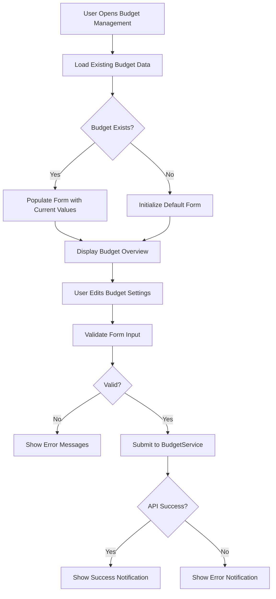
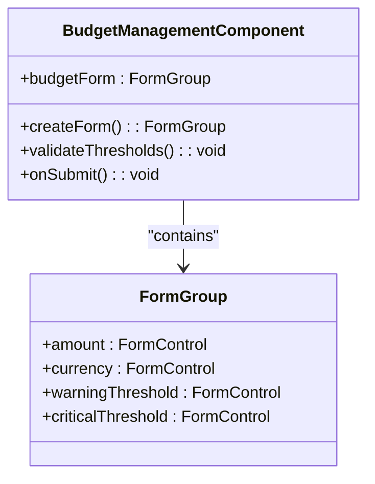
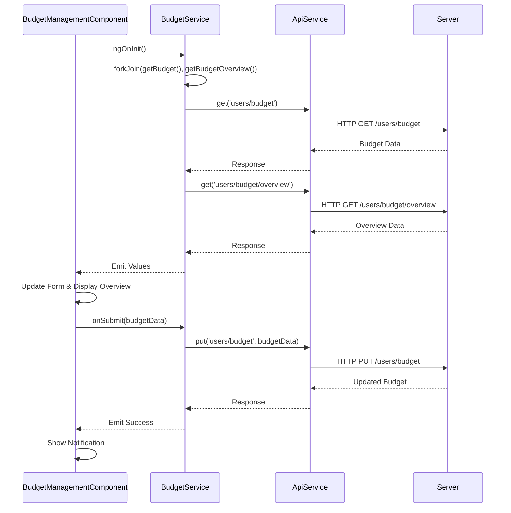

# Budget Management Component

<cite>
**Referenced Files in This Document**  
- [budget-management.component.ts](file://src/app/shared/components/budget-management/budget-management.component.ts)
- [budget.model.ts](file://src/app/shared/models/budget.model.ts)
- [budget.service.ts](file://src/app/shared/services/budget.service.ts)
- [notification.service.ts](file://src/app/shared/services/notification.service.ts)
</cite>

## Table of Contents
1. [Introduction](#introduction)
2. [Core Functionality](#core-functionality)
3. [Form Controls and Validation](#form-controls-and-validation)
4. [Integration with BudgetService](#integration-with-budgetservice)
5. [Usage in Dashboard and Category Modules](#usage-in-dashboard-and-category-modules)
6. [Error Handling and Notifications](#error-handling-and-notifications)
7. [Form State Management](#form-state-management)
8. [Accessibility Features](#accessibility-features)
9. [Responsive Design and Styling](#responsive-design-and-styling)
10. [Best Practices for Component Reuse](#best-practices-for-component-reuse)
11. [Conclusion](#conclusion)

## Introduction
The BudgetManagementComponent is a reusable Angular component designed to enable users to set, update, and monitor monthly budget limits and alert thresholds. It provides a user-friendly interface with real-time feedback, visual progress indicators, and responsive design. The component integrates with core services to persist data and deliver notifications, ensuring a seamless experience across different application contexts such as the Dashboard and Category modules.

**Section sources**
- [budget-management.component.ts](file://src/app/shared/components/budget-management/budget-management.component.ts#L1-L434)

## Core Functionality
The BudgetManagementComponent allows users to define a monthly budget amount, select a currency, and configure two types of alert thresholds: warning and critical. These thresholds trigger email alerts when spending reaches specified percentages of the budget. The component displays a comprehensive budget overview including total budget, amount spent, remaining balance, and percentage used. Visual indicators such as progress bars and status messages dynamically reflect the current financial state, helping users stay within their spending limits.



**Diagram sources**
- [budget-management.component.ts](file://src/app/shared/components/budget-management/budget-management.component.ts#L1-L434)
- [budget.service.ts](file://src/app/shared/services/budget.service.ts#L1-L157)

**Section sources**
- [budget-management.component.ts](file://src/app/shared/components/budget-management/budget-management.component.ts#L1-L434)

## Form Controls and Validation
The component uses Angular Reactive Forms to manage user input through form controls for budget amount, currency selection, warning threshold, and critical threshold. Each control includes validation rules:

- **Amount**: Required and must be greater than 0.01
- **Currency**: Predefined list of supported currencies (USD, EUR, GBP, CAD, AUD)
- **Warning Threshold**: Must be between 0 and 100
- **Critical Threshold**: Must be between 0 and 100

Additionally, a custom validation rule ensures the warning threshold is less than the critical threshold. Error messages are displayed only after the field is touched, improving user experience. Input fields include accessibility features such as proper label associations and ARIA attributes.



**Diagram sources**
- [budget-management.component.ts](file://src/app/shared/components/budget-management/budget-management.component.ts#L1-L434)

**Section sources**
- [budget-management.component.ts](file://src/app/shared/components/budget-management/budget-management.component.ts#L1-L434)

## Integration with BudgetService
The BudgetManagementComponent interacts with BudgetService to load existing budget data and persist changes. On initialization, it calls `getBudget()` and `getBudgetOverview()` via `forkJoin` to retrieve both the current budget settings and spending analytics. When the user submits the form, it invokes `updateBudget()` with the form data. The service handles API communication through ApiService, transforming responses and ensuring date objects are properly instantiated. This integration enables real-time synchronization between the UI and backend.



**Diagram sources**
- [budget-management.component.ts](file://src/app/shared/components/budget-management/budget-management.component.ts#L1-L434)
- [budget.service.ts](file://src/app/shared/services/budget.service.ts#L1-L157)

**Section sources**
- [budget-management.component.ts](file://src/app/shared/components/budget-management/budget-management.component.ts#L1-L434)
- [budget.service.ts](file://src/app/shared/services/budget.service.ts#L1-L157)

## Usage in Dashboard and Category Modules
The BudgetManagementComponent is embedded within the Dashboard module to provide users with immediate access to budget controls upon login. It appears in a dedicated section alongside financial summary cards. In the Category module, it may be used in settings or configuration views where users adjust budget parameters related to specific expense categories. Its standalone nature and input/output flexibility allow seamless integration into various layouts while maintaining consistent behavior and styling.

**Section sources**
- [budget-management.component.ts](file://src/app/shared/components/budget-management/budget-management.component.ts#L1-L434)

## Error Handling and Notifications
The component implements robust error handling for both form validation and API interactions. Client-side validation prevents submission of invalid data, marking fields as touched to display appropriate messages. During API calls, any failure triggers an error notification via NotificationService, informing the user of the issue (e.g., "Failed to update budget"). Success cases also generate notifications (e.g., "Budget updated successfully!"), enhancing user feedback. All errors are logged to the console for debugging purposes.

```mermaid
flowchart LR
A[Form Submit] --> B{Valid?}
B --> |No| C[Mark Fields Touched]
C --> D[Display Validation Errors]
B --> |Yes| E[Call updateBudget()]
E --> F{API Success?}
F --> |Yes| G[Show Success Notification]
F --> |No| H[Show Error Notification]
H --> I[Log Error to Console]
```

**Diagram sources**
- [budget-management.component.ts](file://src/app/shared/components/budget-management/budget-management.component.ts#L1-L434)
- [notification.service.ts](file://src/app/shared/services/notification.service.ts#L1-L52)

**Section sources**
- [budget-management.component.ts](file://src/app/shared/components/budget-management/budget-management.component.ts#L1-L434)
- [notification.service.ts](file://src/app/shared/services/notification.service.ts#L1-L52)

## Form State Management
The component manages form state using Angular's reactive forms capabilities. It tracks whether the form is pristine or dirty, enabling conditional logic for actions like reset and submit. The form is initialized with default values (e.g., 80% warning, 95% critical threshold) and updated with existing budget data when available. During submission, the loading state is reflected with a spinner and disabled buttons to prevent duplicate requests. The `destroy$` subject ensures all subscriptions are cleaned up on component destruction, preventing memory leaks.

**Section sources**
- [budget-management.component.ts](file://src/app/shared/components/budget-management/budget-management.component.ts#L1-L434)

## Accessibility Features
The component adheres to accessibility best practices by associating labels with input fields using `for` and `id` attributes. Error messages are displayed contextually beneath the relevant fields and are announced by screen readers due to proper DOM placement. All interactive elements have sufficient color contrast and are keyboard navigable. The layout uses semantic HTML and ARIA roles where appropriate, ensuring compatibility with assistive technologies.

**Section sources**
- [budget-management.component.ts](file://src/app/shared/components/budget-management/budget-management.component.ts#L1-L434)

## Responsive Design and Styling
Styled with Tailwind CSS, the component features a responsive grid layout that adapts to different screen sizes. On mobile devices, form fields stack vertically, while on larger screens they align in a two-column layout for optimal space utilization. The design maintains visual consistency with the rest of the application through shared color schemes, typography, and spacing conventions. Cards, buttons, and inputs follow the application’s design system, ensuring a cohesive user experience.

**Section sources**
- [budget-management.component.ts](file://src/app/shared/components/budget-management/budget-management.component.ts#L1-L434)

## Best Practices for Component Reuse
To ensure safe and effective reuse of the BudgetManagementComponent across different modules:
- **Isolate State**: Each instance maintains its own form state, preventing cross-context interference.
- **Use Dependency Injection**: Services are injected rather than instantiated, enabling consistent behavior.
- **Avoid Side Effects**: The component does not directly manipulate global state; all changes go through services.
- **Leverage Standalone Flag**: Marked as `standalone: true`, it can be imported without requiring a module declaration.
- **Minimize Inputs/Outputs**: Designed to work autonomously, reducing coupling with parent components.
- **Ensure Idempotent Initialization**: Safe to initialize multiple times without side effects.

**Section sources**
- [budget-management.component.ts](file://src/app/shared/components/budget-management/budget-management.component.ts#L1-L434)

## Conclusion
The BudgetManagementComponent provides a comprehensive solution for managing monthly budgets with intuitive controls, real-time feedback, and robust integration with backend services. Its modular design, accessibility compliance, and responsive layout make it suitable for use across various application contexts. By following best practices for state management and reuse, it ensures reliability and consistency while delivering a polished user experience.