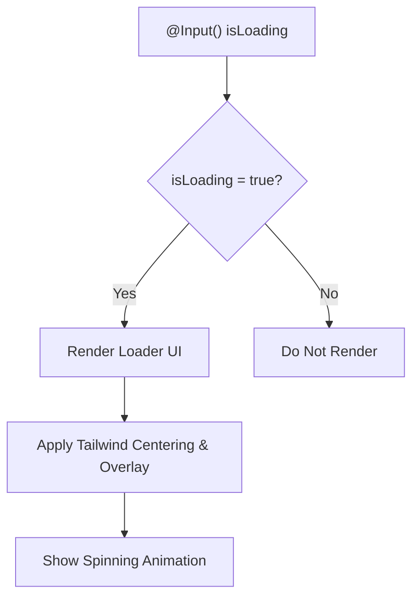

# Loader Component

<cite>
**Referenced Files in This Document**   
- [loader.component.ts](file://src/app/shared/components/loader/loader.component.ts)
- [loader.component.html](file://src/app/shared/components/loader/loader.component.html)
- [loader.interceptor.ts](file://src/app/shared/interceptors/loader.interceptor.ts)
- [loader.service.ts](file://src/app/shared/services/loader.service.ts)
</cite>

## Table of Contents
1. [Introduction](#introduction)
2. [Core Components](#core-components)
3. [Architecture Overview](#architecture-overview)
4. [Detailed Component Analysis](#detailed-component-analysis)
5. [Integration with HTTP Requests](#integration-with-http-requests)
6. [Accessibility, Theming, and Responsiveness](#accessibility-theming-and-responsiveness)
7. [Troubleshooting Guide](#troubleshooting-guide)
8. [Best Practices](#best-practices)

## Introduction
The Loader Component provides visual feedback during asynchronous operations, particularly HTTP requests, enhancing user experience by indicating ongoing background activity. It is integrated into the application via a dedicated interceptor and controlled through a centralized service using reactive programming patterns. This document details its implementation, usage, and best practices for reliable and accessible loading states across feature modules.

## Core Components

The loader system consists of three main parts:
- **LoaderComponent**: A UI component that renders a spinning indicator when active.
- **LoaderService**: A shared service that manages the loading state using an Observable pattern.
- **LoaderInterceptor**: An HTTP interceptor that automatically triggers the loader during API calls.

These components work together to provide a seamless and centralized loading experience.

**Section sources**
- [loader.component.ts](file://src/app/shared/components/loader/loader.component.ts#L1-L13)
- [loader.service.ts](file://src/app/shared/services/loader.service.ts#L1-L18)
- [loader.interceptor.ts](file://src/app/shared/interceptors/loader.interceptor.ts#L1-L11)

## Architecture Overview

```mermaid
graph TD
A[HTTP Request] --> B[LoaderInterceptor]
B --> C[LoaderService.show()]
C --> D[isLoading$ emits true]
D --> E[LoaderComponent *ngIf="true"]
E --> F[Loader UI Displayed]
G[HTTP Response/Error] --> H[LoaderInterceptor completes]
H --> I[LoaderService.hide()]
I --> J[isLoading$ emits false]
J --> K[LoaderComponent *ngIf="false"]
K --> L[Loader UI Hidden]
```

**Diagram sources**
- [loader.interceptor.ts](file://src/app/shared/interceptors/loader.interceptor.ts#L1-L11)
- [loader.service.ts](file://src/app/shared/services/loader.service.ts#L1-L18)
- [loader.component.ts](file://src/app/shared/components/loader/loader.component.ts#L1-L13)

## Detailed Component Analysis

### LoaderComponent
The `LoaderComponent` is a lightweight, standalone Angular component responsible for rendering the visual loader. It uses Angular's `*ngIf` directive to conditionally display the loader based on the `isLoading` input property. The component's template features a Tailwind CSS-styled spinner centered over a semi-transparent overlay, ensuring visibility across all screen sizes.

The structural design leverages Angular's animation-ready state management through the `*ngIf` directive, which naturally supports smooth entry and exit transitions when combined with CSS animations.



**Diagram sources**
- [loader.component.ts](file://src/app/shared/components/loader/loader.component.ts#L1-L13)
- [loader.component.html](file://src/app/shared/components/loader/loader.component.html#L1-L4)

**Section sources**
- [loader.component.ts](file://src/app/shared/components/loader/loader.component.ts#L1-L13)
- [loader.component.html](file://src/app/shared/components/loader/loader.component.html#L1-L4)

### LoaderService
The `LoaderService` uses a `BehaviorSubject<boolean>` to manage the global loading state. It exposes an `isLoading$` Observable that components can subscribe to (or use via the async pipe) to reactively control UI elements like the loader.

Key methods:
- `show()`: Sets the loading state to `true`
- `hide()`: Sets the loading state to `false`

This service is provided at the root level, ensuring a single source of truth for loading states across the entire application.

**Section sources**
- [loader.service.ts](file://src/app/shared/services/loader.service.ts#L1-L18)

### LoaderInterceptor
The `loaderInterceptor` is designed to automatically show and hide the loader during HTTP requests. Currently, the implementation simply passes through the request without modifying the loading state. For full functionality, it should be updated to call `LoaderService.show()` at the start of a request and `LoaderService.hide()` upon response or error.

**Section sources**
- [loader.interceptor.ts](file://src/app/shared/interceptors/loader.interceptor.ts#L1-L11)

## Integration with HTTP Requests

To enable automatic loader control during API calls, the `loaderInterceptor` must be registered in the Angular provider configuration and updated to interact with `LoaderService`. A practical example of triggering the loader manually in a feature module (e.g., during login) is shown below:

```typescript
// In login.component.ts
this.loaderService.show();
this.authService.login(credentials).subscribe({
  next: () => this.router.navigate(['/dashboard']),
  error: () => this.loaderService.hide(),
  complete: () => this.loaderService.hide()
});
```

In templates, the loader can be bound using the async pipe:
```html
<app-loader [isLoading]="loaderService.isLoading$ | async"></app-loader>
```

This pattern ensures that any module can trigger or respond to loading states consistently.

**Section sources**
- [loader.service.ts](file://src/app/shared/services/loader.service.ts#L1-L18)
- [auth.service.ts](file://src/app/auth/auth.service.ts)

## Accessibility, Theming, and Responsiveness

### Accessibility
To support screen readers, the loader should include ARIA live region attributes:
```html
<div aria-live="polite" aria-label="Loading content, please wait">
```

This ensures assistive technologies announce the loading state to users.

### Theming
The loader uses Tailwind CSS utility classes for styling:
- `bg-black bg-opacity-50`: Semi-transparent dark overlay
- `flex justify-center items-center`: Perfect centering
- `animate-spin`: Built-in spinning animation
- `border-b-2 border-white`: High-contrast spinner

These classes can be easily customized to match any theme by modifying the Tailwind configuration or adding custom classes.

### Responsiveness
The loader uses `inset-0` and flexbox centering, making it fully responsive across device sizes. The fixed positioning ensures it overlays all content regardless of scroll position or viewport size.

**Section sources**
- [loader.component.html](file://src/app/shared/components/loader/loader.component.html#L1-L4)
- [loader.component.scss](file://src/app/shared/components/loader/loader.component.scss)

## Troubleshooting Guide

### Loader Not Appearing
- Ensure `LoaderService` is injected and `show()` is called
- Verify the `isLoading` input is properly bound
- Check that the `LoaderComponent` is rendered in the view hierarchy
- Confirm `CommonModule` is imported if used in a lazy module

### Loader Stays Visible Indefinitely
- Ensure every `show()` call has a corresponding `hide()` call
- Handle errors in observables to prevent uncaught exceptions from blocking `hide()`
- Avoid race conditions by using operators like `finalize()`:
```typescript
this.loaderService.show();
this.apiService.getData().pipe(
  finalize(() => this.loaderService.hide())
).subscribe();
```

### Memory Leaks
- Avoid direct subscriptions without cleanup; prefer async pipe in templates
- Unsubscribe from `isLoading$` in components that manually subscribe

**Section sources**
- [loader.service.ts](file://src/app/shared/services/loader.service.ts#L1-L18)
- [loader.component.ts](file://src/app/shared/components/loader/loader.component.ts#L1-L13)

## Best Practices

### Centralized Loading States
Use `LoaderService` as the single source of truth. Avoid local loading variables when global state is needed.

### Prevent Race Conditions
Use RxJS operators like `finalize()` or `tap()` to ensure loader state is reset:
```typescript
.pipe(
  tap(() => this.loaderService.show()),
  finalize(() => this.loaderService.hide())
)
```

### Use Async Pipe
Prefer the async pipe in templates to automatically handle subscription lifecycle:
```html
<app-loader [isLoading]="(loaderService.isLoading$ | async)"></app-loader>
```

### Error Handling
Always hide the loader in error callbacks or use `finalize()` to guarantee cleanup.

### Performance
The loader component is lightweight and uses pure CSS animations, ensuring smooth performance even on low-end devices.

**Section sources**
- [loader.service.ts](file://src/app/shared/services/loader.service.ts#L1-L18)
- [loader.component.ts](file://src/app/shared/components/loader/loader.component.ts#L1-L13)