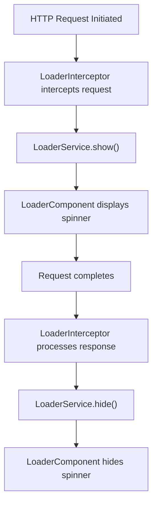
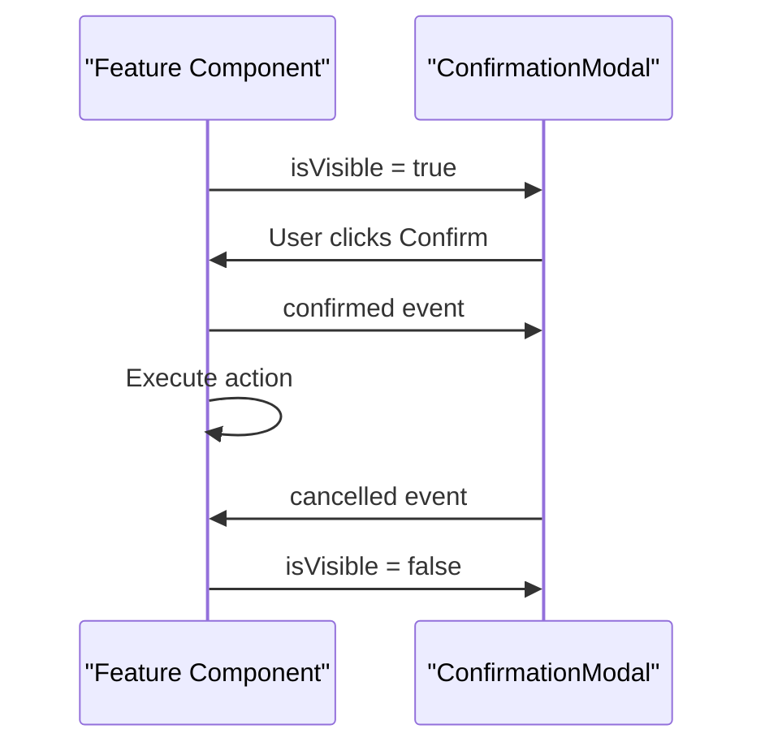

# Shared UI Components

<cite>
**Referenced Files in This Document**   
- [loader.component.ts](file://src/app/shared/components/loader/loader.component.ts)
- [loader.component.html](file://src/app/shared/components/loader/loader.component.html)
- [loader.interceptor.ts](file://src/app/shared/interceptors/loader.interceptor.ts)
- [loader.service.ts](file://src/app/shared/services/loader.service.ts)
- [confirmation-modal.component.ts](file://src/app/shared/components/confirmation-modal/confirmation-modal.component.ts)
- [budget-management.component.ts](file://src/app/shared/components/budget-management/budget-management.component.ts)
- [budget.model.ts](file://src/app/shared/models/budget.model.ts)
- [budget.service.ts](file://src/app/shared/services/budget.service.ts)
</cite>

## Table of Contents
1. [Introduction](#introduction)
2. [Loader Component](#loader-component)
3. [ConfirmationModal Component](#confirmationmodal-component)
4. [BudgetManagement Component](#budgetmanagement-component)
5. [Accessibility and Theming](#accessibility-and-theming)
6. [Best Practices for Reuse and Extension](#best-practices-for-reuse-and-extension)
7. [Conclusion](#conclusion)

## Introduction
This document provides comprehensive documentation for three reusable shared UI components in the Angular application: Loader, ConfirmationModal, and BudgetManagement. These components are designed to be modular, accessible, and themable using Tailwind CSS. Each component serves a distinct purpose in enhancing user experience and maintaining consistency across feature modules.

**Section sources**
- [loader.component.ts](file://src/app/shared/components/loader/loader.component.ts)
- [confirmation-modal.component.ts](file://src/app/shared/components/confirmation-modal/confirmation-modal.component.ts)
- [budget-management.component.ts](file://src/app/shared/components/budget-management/budget-management.component.ts)

## Loader Component

The Loader component provides visual feedback during asynchronous operations, particularly HTTP requests. It is controlled via the `isLoading` input property and integrates with Angular's HTTP interceptor system to automatically display during API calls.

### Integration with HTTP Interceptors
The `LoaderInterceptor` monitors outgoing HTTP requests and uses the `LoaderService` to toggle the loader state. When a request begins, the loader is shown; when all pending requests complete, it is hidden. This automatic behavior ensures consistent loading states without manual intervention in components.

### Visibility Logic
The loader's visibility is managed through a reactive `isLoading$` observable in `LoaderService`, which uses a `BehaviorSubject` to maintain the loading state. Components can manually trigger the loader using `show()` and `hide()` methods when needed for non-HTTP async operations.



**Diagram sources**
- [loader.interceptor.ts](file://src/app/shared/interceptors/loader.interceptor.ts)
- [loader.service.ts](file://src/app/shared/services/loader.service.ts)
- [loader.component.ts](file://src/app/shared/components/loader/loader.component.ts)

**Section sources**
- [loader.component.ts](file://src/app/shared/components/loader/loader.component.ts)
- [loader.component.html](file://src/app/shared/components/loader/loader.component.html)
- [loader.interceptor.ts](file://src/app/shared/interceptors/loader.interceptor.ts)
- [loader.service.ts](file://src/app/shared/services/loader.service.ts)

## ConfirmationModal Component

The ConfirmationModal component provides a customizable modal dialog for user confirmation before critical actions such as deletions or updates.

### Input/Output API
The component exposes several `@Input` properties to customize appearance and behavior:
- `isVisible`: Controls modal visibility
- `title`, `message`: Customizable text content
- `confirmText`, `cancelText`: Button labels
- `type`: Visual theme (danger, warning, info, success)
- `icon`: Material icon to display

It also provides two `@Output` events:
- `confirmed`: Emitted when the user clicks confirm
- `cancelled`: Emitted when the user clicks cancel or closes the modal

### Usage Example
When invoked from a feature module, the parent component binds to `isVisible` and handles the confirmation logic through event binding, enabling reusable confirmation patterns across the application.



**Diagram sources**
- [confirmation-modal.component.ts](file://src/app/shared/components/confirmation-modal/confirmation-modal.component.ts)

**Section sources**
- [confirmation-modal.component.ts](file://src/app/shared/components/confirmation-modal/confirmation-modal.component.ts)

## BudgetManagement Component

The BudgetManagement component enables users to set monthly spending budgets with threshold-based email alerts.

### Form Controls
The component uses Reactive Forms with the following controls:
- `amount`: Required budget amount (minimum 0.01)
- `currency`: Selected currency (default: USD)
- `warningThreshold`: Percentage for warning alerts (default: 80%)
- `criticalThreshold`: Percentage for critical alerts (default: 95%)

Form validation ensures that warning threshold is less than critical threshold.

### Service Interaction
The component interacts with `BudgetService` to:
- Load existing budget and overview data on initialization
- Update budget settings via `updateBudget()`
- Retrieve real-time spending analytics
- Format currency using service utilities

It also uses `NotificationService` to provide user feedback after operations.

```mermaid
classDiagram
class BudgetManagementComponent {
+budgetForm : FormGroup
+currentBudget : MonthlyBudget
+budgetOverview : BudgetOverview
+ngOnInit()
+onSubmit()
+clearBudget()
+loadBudgetData()
}
class BudgetService {
+getBudget() : Observable~MonthlyBudget~
+updateBudget() : Observable~MonthlyBudget~
+getBudgetOverview() : Observable~BudgetOverview~
+formatCurrency() : string
}
class BudgetModel {
<<interface>>
MonthlyBudget
amount : number
currency : string
alertThresholds : {warning, critical}
}
BudgetManagementComponent --> BudgetService : "uses"
BudgetService --> BudgetModel : "returns"
BudgetManagementComponent --> BudgetModel : "implements"
```

**Diagram sources**
- [budget-management.component.ts](file://src/app/shared/components/budget-management/budget-management.component.ts)
- [budget.service.ts](file://src/app/shared/services/budget.service.ts)
- [budget.model.ts](file://src/app/shared/models/budget.model.ts)

**Section sources**
- [budget-management.component.ts](file://src/app/shared/components/budget-management/budget-management.component.ts)
- [budget.service.ts](file://src/app/shared/services/budget.service.ts)
- [budget.model.ts](file://src/app/shared/models/budget.model.ts)

## Accessibility and Theming

### Accessibility Features
- **Loader**: Uses `aria-hidden="true"` since it's purely decorative
- **ConfirmationModal**: Implements proper ARIA attributes including `role="dialog"`, `aria-modal="true"`, and focus trapping
- All interactive elements have appropriate keyboard navigation support

### Theming
Components use Tailwind CSS for styling, enabling easy theme customization through:
- CSS variables defined in the global stylesheet
- Theme-aware classes (e.g., `bg-blue-600 hover:bg-blue-700`)
- Responsive design with Tailwind's breakpoint system
- Dark mode support via class-based toggling

### Responsiveness
All components are mobile-first and responsive:
- Modals adapt to screen size using `max-w-md` and padding
- Forms use responsive grid layouts
- Loader is centered in viewport regardless of screen size

**Section sources**
- [loader.component.html](file://src/app/shared/components/loader/loader.component.html)
- [confirmation-modal.component.ts](file://src/app/shared/components/confirmation-modal/confirmation-modal.component.ts)
- [budget-management.component.ts](file://src/app/shared/components/budget-management/budget-management.component.ts)

## Best Practices for Reuse and Extension

### Component Reuse Guidelines
- Always bind to `isVisible` with two-way binding or explicit control
- Use `LoaderService` for consistent loading states
- Extend `BudgetManagementComponent` via service injection rather than inheritance
- Customize `ConfirmationModal` through inputs rather than template modification

### Extension Patterns
- Create wrapper components for specialized use cases
- Use Angular's dependency injection for service overrides
- Leverage `@ContentChild` and `@ContentChildren` for content projection
- Implement `OnChanges` for input-driven updates

### Performance Considerations
- Use `OnPush` change detection where possible
- Unsubscribe from observables in `ngOnDestroy`
- Use `trackBy` functions in `*ngFor` loops
- Minimize re-renders through pure pipes

**Section sources**
- [loader.component.ts](file://src/app/shared/components/loader/loader.component.ts)
- [confirmation-modal.component.ts](file://src/app/shared/components/confirmation-modal/confirmation-modal.component.ts)
- [budget-management.component.ts](file://src/app/shared/components/budget-management/budget-management.component.ts)

## Conclusion
The Loader, ConfirmationModal, and BudgetManagement components exemplify reusable, accessible, and maintainable UI patterns in Angular. By leveraging Angular's input/output system, reactive programming with RxJS, and Tailwind CSS for styling, these components provide robust functionality while remaining flexible for various use cases across the application. Their proper integration with services and interceptors ensures consistent behavior and enhances the overall user experience.