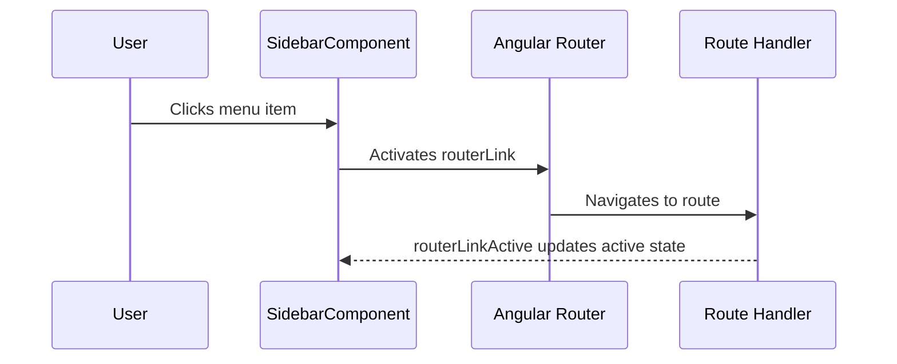
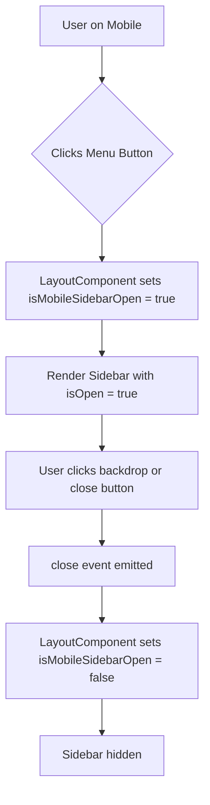
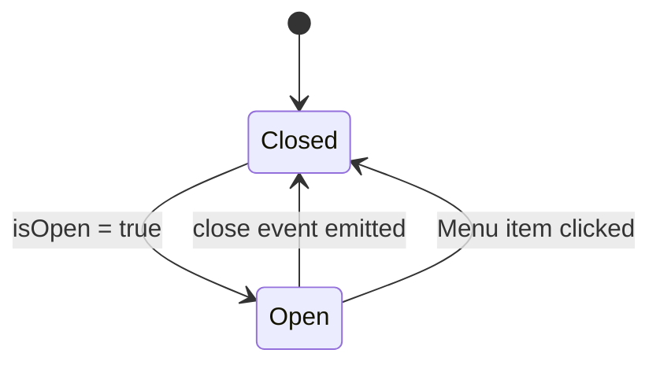
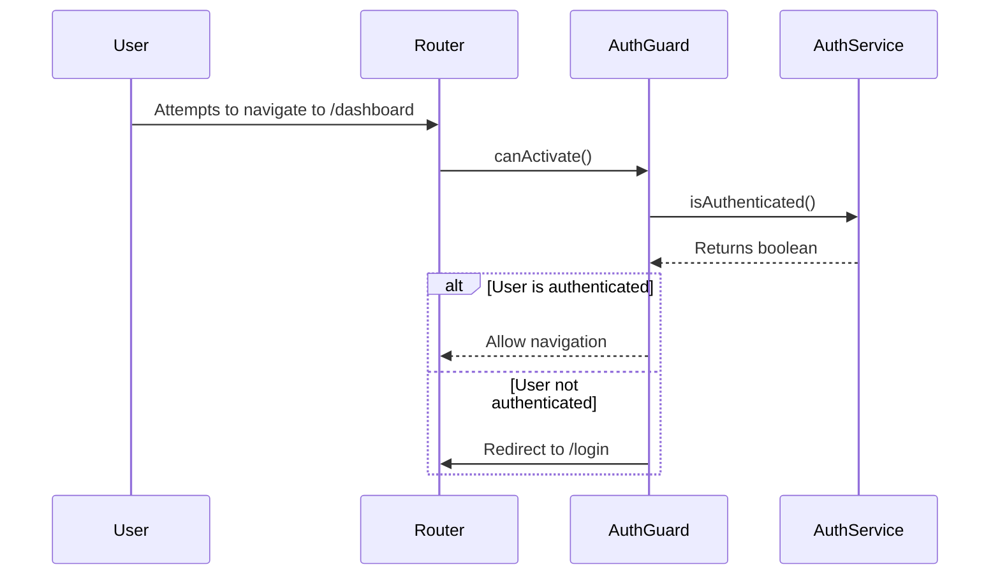

# Sidebar Component

<cite>
**Referenced Files in This Document**   
- [sidebar.component.ts](file://src/app/shared/components/sidebar/sidebar.component.ts)
- [sidebar.component.html](file://src/app/shared/components/sidebar/sidebar.component.html)
- [sidebar.component.scss](file://src/app/shared/components/sidebar/sidebar.component.scss)
- [layout.component.ts](file://src/app/shared/components/layout/layout.component.ts)
- [app.routes.ts](file://src/app/app.routes.ts)
- [auth.guard.ts](file://src/app/shared/services/auth.guard.ts)
</cite>

## Table of Contents
1. [Introduction](#introduction)
2. [Core Structure and Implementation](#core-structure-and-implementation)
3. [Navigation and Routing Integration](#navigation-and-routing-integration)
4. [Responsive Behavior and Mobile Off-Canvas](#responsive-behavior-and-mobile-off-canvas)
5. [State Management and Event Handling](#state-management-and-event-handling)
6. [Security and Conditional Rendering with AuthGuard](#security-and-conditional-rendering-with-authguard)
7. [Styling and UI Design with Tailwind CSS](#styling-and-ui-design-with-tailwind-css)
8. [Accessibility Considerations](#accessibility-considerations)
9. [Extensibility and Maintenance](#extensibility-and-maintenance)

## Introduction
The SidebarComponent serves as the primary navigation interface for the application, providing users with access to core feature modules including Dashboard, Transactions, Categories, Reports, and Profile. Built using Angular's component architecture and integrated with Angular Router, the sidebar supports both desktop and mobile layouts through responsive design principles. It leverages Tailwind CSS for styling, ensuring consistency across themes and devices, while incorporating accessibility best practices for inclusive user experience.

**Section sources**
- [sidebar.component.ts](file://src/app/shared/components/sidebar/sidebar.component.ts#L1-L31)
- [sidebar.component.html](file://src/app/shared/components/sidebar/sidebar.component.html#L1-L121)

## Core Structure and Implementation
The SidebarComponent is implemented as a standalone Angular component with explicit dependencies on CommonModule and RouterModule. It defines a list-based navigation structure where each menu item includes a route path, icon identifier, and display label. The component uses Angular’s input/output API to manage its visibility state and communicate with parent components.

Menu items are statically defined within the component class and rendered via HTML template using semantic anchor tags enhanced with Angular Router directives. Each navigation link is associated with an SVG icon inline for performance and consistency.

```mermaid
classDiagram
class SidebarComponent {
+isOpen : boolean
+close : EventEmitter<void>
+menuItems : Array<{path : string, icon : string, label : string}>
+closeSidebar() : void
+onMenuItemClick() : void
}
```

**Diagram sources**
- [sidebar.component.ts](file://src/app/shared/components/sidebar/sidebar.component.ts#L1-L31)

**Section sources**
- [sidebar.component.ts](file://src/app/shared/components/sidebar/sidebar.component.ts#L1-L31)
- [sidebar.component.html](file://src/app/shared/components/sidebar/sidebar.component.html#L1-L121)

## Navigation and Routing Integration
The sidebar integrates directly with Angular Router through `routerLink` and `routerLinkActive` directives. These enable declarative navigation and automatic highlighting of the currently active route. When a user navigates to a route matching a menu item’s path, the corresponding link receives the `bg-blue-500 text-white` classes, indicating selection.

Routing configuration is centralized in `app.routes.ts`, which defines protected routes under the LayoutComponent, all guarded by AuthGuard. This ensures that only authenticated users can access the sidebar and its associated features.



**Diagram sources**
- [sidebar.component.html](file://src/app/shared/components/sidebar/sidebar.component.html#L30-L110)
- [app.routes.ts](file://src/app/app.routes.ts#L20-L80)

**Section sources**
- [sidebar.component.html](file://src/app/shared/components/sidebar/sidebar.component.html#L30-L110)
- [app.routes.ts](file://src/app/app.routes.ts#L20-L80)

## Responsive Behavior and Mobile Off-Canvas
The SidebarComponent supports responsive behavior through integration with the LayoutComponent. On desktop (large screens), the sidebar is always visible and fixed. On mobile, it operates as an off-canvas drawer that slides in from the left when triggered by the navbar’s mobile menu toggle.

The mobile sidebar is conditionally rendered based on the `isMobileSidebarOpen` state in LayoutComponent. A backdrop overlay enables closing the sidebar by tapping outside. The close button is only visible when the sidebar is open, ensuring clean UI on smaller screens.



**Diagram sources**
- [layout.component.ts](file://src/app/shared/components/layout/layout.component.ts#L8-L69)
- [sidebar.component.ts](file://src/app/shared/components/sidebar/sidebar.component.ts#L7-L10)

**Section sources**
- [layout.component.ts](file://src/app/shared/components/layout/layout.component.ts#L8-L69)
- [sidebar.component.ts](file://src/app/shared/components/sidebar/sidebar.component.ts#L7-L10)

## State Management and Event Handling
The SidebarComponent manages its open/closed state via the `@Input() isOpen` property, which is controlled externally by the LayoutComponent. The `@Output() close` event allows the sidebar to signal its intent to close, enabling parent components to update their state accordingly.

Clicking any menu item triggers the `onMenuItemClick()` method, which checks if the sidebar is open (on mobile) and emits the close event. This ensures that navigation actions automatically collapse the mobile menu for improved UX.



**Diagram sources**
- [sidebar.component.ts](file://src/app/shared/components/sidebar/sidebar.component.ts#L7-L25)

**Section sources**
- [sidebar.component.ts](file://src/app/shared/components/sidebar/sidebar.component.ts#L7-L25)

## Security and Conditional Rendering with AuthGuard
While the SidebarComponent itself does not conditionally hide menu items, access to the routes it links to is protected by AuthGuard. This service checks authentication status before allowing navigation, redirecting unauthenticated users to the login page.

The AuthGuard is applied globally to the LayoutComponent’s route group, ensuring that all feature modules (Dashboard, Transactions, etc.) require authentication. Future enhancements could extend the sidebar to dynamically show/hide admin-only items based on user roles.



**Diagram sources**
- [auth.guard.ts](file://src/app/shared/services/auth.guard.ts#L1-L29)
- [app.routes.ts](file://src/app/app.routes.ts#L1-L85)

**Section sources**
- [auth.guard.ts](file://src/app/shared/services/auth.guard.ts#L1-L29)
- [app.routes.ts](file://src/app/app.routes.ts#L1-L85)

## Styling and UI Design with Tailwind CSS
The sidebar uses Tailwind CSS for all styling, enabling utility-first design with responsive breakpoints and dark mode compatibility. Key features include:
- Hover effects (`hover:bg-gray-100`) for interactive feedback
- Active state styling via `routerLinkActive` with `bg-blue-500 text-white`
- Flexbox layout for vertical stacking and alignment
- Responsive hiding (`lg:hidden`, `hidden lg:block`) for mobile/desktop adaptation
- Pro tip section with colored background and border for visual emphasis

The component supports dark mode through Tailwind’s `dark:` variant, though specific dark classes are not yet implemented. Icons use inline SVGs for consistent rendering and accessibility.

**Section sources**
- [sidebar.component.html](file://src/app/shared/components/sidebar/sidebar.component.html#L1-L121)
- [sidebar.component.scss](file://src/app/shared/components/sidebar/sidebar.component.scss#L1-L4)

## Accessibility Considerations
The SidebarComponent adheres to accessibility best practices:
- Semantic HTML with proper use of `<nav>` and `<a>` elements
- Keyboard navigation support via standard link behavior
- Focus management through default browser focus outlines
- Screen reader compatibility via visible text labels (no icon-only buttons)
- Sufficient color contrast for text and interactive elements
- ARIA roles are implicitly provided by native anchor tags

Future improvements could include explicit `aria-current="page"` on active links and focus trapping within the mobile sidebar for better keyboard navigation.

**Section sources**
- [sidebar.component.html](file://src/app/shared/components/sidebar/sidebar.component.html#L1-L121)

## Extensibility and Maintenance
Adding new menu entries requires updating the `menuItems` array in `sidebar.component.ts` and ensuring the corresponding route exists in `app.routes.ts`. Example:

```typescript
menuItems = [
  { path: '/dashboard', icon: 'dashboard', label: 'Dashboard' },
  { path: '/budget', icon: 'tune', label: 'Budget' }, // New entry
  { path: '/transactions', icon: 'receipt', label: 'Transactions' }
];
```

The component automatically syncs with route changes via Angular Router’s lifecycle events, requiring no additional code for navigation tracking. For role-based menu items, the component can be extended to accept a user role input and filter `menuItems` accordingly.

**Section sources**
- [sidebar.component.ts](file://src/app/shared/components/sidebar/sidebar.component.ts#L12-L20)
- [app.routes.ts](file://src/app/app.routes.ts#L20-L80)