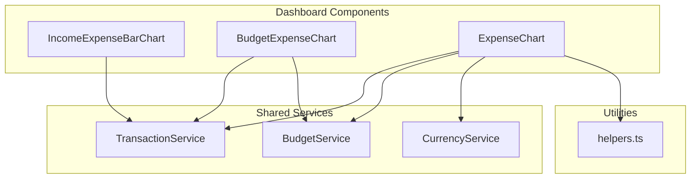
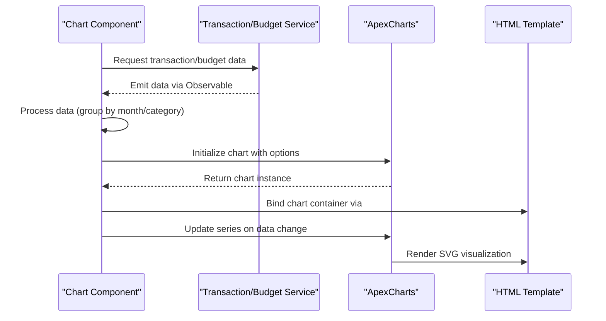
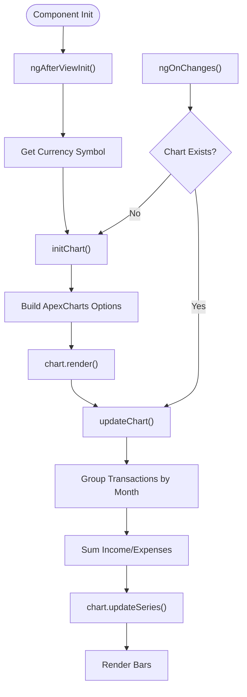
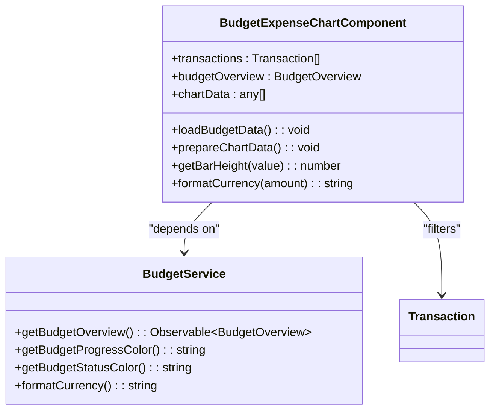
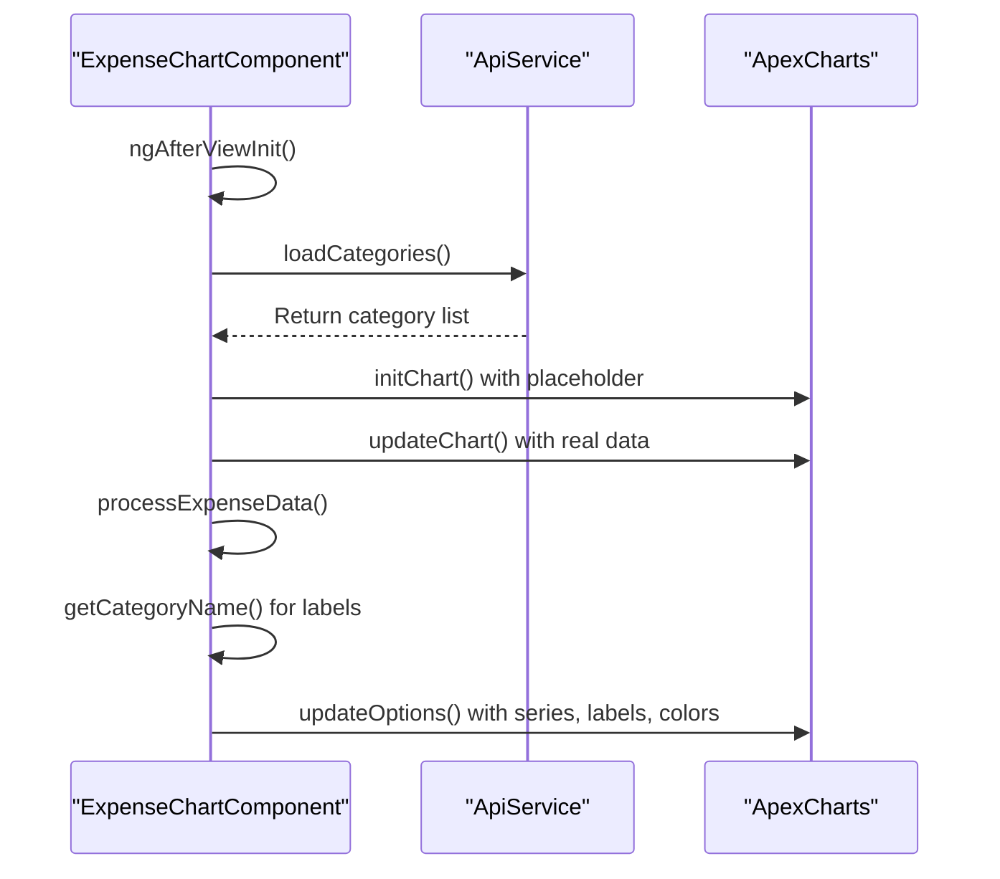
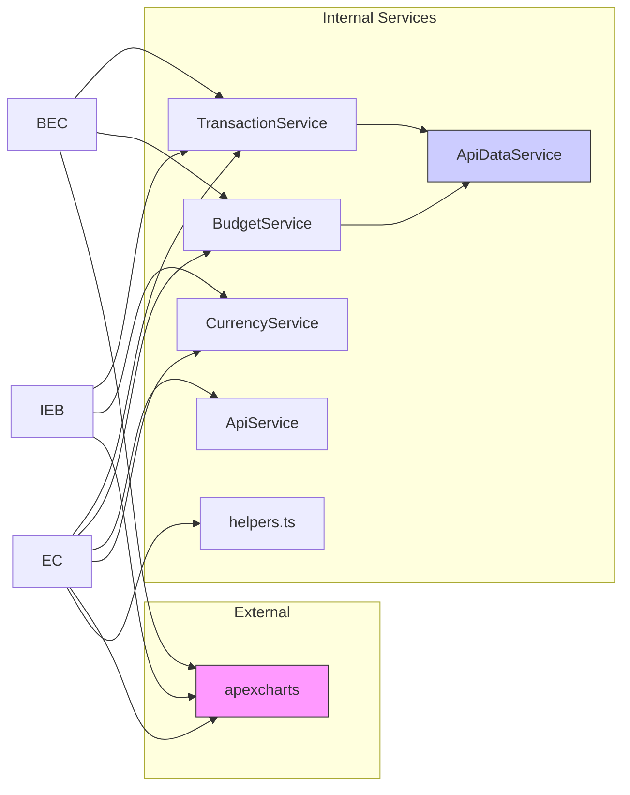

# Dashboard Charts

<cite>
**Referenced Files in This Document**   
- [income-expense-bar-chart.component.ts](file://src/app/dashboard/components/income-expense-bar-chart/income-expense-bar-chart.component.ts)
- [budget-expense-chart.component.ts](file://src/app/dashboard/components/budget-expense-chart/budget-expense-chart.component.ts)
- [expense-chart.component.ts](file://src/app/dashboard/components/expense-chart/expense-chart.component.ts)
- [transaction.service.ts](file://src/app/shared/services/transaction.service.ts)
- [budget.service.ts](file://src/app/shared/services/budget.service.ts)
- [helpers.ts](file://src/app/shared/utils/helpers.ts)
- [expense-chart.component.html](file://src/app/dashboard/components/expense-chart/expense-chart.component.html)
</cite>

## Table of Contents
1. [Introduction](#introduction)
2. [Project Structure](#project-structure)
3. [Core Components](#core-components)
4. [Architecture Overview](#architecture-overview)
5. [Detailed Component Analysis](#detailed-component-analysis)
6. [Dependency Analysis](#dependency-analysis)
7. [Performance Considerations](#performance-considerations)
8. [Troubleshooting Guide](#troubleshooting-guide)
9. [Conclusion](#conclusion)

## Introduction
This document provides comprehensive documentation for the financial dashboard chart components in an Angular application: `IncomeExpenseBarChart`, `BudgetExpenseChart`, and `ExpenseChart`. These components visualize financial trends using reactive templates, data binding, and the ApexCharts library. The charts aggregate transaction and budget data from services, transform it via helper functions, and render dynamic visualizations styled with Tailwind CSS. This documentation covers implementation details, data flow, responsiveness, accessibility, and performance optimization strategies.

## Project Structure
The dashboard chart components are located within the `src/app/dashboard/components/` directory, organized as standalone Angular components with dedicated HTML, SCSS, and TypeScript files. Each chart follows Angular's component-based architecture and leverages reactive programming patterns.

**Diagram sources**
- [income-expense-bar-chart.component.ts](file://src/app/dashboard/components/income-expense-bar-chart/income-expense-bar-chart.component.ts)
- [budget-expense-chart.component.ts](file://src/app/dashboard/components/budget-expense-chart/budget-expense-chart.component.ts)
- [expense-chart.component.ts](file://src/app/dashboard/components/expense-chart/expense-chart.component.ts)
- [transaction.service.ts](file://src/app/shared/services/transaction.service.ts)
- [budget.service.ts](file://src/app/shared/services/budget.service.ts)
- [helpers.ts](file://src/app/shared/utils/helpers.ts)

**Section sources**
- [income-expense-bar-chart.component.ts](file://src/app/dashboard/components/income-expense-bar-chart/income-expense-bar-chart.component.ts)
- [budget-expense-chart.component.ts](file://src/app/dashboard/components/budget-expense-chart/budget-expense-chart.component.ts)
- [expense-chart.component.ts](file://src/app/dashboard/components/expense-chart/expense-chart.component.ts)

## Core Components
The three primary chart components—`IncomeExpenseBarChart`, `BudgetExpenseChart`, and `ExpenseChart`—are implemented as standalone Angular components using reactive templates and two-way data binding. They receive transaction data as input, process it using service-layer logic, and render visualizations via the ApexCharts library. Each component handles lifecycle events such as initialization (`ngAfterViewInit`) and data changes (`ngOnChanges`) to ensure real-time updates.

**Section sources**
- [income-expense-bar-chart.component.ts](file://src/app/dashboard/components/income-expense-bar-chart/income-expense-bar-chart.component.ts)
- [budget-expense-chart.component.ts](file://src/app/dashboard/components/budget-expense-chart/budget-expense-chart.component.ts)
- [expense-chart.component.ts](file://src/app/dashboard/components/expense-chart/expense-chart.component.ts)

## Architecture Overview
The dashboard charts follow a clean separation of concerns, with presentation logic isolated in components and business logic delegated to shared services. Data flows from the `TransactionService` and `BudgetService`, which retrieve financial records and summary metrics. Components transform this data using helper functions and pass it to ApexCharts for rendering. The use of Angular's reactive forms and change detection ensures that charts update efficiently when underlying data changes.

**Diagram sources**
- [income-expense-bar-chart.component.ts](file://src/app/dashboard/components/income-expense-bar-chart/income-expense-bar-chart.component.ts)
- [budget-expense-chart.component.ts](file://src/app/dashboard/components/budget-expense-chart/budget-expense-chart.component.ts)
- [expense-chart.component.ts](file://src/app/dashboard/components/expense-chart/expense-chart.component.ts)
- [transaction.service.ts](file://src/app/shared/services/transaction.service.ts)
- [budget.service.ts](file://src/app/shared/services/budget.service.ts)

## Detailed Component Analysis

### IncomeExpenseBarChart Analysis
The `IncomeExpenseBarChartComponent` visualizes monthly income and expense trends using a grouped bar chart powered by ApexCharts. It receives a list of transactions as input and aggregates them by month to display comparative financial performance over the last six months.

#### Implementation Details
The component initializes the chart during `ngAfterViewInit` and updates it whenever input data changes via `ngOnChanges`. It uses helper methods to extract the last six months and compute monthly totals for income and expenses.

**Diagram sources**
- [income-expense-bar-chart.component.ts](file://src/app/dashboard/components/income-expense-bar-chart/income-expense-bar-chart.component.ts#L50-L119)

**Section sources**
- [income-expense-bar-chart.component.ts](file://src/app/dashboard/components/income-expense-bar-chart/income-expense-bar-chart.component.ts)

### BudgetExpenseChart Analysis
The `BudgetExpenseChartComponent` displays both current budget progress and a six-month trend comparing budgeted amounts against actual expenses. It integrates with `BudgetService` to fetch budget overview data and uses reactive subscriptions to respond to changes.

#### Data Flow and Rendering
This component combines a progress bar for current month tracking with a custom bar chart for historical comparison. Unlike other charts, it uses inline SVG-like styling rather than ApexCharts for the trend visualization.

**Diagram sources**
- [budget-expense-chart.component.ts](file://src/app/dashboard/components/budget-expense-chart/budget-expense-chart.component.ts#L10-L215)
- [budget.service.ts](file://src/app/shared/services/budget.service.ts#L10-L156)

**Section sources**
- [budget-expense-chart.component.ts](file://src/app/dashboard/components/budget-expense-chart/budget-expense-chart.component.ts)
- [budget.service.ts](file://src/app/shared/services/budget.service.ts)

### ExpenseChart Analysis
The `ExpenseChartComponent` renders a donut chart showing expense distribution across categories. It dynamically loads category names from the backend and maps transaction data to display proportional spending.

#### Dynamic Category Handling
This component fetches category metadata asynchronously and uses it to label chart segments. It handles empty datasets gracefully by displaying a neutral state.

**Diagram sources**
- [expense-chart.component.ts](file://src/app/dashboard/components/expense-chart/expense-chart.component.ts#L10-L171)
- [api.service.ts](file://src/app/shared/services/api.service.ts)
- [expense-chart.component.html](file://src/app/dashboard/components/expense-chart/expense-chart.component.html)

**Section sources**
- [expense-chart.component.ts](file://src/app/dashboard/components/expense-chart/expense-chart.component.ts)
- [expense-chart.component.html](file://src/app/dashboard/components/expense-chart/expense-chart.component.html)

## Dependency Analysis
The chart components depend on several shared services and external libraries to function correctly. These dependencies enable data retrieval, formatting, and visualization.

**Diagram sources**
- [transaction.service.ts](file://src/app/shared/services/transaction.service.ts)
- [budget.service.ts](file://src/app/shared/services/budget.service.ts)
- [income-expense-bar-chart.component.ts](file://src/app/dashboard/components/income-expense-bar-chart/income-expense-bar-chart.component.ts)
- [budget-expense-chart.component.ts](file://src/app/dashboard/components/budget-expense-chart/budget-expense-chart.component.ts)
- [expense-chart.component.ts](file://src/app/dashboard/components/expense-chart/expense-chart.component.ts)
- [helpers.ts](file://src/app/shared/utils/helpers.ts)

**Section sources**
- [transaction.service.ts](file://src/app/shared/services/transaction.service.ts)
- [budget.service.ts](file://src/app/shared/services/budget.service.ts)
- [helpers.ts](file://src/app/shared/utils/helpers.ts)

## Performance Considerations
All chart components are optimized for performance through efficient change detection and lazy initialization. Charts are only rendered once the view is initialized (`ngAfterViewInit`), preventing unnecessary computations during component creation. Data processing is minimized by aggregating transactions in a single pass, and ApexCharts is updated only when necessary via `updateSeries()` and `updateOptions()` methods.

The `BudgetExpenseChart` avoids external dependencies by implementing a lightweight bar chart using CSS transforms, reducing bundle size compared to full charting libraries. All components use `OnPush` change detection implicitly through input binding and observable patterns, ensuring updates occur only when relevant data changes.

**Section sources**
- [income-expense-bar-chart.component.ts](file://src/app/dashboard/components/income-expense-bar-chart/income-expense-bar-chart.component.ts)
- [budget-expense-chart.component.ts](file://src/app/dashboard/components/budget-expense-chart/budget-expense-chart.component.ts)
- [expense-chart.component.ts](file://src/app/dashboard/components/expense-chart/expense-chart.component.ts)

## Troubleshooting Guide
Common issues include missing ApexCharts library, incorrect data binding, and currency formatting errors. Ensure that `apexcharts` is installed and properly imported via dynamic import in each component.

Empty charts may result from missing transaction data or failed category loading. The components handle these cases by displaying neutral states (e.g., "No Data" or "No Expenses"). Verify that `TransactionService` emits data and that categories are accessible via the API endpoint.

Memory leaks are prevented through proper subscription cleanup using `takeUntil` and `Subject` in `BudgetExpenseChartComponent`. Always ensure that observables are unsubscribed in `ngOnDestroy`.

**Section sources**
- [expense-chart.component.ts](file://src/app/dashboard/components/expense-chart/expense-chart.component.ts#L50-L80)
- [budget-expense-chart.component.ts](file://src/app/dashboard/components/budget-expense-chart/budget-expense-chart.component.ts#L70-L90)

## Conclusion
The dashboard chart components provide a robust, maintainable solution for visualizing financial data in an Angular application. By leveraging ApexCharts, reactive programming, and Tailwind CSS, they deliver responsive, accessible, and performant visualizations. Data flows cleanly from services to components, where it is transformed and rendered with minimal overhead. These components serve as a scalable foundation for financial analytics dashboards.