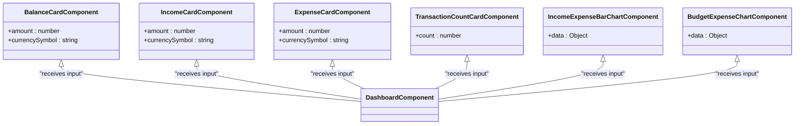

# Dashboard Components

<cite>
**Referenced Files in This Document**   
- [dashboard.component.ts](file://src/app/dashboard/dashboard.component.ts)
- [balance-card.component.ts](file://src/app/dashboard/components/balance-card/balance-card.component.ts)
- [income-card.component.ts](file://src/app/dashboard/components/income-card/income-card.component.ts)
- [expense-card.component.ts](file://src/app/dashboard/components/expense-card/expense-card.component.ts)
- [transaction-count-card.component.ts](file://src/app/dashboard/components/transaction-count-card/transaction-count-card.component.ts)
- [income-expense-bar-chart.component.ts](file://src/app/dashboard/components/income-expense-bar-chart/income-expense-bar-chart.component.ts)
- [budget-expense-chart.component.ts](file://src/app/dashboard/components/budget-expense-chart/budget-expense-chart.component.ts)
- [budget.model.ts](file://src/app/shared/models/budget.model.ts)
</cite>

## Table of Contents
1. [Introduction](#introduction)
2. [Project Structure](#project-structure)
3. [Core Components](#core-components)
4. [Architecture Overview](#architecture-overview)
5. [Detailed Component Analysis](#detailed-component-analysis)
6. [Dependency Analysis](#dependency-analysis)
7. [Performance Considerations](#performance-considerations)
8. [Troubleshooting Guide](#troubleshooting-guide)
9. [Conclusion](#conclusion)

## Introduction
The Dashboard feature serves as the central hub for financial data visualization in the application. It provides users with real-time summaries of their financial status through a collection of specialized widgets. These components are designed to present key metrics such as income, expenses, balance, transaction volume, and budget utilization in an intuitive and visually appealing manner. The dashboard leverages Angular's reactive programming model to ensure data is consistently up-to-date and responsive to user interactions.

## Project Structure
The dashboard functionality is organized within the `src/app/dashboard` directory, which contains the main `DashboardComponent` and a dedicated `components` subdirectory housing all widget components. This modular structure promotes reusability and separation of concerns, with each visualization element encapsulated in its own component. The dashboard imports various child components and integrates them through a cohesive layout defined in the template.

**Diagram sources**
- [dashboard.component.ts](file://src/app/dashboard/dashboard.component.ts#L19-L25)
- [balance-card.component.ts](file://src/app/dashboard/components/balance-card/balance-card.component.ts#L5-L7)
- [income-card.component.ts](file://src/app/dashboard/components/income-card/income-card.component.ts#L5-L7)
- [expense-card.component.ts](file://src/app/dashboard/components/expense-card/expense-card.component.ts#L5-L7)

**Section sources**
- [dashboard.component.ts](file://src/app/dashboard/dashboard.component.ts#L1-L294)
- [components](file://src/app/dashboard/components)

## Core Components
The dashboard ecosystem consists of multiple specialized components that work together to display financial data. The `DashboardComponent` acts as the container that orchestrates data retrieval and distribution to child components via input properties. Each widget receives data through `@Input()` bindings and uses the async pipe pattern indirectly through the parent component's state management. Real-time updates are achieved through Angular's change detection mechanism triggered by observable subscriptions in the parent component.

**Section sources**
- [dashboard.component.ts](file://src/app/dashboard/dashboard.component.ts#L19-L294)
- [balance-card.component.ts](file://src/app/dashboard/components/balance-card/balance-card.component.ts#L1-L14)

## Architecture Overview
The dashboard follows a container-component pattern where the `DashboardComponent` handles all data fetching and business logic while delegating presentation responsibilities to specialized child components. Data flows from services through the dashboard component and down to individual widgets via input properties. This unidirectional data flow ensures predictability and simplifies debugging. The architecture leverages Angular's reactive forms and observable patterns to maintain real-time synchronization between the UI and underlying data models.

**Diagram sources**
- [dashboard.component.ts](file://src/app/dashboard/dashboard.component.ts#L70-L150)
- [transaction.service.ts](file://src/app/shared/services/transaction.service.ts)
- [budget.service.ts](file://src/app/shared/services/budget.service.ts)

## Detailed Component Analysis

### DashboardComponent Analysis
The `DashboardComponent` serves as the orchestrator of the entire dashboard ecosystem. It implements `OnInit` and `OnDestroy` lifecycle hooks to manage subscriptions properly and prevent memory leaks. The component subscribes to multiple services to retrieve transactions, categories, budget data, and currency information. It performs data aggregation calculations such as total income, total expenses, balance, and transaction counts. The component also handles user interactions like adding new transactions and manages modal state for transaction creation.

#### For Object-Oriented Components:

**Diagram sources**
- [dashboard.component.ts](file://src/app/dashboard/dashboard.component.ts#L19-L294)

**Section sources**
- [dashboard.component.ts](file://src/app/dashboard/dashboard.component.ts#L19-L294)

### Widget Components Analysis
The dashboard contains several specialized widget components that display specific financial metrics. Each card component follows a consistent pattern with `@Input()` properties for data binding. The `BalanceCardComponent`, `IncomeCardComponent`, and `ExpenseCardComponent` all accept an amount and currency symbol to display formatted monetary values. These components use Angular's `CommonModule` for basic directives and rely on the parent component for data rather than making direct service calls.

#### For Object-Oriented Components:

**Diagram sources**
- [balance-card.component.ts](file://src/app/dashboard/components/balance-card/balance-card.component.ts#L1-L14)
- [income-card.component.ts](file://src/app/dashboard/components/income-card/income-card.component.ts#L1-L14)
- [expense-card.component.ts](file://src/app/dashboard/components/expense-card/expense-card.component.ts#L1-L14)
- [transaction-count-card.component.ts](file://src/app/dashboard/components/transaction-count-card/transaction-count-card.component.ts#L1-L14)

**Section sources**
- [balance-card.component.ts](file://src/app/dashboard/components/balance-card/balance-card.component.ts#L1-L14)
- [income-card.component.ts](file://src/app/dashboard/components/income-card/income-card.component.ts#L1-L14)
- [expense-card.component.ts](file://src/app/dashboard/components/expense-card/expense-card.component.ts#L1-L14)

### Data Flow and Update Mechanisms
The dashboard implements a sophisticated data update mechanism that ensures all components remain synchronized. When the component initializes, it loads data from multiple services and combines the results to calculate derived values. The `updateBudgetWithTransactionData()` method demonstrates how the dashboard correlates budget information with actual transaction data to provide accurate spending insights. This method filters transactions by current month and calculates expenses, then updates the budget overview with real-time figures.

**Diagram sources**
- [dashboard.component.ts](file://src/app/dashboard/dashboard.component.ts#L70-L150)

**Section sources**
- [dashboard.component.ts](file://src/app/dashboard/dashboard.component.ts#L70-L150)

## Dependency Analysis
The dashboard component has direct dependencies on several services from the shared module, including `TransactionService`, `CategoryService`, `CurrencyService`, and `BudgetService`. These dependencies are injected through the constructor and used to retrieve data. The component also depends on Angular's `CommonModule` and `FormsModule` for template directives and form handling. All child components are imported directly into the dashboard's imports array, creating a tight coupling between the container and its widgets.

**Diagram sources**
- [dashboard.component.ts](file://src/app/dashboard/dashboard.component.ts#L19-L25)
- [dashboard.component.ts](file://src/app/dashboard/dashboard.component.ts#L50-L65)

**Section sources**
- [dashboard.component.ts](file://src/app/dashboard/dashboard.component.ts#L50-L65)

## Performance Considerations
The dashboard implements several performance optimizations to handle multiple data sources and frequent updates efficiently. The use of `takeUntil` with a destroy subject prevents memory leaks by automatically unsubscribing from observables when the component is destroyed. Data aggregation is performed in a single pass through transaction arrays to minimize computational overhead. The component batches related calculations together to reduce the number of change detection cycles needed. For rendering multiple charts simultaneously, the architecture relies on Angular's efficient change detection mechanism and the async pipe pattern to minimize unnecessary re-renders.

**Section sources**
- [dashboard.component.ts](file://src/app/dashboard/dashboard.component.ts#L120-L130)
- [dashboard.component.ts](file://src/app/dashboard/dashboard.component.ts#L180-L190)

## Troubleshooting Guide
Common issues with the dashboard typically relate to data loading and display synchronization. If widgets show outdated or incorrect data, verify that the `calculateTotals()` and `updateBudgetWithTransactionData()` methods are being called after data loads. Ensure that the destroy subject is properly completed in `ngOnDestroy()` to prevent memory leaks. For currency display issues, confirm that the `currencySymbol` is correctly propagated from the `CurrencyService` to all child components. Loading state issues can be diagnosed by checking the `isLoading` flag management in the various load methods.

**Section sources**
- [dashboard.component.ts](file://src/app/dashboard/dashboard.component.ts#L100-L110)
- [dashboard.component.ts](file://src/app/dashboard/dashboard.component.ts#L200-L210)

## Conclusion
The dashboard feature provides a comprehensive financial overview through a well-structured component ecosystem. By following Angular best practices and implementing a clear separation of concerns, the dashboard delivers real-time financial insights with optimal performance. The modular design allows for easy maintenance and extension, while the unidirectional data flow ensures predictable behavior. Future enhancements could include configurable widgets, personalized layouts, and more advanced charting capabilities.