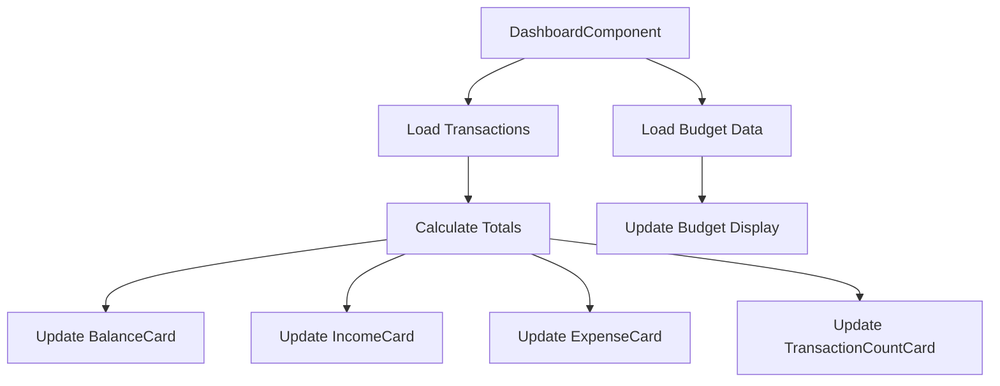
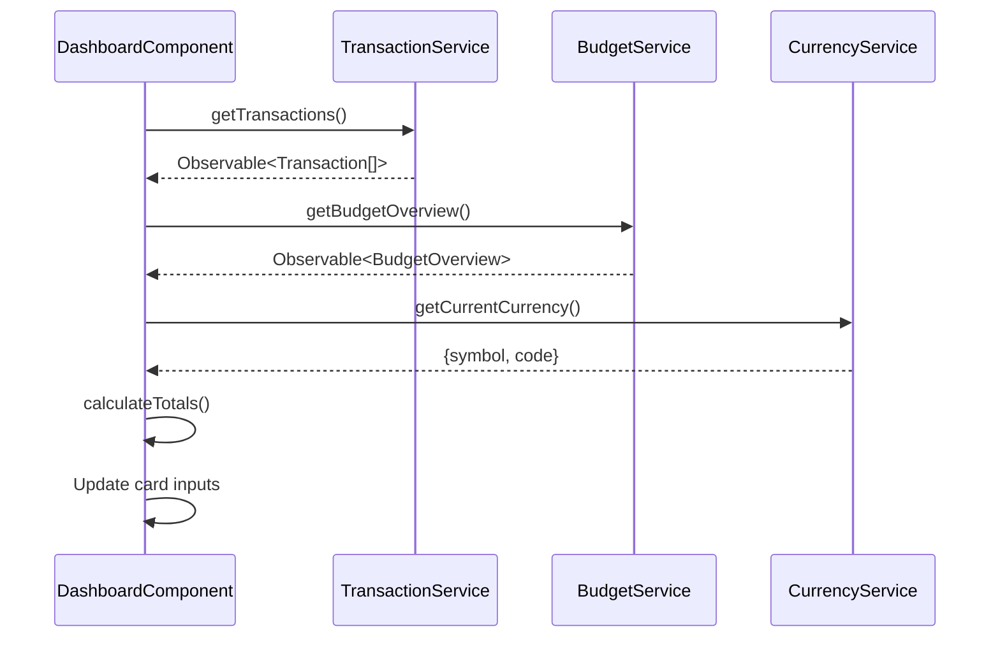
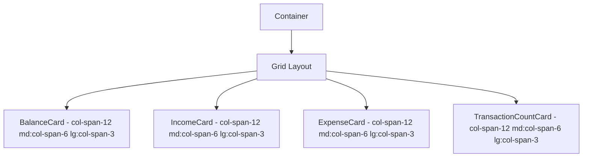
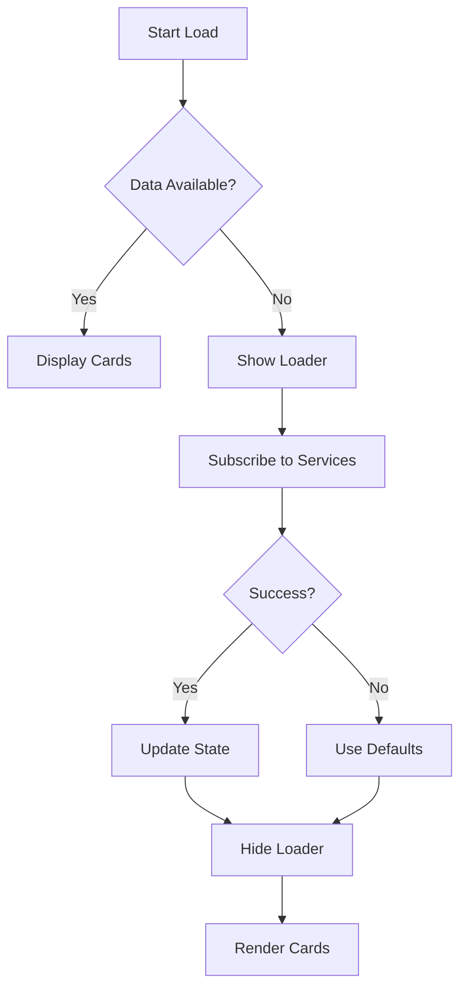

# Dashboard Data Cards

<cite>
**Referenced Files in This Document**  
- [balance-card.component.ts](file://src/app/dashboard/components/balance-card/balance-card.component.ts)
- [income-card.component.ts](file://src/app/dashboard/components/income-card/income-card.component.ts)
- [expense-card.component.ts](file://src/app/dashboard/components/expense-card/expense-card.component.ts)
- [transaction-count-card.component.ts](file://src/app/dashboard/components/transaction-count-card/transaction-count-card.component.ts)
- [dashboard.component.ts](file://src/app/dashboard/dashboard.component.ts)
- [transaction.service.ts](file://src/app/shared/services/transaction.service.ts)
- [budget.service.ts](file://src/app/shared/services/budget.service.ts)
- [currency.service.ts](file://src/app/shared/services/currency.service.ts)
- [loader.component.ts](file://src/app/shared/components/loader/loader.component.ts)
- [loader.service.ts](file://src/app/shared/services/loader.service.ts)
</cite>

## Table of Contents
1. [Introduction](#introduction)
2. [Core Data Card Components](#core-data-card-components)
3. [DashboardComponent Integration](#dashboardcomponent-integration)
4. [Data Flow and Async Handling](#data-flow-and-async-handling)
5. [Currency Formatting and Localization](#currency-formatting-and-localization)
6. [Responsive Design with Tailwind CSS](#responsive-design-with-tailwind-css)
7. [Performance and Change Detection](#performance-and-change-detection)
8. [Error and Loading States](#error-and-loading-states)
9. [Usage Examples](#usage-examples)
10. [Conclusion](#conclusion)

## Introduction
The dashboard data card components—BalanceCard, IncomeCard, ExpenseCard, and TransactionCountCard—are essential UI elements for presenting key financial metrics in a clear, concise manner. These components are designed to be lightweight, reusable, and responsive, integrating seamlessly within the DashboardComponent. They consume data asynchronously from TransactionService and BudgetService, format values using CurrencyService, and respond to application loading states via the global LoaderService. This document details their implementation, integration, and best practices.

**Section sources**
- [balance-card.component.ts](file://src/app/dashboard/components/balance-card/balance-card.component.ts#L1-L13)
- [income-card.component.ts](file://src/app/dashboard/components/income-card/income-card.component.ts#L1-L13)
- [expense-card.component.ts](file://src/app/dashboard/components/expense-card/expense-card.component.ts#L1-L13)
- [transaction-count-card.component.ts](file://src/app/dashboard/components/transaction-count-card/transaction-count-card.component.ts#L1-L14)

## Core Data Card Components

### BalanceCardComponent
Displays the user's current account balance, formatted with the appropriate currency symbol. Accepts `amount` and `currencySymbol` as input properties.

**Section sources**
- [balance-card.component.ts](file://src/app/dashboard/components/balance-card/balance-card.component.ts#L1-L13)

### IncomeCardComponent
Shows the total income amount, formatted with the currency symbol. Uses `amount` and `currencySymbol` inputs to render financial data.

**Section sources**
- [income-card.component.ts](file://src/app/dashboard/components/income-card/income-card.component.ts#L1-L13)

### ExpenseCardComponent
Presents the total expenses, formatted with the currency symbol. Relies on `amount` and `currencySymbol` inputs for display.

**Section sources**
- [expense-card.component.ts](file://src/app/dashboard/components/expense-card/expense-card.component.ts#L1-L13)

### TransactionCountCardComponent
Displays transaction statistics including total, income, and expense counts. Accepts `totalCount`, `incomeCount`, and `expenseCount` as inputs.

**Section sources**
- [transaction-count-card.component.ts](file://src/app/dashboard/components/transaction-count-card/transaction-count-card.component.ts#L1-L14)

## DashboardComponent Integration
The DashboardComponent orchestrates data retrieval and distribution to the data cards. It imports and declares all card components, binds calculated values to their inputs, and manages lifecycle events.



**Diagram sources**
- [dashboard.component.ts](file://src/app/dashboard/dashboard.component.ts#L20-L297)

**Section sources**
- [dashboard.component.ts](file://src/app/dashboard/dashboard.component.ts#L20-L297)

## Data Flow and Async Handling
Data is fetched asynchronously using RxJS observables from TransactionService and BudgetService. The DashboardComponent subscribes to these observables in `ngOnInit`, updating component state upon emission.



**Diagram sources**
- [dashboard.component.ts](file://src/app/dashboard/dashboard.component.ts#L50-L150)
- [transaction.service.ts](file://src/app/shared/services/transaction.service.ts#L10-L40)
- [budget.service.ts](file://src/app/shared/services/budget.service.ts#L10-L40)

**Section sources**
- [dashboard.component.ts](file://src/app/dashboard/dashboard.component.ts#L50-L150)
- [transaction.service.ts](file://src/app/shared/services/transaction.service.ts#L10-L40)
- [budget.service.ts](file://src/app/shared/services/budget.service.ts#L10-L40)

## Currency Formatting and Localization
The CurrencyService determines the user's locale and returns the appropriate currency symbol and code. The `formatAmount` method formats numeric values with the correct symbol.

```mermaid
classDiagram
class CurrencyService {
+getCurrentCurrency() : {symbol : string, code : string}
+formatAmount(amount : number) : string
-getUserCountry() : string
-currencyMap : { [key : string] : { symbol : string; code : string } }
}
```

**Diagram sources**
- [currency.service.ts](file://src/app/shared/services/currency.service.ts#L1-L68)

**Section sources**
- [currency.service.ts](file://src/app/shared/services/currency.service.ts#L1-L68)

## Responsive Design with Tailwind CSS
All data cards use Tailwind CSS for responsive layout. Cards are arranged in a grid that adapts to screen size, ensuring readability on mobile and desktop.



**Diagram sources**
- [dashboard.component.html](file://src/app/dashboard/dashboard.component.html#L1-L50)
- [balance-card.component.html](file://src/app/dashboard/components/balance-card/balance-card.component.html#L1-L10)
- [income-card.component.html](file://src/app/dashboard/components/income-card/income-card.component.html#L1-L10)
- [expense-card.component.html](file://src/app/dashboard/components/expense-card/expense-card.component.html#L1-L10)
- [transaction-count-card.component.html](file://src/app/dashboard/components/transaction-count-card/transaction-count-card.component.html#L1-L10)

## Performance and Change Detection
All card components are standalone and use OnPush change detection implicitly due to their simplicity. Inputs are immutable values (numbers, strings), minimizing unnecessary change detection cycles.

**Section sources**
- [balance-card.component.ts](file://src/app/dashboard/components/balance-card/balance-card.component.ts#L1-L13)
- [income-card.component.ts](file://src/app/dashboard/components/income-card/income-card.component.ts#L1-L13)
- [expense-card.component.ts](file://src/app/dashboard/components/expense-card/expense-card.component.ts#L1-L13)
- [transaction-count-card.component.ts](file://src/app/dashboard/components/transaction-count-card/transaction-count-card.component.ts#L1-L14)

## Error and Loading States
The DashboardComponent uses the global LoaderService to manage loading states. During data retrieval, a loading indicator is displayed. Null or error states are handled gracefully with default values.



**Diagram sources**
- [dashboard.component.ts](file://src/app/dashboard/dashboard.component.ts#L80-L150)
- [loader.component.ts](file://src/app/shared/components/loader/loader.component.ts#L1-L13)
- [loader.service.ts](file://src/app/shared/services/loader.service.ts#L1-L18)

**Section sources**
- [dashboard.component.ts](file://src/app/dashboard/dashboard.component.ts#L80-L150)
- [loader.component.ts](file://src/app/shared/components/loader/loader.component.ts#L1-L13)
- [loader.service.ts](file://src/app/shared/services/loader.service.ts#L1-L18)

## Usage Examples
The data cards are used within the DashboardComponent template, bound to calculated properties:

```html
<app-balance-card [amount]="balance" [currencySymbol]="currencySymbol"></app-balance-card>
<app-income-card [amount]="totalIncome" [currencySymbol]="currencySymbol"></app-income-card>
<app-expense-card [amount]="totalExpenses" [currencySymbol]="currencySymbol"></app-expense-card>
<app-transaction-count-card 
  [totalCount]="totalTransactionCount" 
  [incomeCount]="incomeTransactionCount" 
  [expenseCount]="expenseTransactionCount">
</app-transaction-count-card>
```

**Section sources**
- [dashboard.component.html](file://src/app/dashboard/dashboard.component.html#L1-L50)

## Conclusion
The dashboard data card components provide a modular, efficient way to display financial metrics. Integrated within the DashboardComponent, they leverage async data from TransactionService and BudgetService, format values via CurrencyService, and respond to loading states through the global LoaderService. Their design emphasizes performance, responsiveness, and clarity, making them essential for user financial insight.