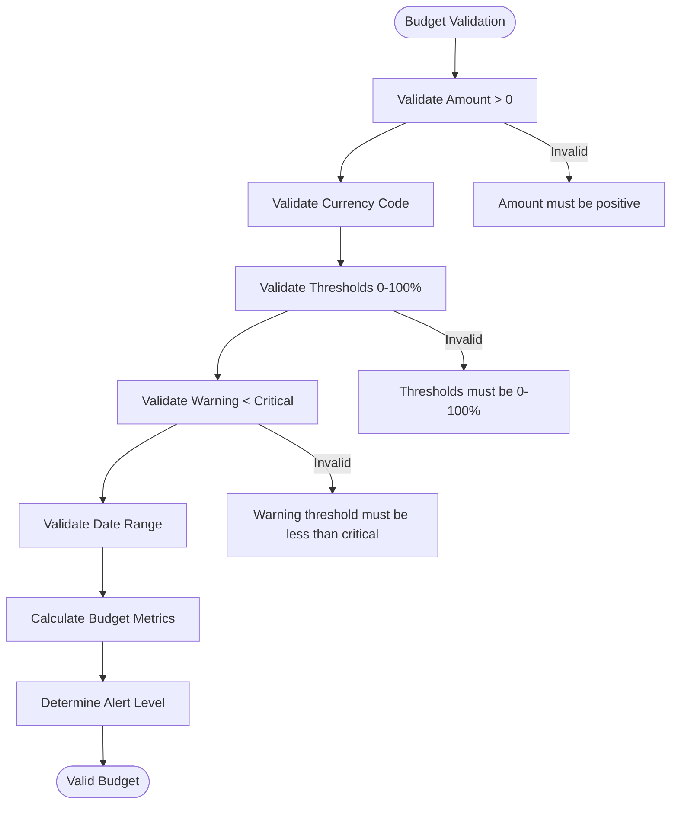
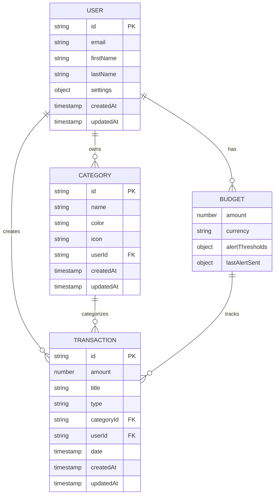
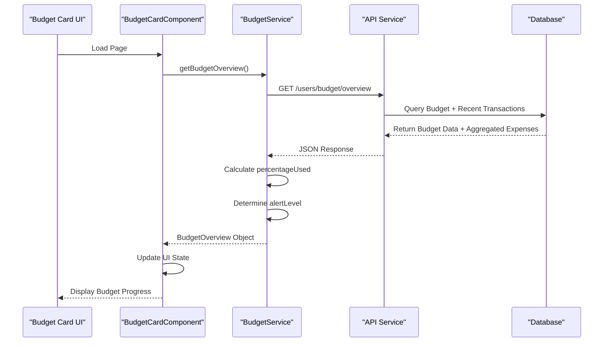
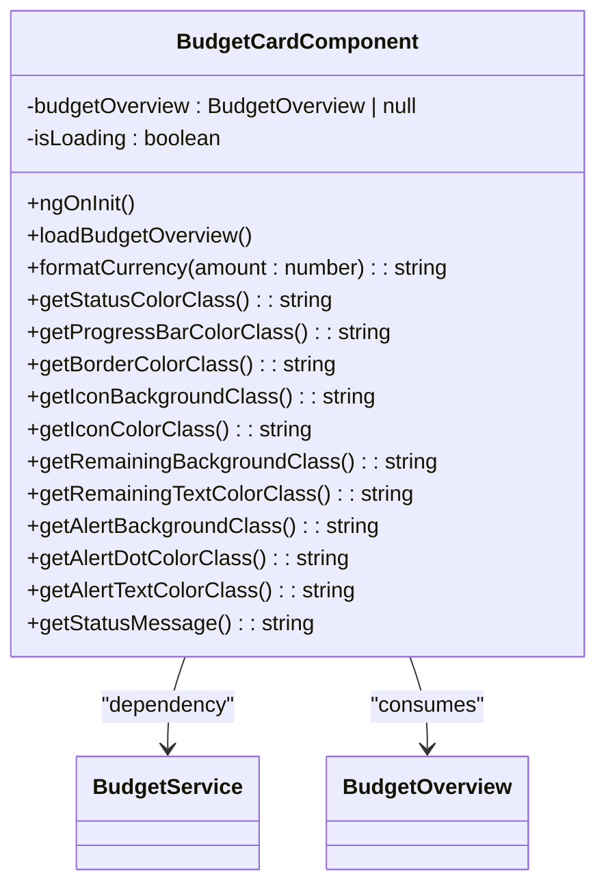
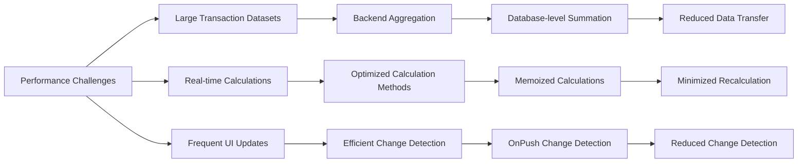

# Budget Model

<cite>
**Referenced Files in This Document**   
- [budget.model.ts](file://src/app/shared/models/budget.model.ts)
- [budget.service.ts](file://src/app/shared/services/budget.service.ts)
- [budget-management.component.ts](file://src/app/shared/components/budget-management/budget-management.component.ts)
- [budget-card.component.ts](file://src/app/dashboard/components/budget-card/budget-card.component.ts)
- [transaction.model.ts](file://src/app/shared/models/transaction.model.ts)
- [user.model.ts](file://src/app/shared/models/user.model.ts)
</cite>

## Table of Contents
1. [Introduction](#introduction)
2. [Core Data Model](#core-data-model)
3. [Budget Validation Logic](#budget-validation-logic)
4. [Relationships with Other Models](#relationships-with-other-models)
5. [Integration with Transaction Data](#integration-with-transaction-data)
6. [Budget Management Component](#budget-management-component)
7. [Budget Card Component](#budget-card-component)
8. [Performance Considerations](#performance-considerations)
9. [Conclusion](#conclusion)

## Introduction
The Budget model in this financial application enables users to set monthly spending limits, track progress, and receive intelligent alerts when approaching or exceeding thresholds. This documentation details the model's structure, validation rules, relationships with other entities, and its implementation across key components. The system supports financial planning through real-time expense tracking and proactive overspending notifications.

## Core Data Model

The Budget model is implemented through two primary interfaces: `MonthlyBudget` and `BudgetOverview`, which together provide comprehensive budget tracking capabilities.

```mermaid
classDiagram
class MonthlyBudget {
+amount : number
+currency : string
+alertThresholds : { warning : number, critical : number }
+lastAlertSent? : { warning? : Date, critical? : Date }
}
class BudgetOverview {
+budgetSet : boolean
+budget? : number
+spent? : number
+remaining? : number
+percentageUsed? : number
+alertLevel? : 'safe' | 'warning' | 'critical'
+shouldSendAlert? : boolean
+thresholds? : { warning : number, critical : number }
+monthlyData? : {
month : number,
year : number,
totalExpenses : number,
transactionCount : number,
period : { startDate : Date, endDate : Date }
}
+categoryBreakdown? : Array<{
categoryId? : string,
categoryName : string,
amount : number,
percentage : number,
transactionCount : number
}>
}
class BudgetAlertSummary {
+budgetSet : boolean
+alertsEnabled : boolean
+currentStatus : 'no_budget' | 'safe' | 'warning' | 'critical'
+percentageUsed? : number
+shouldSendAlert? : boolean
+lastAlerts? : { warning? : Date, critical? : Date }
+thresholds? : { warning : number, critical : number }
}
BudgetOverview --> MonthlyBudget : "extends"
BudgetAlertSummary --> BudgetOverview : "simplifies"
```

**Diagram sources**
- [budget.model.ts](file://src/app/shared/models/budget.model.ts#L1-L59)

**Section sources**
- [budget.model.ts](file://src/app/shared/models/budget.model.ts#L1-L59)

### MonthlyBudget Interface
The `MonthlyBudget` interface defines the core budget configuration:
- **amount**: Numeric value representing the monthly spending limit
- **currency**: Currency code (e.g., USD, EUR) for the budget
- **alertThresholds**: Object containing warning and critical percentage thresholds
- **lastAlertSent**: Optional tracking of when alerts were last sent

### BudgetOverview Interface
The `BudgetOverview` interface provides comprehensive budget analytics:
- **budgetSet**: Boolean indicating if a budget has been configured
- **budget**: The configured budget amount
- **spent**: Total amount spent in the current period
- **remaining**: Calculated remaining budget (budget - spent)
- **percentageUsed**: Percentage of budget consumed
- **alertLevel**: Current status ('safe', 'warning', 'critical')
- **thresholds**: Active alert thresholds
- **monthlyData**: Detailed monthly statistics including date range
- **categoryBreakdown**: Expense distribution across categories

## Budget Validation Logic

The application implements comprehensive validation rules to ensure data integrity and meaningful budget configurations.



**Diagram sources**
- [budget-management.component.ts](file://src/app/shared/components/budget-management/budget-management.component.ts#L256-L268)
- [budget.service.ts](file://src/app/shared/services/budget.service.ts#L100-L145)

**Section sources**
- [budget-management.component.ts](file://src/app/shared/components/budget-management/budget-management.component.ts#L256-L268)
- [budget.service.ts](file://src/app/shared/services/budget.service.ts#L100-L145)

### Field Validation Rules
- **Amount**: Must be a positive number (greater than 0)
- **Currency**: Must be a valid currency code from supported options
- **Warning Threshold**: Must be between 0-100%, defaulting to 80%
- **Critical Threshold**: Must be between 0-100%, defaulting to 95%
- **Threshold Relationship**: Warning threshold must be less than critical threshold

### Cross-Field Validation
The system implements cross-field validation to ensure logical consistency:
- The warning threshold cannot equal or exceed the critical threshold
- Date ranges must represent a valid period (start before end)
- Budget amounts must be non-negative
- Percentage calculations are capped at 100% to prevent overflow

## Relationships with Other Models

The Budget model integrates with User and Category models to provide personalized financial tracking and category-specific budgeting capabilities.



**Diagram sources**
- [budget.model.ts](file://src/app/shared/models/budget.model.ts#L1-L59)
- [user.model.ts](file://src/app/shared/models/user.model.ts#L1-L15)
- [transaction.model.ts](file://src/app/shared/models/transaction.model.ts#L1-L12)

**Section sources**
- [budget.model.ts](file://src/app/shared/models/budget.model.ts#L1-L59)
- [user.model.ts](file://src/app/shared/models/user.model.ts#L1-L15)

### User Relationship
The Budget model has a one-to-one relationship with the User model:
- Each user can have one active monthly budget
- Budget settings are stored in the user's profile
- Budget ownership is enforced through authentication
- User preferences (like notification settings) affect budget alerts

### Category Relationship
While the current implementation doesn't support category-specific budgets directly, the model includes category breakdown functionality:
- The `categoryBreakdown` field in `BudgetOverview` provides expense distribution by category
- Transactions are linked to categories, enabling aggregated reporting
- Future enhancements could enable category-level budgeting

## Integration with Transaction Data

The Budget model integrates with Transaction data to provide real-time spending analytics and progress tracking.



**Diagram sources**
- [budget.service.ts](file://src/app/shared/services/budget.service.ts#L50-L70)
- [budget-card.component.ts](file://src/app/dashboard/components/budget-card/budget-card.component.ts#L80-L100)

**Section sources**
- [budget.service.ts](file://src/app/shared/services/budget.service.ts#L50-L70)
- [budget-card.component.ts](file://src/app/dashboard/components/budget-card/budget-card.component.ts#L80-L100)

### Data Flow Process
1. The BudgetService requests budget overview data from the API
2. The backend aggregates the user's budget configuration with recent transaction data
3. Expense totals are calculated for the current month
4. The service computes derived metrics (percentage used, remaining amount)
5. Alert levels are determined based on threshold comparisons
6. The complete BudgetOverview is returned to the requesting component

### Real-time Updates
Components that display budget information subscribe to data streams:
- BudgetCardComponent loads budget overview on initialization
- The component automatically updates when data changes
- Error handling ensures graceful degradation if budget data is unavailable
- Loading states provide feedback during data retrieval

## Budget Management Component

The BudgetManagementComponent provides a comprehensive interface for users to create, update, and manage their monthly budgets.

```mermaid
flowchart TD
A([Component Initialization]) --> B[Load Existing Budget]
B --> C{Budget Exists?}
C --> |Yes| D[Populate Form with Current Values]
C --> |No| E[Initialize with Defaults]
D --> F
E --> F
F[Display Budget Form]
F --> G[User Submits Form]
G --> H[Validate Form Data]
H --> I{Valid?}
I --> |No| J[Show Validation Errors]
I --> |Yes| K[Call BudgetService.updateBudget()]
K --> L{Success?}
L --> |Yes| M[Show Success Notification]
L --> |No| N[Show Error Notification]
M --> O[Reload Budget Data]
N --> P[Keep Form Data]
```

**Diagram sources**
- [budget-management.component.ts](file://src/app/shared/components/budget-management/budget-management.component.ts#L150-L210)
- [budget.service.ts](file://src/app/shared/services/budget.service.ts#L20-L45)

**Section sources**
- [budget-management.component.ts](file://src/app/shared/components/budget-management/budget-management.component.ts#L150-L210)

### Key Features
- **Form Validation**: Reactive form with required fields and range validation
- **Threshold Validation**: Real-time validation ensuring warning < critical
- **Data Loading**: Simultaneous loading of current budget and overview data
- **Error Handling**: Comprehensive error handling with user notifications
- **Loading States**: Visual feedback during data operations
- **Currency Support**: Multiple currency options with formatting

### Lifecycle Management
The component implements proper Angular lifecycle hooks:
- OnInit: Loads budget data and sets up form validation
- OnDestroy: Cleans up subscriptions to prevent memory leaks
- Form value changes: Real-time threshold validation
- Submit handling: Form submission with validation and API interaction

## Budget Card Component

The BudgetCardComponent provides a compact, visual representation of the user's current budget status on the dashboard.



**Diagram sources**
- [budget-card.component.ts](file://src/app/dashboard/components/budget-card/budget-card.component.ts#L1-L268)

**Section sources**
- [budget-card.component.ts](file://src/app/dashboard/components/budget-card/budget-card.component.ts#L1-L268)

### Visual Indicators
The component uses multiple visual cues to communicate budget status:
- **Border Color**: Changes based on alert level (green, yellow, red)
- **Icon Background**: Matches alert level for quick recognition
- **Progress Bar**: Color-coded and width-adjusted based on usage
- **Remaining Amount**: Green for positive, red for over-budget
- **Alert Indicator**: Pulsing dot and text for warning/critical states

### Responsive Design
The component is designed to work across device sizes:
- Grid layout adapts from 2 to 1 column on smaller screens
- Text sizes and spacing are optimized for readability
- Interactive elements have appropriate tap targets
- Loading state provides clear feedback during data retrieval

## Performance Considerations

The budget system is designed with performance optimization in mind, particularly for real-time expense aggregation and calculations on large datasets.



**Diagram sources**
- [budget.service.ts](file://src/app/shared/services/budget.service.ts#L80-L95)
- [budget-card.component.ts](file://src/app/dashboard/components/budget-card/budget-card.component.ts#L80-L100)

**Section sources**
- [budget.service.ts](file://src/app/shared/services/budget.service.ts#L80-L95)

### Backend Optimization
- **Aggregation at Database Level**: Expense totals are calculated server-side rather than transferring all transactions
- **Caching**: Frequently accessed budget data may be cached to reduce database load
- **Indexed Queries**: Date-based queries on transactions are optimized with proper indexing
- **Batch Processing**: Related data (budget + transactions) is retrieved in a single request

### Frontend Optimization
- **Memoized Calculations**: Budget progress calculations are optimized and only recalculated when necessary
- **Efficient Change Detection**: Components use OnPush strategy where appropriate
- **Lazy Loading**: Budget data is loaded only when needed
- **Debounced Updates**: Rapid state changes are consolidated to prevent excessive recalculations

### Recommendations for Large Datasets
1. **Implement Pagination**: For transaction history, implement pagination to limit data transfer
2. **Add Data Indexing**: Ensure transaction date fields are properly indexed in the database
3. **Use Web Workers**: For complex calculations on large datasets, consider offloading to web workers
4. **Implement Local Caching**: Cache budget calculations in localStorage or IndexedDB
5. **Optimize API Endpoints**: Create specialized endpoints that return only the data needed for budget calculations
6. **Add Loading Skeletons**: Provide immediate visual feedback while data loads
7. **Implement Error Boundaries**: Gracefully handle cases where budget calculations fail due to data volume

## Conclusion
The Budget model provides a robust foundation for financial planning and overspending prevention in the application. By combining a well-structured data model with comprehensive validation, meaningful relationships, and efficient integration with transaction data, the system enables users to effectively manage their monthly spending. The implementation across components like BudgetManagementComponent and BudgetCardComponent demonstrates a thoughtful approach to user experience, providing both detailed configuration options and at-a-glance status information. With proper performance optimizations, this budgeting system can scale effectively to handle large datasets while maintaining responsiveness and usability.