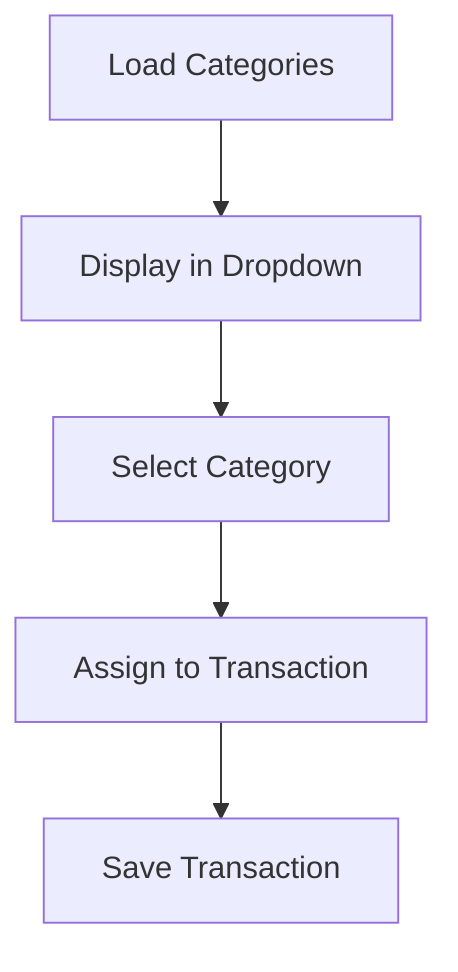
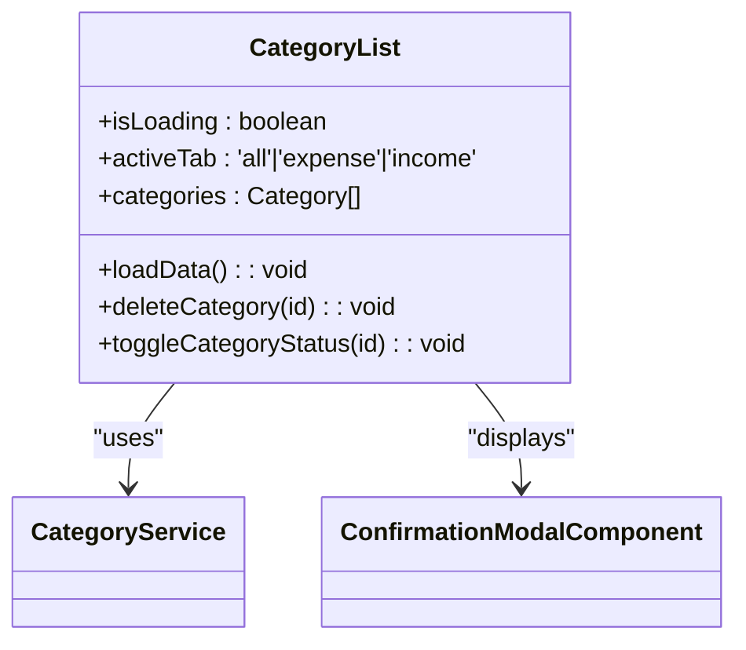
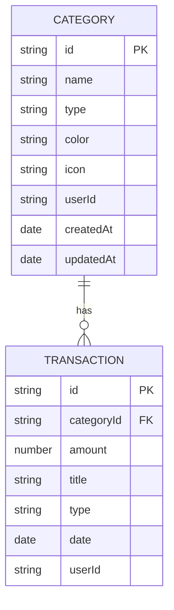

# Category Model

<cite>
**Referenced Files in This Document**   
- [category.model.ts](file://src/app/shared/models/category.model.ts)
- [category.service.ts](file://src/app/shared/services/category.service.ts)
- [category-form.component.ts](file://src/app/categories/category-form/category-form.component.ts)
- [category-list.component.ts](file://src/app/categories/category-list/category-list.component.ts)
- [transaction-form.component.ts](file://src/app/transactions/transaction-form/transaction-form.component.ts)
- [transaction.model.ts](file://src/app/shared/models/transaction.model.ts)
</cite>

## Table of Contents
1. [Introduction](#introduction)
2. [Core Properties](#core-properties)
3. [Business Rules](#business-rules)
4. [UI Integration](#ui-integration)
5. [Usage Examples](#usage-examples)
6. [Integration with Transaction and Budget Models](#integration-with-transaction-and-budget-models)
7. [Extensibility and Custom Templates](#extensibility-and-custom-templates)
8. [Conclusion](#conclusion)

## Introduction
The Category model serves as a foundational component for organizing financial data within the application. It enables users to classify transactions into meaningful groups such as food, transportation, or income sources, thereby improving reporting accuracy and financial visibility. Categories are central to transaction classification, filtering, and analytics, and support visual identification through color and icon properties. This document details the structure, behavior, and integration of the Category model across the system.

**Section sources**
- [category.model.ts](file://src/app/shared/models/category.model.ts#L1-L10)

## Core Properties
The Category model defines a structured set of properties that govern its behavior and presentation:

- **id**: Unique identifier for the category (string)
- **name**: Descriptive label (e.g., "Groceries", "Salary") – required and must be unique per user
- **type**: Classification as either `"income"` or `"expense"` – determines financial impact
- **color**: Hexadecimal color code used for visual representation in charts and UI components
- **icon**: Material icon name (e.g., "restaurant", "attach_money") for intuitive recognition
- **userId**: Links the category to a specific user in multi-user environments
- **createdAt / updatedAt**: Timestamps tracking creation and modification times

These properties ensure consistent categorization and enable rich visual reporting.

**Section sources**
- [category.model.ts](file://src/app/shared/models/category.model.ts#L1-L10)

## Business Rules
The system enforces several business rules to maintain data integrity and usability:

- **Unique Name Constraint**: Category names must be unique per user to prevent confusion and duplication.
- **Non-Deletion of Used Categories**: While the `deleteCategory` method exists in `CategoryService`, deletion is only permitted if no transactions are associated with the category. This rule is enforced at the UI level via confirmation modals but should be validated on the backend.
- **Required Fields**: Name and type are mandatory during creation; default values are applied for color (`#3b82f6`) and icon (`category`).
- **Immutable Type After Creation**: Once set, the category type cannot be changed to avoid misclassification of historical transactions.

These constraints ensure reliable transaction tracking and reporting.

**Section sources**
- [category.service.ts](file://src/app/shared/services/category.service.ts#L49-L94)
- [category-form.component.ts](file://src/app/categories/category-form/category-form.component.ts#L89-L115)

## UI Integration
Categories are deeply integrated into key user interface components, enhancing usability and visual clarity.

### TransactionForm Component
The `TransactionFormComponent` uses categories to classify new or edited transactions. It loads all available categories via `CategoryService.getCategories()` and presents them in a dropdown. The selected category determines the transaction's financial type and appearance in reports.

**Diagram sources**
- [transaction-form.component.ts](file://src/app/transactions/transaction-form/transaction-form.component.ts#L38-L42)

### CategoryList Component
The `CategoryListComponent` displays all categories with their associated metadata, including transaction count and total amount spent/earned. Each category is rendered with its assigned color and icon, allowing quick visual identification. Users can toggle active status, edit, duplicate, or delete categories through a context menu.

**Diagram sources**
- [category-list.component.ts](file://src/app/categories/category-list/category-list.component.ts#L1-L268)

## Usage Examples
### Creating a New Category
Users navigate to `/categories/new`, fill out the form with name, type, color, and icon, then submit. The `CategoryFormComponent` calls `CategoryService.createCategory()` with the data, which sends a POST request to the API.

[SPEC SYMBOL](file://src/app/shared/services/category.service.ts#L49-L58)

### Toggling Category Status
In the category list, users can deactivate a category via the context menu. The `toggleCategoryStatus` method updates the `isActive` flag locally, though persistence requires backend support.

[SPEC SYMBOL](file://src/app/categories/category-list/category-list.component.ts#L200-L207)

### Filtering Transactions by Category
When viewing transactions, users can filter by category. The `TransactionService` retrieves transactions and matches them to categories using `categoryId`, enabling grouped views and reports.

[SPEC SYMBOL](file://src/app/transactions/transaction-form/transaction-form.component.ts#L38-L42)

## Integration with Transaction and Budget Models
### Transaction Model Relationship
Each `Transaction` references a `categoryId`, establishing a one-to-many relationship. This linkage allows:
- Accurate classification of income and expenses
- Aggregation of spending by category in reports
- Visual rendering using category color and icon

**Diagram sources**
- [category.model.ts](file://src/app/shared/models/category.model.ts#L1-L10)
- [transaction.model.ts](file://src/app/shared/models/transaction.model.ts#L1-L13)

### Budget Model Integration
While the `Budget` model does not directly reference categories, category-level spending data is aggregated in `BudgetOverview.categoryBreakdown`. This enables users to see how much has been spent in each category against overall budget limits, supporting informed financial decisions.

[SPEC SYMBOL](file://src/app/shared/models/budget.model.ts#L45-L59)

## Extensibility and Custom Templates
The Category model supports extensibility for future enhancements:
- **Custom Category Templates**: Users could define reusable category sets (e.g., "Freelancer Template" with categories like Clients, Software, Taxes).
- **Default Category Presets**: Onboarding could include predefined categories based on user profile (e.g., student, freelancer).
- **Icon and Color Themes**: Support for custom themes or palettes could enhance personalization.

Such features would build upon the existing `createCategory` and `getCategories` methods, enabling template-based bulk creation.

**Section sources**
- [category.service.ts](file://src/app/shared/services/category.service.ts#L30-L47)

## Conclusion
The Category model is a critical element in the financial management system, enabling accurate transaction classification, intuitive UI representation, and detailed reporting. Its design balances simplicity with extensibility, supporting both immediate functionality and future enhancements. By enforcing business rules and integrating seamlessly with transactions and budgets, it ensures data consistency and user clarity across the application.