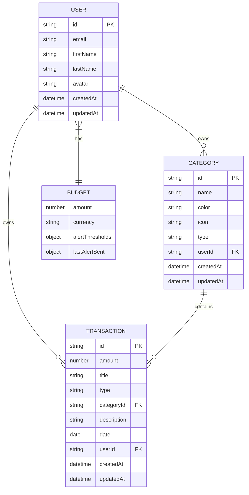
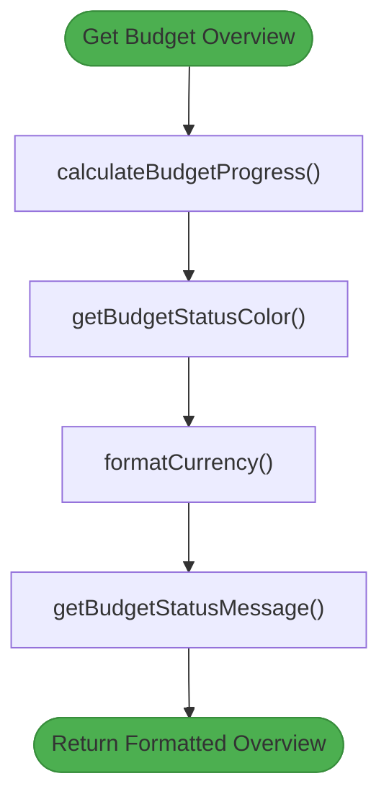

# Data Models & Interfaces

<cite>
**Referenced Files in This Document**   
- [user.model.ts](file://src/app/shared/models/user.model.ts)
- [transaction.model.ts](file://src/app/shared/models/transaction.model.ts)
- [category.model.ts](file://src/app/shared/models/category.model.ts)
- [budget.model.ts](file://src/app/shared/models/budget.model.ts)
- [budget.service.ts](file://src/app/shared/services/budget.service.ts)
</cite>

## Table of Contents
1. [Introduction](#introduction)
2. [Core Data Models](#core-data-models)
3. [Model Relationships](#model-relationships)
4. [Validation Rules and Business Logic](#validation-rules-and-business-logic)
5. [TypeScript Interfaces and Type Safety](#typescript-interfaces-and-type-safety)
6. [Model Instantiation and Serialization](#model-instantiation-and-serialization)
7. [Conclusion](#conclusion)

## Introduction
This document provides comprehensive documentation for the core data models used in the Angular application. It details the structure, properties, types, and relationships of key entities including User, Transaction, Category, and Budget. The documentation also covers validation rules, default values, business logic, and the role of TypeScript interfaces in ensuring type safety across the application.

## Core Data Models

### User Model
The `User` interface defines the structure of user entities in the system. It includes personal information, settings, and metadata.

**Key Properties:**
- `id`: Unique identifier for the user
- `email`: User's email address (used for authentication)
- `firstName`, `lastName`: User's full name
- `avatar`: Optional profile image URL
- `settings`: Configuration preferences including notification options and two-factor authentication status
- `createdAt`, `updatedAt`: Timestamps for record creation and modification

**Section sources**
- [user.model.ts](file://src/app/shared/models/user.model.ts#L1-L15)

### Transaction Model
The `Transaction` interface represents financial transactions within the system, categorized as either income or expense.

**Key Properties:**
- `id`: Unique transaction identifier
- `amount`: Numeric value of the transaction
- `title`: Descriptive name of the transaction
- `type`: Discriminator between 'income' and 'expense'
- `categoryId`: Reference to the associated category
- `description`: Additional details about the transaction
- `date`: Date when the transaction occurred
- `userId`: Reference to the owning user
- `createdAt`, `updatedAt`: Timestamps for record lifecycle
- `category`: Optional embedded category name for display purposes

**Section sources**
- [transaction.model.ts](file://src/app/shared/models/transaction.model.ts#L1-L12)

### Category Model
The `Category` interface defines transaction categories used for organizing financial data.

**Key Properties:**
- `id`: Unique category identifier
- `name`: Display name of the category
- `color`: Visual color code for UI representation
- `icon`: Icon identifier for visual categorization
- `type`: Specifies whether the category is for 'income' or 'expense'
- `userId`: Reference to the owning user (enabling personalization)
- `createdAt`, `updatedAt`: Timestamps for record management

**Section sources**
- [category.model.ts](file://src/app/shared/models/category.model.ts#L1-L9)

### Budget Model
The budget model consists of multiple interfaces that work together to manage financial planning and monitoring.

#### MonthlyBudget
Represents the user's monthly spending limit and alert configuration.

**Key Properties:**
- `amount`: Total budget allocation for the month
- `currency`: Currency code for monetary values
- `alertThresholds`: Percentage levels for warning (default 80%) and critical (default 95%) alerts
- `lastAlertSent`: Tracking of when alerts were last sent to prevent spamming

#### BudgetOverview
Provides a comprehensive view of budget status and spending analysis.

**Key Properties:**
- `budgetSet`: Flag indicating if a budget has been configured
- `spent`, `remaining`: Calculated financial metrics
- `percentageUsed`: Current utilization rate
- `alertLevel`: Current risk level ('safe', 'warning', 'critical')
- `monthlyData`: Detailed breakdown of spending by month
- `categoryBreakdown`: Distribution of expenses across categories

#### BudgetAlertSummary
Specialized interface for alert system management.

**Key Properties:**
- `alertsEnabled`: System-wide alert toggle
- `currentStatus`: Overall budget health indicator
- `shouldSendAlert`: Flag determining if a new alert should be triggered
- `thresholds`: Current threshold values for comparison

**Section sources**
- [budget.model.ts](file://src/app/shared/models/budget.model.ts#L1-L59)

## Model Relationships

**Diagram sources**
- [user.model.ts](file://src/app/shared/models/user.model.ts#L1-L15)
- [transaction.model.ts](file://src/app/shared/models/transaction.model.ts#L1-L12)
- [category.model.ts](file://src/app/shared/models/category.model.ts#L1-L9)
- [budget.model.ts](file://src/app/shared/models/budget.model.ts#L1-L59)

## Validation Rules and Business Logic

### User Settings Validation
- Email must be a valid format
- Two-factor authentication setting defaults to false
- Report format defaults to PDF if not specified
- Settings object is optional but strongly typed when present

### Transaction Validation
- Amount must be a positive number
- Type must be either 'income' or 'expense'
- Date must be within reasonable historical/future bounds
- Required fields: id, amount, title, type, categoryId, userId

### Category Validation
- Name must be unique per user
- Color must be a valid hex code
- Icon must reference an available icon set
- Type determines which transaction types can use the category

### Budget Business Logic
The `BudgetService` implements several key business rules:

- **Budget Progress Calculation**: Percentage used is capped at 100% to prevent overflow
- **Status Determination**: Uses threshold values to determine color coding and messaging
- **Alert Suppression**: Tracks last alert sent to avoid duplicate notifications
- **Date Normalization**: Ensures all date strings from API are converted to Date objects
- **Currency Formatting**: Standardizes display format using Intl.NumberFormat

**Diagram sources**
- [budget.service.ts](file://src/app/shared/services/budget.service.ts#L65-L156)

**Section sources**
- [budget.service.ts](file://src/app/shared/services/budget.service.ts#L65-L156)

## TypeScript Interfaces and Type Safety

TypeScript interfaces play a crucial role in maintaining type safety throughout the application:

- **Compile-time Validation**: Ensures all properties are present and correctly typed
- **IDE Support**: Enables autocomplete and error detection during development
- **API Contract**: Defines the expected shape of data from backend services
- **Refactoring Safety**: Allows safe renaming and restructuring across the codebase

The interfaces are imported and used consistently across services, components, and forms to maintain data integrity. Union types (e.g., `'income' | 'expense'`) prevent invalid values, while optional properties (marked with `?`) accommodate partial updates and nullable fields.

**Section sources**
- [user.model.ts](file://src/app/shared/models/user.model.ts#L1-L15)
- [transaction.model.ts](file://src/app/shared/models/transaction.model.ts#L1-L12)
- [category.model.ts](file://src/app/shared/models/category.model.ts#L1-L9)
- [budget.model.ts](file://src/app/shared/models/budget.model.ts#L1-L59)

## Model Instantiation and Serialization

### Model Instantiation Patterns
Models are typically instantiated through:
- API responses (automatically mapped by HttpClient)
- Form submissions (created from form values)
- Default configurations (for new records)

The `BudgetService` demonstrates proper instantiation by normalizing date strings into Date objects during the mapping process.

### Serialization Considerations
When sending data to the API:
- Date objects are automatically serialized to ISO strings
- Only required fields are sent for creation
- Full objects are sent for updates
- Circular references are avoided by design

Deserialization is handled through RxJS `map` operators in service methods, ensuring all data conforms to the interface definitions before being passed to components.

**Section sources**
- [budget.service.ts](file://src/app/shared/services/budget.service.ts#L20-L60)

## Conclusion
The data model architecture in this application provides a robust foundation for financial tracking and management. Through well-defined TypeScript interfaces, the system ensures type safety and data consistency across all layers. The relationships between entities enable rich financial analysis while maintaining data integrity. Business logic is encapsulated in services, keeping components focused on presentation. This design supports scalability and maintainability as new features are added to the financial management system.