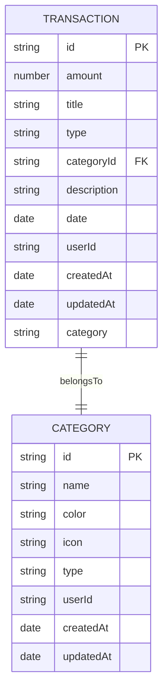
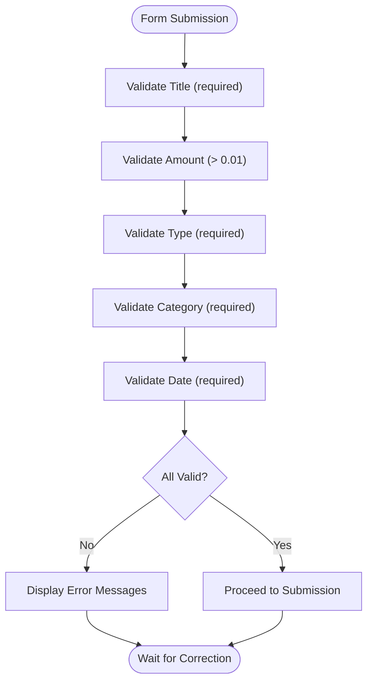
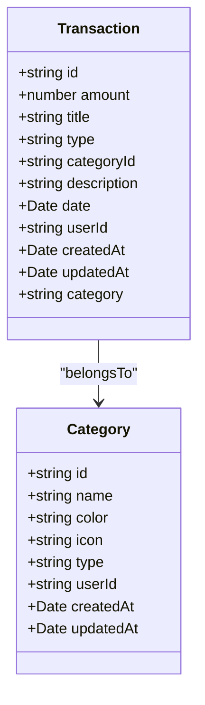
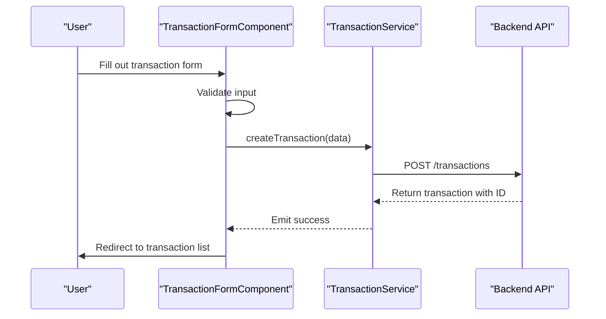

# Transaction Model

<cite>
**Referenced Files in This Document**   
- [transaction.model.ts](file://src/app/shared/models/transaction.model.ts)
- [category.model.ts](file://src/app/shared/models/category.model.ts)
- [transaction-form.component.ts](file://src/app/transactions/transaction-form/transaction-form.component.ts)
- [transaction.service.ts](file://src/app/shared/services/transaction.service.ts)
- [transaction-list.component.ts](file://src/app/transactions/transaction-list/transaction-list.component.ts)
- [category.service.ts](file://src/app/shared/services/category.service.ts)
</cite>

## Table of Contents
1. [Introduction](#introduction)
2. [Transaction Model Structure](#transaction-model-structure)
3. [Field Definitions and Significance](#field-definitions-and-significance)
4. [Validation Rules](#validation-rules)
5. [Relationship with Category Model](#relationship-with-category-model)
6. [Transaction Lifecycle Operations](#transaction-lifecycle-operations)
7. [Data Filtering and Indexing Strategies](#data-filtering-and-indexing-strategies)
8. [Performance Considerations](#performance-considerations)
9. [Conclusion](#conclusion)

## Introduction
The Transaction model serves as a core financial tracking entity in the application, capturing essential details about income and expense records. It enables users to monitor their financial activities with precision, supporting features such as categorization, date-based filtering, and type-specific analysis. This document provides a comprehensive overview of the model's structure, validation logic, relationships, and operational workflows.

**Section sources**
- [transaction.model.ts](file://src/app/shared/models/transaction.model.ts)

## Transaction Model Structure
The Transaction interface defines a structured schema for financial entries, ensuring consistency across the application. Each transaction record includes both user-facing and system-managed properties, facilitating accurate data representation and auditability.

**Diagram sources**
- [transaction.model.ts](file://src/app/shared/models/transaction.model.ts#L1-L12)
- [category.model.ts](file://src/app/shared/models/category.model.ts#L1-L9)

**Section sources**
- [transaction.model.ts](file://src/app/shared/models/transaction.model.ts#L1-L12)

## Field Definitions and Significance
Each field in the Transaction model plays a critical role in financial tracking and reporting:

- **id**: Unique identifier for the transaction, ensuring referential integrity across the system.
- **amount**: Numeric value representing the monetary amount, stored as a floating-point number to support fractional currency units.
- **title**: Brief label for the transaction, used in summaries and lists for quick identification.
- **type**: Enumerated value (`income` | `expense`) that determines the financial impact and visual treatment (e.g., green for income, red for expense).
- **categoryId**: Foreign key linking to the Category model, enabling grouped analysis and budgeting.
- **description**: Optional detailed note about the transaction, providing context beyond the title.
- **date**: Date object indicating when the transaction occurred, crucial for time-based reporting and filtering.
- **userId**: Identifier linking the transaction to a specific user account, supporting multi-user environments.
- **createdAt**, **updatedAt**: Timestamps for creation and modification events, aiding in audit trails and synchronization.
- **category**: Optional populated field containing the category name, derived during data loading for display purposes.

Monetary values are handled with standard JavaScript number precision, relying on backend enforcement for decimal accuracy. Dates are stored as ISO Date objects and formatted using browser-native methods for consistent rendering.

**Section sources**
- [transaction.model.ts](file://src/app/shared/models/transaction.model.ts#L1-L12)

## Validation Rules
The application enforces strict validation rules to maintain data integrity:

- **Amount**: Must be a positive number, with a minimum value of 0.01 enforced via `Validators.min(0.01)` in the form control.
- **Title**: Required field; cannot be empty or whitespace-only.
- **Type**: Required field with predefined options (`income`, `expense`), selected via dropdown.
- **Category**: Required association; users must select a valid category from their available list.
- **Date**: Required field, defaulting to the current date but allowing manual selection.

These validations are implemented at both the form level (using Angular Reactive Forms) and service layer, ensuring consistency whether data is entered through UI or API.

**Diagram sources**
- [transaction-form.component.ts](file://src/app/transactions/transaction-form/transaction-form.component.ts#L25-L35)

**Section sources**
- [transaction-form.component.ts](file://src/app/transactions/transaction-form/transaction-form.component.ts#L25-L35)

## Relationship with Category Model
The Transaction model maintains a one-to-many relationship with the Category model, where each transaction belongs to exactly one category, and each category can have multiple transactions. This relationship ensures that:

- Transactions inherit the **type** (income/expense) from their associated category, maintaining consistency in financial classification.
- Categories are filtered by user context, ensuring users only see their own categories.
- The category name is dynamically populated during transaction loading for display purposes.

When a transaction is created or edited, the selected category's type must match the transaction's type. This constraint is enforced at the UI level by filtering category options based on the selected transaction type.

**Diagram sources**
- [transaction.model.ts](file://src/app/shared/models/transaction.model.ts#L1-L12)
- [category.model.ts](file://src/app/shared/models/category.model.ts#L1-L9)
- [transaction.service.ts](file://src/app/shared/services/transaction.service.ts#L10-L128)
- [category.service.ts](file://src/app/shared/services/category.service.ts#L10-L94)

**Section sources**
- [transaction.service.ts](file://src/app/shared/services/transaction.service.ts#L10-L128)
- [category.service.ts](file://src/app/shared/services/category.service.ts#L10-L94)

## Transaction Lifecycle Operations
The application supports full CRUD operations for transactions through dedicated services and components.

### Creation
Transactions are created via the `TransactionFormComponent`, which binds user input to a reactive form. Upon submission:
1. Form data is validated.
2. A transaction object is constructed with proper date formatting.
3. The `TransactionService.createTransaction()` method is called.
4. On success, the user is redirected to the transaction list.

### Editing
Editing follows a similar flow:
1. The transaction ID is retrieved from the route.
2. The existing transaction is loaded via `getTransaction()`.
3. Form fields are pre-filled using `patchValue()`.
4. Updates are sent via `updateTransaction()`.

### Serialization
Data is serialized for API communication:
- Dates are converted to ISO strings.
- Amounts are sent as raw numbers.
- Metadata (createdAt, updatedAt) is managed server-side.

**Diagram sources**
- [transaction-form.component.ts](file://src/app/transactions/transaction-form/transaction-form.component.ts#L70-L94)
- [transaction.service.ts](file://src/app/shared/services/transaction.service.ts#L55-L85)

**Section sources**
- [transaction-form.component.ts](file://src/app/transactions/transaction-form/transaction-form.component.ts#L70-L94)
- [transaction.service.ts](file://src/app/shared/services/transaction.service.ts#L55-L85)

## Data Filtering and Indexing Strategies
The `TransactionListComponent` implements client-side filtering and sorting to enhance usability:

- **Search**: Filters by title or description using case-insensitive matching.
- **Category Filter**: Limits results to selected category.
- **Type Filter**: Shows only income or expense transactions.
- **Date Range**: Supports from/to date filtering.
- **Sorting**: Available by date, amount, title, or type, with ascending/descending toggle.

For large datasets, server-side pagination and indexing would be recommended. Currently, all transactions are loaded into memory, with filtering applied in real-time using JavaScript array methods.

**Section sources**
- [transaction-list.component.ts](file://src/app/transactions/transaction-list/transaction-list.component.ts#L100-L300)

## Performance Considerations
While the current implementation performs well for moderate transaction volumes, performance optimizations should be considered for large datasets:

- **Indexing**: Database indexes on `userId`, `date`, and `categoryId` would accelerate query performance.
- **Pagination**: Implementing offset/limit or cursor-based pagination would reduce initial load time.
- **Virtual Scrolling**: For long lists, virtual scrolling could improve rendering performance.
- **Caching**: Memoizing filtered/sorted results could reduce redundant computations.
- **Debounced Filtering**: Applying debounce to search inputs would prevent excessive reprocessing.

The service layer already includes error fallbacks (e.g., mock data when API is unavailable), demonstrating resilience in uncertain network conditions.

**Section sources**
- [transaction-list.component.ts](file://src/app/transactions/transaction-list/transaction-list.component.ts#L100-L300)
- [transaction.service.ts](file://src/app/shared/services/transaction.service.ts#L10-L128)

## Conclusion
The Transaction model forms the backbone of the financial tracking system, providing a robust and extensible structure for recording income and expenses. Its integration with the Category model ensures consistent classification, while comprehensive validation and user-friendly interfaces promote data accuracy. Future enhancements could include server-side filtering, improved currency handling, and enhanced performance optimizations for large datasets.