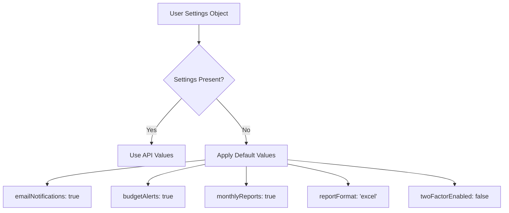
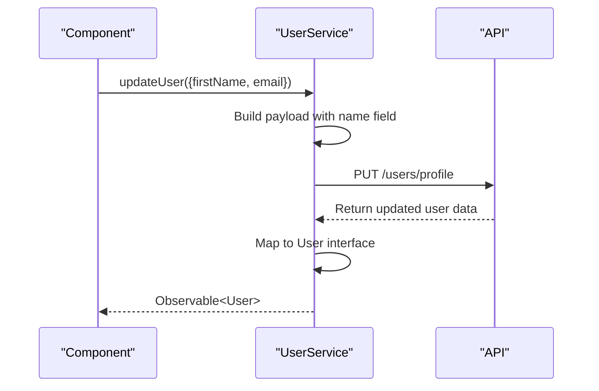
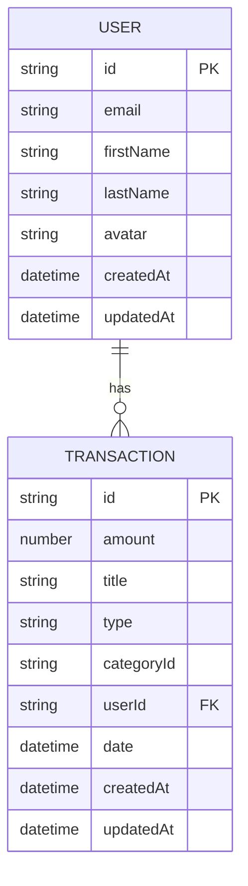

# User Model

<cite>
**Referenced Files in This Document**   
- [user.model.ts](file://src/app/shared/models/user.model.ts)
- [user.service.ts](file://src/app/shared/services/user.service.ts)
- [auth.service.ts](file://src/app/auth/auth.service.ts)
- [profile-view.component.ts](file://src/app/profile/profile-view/profile-view.component.ts)
- [transaction.model.ts](file://src/app/shared/models/transaction.model.ts)
</cite>

## Table of Contents
1. [Introduction](#introduction)
2. [User Model Properties](#user-model-properties)
3. [User Interface and Type Safety](#user-interface-and-type-safety)
4. [Validation Rules and Required Fields](#validation-rules-and-required-fields)
5. [Default Values and Security Settings](#default-values-and-security-settings)
6. [User Model Instantiation and Serialization](#user-model-instantiation-and-serialization)
7. [Relationship with Other Models](#relationship-with-other-models)
8. [Extending the User Model](#extending-the-user-model)
9. [Conclusion](#conclusion)

## Introduction
The User model serves as the central data structure for representing authenticated users within the application. It encapsulates personal information, security settings, and user preferences while ensuring type safety and consistency across authentication, profile management, and API interactions. This document provides a comprehensive overview of the User model's structure, behavior, and integration points.

**Section sources**
- [user.model.ts](file://src/app/shared/models/user.model.ts#L1-L15)

## User Model Properties
The User interface defines the following properties:

- **id**: Unique identifier for the user (string)
- **email**: User's email address, used for login and communication (string)
- **firstName**: User's first name (string)
- **lastName**: User's last name (string)
- **avatar**: Optional URL to the user's profile picture (string | undefined)
- **settings**: Optional nested object containing user preferences and security configurations
- **createdAt**: Timestamp of account creation (Date)
- **updatedAt**: Timestamp of last update (Date)

The model separates `firstName` and `lastName` rather than using a single `name` field, enabling flexible display formatting and personalization throughout the UI.

**Section sources**
- [user.model.ts](file://src/app/shared/models/user.model.ts#L1-L15)

## User Interface and Type Safety
The User interface enforces type safety across key application domains:

- **Authentication**: The `AuthService` uses the User interface to store and retrieve the current session, ensuring consistent data shape during login and signup flows.
- **Profile Management**: Profile components rely on the User interface to validate and update user data, preventing type mismatches.
- **API Interactions**: Service methods return strongly-typed User objects, enabling compile-time checking and reducing runtime errors.

This consistent typing ensures that components consuming user data can safely access properties without additional validation.

**Section sources**
- [user.model.ts](file://src/app/shared/models/user.model.ts#L1-L15)
- [auth.service.ts](file://src/app/auth/auth.service.ts#L10-L30)
- [user.service.ts](file://src/app/shared/services/user.service.ts#L8-L10)

## Validation Rules and Required Fields
The application enforces the following validation rules:

- **Email**: Must be a valid email format, verified during both login and signup operations.
- **Required Fields**: `id`, `email`, `firstName`, `lastName`, `createdAt`, and `updatedAt` are mandatory.
- **Name Validation**: Full name must contain at least one character when split into first and last names.
- **Password**: Minimum 8 characters required when changing passwords.

These rules are enforced both client-side in forms and server-side during API processing.

**Section sources**
- [auth.service.ts](file://src/app/auth/auth.service.ts#L34-L81)
- [profile-view.component.ts](file://src/app/profile/profile-view/profile-view.component.ts#L213-L236)

## Default Values and Security Settings
The User model includes default values for optional settings:

- **emailNotifications**: `true`
- **budgetAlerts**: `true`
- **monthlyReports**: `true`
- **reportFormat**: `'excel'`
- **twoFactorEnabled**: `false`

The `twoFactorEnabled` flag controls access to two-factor authentication features, with the default disabled for new users. These defaults are applied when user settings are absent in the API response.

**Diagram sources**
- [user.service.ts](file://src/app/shared/services/user.service.ts#L15-L30)
- [user.service.ts](file://src/app/shared/services/user.service.ts#L45-L64)

## User Model Instantiation and Serialization
The User model is instantiated from API responses in two primary services:

- **AuthService**: Maps login/signup responses to User objects, extracting `firstName` and `lastName` from the full name.
- **UserService**: Transforms API profile data into User instances, handling name splitting and default value assignment.

During updates, the `updateUser` method serializes partial User data into a payload format expected by the backend, combining `firstName` and `lastName` into a single `name` field.

**Diagram sources**
- [user.service.ts](file://src/app/shared/services/user.service.ts#L32-L64)
- [auth.service.ts](file://src/app/auth/auth.service.ts#L10-L30)

## Relationship with Other Models
The User model maintains ownership relationships with other core entities:

- **Transactions**: Each Transaction includes a `userId` field linking to the User, enabling data filtering and aggregation.
- **Budgets**: Budget data is scoped to the user, though not explicitly shown in the current model.

The application leverages these relationships to calculate user-specific metrics such as total savings, transaction counts, and category usage.

**Diagram sources**
- [user.model.ts](file://src/app/shared/models/user.model.ts#L1-L15)
- [transaction.model.ts](file://src/app/shared/models/transaction.model.ts#L1-L12)

## Extending the User Model
To extend the User model with additional profile fields:

1. Add new properties to the User interface in `user.model.ts`
2. Update the mapping logic in `UserService` to handle new fields
3. Ensure backward compatibility by making new properties optional
4. Update form components to include new fields

When adding sensitive fields, ensure proper security review and validation. The current implementation pattern supports extension while maintaining type safety and default value handling.

**Section sources**
- [user.model.ts](file://src/app/shared/models/user.model.ts#L1-L15)
- [user.service.ts](file://src/app/shared/services/user.service.ts#L15-L64)

## Conclusion
The User model provides a robust foundation for user data management, balancing type safety with flexibility. Its design supports secure authentication, personalized experiences, and extensibility for future requirements. By adhering to consistent patterns for instantiation, validation, and relationship management, the model ensures reliability across the application.