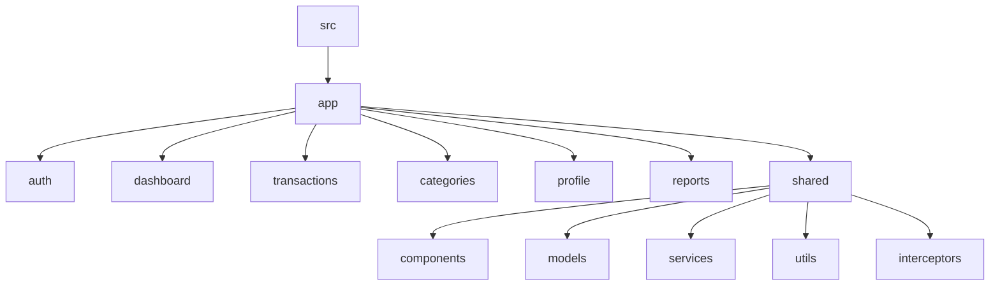

# Getting Started

<cite>
**Referenced Files in This Document**   
- [package.json](file://package.json)
- [constants.ts](file://src/app/shared/utils/constants.ts)
- [auth.service.ts](file://src/app/auth/auth.service.ts)
- [api.service.ts](file://src/app/shared/services/api.service.ts)
- [README.md](file://README.md)
</cite>

## Table of Contents
1. [Introduction](#introduction)
2. [Prerequisites](#prerequisites)
3. [Repository Setup](#repository-setup)
4. [Dependency Installation](#dependency-installation)
5. [Environment Configuration](#environment-configuration)
6. [Running the Application](#running-the-application)
7. [OAuth Provider Setup](#oauth-provider-setup)
8. [Project Structure Overview](#project-structure-overview)
9. [Troubleshooting Common Issues](#troubleshooting-common-issues)

## Introduction
This guide provides a comprehensive walkthrough for setting up the Angular-Tailwind application development environment. It covers installation of prerequisites, repository cloning, dependency management, environment configuration, and execution commands for both development and production builds. Additionally, it includes guidance on OAuth integration and troubleshooting common setup issues.

**Section sources**
- [README.md](file://README.md#L1-L10)

## Prerequisites
Before setting up the project, ensure the following tools are installed on your system:

- **Node.js**: Version 18.x or higher (LTS recommended)
- **npm**: Version 9 or higher (typically included with Node.js)
- **Angular CLI**: Version 19.2.16 (installed globally)

To verify your installations:
```bash
node --version
npm --version
ng version
```

If Angular CLI is not installed globally, install it using:
```bash
npm install -g @angular/cli
```

**Section sources**
- [package.json](file://package.json#L1-L10)

## Repository Setup
Clone the repository to your local machine using Git:

```bash
git clone https://github.com/your-organization/angular-tailwind-app.git
cd angular-tailwind-app
```

Ensure you have the correct repository URL and appropriate access permissions if it's a private repository.

## Dependency Installation
Install all project dependencies using npm:

```bash
npm install
```

In case of dependency conflicts or peer dependency issues, use the force install script defined in the package.json:

```bash
npm run install-force
```

This command executes `npm install --force`, which overrides peer dependency conflicts that may occur during installation.

**Section sources**
- [package.json](file://package.json#L5-L10)

## Environment Configuration
The application's API endpoint is configured in the constants file. The base URL is set to the production backend by default:

```typescript
export const API_CONFIG = {
  BASE_URL: 'https://balancio-backend.vercel.app/api',
  // Alternative for local development:
  // BASE_URL: 'http://localhost:3000/api',
}
```

To configure for local backend development, uncomment the localhost URL and comment out the production URL. This change directs all API calls to your local server instance.

**Section sources**
- [constants.ts](file://src/app/shared/utils/constants.ts#L10-L20)

## Running the Application
### Development Mode
Start the development server using the Angular CLI:

```bash
ng serve
```

Alternatively, use the npm script:
```bash
npm start
```

The application will be available at `http://localhost:4200`. The development server supports hot module replacement (HMR), automatically reloading the browser when source files are modified.

### Production Build
Generate a production-optimized build using:

```bash
ng build
```

Or use the npm script:
```bash
npm run build
```

This command creates optimized assets in the `dist/` directory with minification, tree-shaking, and Ahead-of-Time (AOT) compilation enabled.

**Section sources**
- [package.json](file://package.json#L6-L8)
- [README.md](file://README.md#L12-L20)

## OAuth Provider Setup
The application supports OAuth authentication with Google and GitHub. Configuration is handled through the AuthService and ApiService.

The endpoints for OAuth are defined in the constants:
```typescript
AUTH: {
  GOOGLE: 'auth/google',
  GITHUB: 'auth/github'
}
```

The AuthService provides methods for OAuth login:
```typescript
loginWithGoogle(): Observable<{ success: boolean; user?: User; message?: string }>
loginWithGitHub(): Observable<{ success: boolean; user?: User; message?: string }>
```

No additional client-side configuration is required for OAuth providers. The authentication flow opens a popup window to the backend authentication endpoint, which handles the OAuth provider integration.

**Section sources**
- [constants.ts](file://src/app/shared/utils/constants.ts#L25-L30)
- [auth.service.ts](file://src/app/auth/auth.service.ts#L90-L115)

## Project Structure Overview
The application follows a feature-based modular structure with the following key directories:



**Diagram sources**
- [src](file://src)
- [app](file://src/app)

### Core Modules
- **auth**: Authentication components and services
- **dashboard**: Main dashboard with financial visualization components
- **transactions**: Transaction management forms and lists
- **categories**: Category management for transactions
- **profile**: User profile viewing and editing
- **shared**: Reusable components, services, models, and utilities

### Shared Components
The shared module contains:
- **components**: Reusable UI components (navbar, sidebar, modals)
- **models**: TypeScript interfaces for data structures
- **services**: Core services (API, authentication, notifications)
- **utils**: Constants and helper functions
- **interceptors**: HTTP interceptors for request/response handling

**Section sources**
- [src](file://src)
- [app](file://src/app)

## Troubleshooting Common Issues
### Port Conflicts
If port 4200 is already in use, specify an alternative port:
```bash
ng serve --port 4201
```

### Missing Dependencies
If npm install fails due to peer dependency conflicts:
```bash
npm run install-force
```

Clear npm cache if issues persist:
```bash
npm cache clean --force
rm -rf node_modules package-lock.json
npm install
```

### CORS Errors
CORS configuration must be handled on the backend server. For local development, ensure your backend:
- Allows origin `http://localhost:4200`
- Supports credentials if authentication is required
- Exposes necessary headers

### Authentication Issues
If OAuth popups are blocked:
- Ensure popup blockers are disabled for the site
- Verify the backend authentication endpoints are accessible
- Check browser console for security warnings

### Build Errors
For production build issues:
- Verify TypeScript version compatibility (5.7.2 required)
- Check for deprecated API usage
- Ensure all environment variables are properly configured

**Section sources**
- [package.json](file://package.json)
- [api.service.ts](file://src/app/shared/services/api.service.ts)
- [auth.service.ts](file://src/app/auth/auth.service.ts)