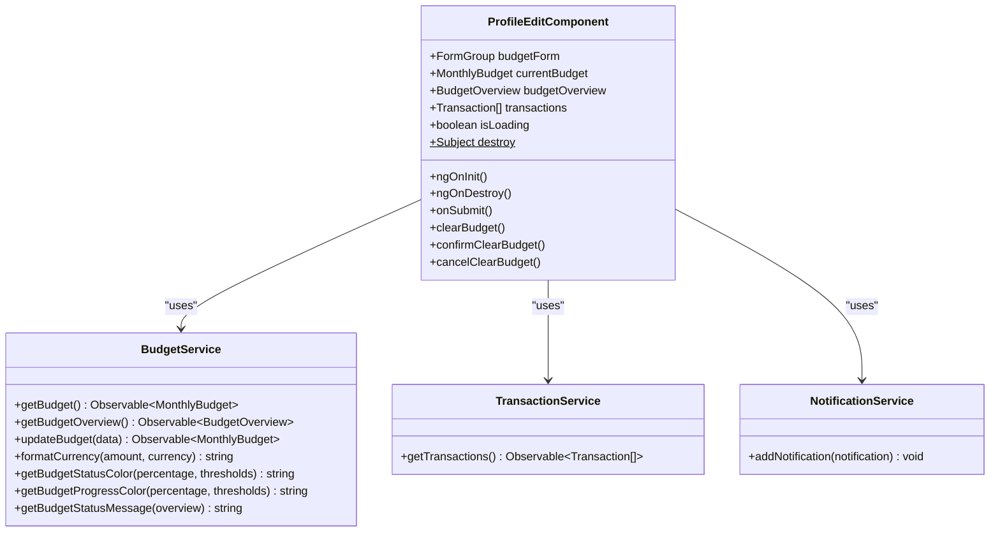
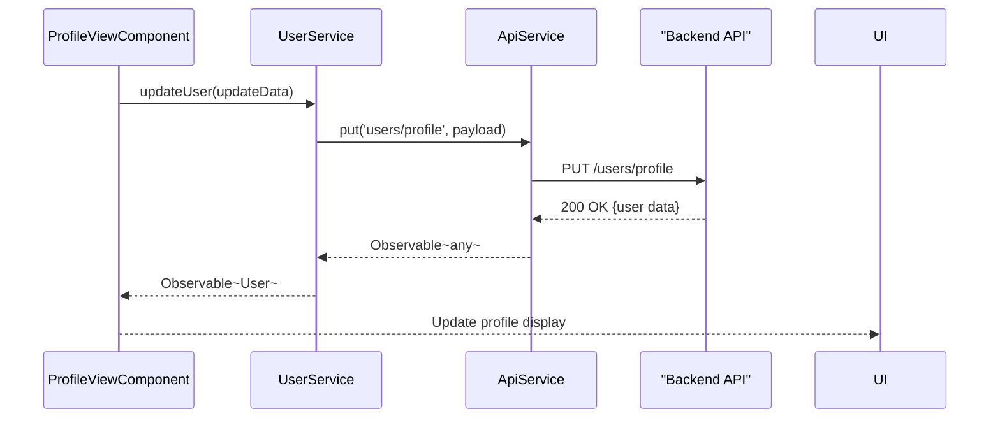

# Profile Edit

<cite>
**Referenced Files in This Document**   
- [profile-edit.component.ts](file://src/app/profile/profile-edit/profile-edit.component.ts)
- [user.service.ts](file://src/app/shared/services/user.service.ts)
- [user.model.ts](file://src/app/shared/models/user.model.ts)
- [api.service.ts](file://src/app/shared/services/api.service.ts)
- [notification.service.ts](file://src/app/shared/services/notification.service.ts)
- [profile-view.component.ts](file://src/app/profile/profile-view/profile-view.component.ts)
</cite>

## Table of Contents
1. [Introduction](#introduction)
2. [Core Components](#core-components)
3. [Reactive Form Implementation](#reactive-form-implementation)
4. [Form Validation Rules](#form-validation-rules)
5. [User Input Handling](#user-input-handling)
6. [UserService Integration](#userservice-integration)
7. [Password Change Workflow](#password-change-workflow)
8. [Two-Factor Authentication Setup](#two-factor-authentication-setup)
9. [Error Handling](#error-handling)
10. [Form Submission and Feedback](#form-submission-and-feedback)
11. [Responsive Form Layout](#responsive-form-layout)
12. [Security Practices](#security-practices)

## Introduction
The ProfileEditComponent enables users to manage their monthly budget settings with a reactive form interface. While the component is named for profile editing, its current implementation focuses on budget management functionality, including setting monthly budgets, configuring alert thresholds, and viewing budget status. The component integrates with various services to load and update budget data, handle user interactions, and provide feedback through notifications.

**Section sources**
- [profile-edit.component.ts](file://src/app/profile/profile-edit/profile-edit.component.ts#L1-L514)

## Core Components
The ProfileEditComponent is built as a standalone Angular component with reactive forms support. It manages budget data through a FormGroup and interacts with BudgetService, TransactionService, and NotificationService. The component displays budget status with visual indicators, progress bars, and statistical information. It also implements confirmation modal functionality for clearing budgets and provides real-time validation feedback.

**Section sources**
- [profile-edit.component.ts](file://src/app/profile/profile-edit/profile-edit.component.ts#L1-L514)

## Reactive Form Implementation
The component implements a reactive form using Angular's FormBuilder to create a FormGroup with budget-related controls. The form includes fields for budget amount, currency selection, and alert thresholds for warning and critical levels. The form is initialized with default values and updated with existing budget data when available. Form submission triggers budget updates through the BudgetService, with loading states managed through the isLoading flag.

**Diagram sources**
- [profile-edit.component.ts](file://src/app/profile/profile-edit/profile-edit.component.ts#L1-L514)
- [profile-edit.component.ts](file://src/app/profile/profile-edit/profile-edit.component.ts#L1-L514)

**Section sources**
- [profile-edit.component.ts](file://src/app/profile/profile-edit/profile-edit.component.ts#L1-L514)

## Form Validation Rules
The component implements comprehensive validation for budget settings. The amount field requires a value greater than zero, while threshold fields must be between 0 and 100. Custom validation ensures the warning threshold is less than the critical threshold. The form uses Angular's built-in Validators (required, min, max) and implements additional business logic validation through the validateThresholds method. Validation errors are displayed immediately when fields are touched or when threshold relationships are invalid.

**Section sources**
- [profile-edit.component.ts](file://src/app/profile/profile-edit/profile-edit.component.ts#L1-L514)

## User Input Handling
The component handles user input through reactive form controls with real-time validation feedback. Input fields for budget amount and thresholds provide immediate visual feedback on validity. The currency selection uses a dropdown with multiple currency options. The component subscribes to form value changes to validate threshold relationships dynamically. Form submission is disabled when the form is invalid or during loading states, preventing invalid submissions.

**Section sources**
- [profile-edit.component.ts](file://src/app/profile/profile-edit/profile-edit.component.ts#L1-L514)

## UserService Integration
While the ProfileEditComponent currently focuses on budget management rather than profile editing, the codebase contains related functionality in the ProfileViewComponent that demonstrates UserService integration. The UserService provides methods to retrieve and update user information by transforming API responses into User objects and mapping form data to API payloads. It handles name splitting and joining for firstName/lastName fields and manages user settings including notification preferences and two-factor authentication status.

**Diagram sources**
- [user.service.ts](file://src/app/shared/services/user.service.ts#L1-L65)
- [profile-view.component.ts](file://src/app/profile/profile-view/profile-view.component.ts#L1-L663)

**Section sources**
- [user.service.ts](file://src/app/shared/services/user.service.ts#L1-L65)
- [profile-view.component.ts](file://src/app/profile/profile-view/profile-view.component.ts#L1-L663)

## Password Change Workflow
The password change workflow is implemented in the ProfileViewComponent rather than the ProfileEditComponent. Users can open a password change modal where they must enter their current password, new password, and confirmation. The component validates that the new passwords match and meet minimum length requirements before submission. Upon successful change, the user is automatically logged out and redirected to the login page to use their new credentials.

**Section sources**
- [profile-view.component.ts](file://src/app/profile/profile-view/profile-view.component.ts#L1-L663)

## Two-Factor Authentication Setup
Two-factor authentication management is available through the ProfileViewComponent. Users can toggle two-factor authentication on or off, which updates their settings through the UserService. The component maintains the twoFactorEnabled state and provides visual feedback when the setting is updated. When enabled, this security feature adds an additional verification step during login.

**Section sources**
- [profile-view.component.ts](file://src/app/profile/profile-view/profile-view.component.ts#L1-L663)

## Error Handling
The component implements comprehensive error handling for various scenarios. Network failures are caught in subscription error handlers, with appropriate notifications displayed to users. Form validation errors are shown inline with descriptive messages. Threshold validation prevents invalid configurations. The component uses Angular's takeUntil pattern with the destroy$ subject to prevent memory leaks and ensure subscriptions are cleaned up when the component is destroyed.

**Section sources**
- [profile-edit.component.ts](file://src/app/profile/profile-edit/profile-edit.component.ts#L1-L514)
- [profile-view.component.ts](file://src/app/profile/profile-view/profile-view.component.ts#L1-L663)

## Form Submission and Feedback
Form submission is handled through the onSubmit method, which validates the form and threshold relationships before proceeding. During submission, a loading spinner is displayed and the form is disabled to prevent multiple submissions. Upon successful update, a success notification is shown, and budget data is reloaded. The component provides visual feedback through color-coded status indicators, progress bars, and descriptive messages that change based on budget usage levels.

**Section sources**
- [profile-edit.component.ts](file://src/app/profile/profile-edit/profile-edit.component.ts#L1-L514)

## Responsive Form Layout
The component uses Tailwind CSS for responsive layout design. The form is contained within a max-w-4xl container with responsive padding. Input fields and form controls adapt to different screen sizes using Tailwind's responsive classes. The threshold settings use a grid layout that switches from two columns on medium screens to single column on smaller screens. The overall design follows modern web standards with appropriate spacing, typography, and interactive elements.

**Section sources**
- [profile-edit.component.ts](file://src/app/profile/profile-edit/profile-edit.component.ts#L1-L514)

## Security Practices
The application implements several security practices for sensitive operations. The ApiService automatically includes authentication tokens in requests using Bearer authentication. Sensitive operations like password changes require the current password for verification. The UserService transforms data appropriately between the frontend model and API payload format. Local storage is used for token persistence with appropriate security considerations. The codebase follows Angular's security best practices for data binding and DOM manipulation.

**Section sources**
- [api.service.ts](file://src/app/shared/services/api.service.ts#L1-L94)
- [user.service.ts](file://src/app/shared/services/user.service.ts#L1-L65)
- [profile-view.component.ts](file://src/app/profile/profile-view/profile-view.component.ts#L1-L663)