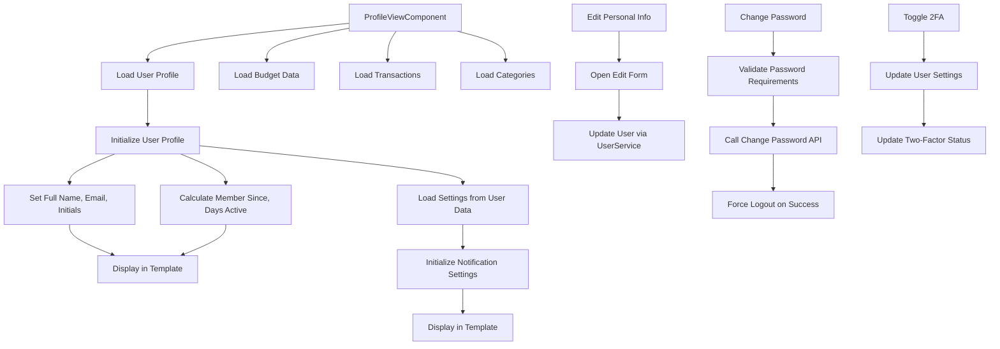
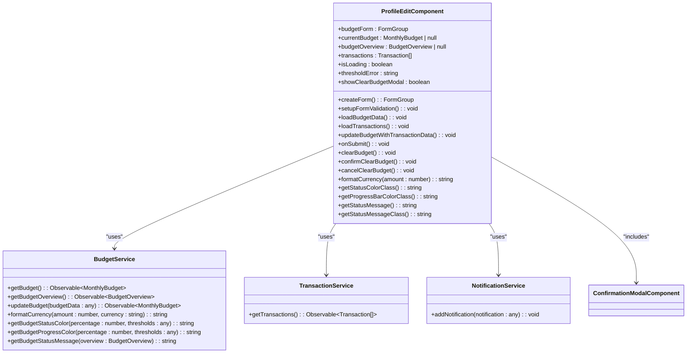
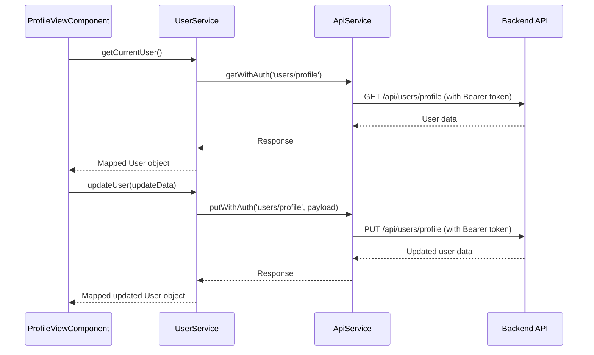
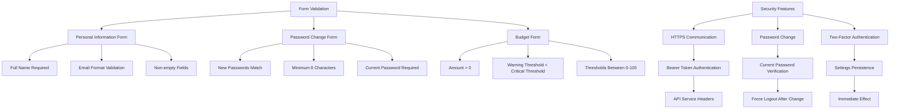
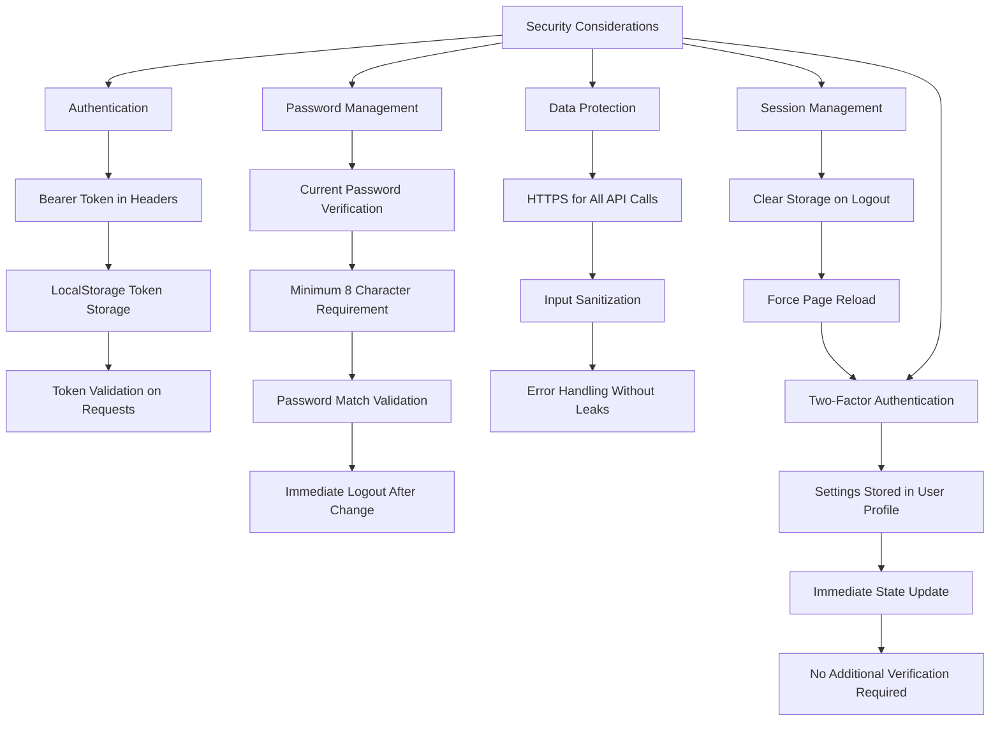
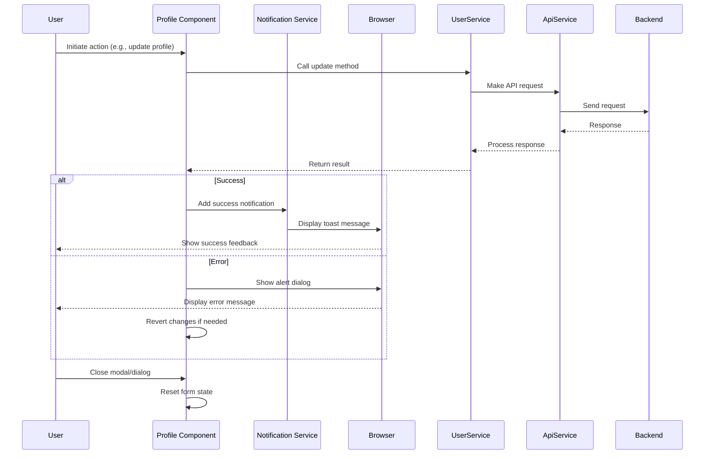
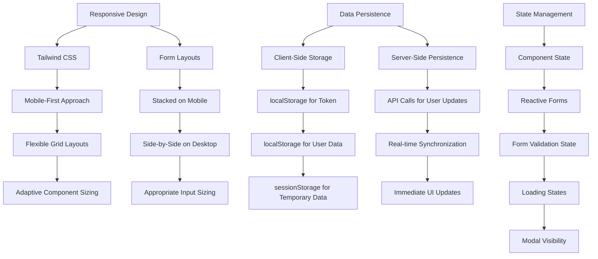

# Profile Management

<cite>
**Referenced Files in This Document**   
- [profile-view.component.ts](file://src/app/profile/profile-view/profile-view.component.ts)
- [profile-edit.component.ts](file://src/app/profile/profile-edit/profile-edit.component.ts)
- [user.service.ts](file://src/app/shared/services/user.service.ts)
- [user.model.ts](file://src/app/shared/models/user.model.ts)
- [auth.service.ts](file://src/app/auth/auth.service.ts)
- [api.service.ts](file://src/app/shared/services/api.service.ts)
- [constants.ts](file://src/app/shared/utils/constants.ts)
</cite>

## Table of Contents
1. [Introduction](#introduction)
2. [ProfileViewComponent](#profileviewcomponent)
3. [ProfileEditComponent](#profileeditcomponent)
4. [UserService Methods](#userservice-methods)
5. [Form Validation and Security Features](#form-validation-and-security-features)
6. [Authentication State Integration](#authentication-state-integration)
7. [Profile Picture Handling](#profile-picture-handling)
8. [Security Considerations](#security-considerations)
9. [Feedback Mechanisms](#feedback-mechanisms)
10. [Responsive Design and Data Persistence](#responsive-design-and-data-persistence)

## Introduction
The profile management system provides users with comprehensive control over their personal information, security settings, and application preferences. This document details the implementation of profile components, user data management services, and associated security features within the Angular application. The system enables users to view and edit personal details, manage security configurations including password changes and two-factor authentication, and configure notification preferences.

## ProfileViewComponent

The ProfileViewComponent serves as the primary interface for users to view their profile information and manage account settings. It displays user details, security configurations, notification preferences, and account actions in a structured layout.



**Diagram sources**
- [profile-view.component.ts](file://src/app/profile/profile-view/profile-view.component.ts#L1-L662)

**Section sources**
- [profile-view.component.ts](file://src/app/profile/profile-view/profile-view.component.ts#L1-L662)

## ProfileEditComponent

The ProfileEditComponent focuses on budget management functionality, allowing users to set, update, and clear their monthly budgets with configurable alert thresholds. The component provides a form-based interface for budget configuration with real-time validation.



**Diagram sources**
- [profile-edit.component.ts](file://src/app/profile/profile-edit/profile-edit.component.ts#L1-L513)

**Section sources**
- [profile-edit.component.ts](file://src/app/profile/profile-edit/profile-edit.component.ts#L1-L513)

## UserService Methods

The UserService provides essential methods for retrieving and updating user data through API calls. It acts as an intermediary between the application components and the backend API, handling data transformation and authentication.



**Diagram sources**
- [user.service.ts](file://src/app/shared/services/user.service.ts#L1-L64)
- [api.service.ts](file://src/app/shared/services/api.service.ts#L1-L93)

**Section sources**
- [user.service.ts](file://src/app/shared/services/user.service.ts#L1-L64)

## Form Validation and Security Features

The profile management system implements comprehensive form validation and security features to ensure data integrity and protect user accounts. These include client-side validation, password strength requirements, and secure API communication.



**Diagram sources**
- [profile-view.component.ts](file://src/app/profile/profile-view/profile-view.component.ts#L1-L662)
- [user.service.ts](file://src/app/shared/services/user.service.ts#L1-L64)
- [api.service.ts](file://src/app/shared/services/api.service.ts#L1-L93)

**Section sources**
- [profile-view.component.ts](file://src/app/profile/profile-view/profile-view.component.ts#L1-L662)

## Authentication State Integration

The profile components integrate with the authentication state to ensure that user data is properly loaded and protected. The system maintains user session information and responds appropriately to authentication changes.

```mermaid
classDiagram
class AuthService {
-currentUser : User | null
+login(email, password) : Observable~{ success : boolean; user? : User; message? : string }~
+signup(userData) : Observable~{ success : boolean; user? : User; message? : string }~
+logout() : void
+isAuthenticated() : boolean
+getCurrentUser() : User | null
+getToken() : string | null
+loginWithGoogle() : Observable~{ success : boolean; user? : User; message? : string }~
+loginWithGitHub() : Observable~{ success : boolean; user? : User; message? : string }~
}
class ProfileViewComponent {
-authService : AuthService
-userService : UserService
-router : Router
+ngOnInit() : void
+signOut() : void
+confirmLogout() : void
}
class ApiService {
-baseUrl : string
+getHeaders() : HttpHeaders
+getAuthHeaders() : HttpHeaders
+getWithAuth<T>(endpoint : string) : Observable<T>
+putWithAuth<T>(endpoint : string) : Observable<T>
}
ProfileViewComponent --> AuthService : "depends on"
ProfileViewComponent --> ApiService : "uses for authenticated calls"
ApiService --> AuthService : "retrieves token"
AuthService --> localStorage : "stores token and user"
```

**Diagram sources**
- [auth.service.ts](file://src/app/auth/auth.service.ts#L1-L120)
- [api.service.ts](file://src/app/shared/services/api.service.ts#L1-L93)
- [profile-view.component.ts](file://src/app/profile/profile-view/profile-view.component.ts#L1-L662)

**Section sources**
- [auth.service.ts](file://src/app/auth/auth.service.ts#L1-L120)

## Profile Picture Handling

The profile management system handles user profile pictures through the User model and UserService. While the current implementation uses placeholder images, the architecture supports custom avatars.

```mermaid
erDiagram
USER {
string id PK
string email UK
string firstName
string lastName
string avatar
object settings
datetime createdAt
datetime updatedAt
}
USER ||--o{ SETTINGS : contains
SETTINGS {
boolean emailNotifications
boolean budgetAlerts
boolean monthlyReports
string reportFormat
boolean twoFactorEnabled
}
note right of USER: Avatar field supports custom image URLs<br/>Defaults to placeholder if not provided
```

**Diagram sources**
- [user.model.ts](file://src/app/shared/models/user.model.ts#L1-L15)
- [user.service.ts](file://src/app/shared/services/user.service.ts#L1-L64)

**Section sources**
- [user.model.ts](file://src/app/shared/models/user.model.ts#L1-L15)

## Security Considerations

The profile management system implements multiple security measures to protect sensitive user operations, including password changes, account deletion, and personal information updates.



**Diagram sources**
- [auth.service.ts](file://src/app/auth/auth.service.ts#L1-L120)
- [api.service.ts](file://src/app/shared/services/api.service.ts#L1-L93)
- [profile-view.component.ts](file://src/app/profile/profile-view/profile-view.component.ts#L1-L662)

**Section sources**
- [auth.service.ts](file://src/app/auth/auth.service.ts#L1-L120)

## Feedback Mechanisms

The system provides comprehensive feedback mechanisms to inform users of operation success or failure, ensuring a clear user experience for all profile management actions.



**Diagram sources**
- [profile-view.component.ts](file://src/app/profile/profile-view/profile-view.component.ts#L1-L662)
- [profile-edit.component.ts](file://src/app/profile/profile-edit/profile-edit.component.ts#L1-L513)
- [notification.service.ts](file://src/app/shared/services/notification.service.ts)

**Section sources**
- [profile-view.component.ts](file://src/app/profile/profile-view/profile-view.component.ts#L1-L662)

## Responsive Design and Data Persistence

The profile management components are designed with responsive layouts and implement proper data persistence patterns to ensure a consistent user experience across devices and sessions.



**Diagram sources**
- [profile-view.component.ts](file://src/app/profile/profile-view/profile-view.component.ts#L1-L662)
- [profile-edit.component.ts](file://src/app/profile/profile-edit/profile-edit.component.ts#L1-L513)
- [auth.service.ts](file://src/app/auth/auth.service.ts#L1-L120)

**Section sources**
- [profile-view.component.ts](file://src/app/profile/profile-view/profile-view.component.ts#L1-L662)
- [profile-edit.component.ts](file://src/app/profile/profile-edit/profile-edit.component.ts#L1-L513)