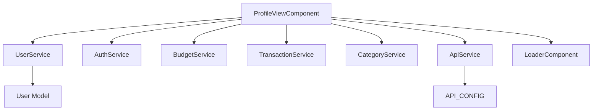
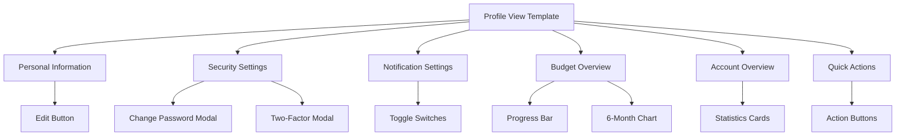
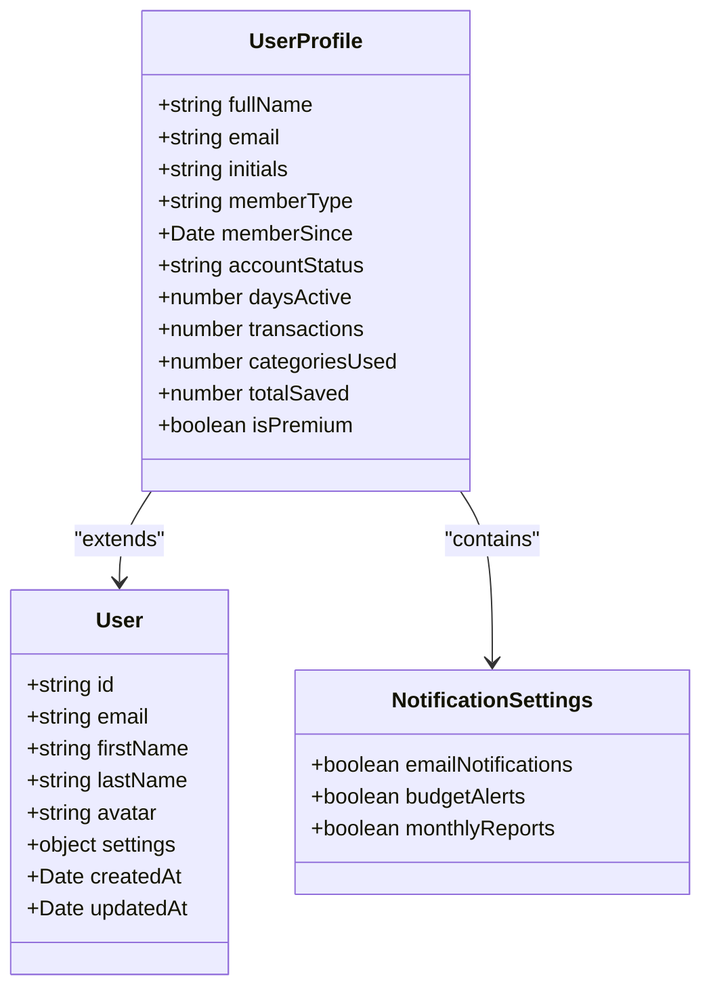
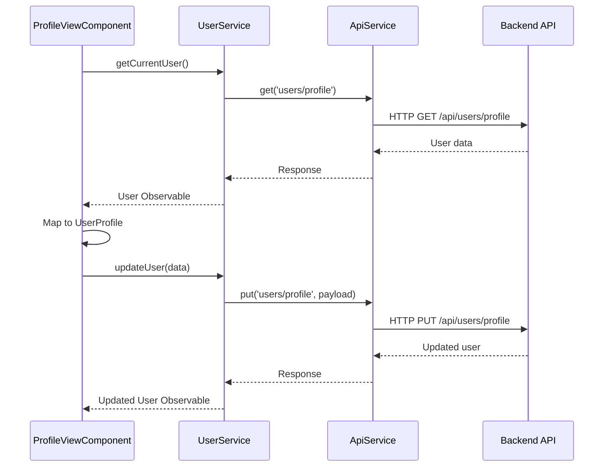
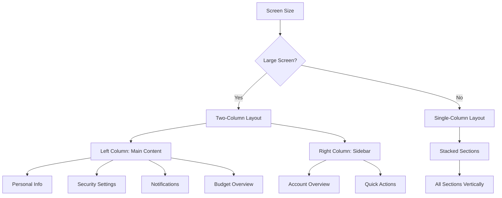
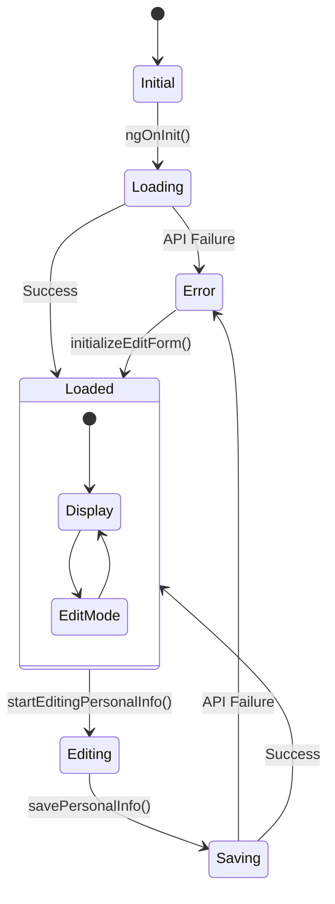
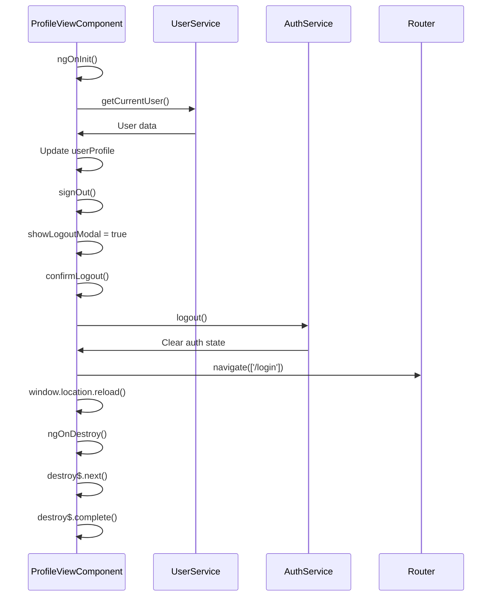
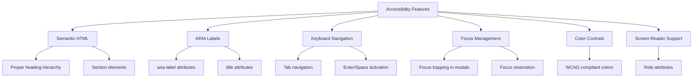
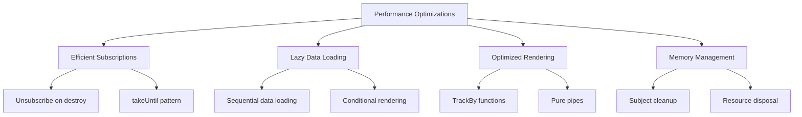

# Profile View

<cite>
**Referenced Files in This Document**   
- [profile-view.component.ts](file://src/app/profile/profile-view/profile-view.component.ts)
- [profile-view.component.html](file://src/app/profile/profile-view/profile-view.component.html)
- [user.model.ts](file://src/app/shared/models/user.model.ts)
- [user.service.ts](file://src/app/shared/services/user.service.ts)
- [api.service.ts](file://src/app/shared/services/api.service.ts)
- [constants.ts](file://src/app/shared/utils/constants.ts)
</cite>

## Table of Contents
1. [Introduction](#introduction)
2. [Component Overview](#component-overview)
3. [Template Structure](#template-structure)
4. [Data Binding and User Model](#data-binding-and-user-model)
5. [User Service Integration](#user-service-integration)
6. [UI Layout and Responsive Design](#ui-layout-and-responsive-design)
7. [Loading and Error States](#loading-and-error-states)
8. [Observables and Authentication State](#observables-and-authentication-state)
9. [Accessibility Features](#accessibility-features)
10. [Performance Optimizations](#performance-optimizations)

## Introduction
The ProfileViewComponent provides a comprehensive interface for users to view and manage their account information within the financial tracking application. This component displays user profile details, security settings, notification preferences, and financial overview data in a structured, user-friendly layout. The component integrates with multiple services to fetch and update user data while maintaining responsiveness and accessibility standards.

## Component Overview
The ProfileViewComponent is implemented as a standalone Angular component that serves as the central hub for user account management. It combines personal information display, security configuration, notification settings, and financial data visualization in a single interface. The component follows Angular's reactive programming model using Observables for data fetching and state management.

**Diagram sources**
- [profile-view.component.ts](file://src/app/profile/profile-view/profile-view.component.ts#L34-L89)
- [user.service.ts](file://src/app/shared/services/user.service.ts#L0-L30)

**Section sources**
- [profile-view.component.ts](file://src/app/profile/profile-view/profile-view.component.ts#L1-L129)

## Template Structure
The component template is organized into a responsive grid layout with two main columns. The left column contains personal information, security settings, notification preferences, and budget overview sections. The right column displays account overview statistics and quick action buttons. The template uses Angular's structural directives for conditional rendering and event binding for user interactions.

**Diagram sources**
- [profile-view.component.html](file://src/app/profile/profile-view/profile-view.component.html#L0-L24)
- [profile-view.component.html](file://src/app/profile/profile-view/profile-view.component.html#L22-L46)

**Section sources**
- [profile-view.component.html](file://src/app/profile/profile-view/profile-view.component.html#L0-L458)

## Data Binding and User Model
The component binds to a UserProfile interface that extends the core User model with additional computed properties for display purposes. Data binding occurs through Angular's property binding and interpolation syntax, connecting component properties to template elements. The UserProfile interface includes derived values such as initials, days active, and formatted dates that are calculated from the base User model.

**Diagram sources**
- [user.model.ts](file://src/app/shared/models/user.model.ts#L0-L15)
- [profile-view.component.ts](file://src/app/profile/profile-view/profile-view.component.ts#L34-L89)

**Section sources**
- [profile-view.component.ts](file://src/app/profile/profile-view/profile-view.component.ts#L54-L89)

## User Service Integration
The ProfileViewComponent integrates with UserService to fetch and update user profile information. The component subscribes to the getCurrentUser() Observable to retrieve user data on initialization and uses updateUser() to persist changes. The service handles the transformation between API response format and the application's User model, including parsing dates and extracting name components from a combined field.

**Diagram sources**
- [user.service.ts](file://src/app/shared/services/user.service.ts#L0-L64)
- [profile-view.component.ts](file://src/app/profile/profile-view/profile-view.component.ts#L126-L168)

**Section sources**
- [user.service.ts](file://src/app/shared/services/user.service.ts#L0-L64)

## UI Layout and Responsive Design
The component implements a responsive design using Tailwind CSS grid and flexbox utilities. On large screens, the layout displays in a two-column format with the main content on the left and supplementary information on the right. On smaller screens, the layout stacks vertically for optimal mobile viewing. The design incorporates consistent spacing, typography, and color schemes aligned with the application's design system.

**Diagram sources**
- [profile-view.component.html](file://src/app/profile/profile-view/profile-view.component.html#L0-L24)
- [profile-view.component.html](file://src/app/profile/profile-view/profile-view.component.html#L22-L46)

**Section sources**
- [profile-view.component.html](file://src/app/profile/profile-view/profile-view.component.html#L0-L458)

## Loading and Error States
The component manages loading states through the isLoading boolean property, which controls the visibility of the LoaderComponent during data retrieval. Error handling is implemented through Observable error callbacks that log errors to the console and provide user feedback through alerts. The component gracefully handles API failures by initializing form data and continuing with partial functionality.

**Diagram sources**
- [profile-view.component.ts](file://src/app/profile/profile-view/profile-view.component.ts#L126-L168)
- [profile-view.component.ts](file://src/app/profile/profile-view/profile-view.component.ts#L170-L211)

**Section sources**
- [profile-view.component.ts](file://src/app/profile/profile-view/profile-view.component.ts#L126-L211)

## Observables and Authentication State
The component subscribes to user data observables and ensures data consistency with the authentication state. It uses the takeUntil operator with a destroy$ Subject to prevent memory leaks by unsubscribing from observables when the component is destroyed. The component coordinates with AuthService to handle logout operations and token management, ensuring that user data remains synchronized with authentication status.

**Diagram sources**
- [profile-view.component.ts](file://src/app/profile/profile-view/profile-view.component.ts#L85-L129)
- [profile-view.component.ts](file://src/app/profile/profile-view/profile-view.component.ts#L126-L168)

**Section sources**
- [profile-view.component.ts](file://src/app/profile/profile-view/profile-view.component.ts#L85-L168)

## Accessibility Features
The component incorporates several accessibility features including proper ARIA labels, keyboard navigation support, and semantic HTML structure. Interactive elements include focus states and are accessible via keyboard. Form controls are properly labeled, and modal dialogs implement focus trapping. The component uses sufficient color contrast and provides text alternatives for visual information.

**Diagram sources**
- [profile-view.component.html](file://src/app/profile/profile-view/profile-view.component.html#L0-L24)
- [profile-view.component.html](file://src/app/profile/profile-view/profile-view.component.html#L22-L46)

**Section sources**
- [profile-view.component.html](file://src/app/profile/profile-view/profile-view.component.html#L0-L458)

## Performance Optimizations
The component implements several performance optimizations including efficient change detection, lazy loading of non-critical data, and optimized rendering of complex visualizations. The use of OnPush change detection strategy could be implemented to minimize unnecessary re-renders. Data transformations are memoized where possible, and expensive operations are debounced or throttled.

**Diagram sources**
- [profile-view.component.ts](file://src/app/profile/profile-view/profile-view.component.ts#L543-L581)
- [profile-view.component.ts](file://src/app/profile/profile-view/profile-view.component.ts#L85-L129)

**Section sources**
- [profile-view.component.ts](file://src/app/profile/profile-view/profile-view.component.ts#L543-L581)