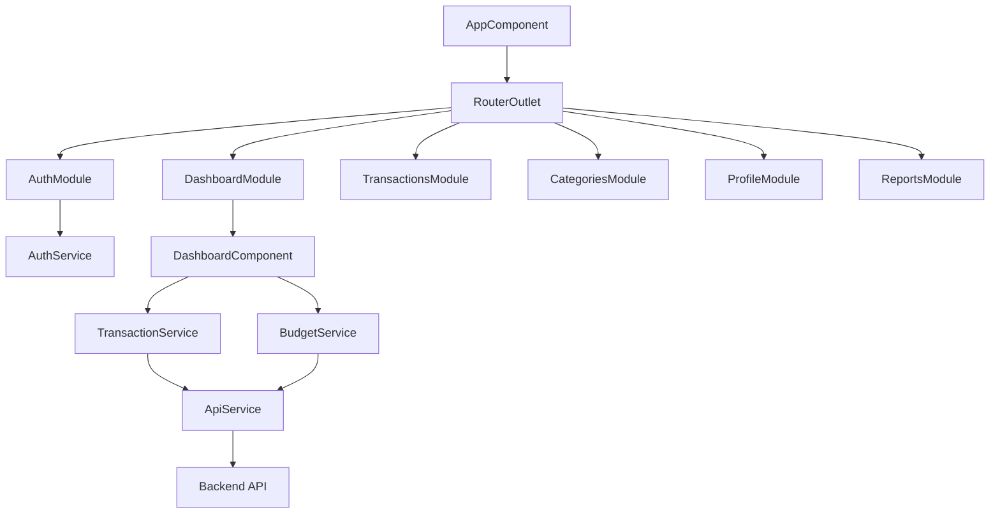
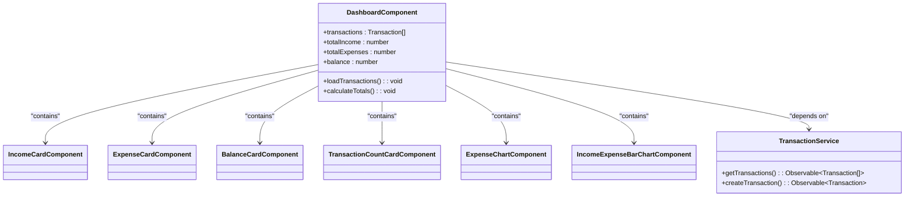
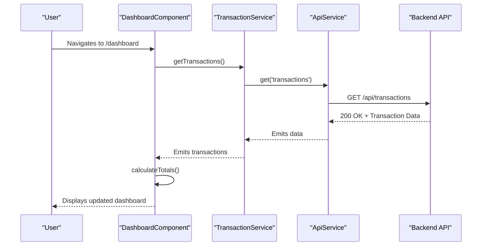
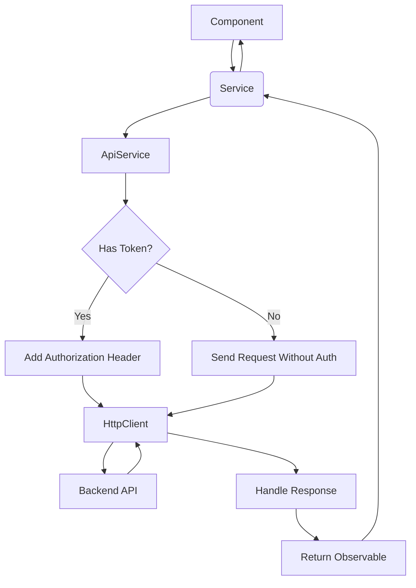

# Project Overview

<cite>
**Referenced Files in This Document**  
- [app.component.ts](file://src/app/app.component.ts)
- [app.routes.ts](file://src/app/app.routes.ts)
- [auth.service.ts](file://src/app/auth/auth.service.ts)
- [api.service.ts](file://src/app/shared/services/api.service.ts)
- [user.model.ts](file://src/app/shared/models/user.model.ts)
- [constants.ts](file://src/app/shared/utils/constants.ts)
- [dashboard.component.ts](file://src/app/dashboard/dashboard.component.ts)
- [transaction.service.ts](file://src/app/shared/services/transaction.service.ts)
</cite>

## Table of Contents
1. [Introduction](#introduction)
2. [Core Functionality](#core-functionality)
3. [Application Architecture](#application-architecture)
4. [Component Hierarchy](#component-hierarchy)
5. [Data Flow and State Management](#data-flow-and-state-management)
6. [User Workflows](#user-workflows)
7. [Service Layer and API Integration](#service-layer-and-api-integration)

## Introduction

The **angular-tailwind-app** is a personal finance tracker application built using **Angular** for the frontend and **Tailwind CSS** for responsive, utility-first styling. The application enables users to manage their financial health through intuitive dashboards, transaction tracking, budget monitoring, and reporting. Designed with a component-based architecture, the app emphasizes modularity, reusability, and a clean separation of concerns.

The primary goal of the application is to provide users with real-time insights into their income, expenses, and overall financial balance. It supports user authentication via email/password and third-party providers (Google, GitHub), ensuring secure access to personal financial data.

**Section sources**  
- [app.component.ts](file://src/app/app.component.ts#L1-L13)
- [app.routes.ts](file://src/app/app.routes.ts#L1-L84)

## Core Functionality

The application delivers a comprehensive suite of financial management features:

- **User Authentication**: Secure login and registration with JWT-based session persistence. Supports OAuth2 via Google and GitHub.
- **Dashboard Visualization**: Real-time financial summaries including income, expenses, balance, and transaction counts. Visualized through interactive charts and cards.
- **Transaction Management**: Users can create, view, edit, and delete income and expense entries. Transactions are categorized and date-stamped.
- **Category Management**: Customizable categories for classifying transactions (e.g., groceries, salary).
- **Budget Tracking**: Monthly budget overview with progress indicators and alerts based on spending patterns.
- **Reporting**: Monthly financial reports with export capabilities in various formats.

These features are accessible through a responsive UI built with Tailwind CSS, ensuring usability across devices.

**Section sources**  
- [dashboard.component.ts](file://src/app/dashboard/dashboard.component.ts#L1-L295)
- [auth.service.ts](file://src/app/auth/auth.service.ts#L1-L120)

## Application Architecture

The application follows a **modular, component-driven architecture** typical of Angular applications. It is structured into feature modules such as `auth`, `dashboard`, `transactions`, `categories`, `profile`, and `reports`, each encapsulating related components, services, and routes.

Key architectural layers include:

- **Component Layer**: UI components responsible for rendering views and handling user interactions.
- **Service Layer**: Reusable services for data fetching, authentication, and business logic.
- **Model Layer**: TypeScript interfaces defining data structures (e.g., `User`, `Transaction`, `Category`).
- **Routing Layer**: Configured using Angular’s `Router` with route guards for authentication control.
- **State Management**: Lightweight state via service-level observables and `localStorage` for session persistence.

The use of **RxJS observables** enables reactive data flow, ensuring that UI components automatically update when underlying data changes.

**Diagram sources**  
- [app.routes.ts](file://src/app/app.routes.ts#L1-L84)
- [dashboard.component.ts](file://src/app/dashboard/dashboard.component.ts#L1-L295)
- [transaction.service.ts](file://src/app/shared/services/transaction.service.ts#L1-L122)

## Component Hierarchy

The UI is organized into nested, reusable components. The root `AppComponent` hosts the `RouterOutlet`, which dynamically loads feature components based on the current route.

The `DashboardComponent` serves as a container for multiple child components that display financial metrics:

- `IncomeCardComponent`: Shows total income
- `ExpenseCardComponent`: Shows total expenses
- `BalanceCardComponent`: Displays net balance
- `TransactionCountCardComponent`: Shows transaction volume
- `ExpenseChartComponent`: Visualizes expense distribution
- `IncomeExpenseBarChartComponent`: Compares income vs. expenses

Shared components such as `Navbar`, `Sidebar`, `Footer`, and `Loader` are reused across views, promoting consistency and reducing duplication.

**Diagram sources**  
- [dashboard.component.ts](file://src/app/dashboard/dashboard.component.ts#L1-L295)
- [transaction.service.ts](file://src/app/shared/services/transaction.service.ts#L1-L122)

## Data Flow and State Management

Data flows **reactively** from backend APIs through services to components using RxJS observables. Components subscribe to service methods to receive data streams, which are automatically updated when new values are emitted.

For example, the `DashboardComponent` calls `TransactionService.getTransactions()`, which returns an `Observable<Transaction[]>`. Upon subscription, the component updates its internal state and recalculates financial totals.

User session state (authentication token and current user) is stored in `localStorage` and managed by `AuthService`. The `AuthGuard` service intercepts route changes to enforce authentication rules, redirecting unauthenticated users to the login page.

**Diagram sources**  
- [dashboard.component.ts](file://src/app/dashboard/dashboard.component.ts#L1-L295)
- [transaction.service.ts](file://src/app/shared/services/transaction.service.ts#L1-L122)
- [api.service.ts](file://src/app/shared/services/api.service.ts#L1-L93)

## User Workflows

### Onboarding
New users begin at the `/login` page. They can either:
- Sign up with email and password
- Log in with existing credentials
- Use Google or GitHub OAuth

Upon successful authentication, users are redirected to the `/dashboard`.

### Daily Usage
Logged-in users interact with:
- **Dashboard**: View financial summaries and add new transactions
- **Transactions**: List, create, edit, and delete entries
- **Categories**: Manage custom categories for classification
- **Reports**: Generate and export monthly financial reports

### Profile Management
Users can:
- View their profile (`/profile`)
- Edit personal information (`/profile/edit`)
- Manage notification and budget alert preferences

All protected routes are guarded by `AuthGuard`, ensuring only authenticated users can access them.

**Section sources**  
- [app.routes.ts](file://src/app/app.routes.ts#L1-L84)
- [auth.service.ts](file://src/app/auth/auth.service.ts#L1-L120)

## Service Layer and API Integration

The `ApiService` abstracts HTTP communication with the backend, providing typed methods for `GET`, `POST`, `PUT`, and `DELETE` operations. It automatically attaches authentication headers when a JWT token is present in `localStorage`.

The `API_CONFIG` constants define base URLs and endpoint paths, enabling environment-specific configurations. Services like `TransactionService`, `CategoryService`, and `BudgetService` depend on `ApiService` to fetch and mutate data.

Error handling is implemented using RxJS `catchError` and `tap` operators, with user-facing notifications provided by `NotificationService`.

**Diagram sources**  
- [api.service.ts](file://src/app/shared/services/api.service.ts#L1-L93)
- [transaction.service.ts](file://src/app/shared/services/transaction.service.ts#L1-L122)
- [constants.ts](file://src/app/shared/utils/constants.ts#L1-L54)