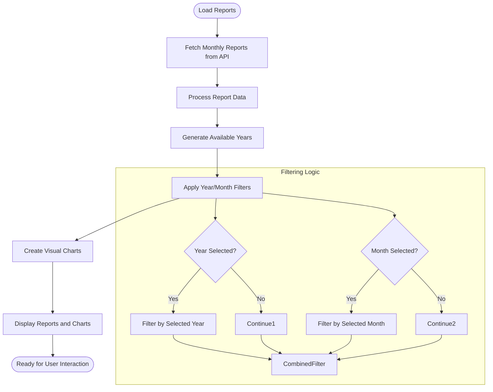
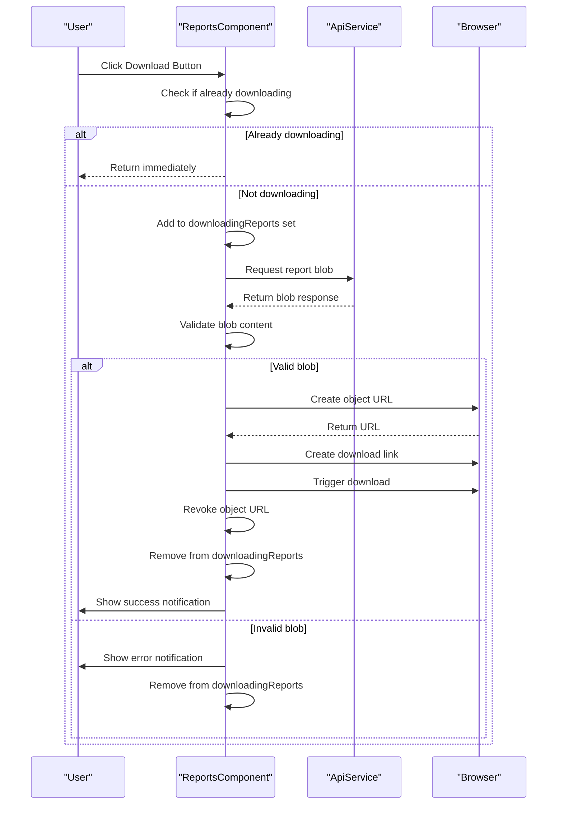
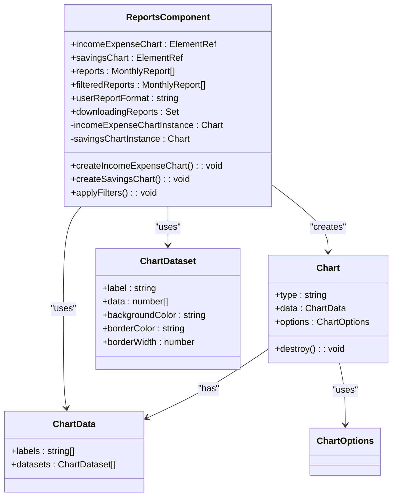
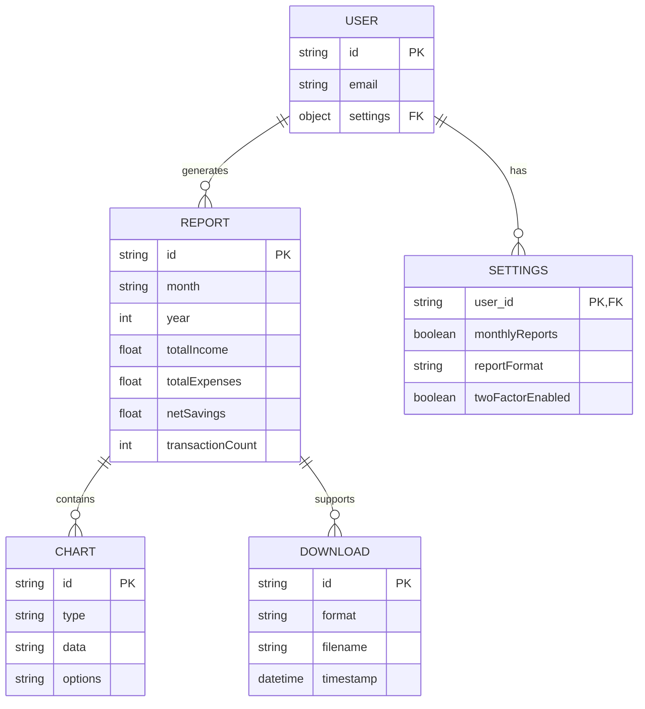

# Reports Generation

<cite>
**Referenced Files in This Document**   
- [reports.component.ts](file://src/app/reports/reports.component.ts)
- [constants.ts](file://src/app/shared/utils/constants.ts)
- [user.model.ts](file://src/app/shared/models/user.model.ts)
- [transaction.model.ts](file://src/app/shared/models/transaction.model.ts)
- [transaction.service.ts](file://src/app/shared/services/transaction.service.ts)
</cite>

## Table of Contents
1. [Introduction](#introduction)
2. [Core Components](#core-components)
3. [Data Processing Logic](#data-processing-logic)
4. [Report Export Functionality](#report-export-functionality)
5. [Chart Integration](#chart-integration)
6. [Performance and Caching Considerations](#performance-and-caching-considerations)
7. [User Customization Options](#user-customization-options)
8. [Error Handling and Notifications](#error-handling-and-notifications)

## Introduction
The Reports Generation feature provides users with comprehensive financial insights by aggregating transaction data into monthly reports. The system enables users to analyze income and expense patterns, visualize financial trends through interactive charts, and export reports in preferred formats. This documentation details the implementation of the ReportsComponent, covering data processing, visualization, export functionality, and user customization options.

## Core Components

The ReportsComponent is the central implementation for generating and displaying financial reports. It handles data retrieval, filtering, visualization, and export operations. The component leverages Angular's lifecycle hooks and ViewChild decorators to manage chart instances and UI interactions.

The MonthlyReport interface defines the structure of report data, including monthly financial metrics such as total income, expenses, net savings, and transaction counts. The component integrates with various services to fetch user settings, retrieve report data, and handle notifications.

**Section sources**
- [reports.component.ts](file://src/app/reports/reports.component.ts#L15-L454)
- [user.model.ts](file://src/app/shared/models/user.model.ts#L0-L15)

## Data Processing Logic

The ReportsComponent processes transaction data by aggregating financial information on a monthly basis. The data processing workflow begins with loading reports from the API endpoint defined in API_CONFIG.ENDPOINTS.REPORTS.MONTHLY. The component then categorizes income and expenses, calculates totals, and identifies top spending categories.

Data filtering is implemented through year and month selection, allowing users to narrow down reports to specific time periods. The filtering logic applies to both the displayed data table and visual charts, ensuring consistency across the interface. When no filters are applied, all available reports are displayed.

The component automatically generates available years from the retrieved report data, creating a dynamic dropdown menu sorted in descending order. This ensures users can easily navigate through historical financial data without manual configuration.

**Diagram sources**
- [reports.component.ts](file://src/app/reports/reports.component.ts#L228-L342)

## Report Export Functionality

The report export functionality allows users to download financial reports in their preferred format. The system supports both PDF and Excel (XLSX) formats, with the default format configurable through user settings. The download process is managed through the downloadReport method, which handles the entire export workflow.

When a user initiates a download, the component first checks if the report is already being downloaded to prevent duplicate requests. It then constructs the appropriate API endpoint using the year and month parameters from the report data. The download uses the getBlobWithResponse method to retrieve the file as a binary object, ensuring proper handling of different file types.

The filename is dynamically generated based on the user's preferred format and the report month, with spaces replaced by hyphens for compatibility. After successful download, the system revokes the object URL to free up memory and provides user feedback through the notification service.

**Diagram sources**
- [reports.component.ts](file://src/app/reports/reports.component.ts#L228-L300)
- [constants.ts](file://src/app/shared/utils/constants.ts#L0-L54)

## Chart Integration

The ReportsComponent integrates with Chart.js to provide visual representations of financial data. Two primary charts are implemented: an income vs. expenses bar chart and a net savings trend line chart. These visualizations help users quickly identify financial patterns and trends over time.

The income vs. expenses chart displays monthly income and expenses as stacked bars, with green bars representing income and red bars representing expenses. The chart is configured with responsive design principles, ensuring proper display across different screen sizes. The y-axis is dynamically scaled based on the maximum values in the dataset, with currency symbols displayed on tick labels.

The net savings trend chart shows the user's net savings over time as a line graph with area fill. This visualization highlights periods of positive and negative savings, helping users identify financial trends. The chart uses a blue color scheme with transparency for the filled area, creating a clean and professional appearance.

Chart instances are properly managed through the component lifecycle, with existing charts being destroyed before creating new ones when filters change. This prevents memory leaks and ensures accurate data representation.

**Diagram sources**
- [reports.component.ts](file://src/app/reports/reports.component.ts#L344-L436)

## Performance and Caching Considerations

The ReportsComponent implements several performance optimizations to ensure smooth operation, especially when handling large datasets. The component uses a loading indicator to provide user feedback during data retrieval operations, improving perceived performance.

To prevent multiple simultaneous downloads of the same report, the component maintains a Set of downloadingReports, using a composite key of year and month number. This prevents duplicate network requests and ensures a smooth user experience when interacting with multiple report downloads.

The chart creation process is optimized by using setTimeout to defer chart rendering after filter changes. This prevents potential timing issues with DOM rendering and ensures that charts are created only after the filtered data is ready. Chart instances are properly destroyed before creating new ones, preventing memory leaks and ensuring accurate data representation.

While the current implementation does not include client-side caching of report data, the component structure allows for easy integration of caching mechanisms. Future enhancements could include localStorage caching of retrieved reports to reduce server load and improve response times for frequently accessed data.

**Section sources**
- [reports.component.ts](file://src/app/reports/reports.component.ts#L199-L454)

## User Customization Options

The ReportsComponent provides several customization options to enhance user experience. Users can filter reports by year and month using dropdown selectors, allowing them to focus on specific time periods of interest. The filtering interface is intuitive, with a clear button to reset filters and view all available reports.

Users can customize their report experience through profile settings, specifically the reportFormat preference. This setting determines the default format for downloaded reports, with options for Excel (XLSX) and PDF formats. The user's preferred format is loaded when the component initializes and is used to determine the file extension for downloaded reports.

The component also respects the user's currency preferences, displaying currency symbols appropriately in both the data table and charts. This ensures that financial data is presented in a familiar format, improving readability and user comprehension.

**Diagram sources**
- [reports.component.ts](file://src/app/reports/reports.component.ts#L199-L226)
- [user.model.ts](file://src/app/shared/models/user.model.ts#L0-L15)

## Error Handling and Notifications

The ReportsComponent implements comprehensive error handling to provide a robust user experience. All API interactions are wrapped in try-catch blocks with appropriate error handling, ensuring that network issues or server errors do not crash the application.

When downloading reports, the component provides specific error messages based on the HTTP status code, helping users understand the nature of the problem. For example, a 404 error indicates no data is available for the selected month, while a 401 error suggests the user needs to log in again. These contextual error messages improve user experience by providing actionable feedback.

The component integrates with the NotificationService to provide visual feedback for both successful operations and errors. Users receive success notifications when reports are downloaded successfully and error notifications when downloads fail. This feedback mechanism keeps users informed about the status of their actions without requiring them to monitor console logs.

The component also handles edge cases such as empty datasets, displaying a user-friendly message when no reports are available. This occurs when the user has not yet added any transactions to the system, guiding them to take the necessary action to generate reports.

**Section sources**
- [reports.component.ts](file://src/app/reports/reports.component.ts#L228-L300)
- [reports.component.ts](file://src/app/reports/reports.component.ts#L127-L149)