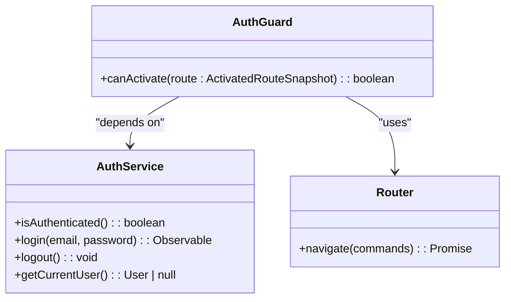
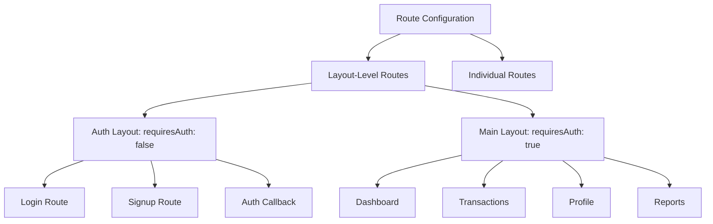
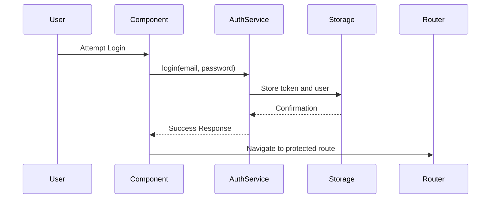
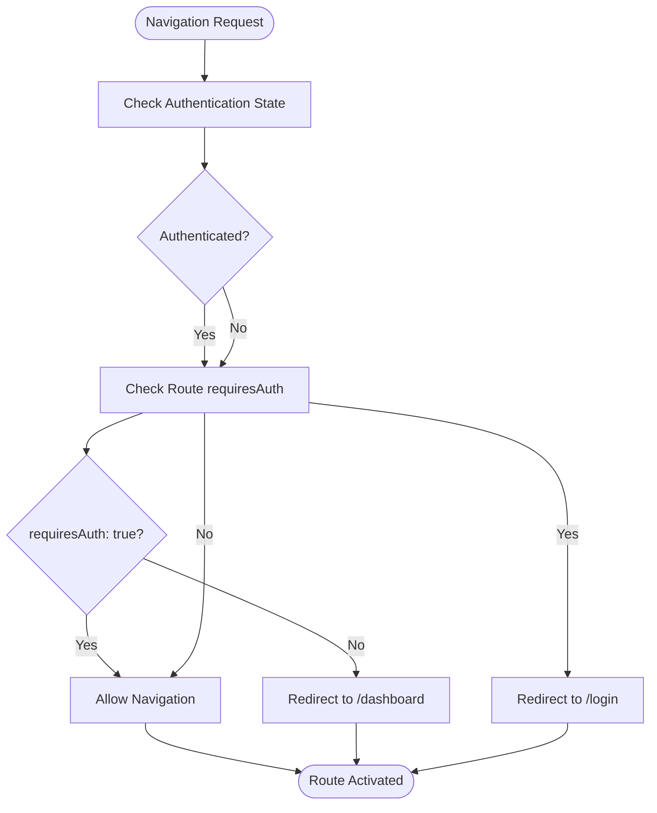

# Navigation Guards

<cite>
**Referenced Files in This Document**   
- [auth.guard.ts](file://src/app/shared/services/auth.guard.ts)
- [auth.service.ts](file://src/app/auth/auth.service.ts)
- [app.routes.ts](file://src/app/app.routes.ts)
- [auth-callback.component.ts](file://src/app/auth/auth-callback/auth-callback.component.ts)
</cite>

## Table of Contents
1. [Introduction](#introduction)
2. [AuthGuard Implementation](#authguard-implementation)
3. [Route Integration and Configuration](#route-integration-and-configuration)
4. [Authentication State Management](#authentication-state-management)
5. [Navigation Flow and Redirect Logic](#navigation-flow-and-redirect-logic)
6. [Extending AuthGuard for Advanced Scenarios](#extending-authguard-for-advanced-scenarios)
7. [Testing and Debugging](#testing-and-debugging)
8. [Common Issues and Solutions](#common-issues-and-solutions)

## Introduction
The Angular Router provides powerful navigation guard mechanisms to control access to routes based on application state. This document details the implementation and integration of the `AuthGuard` service in the Angular-Tailwind application, which protects routes by verifying user authentication status. The guard intercepts navigation requests and determines whether to allow access or redirect users based on their authentication state and route requirements.

**Section sources**
- [auth.guard.ts](file://src/app/shared/services/auth.guard.ts#L1-L30)
- [app.routes.ts](file://src/app/app.routes.ts#L1-L85)

## AuthGuard Implementation

The `AuthGuard` service implements Angular's `CanActivate` interface to control access to routes. It leverages dependency injection to access the `AuthService` for authentication checks and the `Router` for navigation control.

**Diagram sources**
- [auth.guard.ts](file://src/app/shared/services/auth.guard.ts#L1-L30)
- [auth.service.ts](file://src/app/auth/auth.service.ts#L1-L120)

**Section sources**
- [auth.guard.ts](file://src/app/shared/services/auth.guard.ts#L1-L30)

## Route Integration and Configuration

The `AuthGuard` is integrated into the application's routing configuration through the `app.routes.ts` file. It is applied to route objects using the `canActivate` property, which accepts an array of guard services to execute before allowing navigation.

Route-level configuration uses the `data` property to specify whether a route requires authentication (`requiresAuth: true`) or is accessible to unauthenticated users (`requiresAuth: false`). This pattern enables flexible access control across different route groups.

**Diagram sources**
- [app.routes.ts](file://src/app/app.routes.ts#L1-L85)

**Section sources**
- [app.routes.ts](file://src/app/app.routes.ts#L1-L85)

## Authentication State Management

The `AuthService` manages user authentication state using browser localStorage to persist the JWT token and user information. The `isAuthenticated()` method checks for the presence of a token in localStorage and reconstructs the current user object if available.

Authentication state is maintained across page refreshes through localStorage persistence. Third-party authentication methods (Google, GitHub) use popup windows and callback handling to complete the authentication flow and store credentials securely.

**Diagram sources**
- [auth.service.ts](file://src/app/auth/auth.service.ts#L1-L120)
- [auth-callback.component.ts](file://src/app/auth/auth-callback/auth-callback.component.ts#L1-L41)

**Section sources**
- [auth.service.ts](file://src/app/auth/auth.service.ts#L1-L120)

## Navigation Flow and Redirect Logic

The `canActivate` method in `AuthGuard` implements a decision matrix based on the current authentication state and the route's `requiresAuth` data property. This logic prevents unauthorized access to protected routes and redirects authenticated users away from authentication pages.

When an unauthenticated user attempts to access a protected route, they are redirected to the login page. Conversely, authenticated users attempting to access login/signup routes are redirected to the dashboard to prevent unnecessary navigation.

**Diagram sources**
- [auth.guard.ts](file://src/app/shared/services/auth.guard.ts#L1-L30)

**Section sources**
- [auth.guard.ts](file://src/app/shared/services/auth.guard.ts#L1-L30)

## Extending AuthGuard for Advanced Scenarios

The current `AuthGuard` implementation can be extended to support role-based access control (RBAC) by adding role checks to the `canActivate` method. Additional data properties such as `requiredRoles` could be added to route configurations to specify access requirements.

For asynchronous authentication checks (e.g., token validation with backend), the guard can return an `Observable<boolean>` or `Promise<boolean>` instead of a boolean value. This enables real-time validation of authentication tokens before granting access.

Route data can also be used to implement more granular access control, such as feature flags or permission-based access, by adding additional properties to the `data` object in route configurations.

**Section sources**
- [auth.guard.ts](file://src/app/shared/services/auth.guard.ts#L1-L30)
- [app.routes.ts](file://src/app/app.routes.ts#L1-L85)

## Testing and Debugging

Guard logic can be tested using Angular's testing utilities by mocking the `AuthService` and `Router` dependencies. Unit tests should cover all four scenarios in the navigation matrix: authenticated/protected, authenticated/public, unauthenticated/protected, and unauthenticated/public.

Debugging navigation issues involves checking the console for navigation events, verifying localStorage contents, and ensuring proper route configuration. The `TODO.md` file indicates that the guard implementation has been tested across various navigation scenarios to ensure correct redirect behavior.

**Section sources**
- [auth.guard.ts](file://src/app/shared/services/auth.guard.ts#L1-L30)
- [TODO.md](file://TODO.md#L1-L6)

## Common Issues and Solutions

### Infinite Redirect Loops
Infinite redirect loops can occur if the guard logic contains contradictory conditions. This is prevented by ensuring that public routes (login, signup) have `requiresAuth: false` and protected routes have `requiresAuth: true`.

### Unauthenticated State Persistence
Authentication state must be properly cleared on logout by removing tokens and user data from localStorage. The `AuthService.logout()` method handles this cleanup to prevent stale authentication state.

### Third-Party Authentication Callbacks
The `AuthCallbackComponent` handles OAuth callback flows by extracting tokens and user data from query parameters and storing them in localStorage before redirecting to the dashboard. Error handling ensures users are redirected to login if callback processing fails.

**Section sources**
- [auth.guard.ts](file://src/app/shared/services/auth.guard.ts#L1-L30)
- [auth.service.ts](file://src/app/auth/auth.service.ts#L1-L120)
- [auth-callback.component.ts](file://src/app/auth/auth-callback/auth-callback.component.ts#L1-L41)