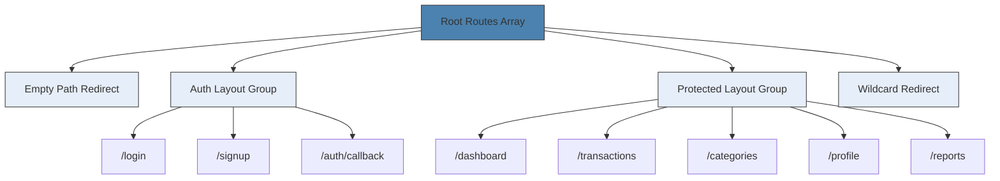
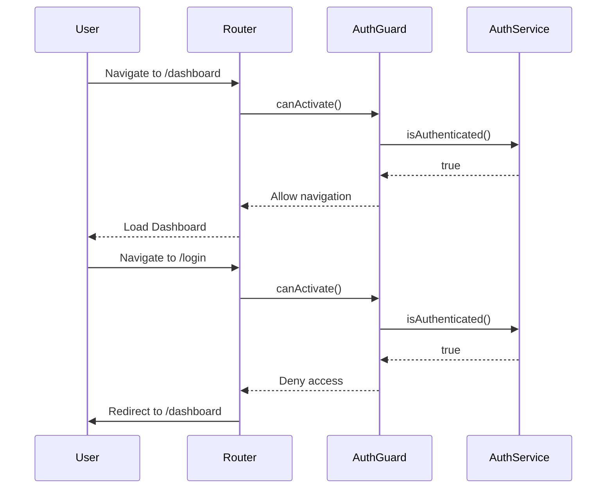
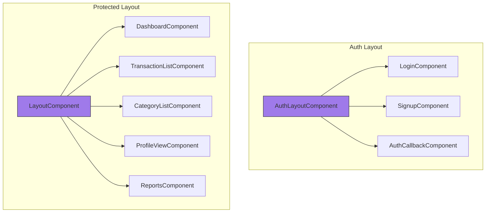
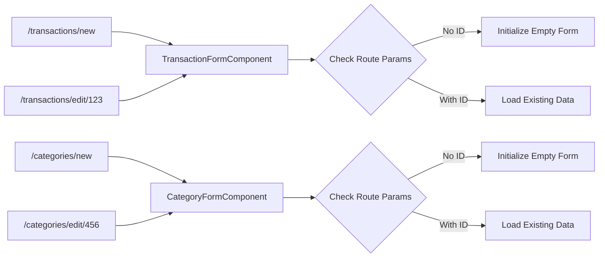
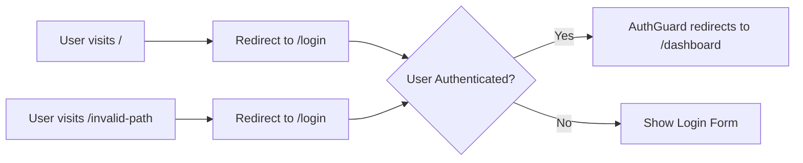
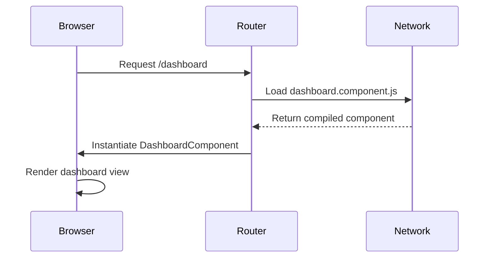

# Route Configuration

<cite>
**Referenced Files in This Document**   
- [app.routes.ts](file://src/app/app.routes.ts)
- [auth.guard.ts](file://src/app/shared/services/auth.guard.ts)
- [auth-layout.component.ts](file://src/app/auth/auth-layout/auth-layout.component.ts)
- [layout.component.ts](file://src/app/shared/components/layout/layout.component.ts)
- [main.ts](file://src/main.ts)
</cite>

## Table of Contents
1. [Introduction](#introduction)
2. [Route Configuration Structure](#route-configuration-structure)
3. [Authentication and Protected Routes](#authentication-and-protected-routes)
4. [Layout Components and Routing](#layout-components-and-routing)
5. [Dynamic and Parameterized Routes](#dynamic-and-parameterized-routes)
6. [Route Redirection and Wildcard Handling](#route-redirection-and-wildcard-handling)
7. [Lazy Loading with Standalone Components](#lazy-loading-with-standalone-components)
8. [Best Practices and Performance Considerations](#best-practices-and-performance-considerations)
9. [Troubleshooting Common Routing Issues](#troubleshooting-common-routing-issues)

## Introduction
The Angular routing system in this application is configured using a modular and scalable approach defined in `app.routes.ts`. It leverages standalone components, dynamic imports, and route guards to manage navigation between public (authentication) and protected (authenticated) sections of the app. The configuration supports layout grouping, nested routing, parameterized paths, and lazy loading without requiring separate NgModule files. This document provides a comprehensive breakdown of the routing architecture, its implementation, and best practices derived from the current setup.

## Route Configuration Structure

The `routes` constant in `app.routes.ts` defines an array of `Route` objects that configure the application's navigation structure. Each route can include a path, component loader, child routes, guards, and metadata. The configuration uses empty path routes (`path: ''`) to group related routes under shared layout components.

Key structural elements:
- **Empty path routes**: Used for layout grouping without creating a navigable URL segment
- **Children routes**: Enable nested navigation within a layout context
- **Dynamic component loading**: Achieved via `loadComponent` with dynamic `import()` statements
- **Route guards**: `AuthGuard` controls access based on authentication state
- **Data properties**: Pass metadata (e.g., `requiresAuth`) to guards for conditional logic

**Diagram sources**
- [app.routes.ts](file://src/app/app.routes.ts#L1-L84)

**Section sources**
- [app.routes.ts](file://src/app/app.routes.ts#L1-L84)

## Authentication and Protected Routes

The application separates routes into two main categories: public authentication routes and protected authenticated routes. This separation is enforced using the `AuthGuard` service, which evaluates the `requiresAuth` flag in route data to determine access permissions.

Public routes (auth section) are wrapped under the `AuthLayoutComponent` and marked with `data: { requiresAuth: false }`. When an authenticated user attempts to access these routes, they are redirected to `/dashboard`. Conversely, unauthenticated users attempting to access protected routes are redirected to `/login`.

Protected routes are grouped under the `LayoutComponent` and require authentication via `data: { requiresAuth: true }`. This ensures that only authenticated users can access dashboard, transactions, categories, profile, and reports sections.

**Diagram sources**
- [app.routes.ts](file://src/app/app.routes.ts#L20-L38)
- [auth.guard.ts](file://src/app/shared/services/auth.guard.ts#L4-L29)

**Section sources**
- [app.routes.ts](file://src/app/app.routes.ts#L20-L38)
- [auth.guard.ts](file://src/app/shared/services/auth.guard.ts#L4-L29)

## Layout Components and Routing

The application uses two primary layout components to encapsulate different UI structures: `AuthLayoutComponent` for authentication pages and `LayoutComponent` for protected content.

The `AuthLayoutComponent` provides a visually distinct gradient background and centered layout optimized for login/signup forms. It contains a single `<router-outlet>` to render child components like `LoginComponent` and `SignupComponent`.

The `LayoutComponent` implements a responsive dashboard layout with sidebar navigation, top navbar, and main content area. It supports both desktop and mobile views, with a collapsible sidebar on smaller screens. This layout wraps all protected routes, ensuring consistent navigation and branding across authenticated sections.

Both layouts are standalone components imported directly via dynamic imports in the route configuration, eliminating the need for feature modules.

**Diagram sources**
- [auth-layout.component.ts](file://src/app/auth/auth-layout/auth-layout.component.ts#L1-L27)
- [layout.component.ts](file://src/app/shared/components/layout/layout.component.ts#L1-L61)

**Section sources**
- [auth-layout.component.ts](file://src/app/auth/auth-layout/auth-layout.component.ts#L1-L27)
- [layout.component.ts](file://src/app/shared/components/layout/layout.component.ts#L1-L61)

## Dynamic and Parameterized Routes

The application implements dynamic routing for forms that handle both creation and editing of entities using parameterized paths. The same component is reused for different operations by varying the route path.

For transaction management:
- `/transactions/new` loads `TransactionFormComponent` for creating new transactions
- `/transactions/edit/:id` loads the same component but with a route parameter to populate existing data

For category management:
- `/categories/new` loads `CategoryFormComponent` for creating new categories
- `/categories/edit/:id` loads the same component with a category ID parameter for editing

This pattern reduces code duplication and simplifies maintenance by centralizing form logic in a single component that adapts behavior based on route parameters. The `:id` parameter is accessed via `ActivatedRoute` in the component to fetch and pre-fill data.

**Diagram sources**
- [app.routes.ts](file://src/app/app.routes.ts#L55-L65)

**Section sources**
- [app.routes.ts](file://src/app/app.routes.ts#L55-L65)

## Route Redirection and Wildcard Handling

The routing configuration includes two redirection rules to handle default and invalid navigation scenarios:

1. **Empty path redirection**: When users navigate to the root URL (`/`), they are automatically redirected to `/login` using `redirectTo: '/login'` with `pathMatch: 'full'`. This ensures there's always a default destination.

2. **Wildcard redirection**: Any unmatched route (`**`) is redirected to `/login`. This acts as a safety net for broken links or mistyped URLs, preventing 404 errors and guiding users back to the authentication flow.

These redirections work in conjunction with the `AuthGuard` to create a seamless user experience. Even if a user lands on `/login` through redirection, the guard will immediately redirect them to `/dashboard` if they're already authenticated.

**Diagram sources**
- [app.routes.ts](file://src/app/app.routes.ts#L4-L6)
- [app.routes.ts](file://src/app/app.routes.ts#L80-L83)

**Section sources**
- [app.routes.ts](file://src/app/app.routes.ts#L4-L6)
- [app.routes.ts](file://src/app/app.routes.ts#L80-L83)

## Lazy Loading with Standalone Components

The application implements lazy loading without traditional feature modules by using the `loadComponent` function with dynamic imports. Each route specifies a component to load asynchronously when the route is first accessed.

This approach:
- Eliminates the need for `NgModule` files
- Reduces initial bundle size by code-splitting
- Improves performance through on-demand loading
- Simplifies project structure by collocating components with their routes

Components are loaded using ES2020 dynamic imports (`import('./path/to/component')`) combined with `then()` to extract the component reference from the module. Angular handles the asynchronous loading and instantiation automatically.

The `main.ts` file bootstraps the application using `provideRouter(routes)`, which integrates the route configuration at the application level without requiring a separate routing module.

**Diagram sources**
- [app.routes.ts](file://src/app/app.routes.ts#L25-L78)
- [main.ts](file://src/main.ts#L1-L16)

**Section sources**
- [app.routes.ts](file://src/app/app.routes.ts#L25-L78)
- [main.ts](file://src/main.ts#L1-L16)

## Best Practices and Performance Considerations

The routing implementation follows several Angular best practices:

- **Standalone architecture**: Eliminates NgModule overhead and simplifies imports
- **Code splitting**: Each lazy-loaded component is its own chunk, improving load times
- **Route grouping**: Logical grouping of routes under layout components enhances maintainability
- **Guard reuse**: Single `AuthGuard` handles both authentication and authorization logic
- **Consistent patterns**: Reuse of form components for create/edit operations reduces complexity

Performance implications:
- Initial load time is minimized as only core routing and authentication components are loaded initially
- Subsequent navigation triggers lazy loading of feature components
- Bundle sizes are optimized through tree-shaking and code splitting
- Memory usage is efficient as components are instantiated only when needed

To further optimize:
- Consider preloading critical routes (e.g., dashboard) using a custom preloading strategy
- Implement route animations for smoother transitions
- Add loading indicators during component loading to improve UX
- Monitor bundle sizes and consider grouping small related components

**Section sources**
- [app.routes.ts](file://src/app/app.routes.ts#L1-L84)
- [auth.guard.ts](file://src/app/shared/services/auth.guard.ts#L1-L30)

## Troubleshooting Common Routing Issues

Common routing issues and their solutions:

**Incorrect path matching**: Ensure `pathMatch: 'full'` is used for empty path redirects. Without it, the redirect may trigger unexpectedly due to prefix matching.

**Failed component loading**: Verify the import path in `loadComponent` is correct relative to `app.routes.ts`. Check that the component class name matches the exported reference.

**Guard blocking access**: Confirm `requiresAuth` data flag aligns with intended access rules. Debug by logging authentication state in `AuthGuard`.

**Children routes not rendering**: Ensure parent components contain `<router-outlet>` in their template. Missing outlets prevent child component display.

**Parameterized routes not working**: Access route parameters using `ActivatedRoute` in the component, not from the route configuration.

**Wildcard overriding routes**: Place the `**` wildcard route at the end of the routes array to prevent it from matching valid routes.

Use Angular DevTools to inspect route states, activation paths, and guard execution order when debugging complex navigation issues.

**Section sources**
- [app.routes.ts](file://src/app/app.routes.ts#L1-L84)
- [auth.guard.ts](file://src/app/shared/services/auth.guard.ts#L1-L30)
- [auth-layout.component.ts](file://src/app/auth/auth-layout/auth-layout.component.ts#L1-L27)
- [layout.component.ts](file://src/app/shared/components/layout/layout.component.ts#L1-L61)