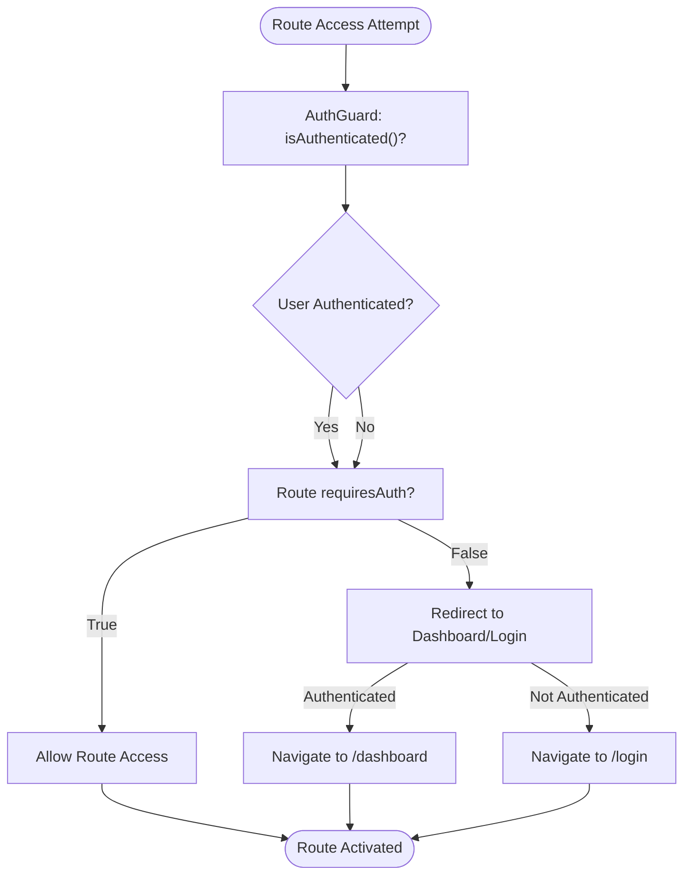
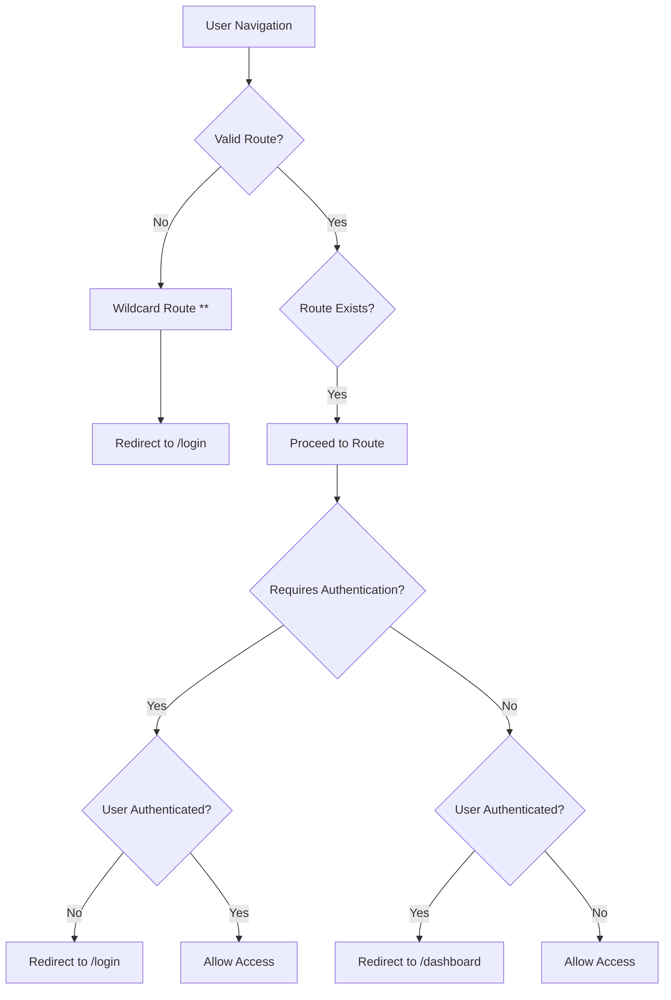

# Routing & Navigation

<cite>
**Referenced Files in This Document**   
- [app.routes.ts](file://src/app/app.routes.ts)
- [auth.guard.ts](file://src/app/shared/services/auth.guard.ts)
- [auth.service.ts](file://src/app/auth/auth.service.ts)
- [app.component.ts](file://src/app/app.component.ts)
- [app.config.ts](file://src/app/app.config.ts)
</cite>

## Table of Contents
1. [Introduction](#introduction)
2. [Route Configuration](#route-configuration)
3. [Authentication Guard Implementation](#authentication-guard-implementation)
4. [Routing Module and Application Setup](#routing-module-and-application-setup)
5. [Navigation Patterns](#navigation-patterns)
6. [Route Parameters and Query Handling](#route-parameters-and-query-handling)
7. [Error Handling and Redirect Logic](#error-handling-and-redirect-logic)
8. [Protected vs Public Routes](#protected-vs-public-routes)
9. [Conclusion](#conclusion)

## Introduction
This document provides a comprehensive overview of the Angular Router configuration and navigation system in the finance-tracker application. It details the route definitions, authentication guard logic, navigation mechanisms, and error handling strategies implemented across the codebase. The routing architecture supports both public and protected routes using layout-based routing and authentication state checks.

## Route Configuration

The application's routing structure is defined in `app.routes.ts` using Angular's `Routes` interface. The configuration implements a layout-based routing pattern with two primary layouts: authentication layout for login/signup pages and main layout for protected dashboard content.

The route configuration includes:
- Root redirect from empty path to `/login`
- Authenticated routes under the main layout requiring authentication
- Public authentication routes under the auth layout
- Wildcard route redirecting invalid paths to login

Each route uses lazy loading via `loadComponent` to improve performance by loading components only when needed. Route parameters are used in transaction and category editing routes (e.g., `/transactions/edit/:id`). The configuration separates concerns by grouping routes under appropriate layouts based on authentication requirements.

**Section sources**
- [app.routes.ts](file://src/app/app.routes.ts#L1-L84)

## Authentication Guard Implementation

The `AuthGuard` service controls access to routes based on authentication state and route requirements. It implements Angular's `CanActivate` interface and uses route data to determine whether a route requires authentication.

The guard evaluates two conditions:
1. Whether the user is currently authenticated (via `isAuthenticated()`)
2. Whether the target route requires authentication (`requiresAuth` in route data)

When an authenticated user attempts to access public auth routes (login/signup), they're redirected to the dashboard. Conversely, unauthenticated users attempting to access protected routes are redirected to the login page. This bidirectional protection prevents both unauthorized access and unnecessary authentication.

The `AuthService` supports authentication state persistence using localStorage for both JWT tokens and user data. Authentication status is determined by checking for the presence of a stored token.

**Diagram sources**
- [auth.guard.ts](file://src/app/shared/services/auth.guard.ts#L1-L30)
- [auth.service.ts](file://src/app/auth/auth.service.ts#L1-L120)

**Section sources**
- [auth.guard.ts](file://src/app/shared/services/auth.guard.ts#L1-L30)
- [auth.service.ts](file://src/app/auth/auth.service.ts#L1-L120)

## Routing Module and Application Setup

The routing system is configured through Angular's standalone component architecture. The `appConfig` object in `app.config.ts` provides the router configuration using `provideRouter(routes)`.

The `AppComponent` serves as the root component with `RouterOutlet` imported to render routed components. The application uses a modular routing approach without a dedicated `AppRoutingModule`, instead configuring routes directly in the application configuration.

The routing setup includes:
- Zone.js change detection optimization
- HttpClient provider for API interactions
- Router provider with the defined routes

This configuration follows Angular's modern standalone component pattern, eliminating the need for NgModules while maintaining full routing functionality.

**Section sources**
- [app.config.ts](file://src/app/app.config.ts#L1-L13)
- [app.component.ts](file://src/app/app.component.ts#L1-L13)

## Navigation Patterns

The application supports multiple navigation methods:

### Template-Based Navigation
Components use `routerLink` directives in templates for declarative navigation:
- Navigation to dashboard, transactions, categories, profile, and reports
- Form routes with parameterized paths for editing existing records
- Authentication routes for login and signup

### Programmatic Navigation
The `Router` service enables imperative navigation in component logic:
- Post-authentication redirects to dashboard
- Error-based navigation to login page
- Callback handling after social authentication

The navigation flow ensures consistent user experience by always redirecting to appropriate destinations based on authentication state and user actions.

## Route Parameters and Query Handling

The application implements route parameters for data editing workflows:
- Transaction editing: `/transactions/edit/:id`
- Category editing: `/categories/edit/:id`

These parameterized routes reuse the same component (`TransactionFormComponent` and `CategoryFormComponent`) for both creation and editing, with the presence of the `:id` parameter determining the mode.

While query parameters and fragments are not explicitly used in the current route configuration, the Angular Router is capable of handling them through:
- `ActivatedRoute` service for accessing route parameters and query strings
- Fragment handling for scrolling to specific page sections
- Query parameter preservation during navigation

The route parameter system enables efficient code reuse and maintains clean URL structures for data manipulation operations.

**Section sources**
- [app.routes.ts](file://src/app/app.routes.ts#L1-L84)

## Error Handling and Redirect Logic

The application implements comprehensive error handling and redirect logic:

### Wildcard Route Handling
The `**` wildcard route catches all invalid paths and redirects to `/login`, preventing 404 errors and ensuring users always land on a valid page.

### Authentication-Based Redirects
The `AuthGuard` handles authentication state transitions:
- Unauthenticated users → Redirected to `/login`
- Authenticated users accessing auth routes → Redirected to `/dashboard`

### Initial Route Redirection
An empty path (`''`) redirects to `/login`, establishing the login page as the default entry point.

This redirect strategy creates a seamless user experience by automatically guiding users to appropriate destinations regardless of their current state or navigation errors.

**Diagram sources**
- [app.routes.ts](file://src/app/app.routes.ts#L1-L84)
- [auth.guard.ts](file://src/app/shared/services/auth.guard.ts#L1-L30)

## Protected vs Public Routes

The application clearly distinguishes between protected and public routes using route grouping and data flags:

### Public Routes (Auth Layout)
- `/login` - User authentication
- `/signup` - New user registration
- `/auth/callback` - OAuth callback handler

These routes have `requiresAuth: false` and are accessible only to unauthenticated users.

### Protected Routes (Main Layout)
- `/dashboard` - Main application view
- `/transactions` - Transaction management
- `/categories` - Category management
- `/profile` - User profile
- `/reports` - Financial reports

These routes require authentication (`requiresAuth: true`) and are only accessible to authenticated users.

The layout-based routing approach allows different UI layouts to be applied based on authentication state, with the auth layout used for authentication pages and the main layout (with sidebar, navbar, etc.) for the protected application area.

This separation ensures proper user experience flows and maintains security boundaries between authenticated and unauthenticated application areas.

**Section sources**
- [app.routes.ts](file://src/app/app.routes.ts#L1-L84)
- [auth.guard.ts](file://src/app/shared/services/auth.guard.ts#L1-L30)

## Conclusion
The Angular Router implementation in this application provides a robust navigation system with proper authentication guarding, layout separation, and error handling. The configuration effectively separates public and protected routes while maintaining a clean URL structure and optimal performance through lazy loading. The bidirectional authentication guard ensures users are always directed to appropriate destinations based on their authentication state, creating a seamless user experience. The routing architecture is scalable and maintainable, following Angular's best practices for standalone components and modern router configuration.