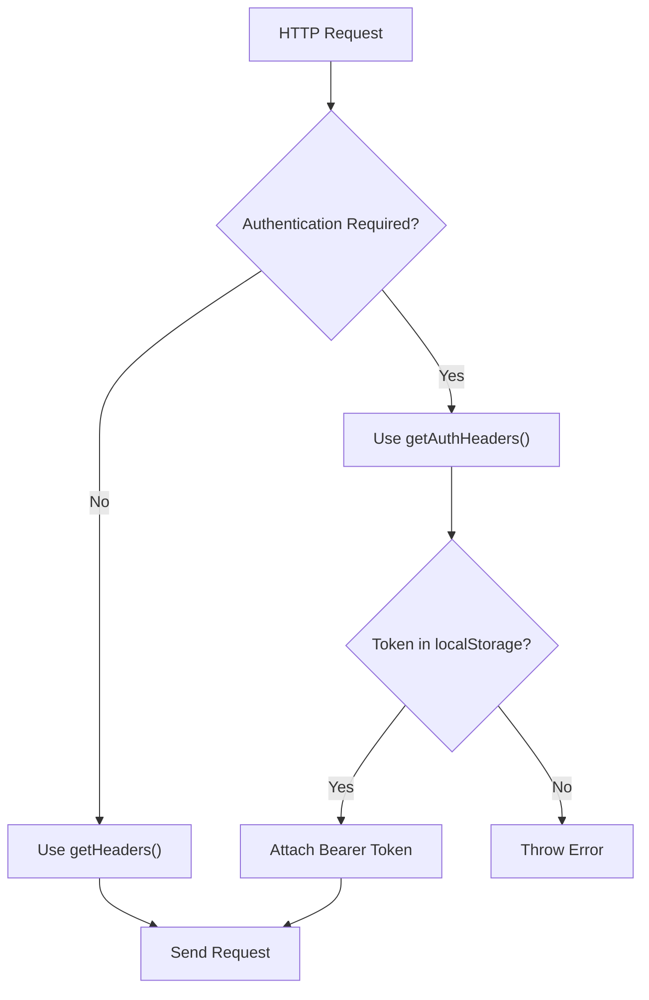
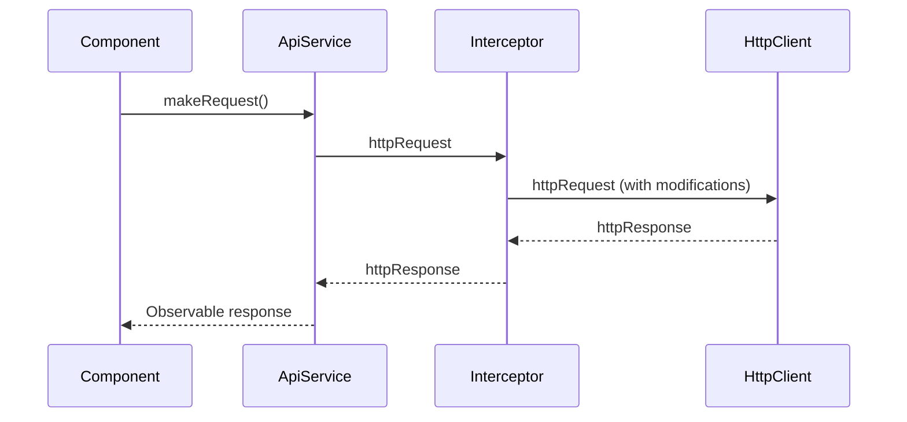
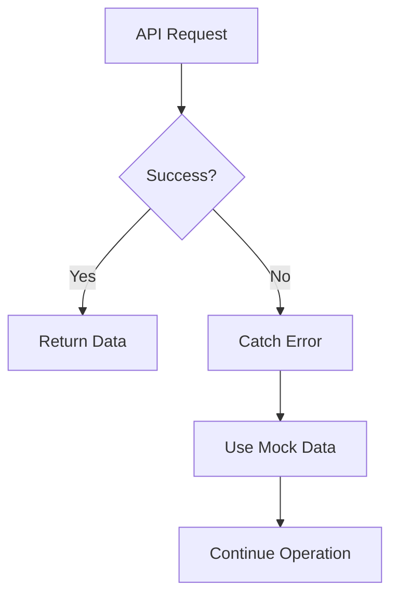
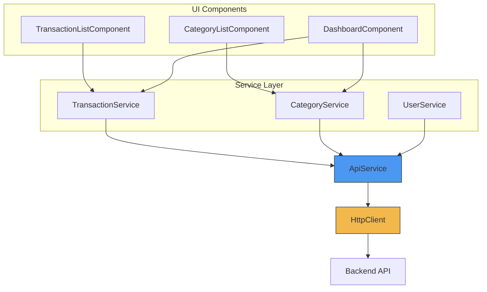

# ApiService Reference

<cite>
**Referenced Files in This Document**  
- [api.service.ts](file://src/app/shared/services/api.service.ts)
- [loader.interceptor.ts](file://src/app/shared/interceptors/loader.interceptor.ts)
- [loader.service.ts](file://src/app/shared/services/loader.service.ts)
- [constants.ts](file://src/app/shared/utils/constants.ts)
- [transaction.service.ts](file://src/app/shared/services/transaction.service.ts)
- [category.service.ts](file://src/app/shared/services/category.service.ts)
</cite>

## Table of Contents
1. [Introduction](#introduction)
2. [Core HTTP Methods](#core-http-methods)
3. [Authentication and Headers](#authentication-and-headers)
4. [Blob Response Handling](#blob-response-handling)
5. [Convenience Methods](#convenience-methods)
6. [Interceptor Integration](#interceptor-integration)
7. [Error Handling and Fallbacks](#error-handling-and-fallbacks)
8. [Usage Examples](#usage-examples)
9. [Security Considerations](#security-considerations)
10. [Best Practices and Type Safety](#best-practices-and-type-safety)
11. [Architecture and Data Flow](#architecture-and-data-flow)

## Introduction
The ApiService is the central HTTP client wrapper in the application, providing a unified interface for all API communications. It abstracts Angular's HttpClient with consistent header management, authentication handling, and type-safe responses. The service serves as the foundation for all data operations across components and services, ensuring standardized interaction with the backend API.

**Section sources**
- [api.service.ts](file://src/app/shared/services/api.service.ts#L1-L10)

## Core HTTP Methods
The ApiService exposes a comprehensive set of HTTP methods for all standard operations, each supporting type generics for compile-time type safety.

### GET Methods
- `get<T>(endpoint: string)`: Performs GET request with optional authentication token
- `getWithAuth<T>(endpoint: string)`: Requires authentication token, throws error if missing

### POST Methods
- `post<T>(endpoint: string, data: any)`: Sends data in request body with standard headers
- `postWithAuth<T>(endpoint: string, data: any)`: Same as post but requires authentication

### PUT Methods
- `put<T>(endpoint: string, data: any)`: Updates resource with provided data
- `putWithAuth<T>(endpoint: string, data: any)`: Authenticated version of put

### DELETE Methods
- `delete<T>(endpoint: string)`: Removes resource at specified endpoint
- `deleteWithAuth<T>(endpoint: string)`: Authenticated deletion

All methods automatically prepend the base API URL from configuration.

**Section sources**
- [api.service.ts](file://src/app/shared/services/api.service.ts#L30-L93)

## Authentication and Headers
The ApiService manages authentication headers automatically through two private header generation methods.

### Header Strategies
- **getHeaders()**: Includes Content-Type and Authorization if token exists (optional auth)
- **getAuthHeaders()**: Requires valid JWT token; throws error if not found (mandatory auth)

### Token Management
Authentication tokens are retrieved from localStorage under the 'token' key. The service differentiates between optional authentication endpoints (using getHeaders) and required authentication endpoints (using getAuthHeaders).



**Diagram sources**
- [api.service.ts](file://src/app/shared/services/api.service.ts#L15-L28)

## Blob Response Handling
The ApiService provides specialized methods for handling binary responses such as file downloads.

### Blob Methods
- `getBlob(endpoint: string)`: Retrieves binary data as Blob
- `getBlobWithResponse(endpoint: string)`: Returns full HttpResponse with Blob body and headers

These methods use responseType: 'blob' and require authentication, making them suitable for protected file resources.

**Section sources**
- [api.service.ts](file://src/app/shared/services/api.service.ts#L35-L46)

## Convenience Methods
The ApiService includes utility methods for common application patterns.

### openAuthPopup
Opens authentication provider popup windows with standardized dimensions:
- Parameters: authUrl (string), windowName (string)
- Returns: Window object or null
- Configured with 500x600 dimensions, scrollbars, and resizable features

### getFullUrl
Generates complete absolute URL for a given endpoint path, useful for external references or direct navigation.

**Section sources**
- [api.service.ts](file://src/app/shared/services/api.service.ts#L85-L93)

## Interceptor Integration
The ApiService works in conjunction with Angular's interceptor system for cross-cutting concerns.

### LoaderInterceptor
Currently implemented as a pass-through function, this interceptor is designed to integrate with the LoaderService for UI loading state management during HTTP requests.



**Diagram sources**
- [loader.interceptor.ts](file://src/app/shared/interceptors/loader.interceptor.ts#L1-L10)
- [api.service.ts](file://src/app/shared/services/api.service.ts#L1-L10)

## Error Handling and Fallbacks
While the ApiService itself doesn't implement error handling, it enables robust error management in consuming services.

### Error Propagation
All HTTP errors are propagated as Observable errors, to be handled by subscriber services.

### Fallback Strategy
Consuming services like TransactionService and CategoryService implement catchError operators to provide mock data when API is unavailable, ensuring application resilience.



**Section sources**
- [transaction.service.ts](file://src/app/shared/services/transaction.service.ts#L15-L25)
- [category.service.ts](file://src/app/shared/services/category.service.ts#L15-L25)

## Usage Examples
Real-world implementations demonstrate how ApiService is consumed across the application.

### TransactionService Usage
```typescript
getTransactions(): Observable<Transaction[]> {
  return this.apiService.get<any[]>('transactions').pipe(
    map(/* transform logic */),
    catchError(/* fallback to mock data */)
  );
}
```

### CategoryService Usage
```typescript
createCategory(category: Omit<Category, 'id' | 'createdAt' | 'updatedAt'>): Observable<Category> {
  return this.apiService.post<any>('categories', payload).pipe(
    map(/* transform response */)
  );
}
```

These services extend ApiService functionality with data transformation and business logic.

**Section sources**
- [transaction.service.ts](file://src/app/shared/services/transaction.service.ts#L10-L53)
- [category.service.ts](file://src/app/shared/services/category.service.ts#L10-L94)

## Security Considerations
The ApiService implements several security best practices.

### JWT Authentication
- Tokens stored in localStorage (with XSS considerations)
- Bearer token pattern for API authentication
- Automatic attachment to all authenticated requests

### XSS Protection
While using localStorage has XSS implications, the application mitigates risks through:
- Input sanitization in components
- Content Security Policy via Angular's built-in protections
- Limited token scope and expiration (handled by backend)

### Secure Communication
All production API calls use HTTPS as defined in the API_CONFIG constant.

**Section sources**
- [api.service.ts](file://src/app/shared/services/api.service.ts#L15-L28)
- [constants.ts](file://src/app/shared/utils/constants.ts#L4-L10)

## Best Practices and Type Safety
The ApiService promotes type-safe API interactions through generics and proper typing.

### Generic Type Parameters
All HTTP methods use generic type parameters (T) to ensure compile-time type checking:
```typescript
get<T>(endpoint: string): Observable<T>
```

### Response Transformation
Consuming services should transform raw API responses into typed domain models, as demonstrated in TransactionService and CategoryService.

### Service Extension
To extend ApiService for new endpoint types:
1. Create a new service that injects ApiService
2. Implement methods with appropriate error handling
3. Transform responses to domain models
4. Add business logic as needed

**Section sources**
- [transaction.service.ts](file://src/app/shared/services/transaction.service.ts#L1-L94)
- [category.service.ts](file://src/app/shared/services/category.service.ts#L1-L94)

## Architecture and Data Flow
The ApiService sits at the center of the application's data architecture.



**Diagram sources**
- [api.service.ts](file://src/app/shared/services/api.service.ts#L1-L93)
- [transaction.service.ts](file://src/app/shared/services/transaction.service.ts#L1-L94)
- [category.service.ts](file://src/app/shared/services/category.service.ts#L1-L94)