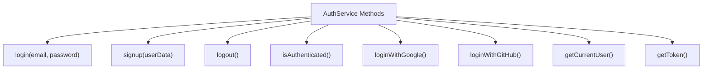
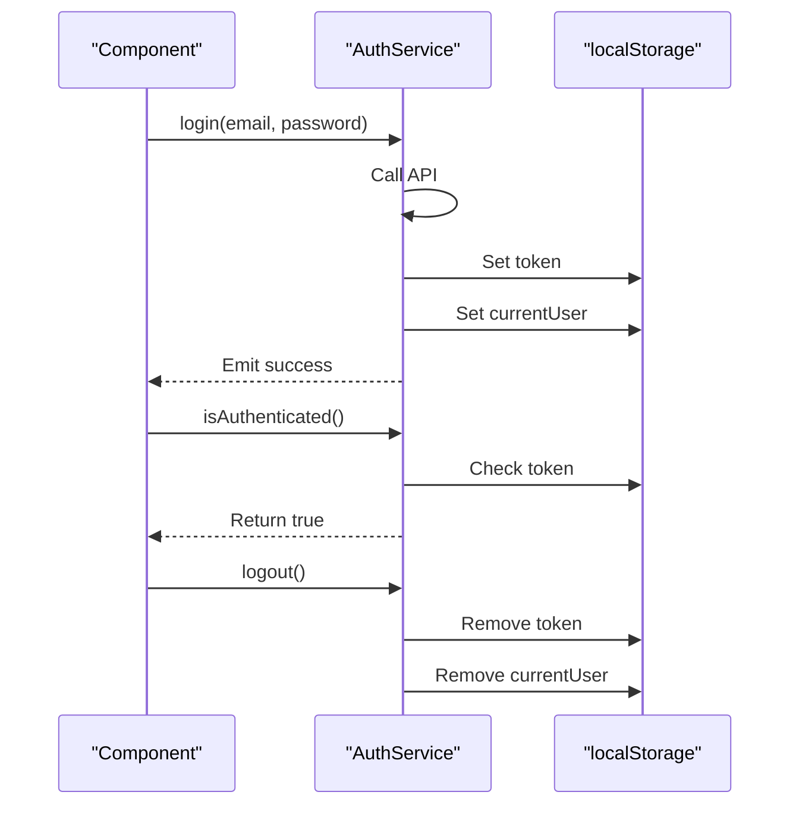
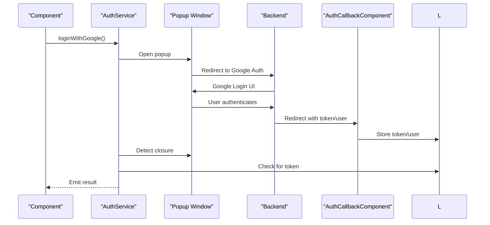
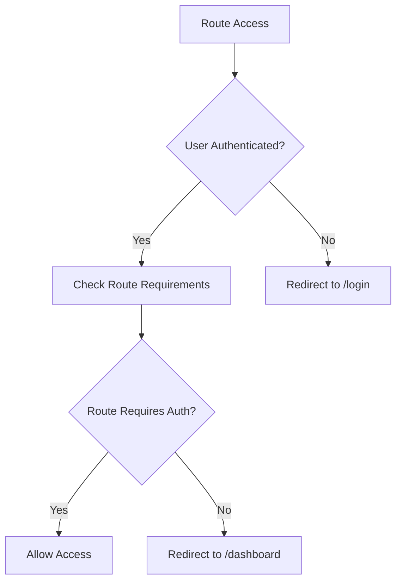
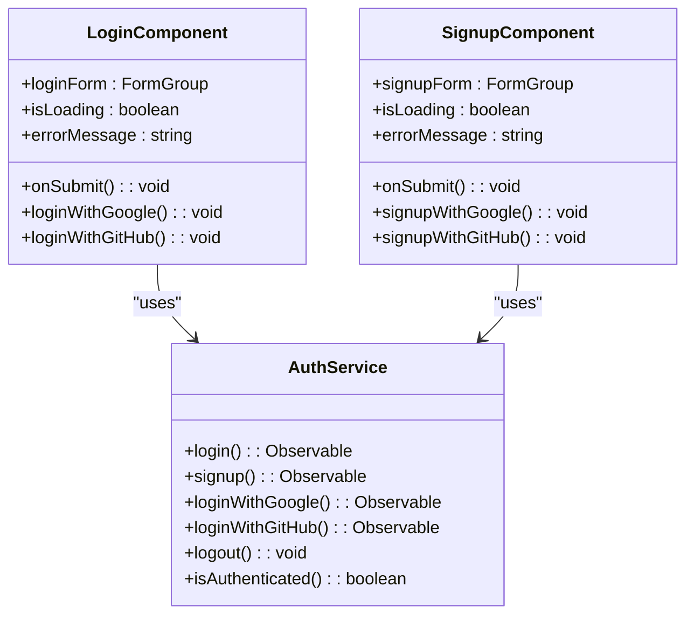

# AuthService Reference

<cite>
**Referenced Files in This Document**   
- [auth.service.ts](file://src/app/auth/auth.service.ts)
- [auth-callback.component.ts](file://src/app/auth/auth-callback/auth-callback.component.ts)
- [auth.guard.ts](file://src/app/shared/services/auth.guard.ts)
- [api.service.ts](file://src/app/shared/services/api.service.ts)
- [login.component.ts](file://src/app/auth/login/login.component.ts)
- [signup.component.ts](file://src/app/auth/signup/signup.component.ts)
- [constants.ts](file://src/app/shared/utils/constants.ts)
</cite>

## Table of Contents
1. [Introduction](#introduction)
2. [Core Methods](#core-methods)
3. [Token Management](#token-management)
4. [OAuth2 Implementation](#oauth2-implementation)
5. [AuthCallbackComponent](#authcallbackcomponent)
6. [AuthGuard Integration](#authguard-integration)
7. [ApiService Interaction](#apiservice-interaction)
8. [Component-Level Usage](#component-level-usage)
9. [Security Considerations](#security-considerations)
10. [Testing Strategies](#testing-strategies)

## Introduction
AuthService is the central service responsible for managing user authentication and session state in the Angular application. It handles traditional email/password login and signup, as well as OAuth2-based authentication with Google and GitHub. The service manages token storage in localStorage, user session persistence, and provides methods for checking authentication status. It integrates with AuthGuard for route protection and ApiService for authenticated HTTP requests.

**Section sources**
- [auth.service.ts](file://src/app/auth/auth.service.ts#L1-L10)

## Core Methods

AuthService exposes several public methods for authentication operations:

- **login(email, password)**: Authenticates user with email and password credentials
- **signup(userData)**: Registers new user with provided user data
- **logout()**: Clears authentication state and removes stored tokens
- **isAuthenticated()**: Checks if user is currently authenticated
- **loginWithGoogle()**: Initiates Google OAuth2 authentication flow
- **loginWithGitHub()**: Initiates GitHub OAuth2 authentication flow
- **getCurrentUser()**: Returns current user object if authenticated
- **getToken()**: Retrieves the stored authentication token

These methods return observables for asynchronous operations, allowing components to subscribe to authentication results.

**Diagram sources**
- [auth.service.ts](file://src/app/auth/auth.service.ts#L15-L120)

**Section sources**
- [auth.service.ts](file://src/app/auth/auth.service.ts#L15-L120)

## Token Management
AuthService stores authentication tokens and user data in the browser's localStorage. Upon successful authentication (either via login, signup, or OAuth2), the JWT token is stored under the key 'token' and the current user object is serialized and stored under 'currentUser'. The isAuthenticated() method checks for the presence of a token in localStorage and reconstructs the currentUser object if available. During logout, both 'token' and 'currentUser' entries are removed from localStorage to completely clear the authentication state.

**Diagram sources**
- [auth.service.ts](file://src/app/auth/auth.service.ts#L34-L55)
- [auth.service.ts](file://src/app/auth/auth.service.ts#L65-L75)

**Section sources**
- [auth.service.ts](file://src/app/auth/auth.service.ts#L34-L75)

## OAuth2 Implementation
The OAuth2 flow for Google and GitHub is implemented using popup windows. The loginWithGoogle() and loginWithGitHub() methods use ApiService's openAuthPopup() to open authentication windows at the configured endpoints. These methods create an Observable that monitors the popup window for closure. Once closed, they check localStorage for a token to determine authentication success. The backend handles the OAuth2 provider authentication and redirects to AuthCallbackComponent with token and user data in query parameters.

**Diagram sources**
- [auth.service.ts](file://src/app/auth/auth.service.ts#L85-L120)
- [api.service.ts](file://src/app/shared/services/api.service.ts#L85-L93)
- [auth-callback.component.ts](file://src/app/auth/auth-callback/auth-callback.component.ts#L15-L41)

**Section sources**
- [auth.service.ts](file://src/app/auth/auth.service.ts#L85-L120)

## AuthCallbackComponent
AuthCallbackComponent handles the callback phase of OAuth2 authentication. It listens for query parameters containing 'token' and 'user' data after the user authenticates with Google or GitHub. The component parses these parameters, stores them in localStorage, and redirects to the dashboard. If parameters are missing or invalid, it redirects to the login page with an error. The component displays a loading spinner during the process to provide visual feedback.

**Section sources**
- [auth-callback.component.ts](file://src/app/auth/auth-callback/auth-callback.component.ts#L15-L41)

## AuthGuard Integration
AuthService integrates with AuthGuard to protect routes in the application. AuthGuard uses the isAuthenticated() method to determine if a user can access protected routes. Routes requiring authentication (like dashboard) redirect unauthenticated users to the login page, while public routes (like login/signup) redirect authenticated users to the dashboard. This ensures proper access control throughout the application.

**Diagram sources**
- [auth.guard.ts](file://src/app/shared/services/auth.guard.ts#L10-L30)
- [auth.service.ts](file://src/app/auth/auth.service.ts#L65-L75)

**Section sources**
- [auth.guard.ts](file://src/app/shared/services/auth.guard.ts#L10-L30)

## ApiService Interaction
AuthService depends on ApiService for all HTTP communications. ApiService automatically includes the Authorization header with the Bearer token when available in localStorage. The openAuthPopup() method in ApiService is used to open OAuth2 authentication windows with proper configuration. AuthService uses post() method for login and signup operations, which ApiService enhances with appropriate headers including the Authorization token when present.

**Section sources**
- [auth.service.ts](file://src/app/auth/auth.service.ts#L10-L12)
- [api.service.ts](file://src/app/shared/services/api.service.ts#L15-L25)

## Component-Level Usage
AuthService is used in LoginComponent and SignupComponent for form-based authentication. Both components inject AuthService and call its methods in response to user actions. On successful authentication, they navigate to the dashboard. They also provide methods for OAuth2 authentication via Google and GitHub. The components handle loading states and display appropriate error messages based on the result objects returned by AuthService methods.

**Diagram sources**
- [login.component.ts](file://src/app/auth/login/login.component.ts#L15-L88)
- [signup.component.ts](file://src/app/auth/signup/signup.component.ts#L15-L105)
- [auth.service.ts](file://src/app/auth/auth.service.ts#L15-L120)

**Section sources**
- [login.component.ts](file://src/app/auth/login/login.component.ts#L15-L88)
- [signup.component.ts](file://src/app/auth/signup/signup.component.ts#L15-L105)

## Security Considerations
The authentication implementation stores tokens in localStorage, which is vulnerable to XSS attacks. While convenient for persistence across page reloads, this approach requires careful input sanitization throughout the application to prevent token theft. The implementation lacks token refresh functionality, relying on the initial token's expiration. There is no mechanism for detecting or preventing concurrent sessions. The OAuth2 popup flow helps mitigate some CSRF risks by keeping authentication in a separate window context.

**Section sources**
- [auth.service.ts](file://src/app/auth/auth.service.ts#L50-L55)
- [auth.service.ts](file://src/app/auth/auth.service.ts#L70-L75)

## Testing Strategies
To test components using AuthService, create a mock authentication service that returns controlled observables for each method. Set up test scenarios for authenticated and unauthenticated states by configuring the mock to return appropriate values from isAuthenticated() and getCurrentUser(). Test error handling by having mock methods emit error observables. For AuthGuard testing, provide the mock service and verify navigation behavior based on the authentication state. Test token persistence by simulating page reloads and verifying localStorage state.

**Section sources**
- [auth.service.ts](file://src/app/auth/auth.service.ts#L15-L120)
- [auth.guard.ts](file://src/app/shared/services/auth.guard.ts#L10-L30)