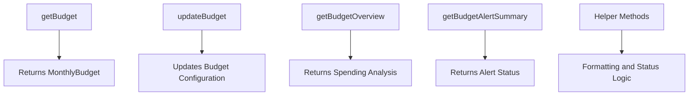
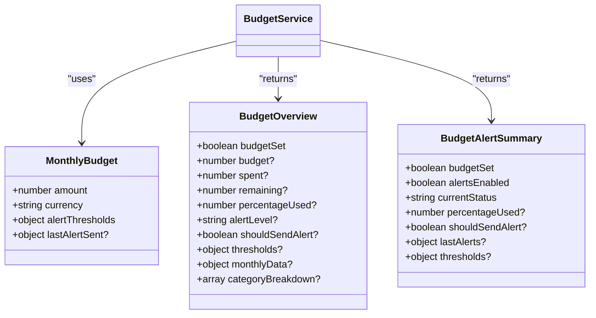
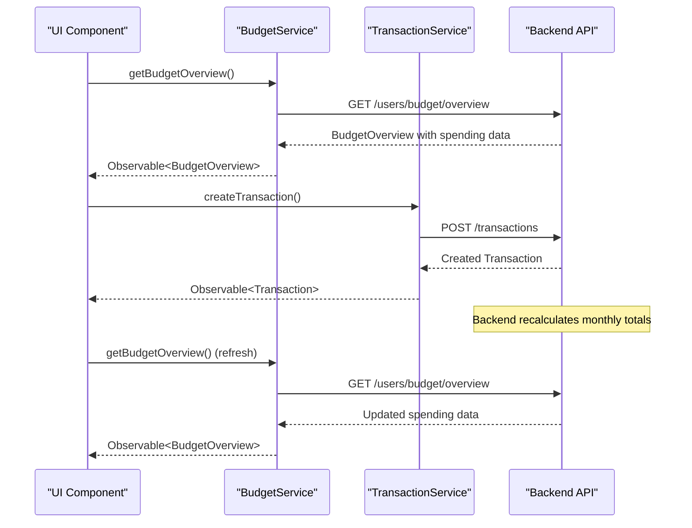
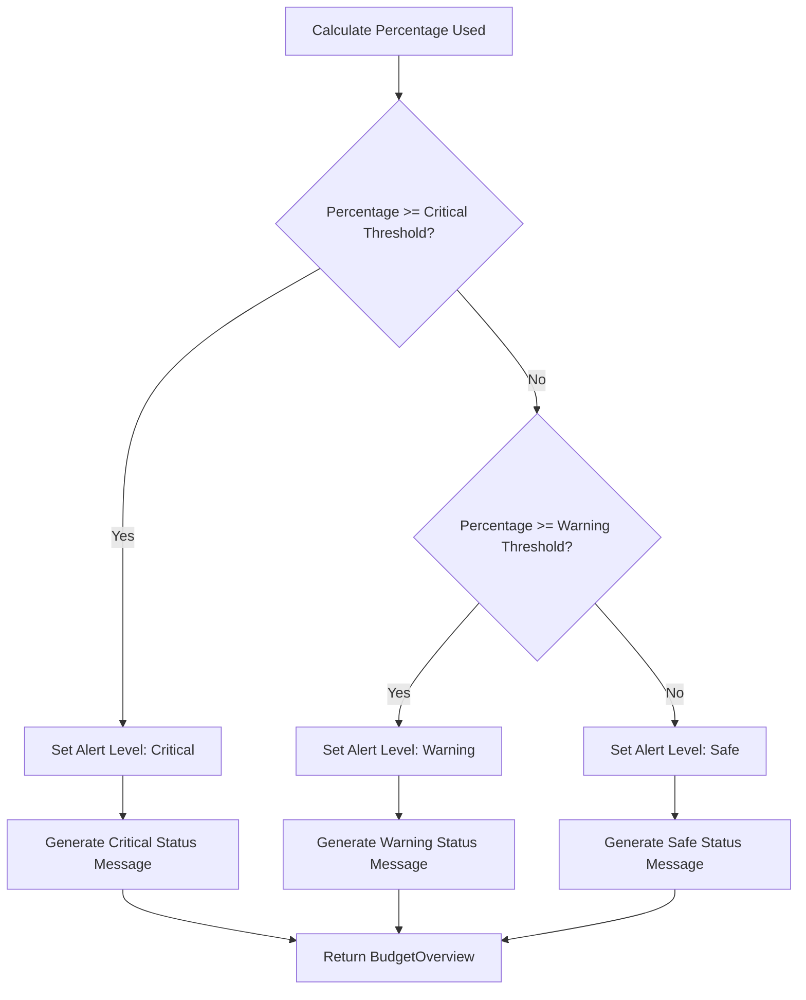

# BudgetService Reference

<cite>
**Referenced Files in This Document**  
- [budget.service.ts](file://src/app/shared/services/budget.service.ts)
- [budget.model.ts](file://src/app/shared/models/budget.model.ts)
- [transaction.service.ts](file://src/app/shared/services/transaction.service.ts)
- [budget-management.component.ts](file://src/app/shared/components/budget-management/budget-management.component.ts)
- [dashboard.component.ts](file://src/app/dashboard/dashboard.component.ts)
</cite>

## Table of Contents
1. [Introduction](#introduction)
2. [Core Methods](#core-methods)
3. [Budget Model Structure](#budget-model-structure)
4. [Integration with TransactionService](#integration-with-transactionservice)
5. [Budget Alerting System](#budget-alerting-system)
6. [Usage in BudgetManagementComponent](#usage-in-budgetmanagementcomponent)
7. [Dashboard Integration and Visualization](#dashboard-integration-and-visualization)
8. [Date-Based Monthly Budget Calculations](#date-based-monthly-budget-calculations)
9. [Edge Case Handling](#edge-case-handling)
10. [Performance Optimization for Budget Checks](#performance-optimization-for-budget-checks)

## Introduction
The BudgetService is a central component responsible for managing user-defined monthly budgets, tracking spending against limits, and triggering alerts when thresholds are approached or exceeded. It integrates with the TransactionService to monitor real-time spending and provides data to UI components for visualization. The service supports multi-currency budgets, customizable alert thresholds, and dynamic status messaging based on spending behavior.

**Section sources**
- [budget.service.ts](file://src/app/shared/services/budget.service.ts#L1-L156)
- [budget.model.ts](file://src/app/shared/models/budget.model.ts#L1-L60)

## Core Methods
The BudgetService exposes several key methods for budget management and analysis:

- **getBudget**: Retrieves the current monthly budget configuration including amount, currency, and alert thresholds.
- **updateBudget**: Updates or creates a new monthly budget with specified financial and alert parameters.
- **getBudgetOverview**: Provides a comprehensive view of current spending status, including percentage used, remaining balance, and category breakdown.
- **getBudgetAlertSummary**: Returns alert-related metadata such as last alert timestamps and current alert level.
- **calculateBudgetProgress**: Computes the percentage of budget consumed.
- **checkThreshold**: Implicitly evaluated through alert level determination in budget overview.
- **calculateRemainingAmount**: Derived from budget and spent values in the BudgetOverview interface.

These methods return observables for reactive data binding and automatically handle date deserialization from API responses.

**Diagram sources**
- [budget.service.ts](file://src/app/shared/services/budget.service.ts#L15-L156)

**Section sources**
- [budget.service.ts](file://src/app/shared/services/budget.service.ts#L15-L156)

## Budget Model Structure
The BudgetService relies on three primary interfaces defined in the budget.model.ts file:

- **MonthlyBudget**: Contains the core budget configuration including amount, currency, and alert thresholds (warning and critical percentages). It also tracks when alerts were last sent.
- **BudgetOverview**: Provides a detailed spending analysis with fields for budget status, amounts spent and remaining, percentage used, alert level, and monthly transaction data including date range.
- **BudgetAlertSummary**: Focuses specifically on alert-related information including current status, thresholds, and timestamps of last alerts sent.

All date fields are properly deserialized from string responses into JavaScript Date objects within the service layer.

**Diagram sources**
- [budget.model.ts](file://src/app/shared/models/budget.model.ts#L1-L60)

**Section sources**
- [budget.model.ts](file://src/app/shared/models/budget.model.ts#L1-L60)

## Integration with TransactionService
The BudgetService does not directly process transactions but works in conjunction with the TransactionService to provide up-to-date budget tracking. When transactions are created, updated, or deleted via the TransactionService, the budget overview automatically reflects these changes on subsequent queries. The BudgetService relies on backend aggregation to calculate total monthly spending, which is then compared against the budget limit.

The integration is indirect but critical: transaction operations trigger backend recalculations of monthly totals, which are then exposed through the BudgetService's getBudgetOverview method. This decoupled architecture ensures separation of concerns while maintaining accurate budget tracking.

**Diagram sources**
- [budget.service.ts](file://src/app/shared/services/budget.service.ts#L45-L65)
- [transaction.service.ts](file://src/app/shared/services/transaction.service.ts#L25-L50)

**Section sources**
- [budget.service.ts](file://src/app/shared/services/budget.service.ts#L45-L65)
- [transaction.service.ts](file://src/app/shared/services/transaction.service.ts#L25-L50)

## Budget Alerting System
The BudgetService implements a tiered alerting system based on configurable percentage thresholds. The system supports two alert levels: warning (typically at 80%) and critical (typically at 95%). Alert status is determined by the percentage of the budget consumed, as calculated from the spending data in the BudgetOverview.

While the BudgetService itself doesn't send notifications, it provides the logic and status information that drives the alerting system. The getBudgetStatusMessage method generates appropriate messages based on the current alert level, and the getBudgetStatusColor and getBudgetProgressColor methods determine visual styling for UI components.

The service also tracks when alerts were last sent through the lastAlertSent field in the MonthlyBudget interface, preventing duplicate notifications for the same threshold breach.

**Diagram sources**
- [budget.service.ts](file://src/app/shared/services/budget.service.ts#L85-L145)
- [budget.model.ts](file://src/app/shared/models/budget.model.ts#L20-L40)

**Section sources**
- [budget.service.ts](file://src/app/shared/services/budget.service.ts#L85-L145)

## Usage in BudgetManagementComponent
The BudgetManagementComponent provides a user interface for setting and managing monthly budgets, leveraging multiple methods from the BudgetService. On initialization, it calls both getBudget and getBudgetOverview to load current budget configuration and spending data.

The component's form allows users to set the monthly budget amount, select currency, and configure warning and critical alert thresholds. When submitted, the form data is passed to the updateBudget method. The component includes client-side validation to ensure the warning threshold is less than the critical threshold.

Visual elements such as the progress bar and status message use helper methods from the BudgetService to determine styling and content based on the current budget status. The component also provides a "Clear Budget" function that sets the budget amount to zero.

**Section sources**
- [budget-management.component.ts](file://src/app/shared/components/budget-management/budget-management.component.ts#L1-L433)

## Dashboard Integration and Visualization
The BudgetService provides data to dashboard components for visualization of budget status and spending patterns. The BudgetOverview data is used to populate budget cards and charts that display spending progress, remaining balance, and category breakdowns.

Dashboard components consume the BudgetService observables to maintain real-time updates without requiring manual refresh. The service's helper methods for formatting currency and determining status colors are utilized to ensure consistent presentation across different dashboard widgets.

The integration enables dynamic updates to budget visualizations whenever transactions are added or budget settings are changed, providing users with immediate feedback on their financial status.

**Section sources**
- [dashboard.component.ts](file://src/app/dashboard/dashboard.component.ts#L1-L100)

## Date-Based Monthly Budget Calculations
The BudgetService handles monthly budget calculations through backend integration, with the frontend properly processing date information from API responses. The BudgetOverview interface includes a monthlyData field with startDate and endDate properties that define the current budget period.

All date strings received from the API are automatically converted to JavaScript Date objects within the service's mapping operations, ensuring proper type handling in the application. This enables accurate period-based calculations and proper display of budget cycle information in UI components.

The service assumes a calendar-month budget cycle managed by the backend, with automatic rollover to new months and reset of spending calculations.

**Section sources**
- [budget.service.ts](file://src/app/shared/services/budget.service.ts#L45-L65)
- [budget.model.ts](file://src/app/shared/models/budget.model.ts#L20-L40)

## Edge Case Handling
The BudgetService includes several mechanisms for handling edge cases:

- **Rollover budgets**: While not explicitly supported in the current implementation, the date-based monthly calculations naturally support month-to-month rollover through the backend's period tracking.
- **Multi-currency scenarios**: The service supports currency specification in the MonthlyBudget interface, with the formatCurrency helper method handling proper formatting based on the selected currency code.
- **Zero or unset budgets**: The getBudget method returns null if no budget is set or the amount is zero, allowing components to handle this state appropriately.
- **Invalid threshold configurations**: The BudgetManagementComponent enforces that warning thresholds must be lower than critical thresholds, preventing logical inconsistencies.

The service gracefully handles missing data through optional properties in the interfaces and defensive programming in the mapping functions.

**Section sources**
- [budget.service.ts](file://src/app/shared/services/budget.service.ts#L15-L156)
- [budget-management.component.ts](file://src/app/shared/components/budget-management/budget-management.component.ts#L150-L180)

## Performance Optimization for Budget Checks
For optimal performance during frequent budget checks, particularly during transaction entry, the following recommendations apply:

- **Cache budget data**: Store the BudgetOverview in a local variable or service property to avoid repeated API calls when checking budget status multiple times in a short period.
- **Use observables efficiently**: Leverage Angular's async pipe in templates to automatically manage subscriptions and prevent memory leaks.
- **Debounce rapid updates**: When multiple transactions are entered in quick succession, consider debouncing budget refresh calls to reduce API load.
- **Leverage change detection strategies**: Use OnPush change detection in budget-related components to minimize unnecessary re-renders.
- **Batch operations**: When processing multiple transactions, update the budget display only once after all transactions are processed rather than after each individual transaction.

The service's current implementation already optimizes data transfer by combining budget configuration and spending analysis into separate but related endpoints, allowing components to request only the data they need.

**Section sources**
- [budget.service.ts](file://src/app/shared/services/budget.service.ts#L15-L156)
- [budget-management.component.ts](file://src/app/shared/components/budget-management/budget-management.component.ts#L100-L120)