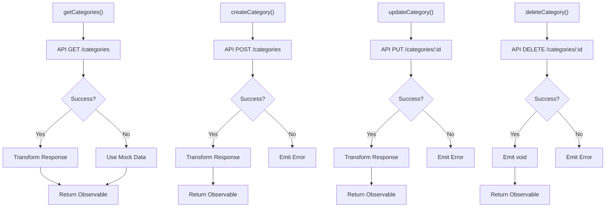
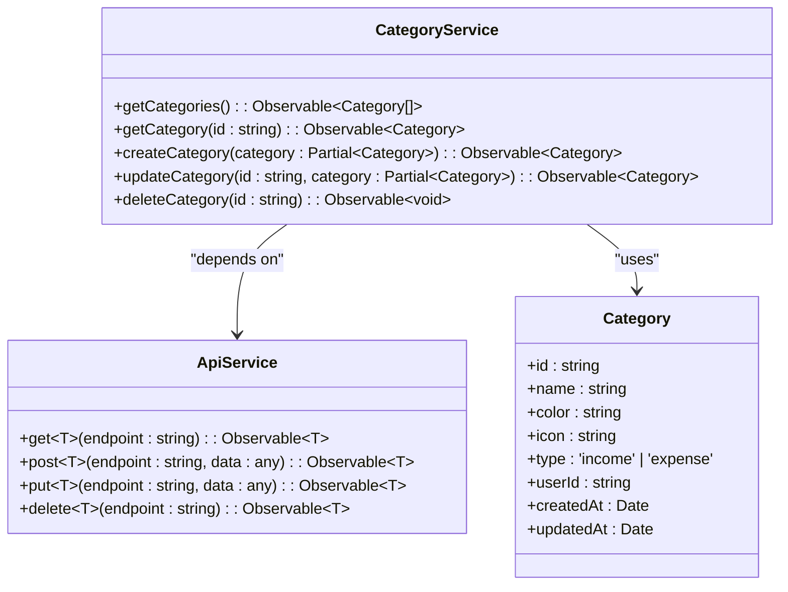
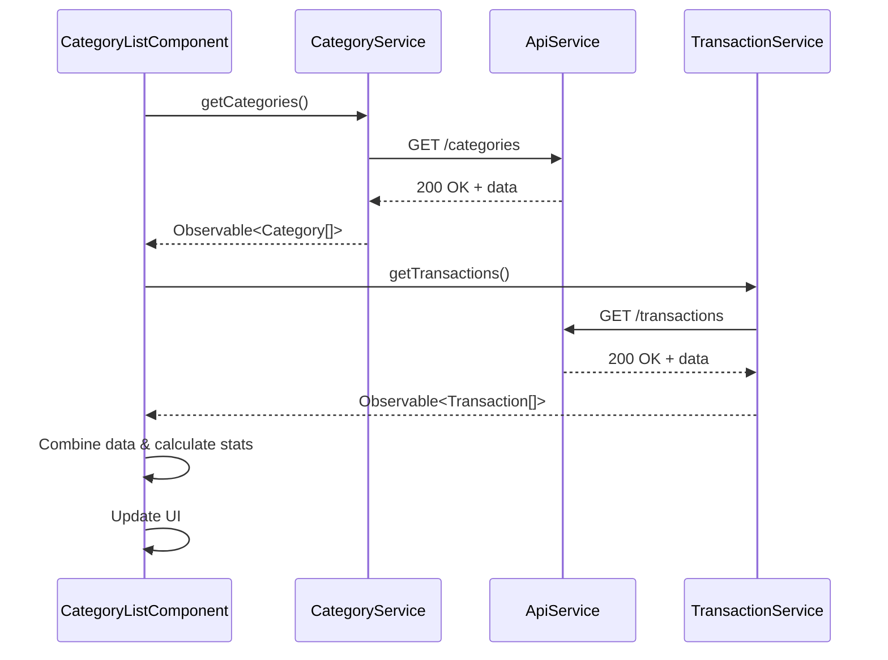
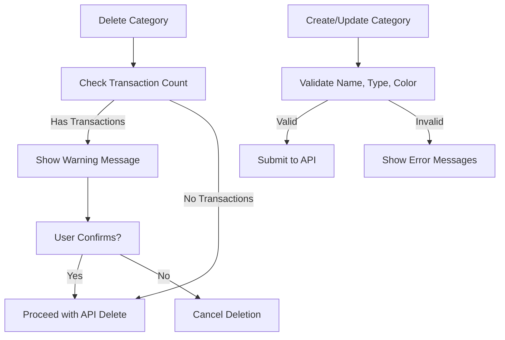

# CategoryService Reference

<cite>
**Referenced Files in This Document**   
- [category.service.ts](file://src/app/shared/services/category.service.ts)
- [category.model.ts](file://src/app/shared/models/category.model.ts)
- [api.service.ts](file://src/app/shared/services/api.service.ts)
- [category-list.component.ts](file://src/app/categories/category-list/category-list.component.ts)
- [category-form.component.ts](file://src/app/categories/category-form/category-form.component.ts)
</cite>

## Table of Contents
1. [Introduction](#introduction)
2. [Core Methods Overview](#core-methods-overview)
3. [Category Model Structure](#category-model-structure)
4. [Integration with ApiService](#integration-with-apiservice)
5. [Usage in CategoryListComponent](#usage-in-categorylistcomponent)
6. [Usage in CategoryFormComponent](#usage-in-categoryformcomponent)
7. [Business Rules and Validation](#business-rules-and-validation)
8. [Real-Time Updates and Observables](#real-time-updates-and-observables)
9. [UI Display and Color Handling](#ui-display-and-color-handling)
10. [Error Handling and Fallbacks](#error-handling-and-fallbacks)
11. [Testing Scenarios](#testing-scenarios)

## Introduction
The `CategoryService` is a central Angular service responsible for managing income and expense categories within the financial tracking application. It provides a clean abstraction layer between the frontend components and backend API, ensuring consistent data handling, transformation, and error resilience. The service supports full CRUD operations and integrates with real-time data flows to maintain synchronized state across the UI.

**Section sources**
- [category.service.ts](file://src/app/shared/services/category.service.ts#L1-L95)

## Core Methods Overview
The `CategoryService` exposes five primary public methods for category management:

- **getCategories**: Retrieves all categories from the API with fallback to mock data
- **getCategoryById**: Fetches a single category by its unique identifier
- **createCategory**: Submits a new category to the backend
- **updateCategory**: Updates an existing category with partial data
- **deleteCategory**: Removes a category from persistence

Each method returns an `Observable`, enabling reactive programming patterns throughout the application.



**Diagram sources**
- [category.service.ts](file://src/app/shared/services/category.service.ts#L15-L90)

**Section sources**
- [category.service.ts](file://src/app/shared/services/category.service.ts#L15-L90)

## Category Model Structure
The `Category` interface defines the canonical data structure used throughout the application. It ensures type safety and consistency in category data handling.

```typescript
interface Category {
  id: string;
  name: string;
  color: string;
  icon: string;
  type: 'income' | 'expense';
  userId: string;
  createdAt: Date;
  updatedAt: Date;
}
```

The model includes metadata such as creation and update timestamps, user association, and visual properties (color and icon) for UI rendering.

**Section sources**
- [category.model.ts](file://src/app/shared/models/category.model.ts#L1-L10)

## Integration with ApiService
`CategoryService` depends on `ApiService` to handle HTTP communication. This separation of concerns allows for centralized API configuration, authentication handling, and request standardization.

The service uses the following `ApiService` methods:
- `get<T>(endpoint)` for retrieving categories
- `post<T>(endpoint, data)` for creating new categories
- `put<T>(endpoint, data)` for updating categories
- `delete<T>(endpoint)` for removing categories

Authentication headers are automatically injected via `ApiService` using tokens stored in `localStorage`.



**Diagram sources**
- [category.service.ts](file://src/app/shared/services/category.service.ts#L1-L95)
- [api.service.ts](file://src/app/shared/services/api.service.ts#L1-L94)

**Section sources**
- [api.service.ts](file://src/app/shared/services/api.service.ts#L1-L94)

## Usage in CategoryListComponent
The `CategoryListComponent` consumes `CategoryService` to display a comprehensive list of categories with associated statistics. It combines category data with transaction data using `forkJoin` to calculate usage metrics.

Key interactions:
- Calls `getCategories()` on initialization and after transaction events
- Displays category usage percentage based on transaction volume
- Handles deletion via confirmation modal
- Supports filtering by type (income/expense)
- Updates UI counters dynamically

The component listens for `transactionAdded` events to refresh data in real time.



**Diagram sources**
- [category-list.component.ts](file://src/app/categories/category-list/category-list.component.ts#L1-L269)

**Section sources**
- [category-list.component.ts](file://src/app/categories/category-list/category-list.component.ts#L1-L269)

## Usage in CategoryFormComponent
The `CategoryFormComponent` utilizes `CategoryService` for creating and editing categories. It provides a form interface that validates input before submission.

Workflow:
- Loads existing category data via `getCategory()` when editing
- Submits new categories using `createCategory()`
- Updates existing categories using `updateCategory()`
- Handles success/error responses and navigates accordingly

The form enforces required fields and provides visual feedback during API operations.

**Section sources**
- [category-form.component.ts](file://src/app/categories/category-form/category-form.component.ts)

## Business Rules and Validation
The application enforces several business rules through the `CategoryService` and consuming components:

- **Deletion Prevention**: Categories with associated transactions cannot be deleted (enforced in UI by warning message)
- **Type Integrity**: Categories must be either 'income' or 'expense'
- **Name Uniqueness**: While not enforced in service, UI should prevent duplicate names
- **Required Fields**: Name, type, and color are mandatory for creation

The service itself does not enforce these rules but provides the necessary data for components to implement them.



**Diagram sources**
- [category-list.component.ts](file://src/app/categories/category-list/category-list.component.ts#L150-L200)
- [category.service.ts](file://src/app/shared/services/category.service.ts#L50-L75)

## Real-Time Updates and Observables
The `CategoryService` leverages RxJS observables to enable reactive data flow:

- All methods return `Observable` streams
- `CategoryListComponent` subscribes to `getCategories()` and combines with transaction data
- Data refresh is triggered by `transactionAdded` custom events
- Error handling with `catchError` ensures resilience
- Loading states are managed through component flags

This pattern ensures the UI remains synchronized with the latest data without requiring full page reloads.

**Section sources**
- [category-list.component.ts](file://src/app/categories/category-list/category-list.component.ts#L50-L100)

## UI Display and Color Handling
The application implements visual consistency for categories through:

- **Color-Coded Display**: Each category has a designated color used in charts and lists
- **Icon Mapping**: Dynamic icon selection based on category name (e.g., "food" → restaurant icon)
- **Type Differentiation**: Income categories use green/upward indicators; expenses use red/downward
- **Active Status**: Categories can be toggled active/inactive (UI-only state)

The `getProperIcon()` method in `CategoryListComponent` implements intelligent icon selection based on category name.

**Section sources**
- [category-list.component.ts](file://src/app/categories/category-list/category-list.component.ts#L220-L250)

## Error Handling and Fallbacks
The `CategoryService` implements robust error handling:

- **Network Resilience**: `getCategories()` falls back to mock data if API is unavailable
- **Graceful Degradation**: Users can continue working with cached/mock data
- **Error Logging**: All errors are logged to console for debugging
- **User Feedback**: Components display alerts for failed operations

The fallback mechanism ensures the application remains usable even when the backend is unreachable.

```mermaid
flowchart TD
A["API Request"] --> B{"Success?"}
B --> |Yes| C["Return Data"]
B --> |No| D["Log Warning"]
D --> E["Check Method"]
E --> |getCategories()| F["Return Mock Data"]
E --> |Other Methods| G["Emit Error"]
F --> H["Application Continues"]
G --> I["Component Handles Error"]
```

**Diagram sources**
- [category.service.ts](file://src/app/shared/services/category.service.ts#L15-L30)

## Testing Scenarios
Recommended test cases for `CategoryService` include:

- **Successful API Calls**: Verify proper data transformation from API response
- **API Failure Fallback**: Test `getCategories()` fallback to mock data when API fails
- **Validation Errors**: Test handling of invalid category data
- **Authentication Errors**: Verify proper handling of 401/403 responses
- **Empty Responses**: Test behavior with empty category arrays
- **Error Propagation**: Ensure errors are properly emitted to subscribers
- **Payload Construction**: Verify correct payload structure for create/update operations

Integration tests should verify that `CategoryListComponent` properly displays data, handles loading states, and responds to transaction events.

**Section sources**
- [category.service.ts](file://src/app/shared/services/category.service.ts)
- [category-list.component.ts](file://src/app/categories/category-list/category-list.component.ts)