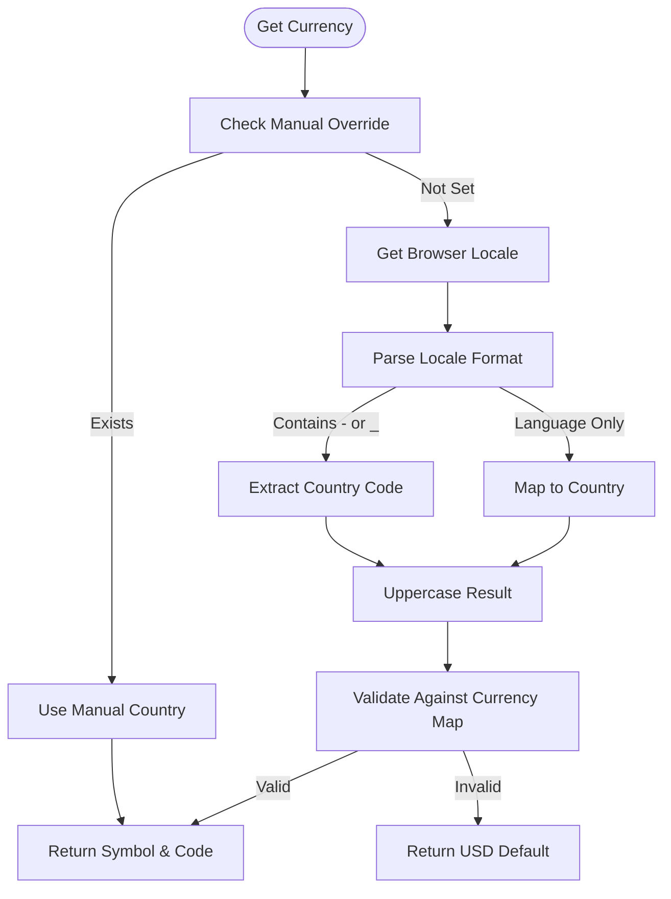

# CurrencyService Reference

<cite>
**Referenced Files in This Document**   
- [currency.service.ts](file://src/app/shared/services/currency.service.ts)
- [dashboard.component.ts](file://src/app/dashboard/dashboard.component.ts)
- [balance-card.component.ts](file://src/app/dashboard/components/balance-card/balance-card.component.ts)
- [income-card.component.ts](file://src/app/dashboard/components/income-card/income-card.component.ts)
- [expense-card.component.ts](file://src/app/dashboard/components/expense-card/expense-card.component.ts)
- [profile-edit.component.ts](file://src/app/profile/profile-edit/profile-edit.component.ts)
</cite>

## Table of Contents
1. [Introduction](#introduction)
2. [Core Methods](#core-methods)
3. [Currency Detection and User Preferences](#currency-detection-and-user-preferences)
4. [Integration with Financial Display Components](#integration-with-financial-display-components)
5. [Number Formatting and Display Standards](#number-formatting-and-display-standards)
6. [Extensibility and External API Integration](#extensibility-and-external-api-integration)
7. [Accessibility and Internationalization](#accessibility-and-internationalization)

## Introduction
The CurrencyService is a central utility in the financial application responsible for handling currency formatting, locale-based currency detection, and consistent display across financial components. It ensures that monetary values are presented correctly based on user location and application context. The service operates as a singleton (providedIn: 'root') and is injected into various components that require currency display functionality.

**Section sources**
- [currency.service.ts](file://src/app/shared/services/currency.service.ts#L1-L10)

## Core Methods

### getCurrentCurrency
Retrieves the appropriate currency symbol and code based on the user's detected country. The method first checks for a manually set country (used for testing), then falls back to browser locale detection. It returns an object containing both the currency symbol (e.g., '$') and ISO code (e.g., 'USD').

### formatAmount
Formats a numeric amount into a string with the appropriate currency symbol and two decimal places. This method uses the current currency determined by getCurrentCurrency and applies standard decimal precision for financial display.

### getUserCountry
Private method that determines the user's country from the browser's language settings. It parses the navigator.language property, handling various formats (hyphenated, underscored, or language-only), and maps language codes to likely countries when explicit country information is unavailable.

**Section sources**
- [currency.service.ts](file://src/app/shared/services/currency.service.ts#L12-L68)

## Currency Detection and User Preferences

The CurrencyService implements a multi-layered approach to currency determination:

1. **Manual Override**: A hardcoded manualCountry value ('IN' in the current implementation) allows for easy testing of different currency configurations.

2. **Browser Locale Detection**: The service extracts country information from the browser's language setting using navigator.language. It supports multiple format patterns:
   - "en-US" → extracts "US"
   - "fr_FR" → extracts "FR"
   - Language-only codes are mapped using an internal dictionary (e.g., 'hi' → 'IN' for Hindi/India)

3. **User Profile Integration**: While not directly implemented in the service, the profile-edit component includes a currency selection dropdown, indicating that user preferences should eventually override automatic detection. The current implementation in dashboard.component.ts shows currency being set at initialization time from the service.



**Diagram sources**
- [currency.service.ts](file://src/app/shared/services/currency.service.ts#L33-L68)
- [profile-edit.component.ts](file://src/app/profile/profile-edit/profile-edit.component.ts#L104-L125)

**Section sources**
- [currency.service.ts](file://src/app/shared/services/currency.service.ts#L33-L68)
- [profile-edit.component.ts](file://src/app/profile/profile-edit/profile-edit.component.ts#L104-L125)

## Integration with Financial Display Components

The CurrencyService is integrated into key financial display components through dependency injection and property binding:

### Dashboard Integration
The DashboardComponent initializes the currency symbol during setup by calling getCurrentCurrency(). This value is then passed to child components via input properties.

### Financial Card Components
Three primary financial display components consume the currency information:

- **BalanceCardComponent**: Displays current account balance with currency symbol
- **IncomeCardComponent**: Shows total income with proper currency formatting
- **ExpenseCardComponent**: Presents expense totals with correct currency symbol

These components receive the currency symbol as an @Input() parameter, creating a clean separation between currency logic and display presentation.

```mermaid
classDiagram
class CurrencyService {
+getCurrentCurrency() {symbol, code}
+formatAmount(amount) string
-getUserCountry() string
}
class DashboardComponent {
-currencySymbol : string
+ngOnInit()
}
class BalanceCardComponent {
+amount : number
+currencySymbol : string
}
class IncomeCardComponent {
+amount : number
+currencySymbol : string
}
class ExpenseCardComponent {
+amount : number
+currencySymbol : string
}
CurrencyService --> DashboardComponent : "provides currency symbol"
DashboardComponent --> BalanceCardComponent : "passes currencySymbol"
DashboardComponent --> IncomeCardComponent : "passes currencySymbol"
DashboardComponent --> ExpenseCardComponent : "passes currencySymbol"
```

**Diagram sources**
- [currency.service.ts](file://src/app/shared/services/currency.service.ts#L1-L68)
- [dashboard.component.ts](file://src/app/dashboard/dashboard.component.ts#L0-L304)
- [balance-card.component.ts](file://src/app/dashboard/components/balance-card/balance-card.component.ts#L0-L13)

**Section sources**
- [dashboard.component.ts](file://src/app/dashboard/dashboard.component.ts#L0-L304)
- [balance-card.component.ts](file://src/app/dashboard/components/balance-card/balance-card.component.ts#L0-L13)
- [income-card.component.ts](file://src/app/dashboard/components/income-card/income-card.component.ts#L0-L13)
- [expense-card.component.ts](file://src/app/dashboard/components/expense-card/expense-card.component.ts#L0-L13)

## Number Formatting and Display Standards

The CurrencyService implements consistent formatting standards for financial display:

### Decimal Precision
All amounts are formatted to exactly two decimal places using toFixed(2), ensuring consistency in financial presentation regardless of the original numeric value.

### Large Number Display
While the current implementation uses simple concatenation, the service could be extended to handle large numbers with appropriate separators. The formatAmount method currently produces output like "$1,234.56" through Angular's built-in number pipe in the templates.

### Supported Currencies
The service supports 15 major world currencies through its currencyMap:
- USD (US Dollar)
- EUR (Euro)
- GBP (British Pound)
- JPY (Japanese Yen)
- INR (Indian Rupee)
- CAD (Canadian Dollar)
- AUD (Australian Dollar)
- CNY (Chinese Yuan)
- KRW (South Korean Won)
- BRL (Brazilian Real)
- MXN (Mexican Peso)
- RUB (Russian Ruble)
- ZAR (South African Rand)
- SGD (Singapore Dollar)
- CHF (Swiss Franc)

The service defaults to USD if the detected country is not in the supported list.

**Section sources**
- [currency.service.ts](file://src/app/shared/services/currency.service.ts#L12-L28)

## Extensibility and External API Integration

### Adding New Currencies
To extend the service with additional currencies, developers should add new entries to the currencyMap object using the two-letter country code as the key and an object containing symbol and ISO code as the value.

### External Exchange Rate Integration
While the current implementation does not include currency conversion functionality, the architecture supports future integration with external exchange rate APIs. Potential integration points include:
- Adding a convert(amount, fromCurrency, toCurrency) method
- Implementing periodic exchange rate updates
- Adding caching mechanisms for rate data
- Supporting offline mode with last-known rates

The service would need to be enhanced with HTTP client integration and error handling for network requests.

### Default Currency Management
The service currently lacks a setDefaultCurrency method, but this could be implemented by:
- Adding a defaultCurrency property
- Creating a setter method to update the default
- Persisting the selection to local storage or user preferences
- Modifying getCurrentCurrency to prioritize user defaults over automatic detection

**Section sources**
- [currency.service.ts](file://src/app/shared/services/currency.service.ts#L1-L68)

## Accessibility and Internationalization

### Screen Reader Compatibility
The currency display approach using separate symbol and amount (rather than a single formatted string) enhances accessibility by allowing screen readers to properly interpret the numeric value.

### International User Experience
The automatic country detection provides a personalized experience for international users without requiring manual configuration. The fallback to USD ensures functionality even when detection fails.

### Localization Considerations
Future enhancements could include:
- Right-to-left currency symbol placement for certain languages
- Cultural formatting preferences (e.g., comma vs. period as decimal separator)
- Support for non-Latin script currencies
- Dynamic language switching based on user preferences

The current implementation balances immediate usability with room for future internationalization improvements.

**Section sources**
- [currency.service.ts](file://src/app/shared/services/currency.service.ts#L33-L68)
- [profile-edit.component.ts](file://src/app/profile/profile-edit/profile-edit.component.ts#L104-L125)