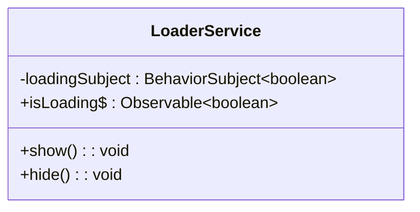
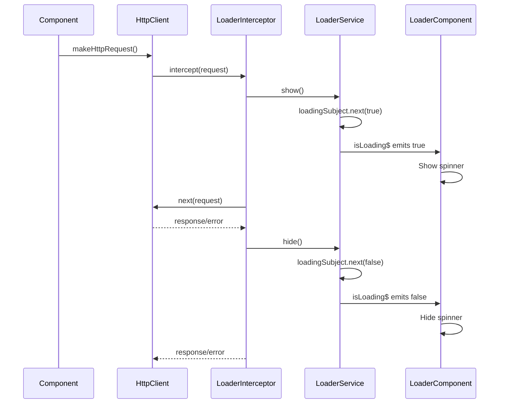
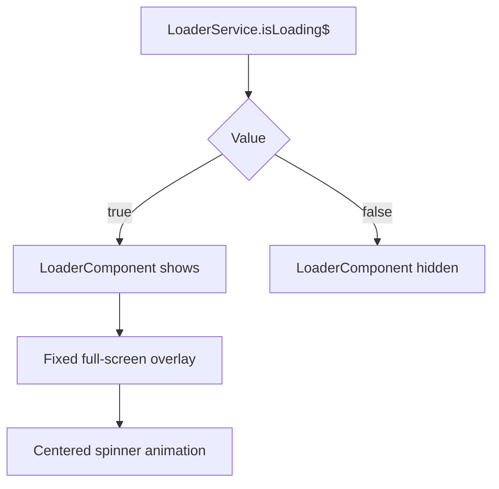

# LoaderService Reference

<cite>
**Referenced Files in This Document**   
- [loader.service.ts](file://src/app/shared/services/loader.service.ts)
- [loader.interceptor.ts](file://src/app/shared/interceptors/loader.interceptor.ts)
- [loader.component.ts](file://src/app/shared/components/loader/loader.component.ts)
- [loader.component.html](file://src/app/shared/components/loader/loader.component.html)
- [app.config.ts](file://src/app/app.config.ts)
</cite>

## Table of Contents
1. [Introduction](#introduction)
2. [Core Components](#core-components)
3. [Architecture Overview](#architecture-overview)
4. [Detailed Component Analysis](#detailed-component-analysis)
5. [Integration with HTTP Interceptors](#integration-with-http-interceptors)
6. [UI Integration via LoaderComponent](#ui-integration-via-loadercomponent)
7. [Manual Loading State Control](#manual-loading-state-control)
8. [Race Condition Handling and Best Practices](#race-condition-handling-and-best-practices)
9. [Debugging Stuck Loader States](#debugging-stuck-loader-states)
10. [Performance Considerations](#performance-considerations)
11. [Conclusion](#conclusion)

## Introduction
The `LoaderService` is a central mechanism for managing application-wide loading states in the Angular-Tailwind application. It provides a reactive interface to show and hide loading indicators, integrates seamlessly with HTTP requests via interceptors, and supports manual control for complex operations. This document details its implementation, integration points, and best practices for reliable usage across the application.

## Core Components
The loader system consists of three primary components:
- `LoaderService`: Manages the internal state using RxJS BehaviorSubject
- `LoaderInterceptor`: Automatically triggers loading states during HTTP requests
- `LoaderComponent`: Visual representation of the loading state in the UI

These components work together to provide a consistent user experience during data fetching and processing.

**Section sources**
- [loader.service.ts](file://src/app/shared/services/loader.service.ts#L1-L18)
- [loader.interceptor.ts](file://src/app/shared/interceptors/loader.interceptor.ts#L1-L11)
- [loader.component.ts](file://src/app/shared/components/loader/loader.component.ts#L1-L13)

## Architecture Overview
The loader architecture follows a reactive pattern where the service acts as a single source of truth for loading states. Components and interceptors interact with this service to update and observe the loading state, which is then reflected in the UI through the loader component.

```mermaid
graph TD
A[HTTP Request] --> B[LoaderInterceptor]
B --> C[LoaderService.show()]
D[Manual Operation Start] --> C
C --> E[isLoading$ emits true]
E --> F[LoaderComponent shows spinner]
G[HTTP Response] --> H[LoaderInterceptor]
H --> I[LoaderService.hide()]
J[Manual Operation End] --> I
I --> K[isLoading$ emits false]
K --> L[LoaderComponent hides spinner]
```

**Diagram sources**
- [loader.service.ts](file://src/app/shared/services/loader.service.ts#L1-L18)
- [loader.interceptor.ts](file://src/app/shared/interceptors/loader.interceptor.ts#L1-L11)
- [loader.component.ts](file://src/app/shared/components/loader/loader.component.ts#L1-L13)

## Detailed Component Analysis

### LoaderService Analysis
The `LoaderService` uses a `BehaviorSubject<boolean>` to maintain the loading state, providing an observable `isLoading$` for consumers. The `show()` and `hide()` methods update the subject's value, triggering emissions to all subscribers.

This implementation ensures that any component subscribing to `isLoading$` will receive the current state immediately upon subscription (due to BehaviorSubject semantics), making it ideal for UI binding.



**Diagram sources**
- [loader.service.ts](file://src/app/shared/services/loader.service.ts#L6-L17)

**Section sources**
- [loader.service.ts](file://src/app/shared/services/loader.service.ts#L1-L18)

## Integration with HTTP Interceptors
The `loaderInterceptor` function is designed to automatically manage loading states during HTTP requests. Currently, the implementation simply passes requests through without modifying the loading state. For full functionality, it should be updated to call `LoaderService.show()` before the request and `LoaderService.hide()` after the response (or error).

A proper implementation would use RxJS operators like `finalize` to ensure `hide()` is called regardless of success or failure, preventing "stuck" loaders.



**Diagram sources**
- [loader.interceptor.ts](file://src/app/shared/interceptors/loader.interceptor.ts#L8-L10)
- [loader.service.ts](file://src/app/shared/services/loader.service.ts#L10-L17)

**Section sources**
- [loader.interceptor.ts](file://src/app/shared/interceptors/loader.interceptor.ts#L1-L11)

## UI Integration via LoaderComponent
The `LoaderComponent` provides a visual overlay that appears when `isLoading` is true. It uses Tailwind CSS for styling and is designed to cover the entire viewport with a semi-transparent black background and a spinning white indicator.

The component is controlled by binding to the `isLoading` input, which should be connected to the `LoaderService.isLoading$` observable in parent components or via a shared template reference.



**Diagram sources**
- [loader.component.ts](file://src/app/shared/components/loader/loader.component.ts#L1-L13)
- [loader.component.html](file://src/app/shared/components/loader/loader.component.html#L1-L4)

**Section sources**
- [loader.component.ts](file://src/app/shared/components/loader/loader.component.ts#L1-L13)
- [loader.component.html](file://src/app/shared/components/loader/loader.component.html#L1-L4)

## Manual Loading State Control
For complex operations like batch imports that don't involve HTTP requests, developers can manually control the loading state using the `show()` and `hide()` methods:

```typescript
this.loaderService.show();
// Perform complex operation
// Ensure hide() is called in finally block or after completion
this.loaderService.hide();
```

Best practice is to wrap such operations in a try-finally block or use RxJS operators to guarantee the loader is hidden even if an error occurs.

**Section sources**
- [loader.service.ts](file://src/app/shared/services/loader.service.ts#L14-L17)

## Race Condition Handling and Best Practices
To prevent race conditions where multiple requests could cause inconsistent loader states, consider implementing a request counter pattern in the `LoaderService`. This ensures the loader only hides when all pending requests have completed.

Best practices include:
- Always pair `show()` with `hide()` in the same execution context
- Use `finalize()` operator in HTTP chains to ensure cleanup
- Avoid direct manipulation of loading state in components; use service methods
- Subscribe to `isLoading$` in templates using the `async` pipe to minimize subscription management

**Section sources**
- [loader.service.ts](file://src/app/shared/services/loader.service.ts#L6-L17)

## Debugging Stuck Loader States
Common causes of "stuck" loaders include:
- Unhandled errors in HTTP requests that prevent `hide()` from being called
- Multiple `show()` calls without corresponding `hide()` calls
- Asynchronous operations that complete after component destruction

Debugging tips:
- Add console logs in `show()` and `hide()` methods temporarily
- Use Angular DevTools to inspect service instances and observable emissions
- Implement a timeout safeguard that forces `hide()` after a maximum duration
- Check for uncaught promise rejections in the browser console

**Section sources**
- [loader.service.ts](file://src/app/shared/services/loader.service.ts#L14-L17)

## Performance Considerations
The current implementation is lightweight and efficient:
- Uses a single BehaviorSubject for state management
- Minimal overhead for state changes
- No periodic polling or timers

To minimize UI blocking:
- Ensure the loader service methods execute synchronously
- Avoid complex logic in the show/hide methods
- Keep the loader component's change detection strategy optimized
- Use CSS animations (as currently implemented) rather than JavaScript-based animations

**Section sources**
- [loader.service.ts](file://src/app/shared/services/loader.service.ts#L14-L17)
- [loader.component.ts](file://src/app/shared/components/loader/loader.component.ts#L1-L13)

## Conclusion
The `LoaderService` provides a solid foundation for managing loading states in the application. While the current interceptor implementation is incomplete, the service and component are properly structured for reactive state management. By completing the interceptor logic and following best practices for manual control, the application can ensure consistent and reliable loading feedback for users.