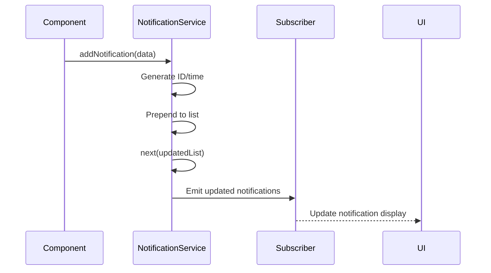
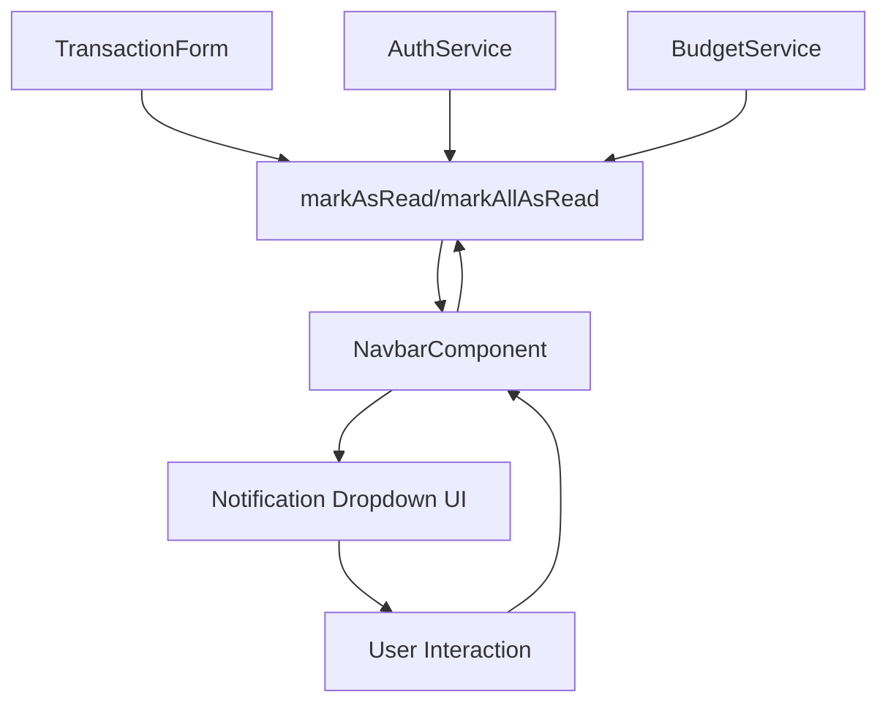

# NotificationService Reference

<cite>
**Referenced Files in This Document**   
- [notification.service.ts](file://src/app/shared/services/notification.service.ts)
- [navbar.component.ts](file://src/app/shared/components/navbar/navbar.component.ts)
- [navbar.component.html](file://src/app/shared/components/navbar/navbar.component.html)
</cite>

## Table of Contents
1. [Introduction](#introduction)
2. [Core Methods](#core-methods)
3. [Underlying Mechanism](#underlying-mechanism)
4. [UI Integration](#ui-integration)
5. [Usage Examples](#usage-examples)
6. [Configuration and Theming](#configuration-and-theming)
7. [Accessibility](#accessibility)
8. [Testing Strategies](#testing-strategies)
9. [Conclusion](#conclusion)

## Introduction
The NotificationService is a centralized service responsible for managing in-app notifications and user alerts within the Angular application. It enables components to broadcast messages of various types (success, error, warning, info) to the user interface, primarily through a notification dropdown in the global navbar. The service follows reactive programming principles using RxJS BehaviorSubject to maintain state and emit updates to subscribers.

**Section sources**
- [notification.service.ts](file://src/app/shared/services/notification.service.ts#L1-L51)

## Core Methods
The NotificationService provides a set of public methods to manage notifications:

- **addNotification**: Adds a new notification to the beginning of the list with auto-generated ID, timestamp ("Just now"), and unread status.
- **markAsRead**: Updates a specific notification's read status to true.
- **markAllAsRead**: Marks all notifications as read.
- **getNotifications**: Returns an Observable of the current notification list for subscription.
- **getUnreadCount**: Provides an Observable of the current unread notification count.

These methods allow for full lifecycle management of user-facing alerts.

**Section sources**
- [notification.service.ts](file://src/app/shared/services/notification.service.ts#L12-L51)

## Underlying Mechanism
The service uses a BehaviorSubject<Notification[]> to store and broadcast notifications. This pattern enables real-time updates across components:

1. The private `notifications` BehaviorSubject holds the current state.
2. When a new notification is added via `addNotification`, it is prepended to the existing list.
3. The `getNotifications()` method exposes the BehaviorSubject as an Observable, allowing components to subscribe and react to changes.
4. State mutations (marking as read, adding new items) trigger next() emissions, updating all subscribers.

This implementation ensures that any component with a subscription receives immediate updates when notifications change.



**Diagram sources**
- [notification.service.ts](file://src/app/shared/services/notification.service.ts#L12-L30)

## UI Integration
The NotificationService is integrated into the application's global layout through the Navbar component:

- The navbar subscribes to `getNotifications()` in `ngOnInit()` and updates its local `notifications` array.
- A badge displays the unread count via `notifications.filter(n => !n.read).length`.
- Clicking the notification icon toggles the dropdown and marks all as read.
- Individual notifications can be marked as read by clicking on them.

The UI uses Tailwind CSS for styling, with color-coded indicators based on notification type (success=green, error=red, warning=orange, info=blue).



**Diagram sources**
- [navbar.component.ts](file://src/app/shared/components/navbar/navbar.component.ts#L34-L74)
- [navbar.component.html](file://src/app/shared/components/navbar/navbar.component.html#L60-L125)

**Section sources**
- [navbar.component.ts](file://src/app/shared/components/navbar/navbar.component.ts#L34-L74)
- [navbar.component.html](file://src/app/shared/components/navbar/navbar.component.html#L60-L125)

## Usage Examples
The NotificationService is used across the application to provide user feedback:

- **Transaction Submission**: After successfully adding a transaction, a success notification appears: `addNotification({ title: 'Success', message: 'Transaction added successfully!', type: 'success' })`.
- **Login Failures**: Authentication errors trigger error notifications: `addNotification({ title: 'Login Failed', message: 'Invalid credentials', type: 'error' })`.
- **Budget Threshold Breaches**: When spending approaches budget limits, warning notifications are shown: `addNotification({ title: 'Budget Alert', message: 'You're approaching your monthly limit', type: 'warning' })`.

These examples demonstrate how business logic components use the service to communicate important events to users.

**Section sources**
- [transaction-form.component.ts](file://src/app/transactions/transaction-form/transaction-form.component.ts#L154-L199)
- [auth.service.ts](file://src/app/auth/auth.service.ts)
- [budget-management.component.ts](file://src/app/shared/components/budget-management/budget-management.component.ts)

## Configuration and Theming
While the current implementation has fixed configuration, the service supports extension for:

- **Auto-dismiss timers**: Could be added by including a `duration` property in the Notification interface and using RxJS operators like `delay` and `filter` to automatically remove notifications.
- **Positioning**: Currently displayed in the navbar dropdown; could be extended to support toast-style notifications at different screen positions (top-right, bottom-center, etc.).
- **Theming**: Uses Tailwind CSS utility classes with conditional ngClass bindings based on notification type, enabling easy theme customization through the existing Tailwind configuration.

Future enhancements could include configurable defaults per notification type and user preferences stored in settings.

**Section sources**
- [navbar.component.html](file://src/app/shared/components/navbar/navbar.component.html#L81-L101)
- [tailwind.config.js](file://tailwind.config.js)

## Accessibility
The notification system supports accessibility through:

- Semantic HTML structure in the navbar dropdown.
- Visual indicators (color, icons) for different notification types.
- Text-based content that can be read by screen readers.
- Interactive elements (buttons, clickable notifications) with proper focus management.

To further improve accessibility, the system could implement:
- ARIA live regions to announce new notifications to screen readers.
- Keyboard navigation within the notification dropdown.
- Sufficient color contrast ratios as defined by WCAG.
- Optional sound cues for critical alerts (configurable by user).

**Section sources**
- [navbar.component.html](file://src/app/shared/components/navbar/navbar.component.html#L81-L125)

## Testing Strategies
To verify notification triggers in component tests:

1. **Service Mocking**: Mock NotificationService in component TestBed configurations.
2. **Spy Verification**: Use Jasmine spies to verify `addNotification` is called with correct parameters.
3. **Observable Testing**: Use `fakeAsync` and `tick` to test asynchronous notification updates.
4. **Integration Tests**: Test that UI components properly display notifications from the service.

Example test pattern:
```typescript
expect(notificationService.addNotification).toHaveBeenCalledWith(
  jasmine.objectContaining({
    title: 'Success',
    type: 'success'
  })
);
```

**Section sources**
- [notification.service.ts](file://src/app/shared/services/notification.service.ts#L12-L30)
- [transaction-form.component.ts](file://src/app/transactions/transaction-form/transaction-form.component.ts#L154-L199)

## Conclusion
The NotificationService provides a robust, reactive foundation for user communication in the application. By leveraging RxJS BehaviorSubject, it enables real-time updates across components while maintaining a clean separation of concerns. Integrated with the global navbar and styled with Tailwind CSS, it delivers a consistent user experience for alerts and notifications. The service is ready for extension with additional configuration options and enhanced accessibility features.