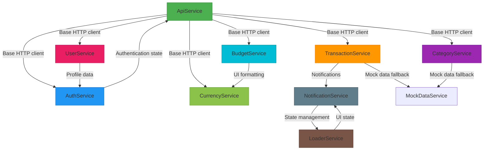
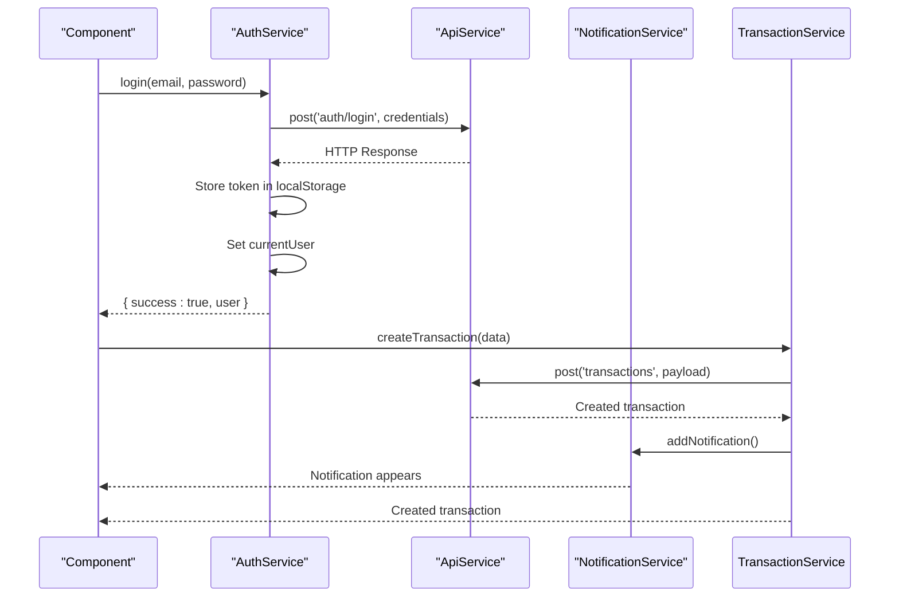

# Services Reference

<cite>
**Referenced Files in This Document**   
- [api.service.ts](file://src/app/shared/services/api.service.ts)
- [auth.service.ts](file://src/app/auth/auth.service.ts)
- [transaction.service.ts](file://src/app/shared/services/transaction.service.ts)
- [category.service.ts](file://src/app/shared/services/category.service.ts)
- [budget.service.ts](file://src/app/shared/services/budget.service.ts)
- [user.service.ts](file://src/app/shared/services/user.service.ts)
- [notification.service.ts](file://src/app/shared/services/notification.service.ts)
- [loader.service.ts](file://src/app/shared/services/loader.service.ts)
- [currency.service.ts](file://src/app/shared/services/currency.service.ts)
</cite>

## Table of Contents
1. [Introduction](#introduction)
2. [Core Services Overview](#core-services-overview)
3. [ApiService](#apiservice)
4. [AuthService](#authservice)
5. [TransactionService](#transactionservice)
6. [CategoryService](#categoryservice)
7. [BudgetService](#budgetservice)
8. [UserService](#userservice)
9. [NotificationService](#notificationservice)
10. [LoaderService](#loaderservice)
11. [CurrencyService](#currencyservice)
12. [Service Interactions](#service-interactions)
13. [Testing Considerations](#testing-considerations)
14. [Performance Tips and Anti-Patterns](#performance-tips-and-anti-patterns)

## Introduction
This document provides comprehensive API documentation for all Angular services in the financial management application. Each service is documented with its public methods, parameters, return types, side effects, usage examples, error handling patterns, and observable lifecycle management. The documentation also covers service dependencies, testing strategies, and performance optimization guidelines to ensure proper implementation and maintenance.

## Core Services Overview
The application implements a service-oriented architecture with specialized services handling distinct domains. The core services include ApiService for HTTP communication, AuthService for authentication, TransactionService for financial records, CategoryService for transaction categorization, BudgetService for financial planning, UserService for profile management, NotificationService for user alerts, LoaderService for UI state management, and CurrencyService for localization. These services follow Angular's dependency injection pattern and leverage RxJS observables for asynchronous data handling.



**Diagram sources**
- [api.service.ts](file://src/app/shared/services/api.service.ts#L1-L93)
- [auth.service.ts](file://src/app/auth/auth.service.ts#L1-L120)
- [transaction.service.ts](file://src/app/shared/services/transaction.service.ts#L1-L128)
- [category.service.ts](file://src/app/shared/services/category.service.ts#L1-L47)
- [budget.service.ts](file://src/app/shared/services/budget.service.ts#L1-L77)
- [user.service.ts](file://src/app/shared/services/user.service.ts#L1-L64)
- [notification.service.ts](file://src/app/shared/services/notification.service.ts#L1-L51)
- [loader.service.ts](file://src/app/shared/services/loader.service.ts#L1-L17)
- [currency.service.ts](file://src/app/shared/services/currency.service.ts#L1-L68)

**Section sources**
- [api.service.ts](file://src/app/shared/services/api.service.ts#L1-L93)
- [auth.service.ts](file://src/app/auth/auth.service.ts#L1-L120)

## ApiService
The ApiService provides a centralized HTTP client wrapper with authentication handling and error management. It serves as the foundation for all API communications in the application.

### Public Methods
- **get<T>(endpoint: string): Observable<T>** - Performs GET request with optional authentication token
- **getWithAuth<T>(endpoint: string): Observable<T>** - Performs authenticated GET request, throws error if no token
- **getBlob(endpoint: string): Observable<Blob>** - Retrieves binary data with authentication
- **getBlobWithResponse(endpoint: string): Observable<HttpResponse<Blob>>** - Gets blob with full HTTP response
- **post<T>(endpoint: string, data: any): Observable<T>** - Sends POST request with JSON data
- **postWithAuth<T>(endpoint: string, data: any): Observable<T>** - Sends authenticated POST request
- **put<T>(endpoint: string, data: any): Observable<T>** - Updates resource with PUT request
- **putWithAuth<T>(endpoint: string, data: any): Observable<T>** - Updates resource with authenticated PUT
- **delete<T>(endpoint: string): Observable<T>** - Deletes resource with optional authentication
- **openAuthPopup(authUrl: string, windowName: string): Window | null** - Opens authentication popup window
- **getFullUrl(endpoint: string): string** - Returns complete URL for API endpoint

### Usage Example
```typescript
// In component constructor
constructor(private apiService: ApiService) {}

// Making API calls
this.apiService.get<User[]>('users').subscribe(users => {
  console.log('Users:', users);
});

this.apiService.postWithAuth('transactions', transactionData)
  .subscribe(result => {
    console.log('Transaction created:', result);
  });
```

### Error Handling
The ApiService handles HTTP errors at the framework level, with specific methods like getWithAuth throwing explicit errors when authentication tokens are missing. Network errors and server responses are propagated to subscribers for component-level handling.

### Observable Lifecycle
All methods return cold observables that execute HTTP requests upon subscription. Subscribers must manage subscription lifecycle using takeUntil pattern or unsubscribe methods to prevent memory leaks.

**Section sources**
- [api.service.ts](file://src/app/shared/services/api.service.ts#L1-L93)

## AuthService
The AuthService manages user authentication state, login/logout functionality, and user session persistence using localStorage.

### Public Methods
- **login(email: string, password: string): Observable<{ success: boolean; user?: User; message?: string }>** - Authenticates user with email/password
- **signup(userData: any): Observable<{ success: boolean; user?: User; message?: string }>** - Registers new user account
- **logout(): void** - Clears authentication state and removes tokens
- **isAuthenticated(): boolean** - Checks if user has valid authentication token
- **getCurrentUser(): User | null** - Retrieves current user object from memory
- **getToken(): string | null** - Gets authentication token from localStorage
- **loginWithGoogle(): Observable<{ success: boolean; user?: User; message?: string }>** - Initiates Google OAuth flow
- **loginWithGitHub(): Observable<{ success: boolean; user?: User; message?: string }>** - Initiates GitHub OAuth flow

### Usage Example
```typescript
// In component
constructor(private authService: AuthService) {}

// Login process
this.authService.login(email, password).subscribe(result => {
  if (result.success) {
    this.router.navigate(['/dashboard']);
  } else {
    this.errorMessage = result.message;
  }
});

// Check authentication status
if (this.authService.isAuthenticated()) {
  const user = this.authService.getCurrentUser();
  console.log('Welcome back,', user?.firstName);
}
```

### Side Effects
- Stores authentication token in localStorage
- Persists current user data in localStorage
- Updates in-memory currentUser reference
- Triggers UI updates through authentication state changes

### Error Handling
The service uses RxJS catchError operator to handle HTTP errors gracefully, returning structured error objects with success: false flag and descriptive messages. Authentication failures are normalized to provide consistent error feedback.

**Section sources**
- [auth.service.ts](file://src/app/auth/auth.service.ts#L1-L120)

## TransactionService
The TransactionService manages financial transaction data, including CRUD operations, data transformation, and integration with notification system.

### Public Methods
- **getTransactions(): Observable<Transaction[]>** - Retrieves all transactions with mock data fallback
- **getTransaction(id: string): Observable<Transaction>** - Gets specific transaction by ID
- **createTransaction(transaction: Omit<Transaction, 'id' | 'createdAt' | 'updatedAt'>): Observable<Transaction>** - Creates new transaction
- **updateTransaction(id: string, transaction: Partial<Transaction>): Observable<Transaction>** - Updates existing transaction
- **deleteTransaction(id: string): Observable<void>** - Removes transaction by ID
- **exportTransactions(fileType: string): Observable<Blob>** - Exports transactions in specified format

### Usage Example
```typescript
// In component
constructor(private transactionService: TransactionService) {}

// Load transactions
this.transactionService.getTransactions().subscribe(transactions => {
  this.transactions = transactions;
});

// Create new transaction
this.transactionService.createTransaction(newTransaction)
  .subscribe(created => {
    this.notificationService.addNotification({
      title: 'Transaction Created',
      message: `${created.title}: $${created.amount}`,
      type: 'success'
    });
  });
```

### Error Handling
Implements robust error handling with catchError operator that provides mock data when API is unavailable. HTTP errors are logged to console and fallback data is returned to maintain application functionality.

### Observable Lifecycle
All methods return observables that automatically handle subscription cleanup through pipeable operators. The service leverages tap operator to trigger side effects like notifications without affecting the main data stream.

**Section sources**
- [transaction.service.ts](file://src/app/shared/services/transaction.service.ts#L1-L128)

## CategoryService
The CategoryService handles transaction categorization data with API integration and mock data fallback capabilities.

### Public Methods
- **getCategories(): Observable<Category[]>** - Retrieves all categories with mock data fallback
- **getCategory(id: string): Observable<Category>** - Gets specific category by ID

### Usage Example
```typescript
// In component
constructor(private categoryService: CategoryService) {}

// Load categories
this.categoryService.getCategories().subscribe(categories => {
  this.categories = categories;
});
```

### Error Handling
Similar to TransactionService, it implements error fallback mechanism using catchError operator to return mock data when API requests fail, ensuring uninterrupted application functionality.

**Section sources**
- [category.service.ts](file://src/app/shared/services/category.service.ts#L1-L47)

## BudgetService
The BudgetService manages financial budgeting functionality, including budget configuration, spending analysis, and currency formatting.

### Public Methods
- **getBudget(): Observable<MonthlyBudget | null>** - Retrieves current monthly budget
- **updateBudget(budgetData: { amount: number; currency?: string; alertThresholds?: { warning: number; critical: number; }; }): Observable<MonthlyBudget>** - Updates budget configuration
- **getBudgetOverview(): Observable<BudgetOverview>** - Gets comprehensive budget analysis
- **getBudgetAlertSummary(): Observable<BudgetAlertSummary>** - Retrieves budget alert status
- **formatCurrency(amount: number, currencyCode?: string): string** - Formats amount with currency symbol
- **getBudgetStatusColor(percentageUsed: number, thresholds: { warning: number; critical: number; }): string** - Determines status color based on usage
- **getBudgetProgressColor(percentageUsed: number, thresholds: { warning: number; critical: number; }): string** - Gets progress bar color
- **getBudgetStatusMessage(overview: BudgetOverview): string** - Generates descriptive status message

### Usage Example
```typescript
// In component
constructor(private budgetService: BudgetService) {}

// Load budget data
this.budgetService.getBudgetOverview().subscribe(overview => {
  this.budgetOverview = overview;
});

// Update budget
this.budgetService.updateBudget(budgetData).subscribe(updated => {
  this.currentBudget = updated;
});
```

### Side Effects
- Updates UI through returned observables
- Integrates with NotificationService for user feedback
- Provides formatting methods used across multiple components

**Section sources**
- [budget.service.ts](file://src/app/shared/services/budget.service.ts#L1-L77)

## UserService
The UserService manages user profile data and settings through API integration.

### Public Methods
- **getCurrentUser(): Observable<User>** - Retrieves current user profile
- **updateUser(user: Partial<User>): Observable<User>** - Updates user profile and settings

### Usage Example
```typescript
// In component
constructor(private userService: UserService) {}

// Load user profile
this.userService.getCurrentUser().subscribe(user => {
  this.userProfile = user;
});

// Update user settings
this.userService.updateUser(updateData).subscribe(updated => {
  this.userProfile = updated;
});
```

**Section sources**
- [user.service.ts](file://src/app/shared/services/user.service.ts#L1-L64)

## NotificationService
The NotificationService manages application notifications using BehaviorSubject for reactive state management.

### Public Methods
- **getNotifications(): Observable<Notification[]>** - Streams current notifications
- **addNotification(notification: Omit<Notification, 'id' | 'time' | 'read'>): void** - Adds new notification
- **markAsRead(id: string): void** - Marks specific notification as read
- **markAllAsRead(): void** - Marks all notifications as read
- **getUnreadCount(): Observable<number>** - Streams unread notification count

### Usage Example
```typescript
// In component
constructor(private notificationService: NotificationService) {}

// Subscribe to notifications
this.notificationService.getNotifications().subscribe(notifications => {
  this.notifications = notifications;
});

// Add notification
this.notificationService.addNotification({
  title: 'Success',
  message: 'Operation completed',
  type: 'success'
});
```

### State Management
Uses BehaviorSubject to maintain notification state, enabling multiple components to reactively respond to notification changes. The service handles notification metadata like timestamps and read status automatically.

**Section sources**
- [notification.service.ts](file://src/app/shared/services/notification.service.ts#L1-L51)

## LoaderService
The LoaderService manages application loading state using Observable pattern.

### Public Methods
- **show(): void** - Activates loading state
- **hide(): void** - Deactivates loading state
- **isLoading$: Observable<boolean>** - Streams current loading state

### Usage Example
```typescript
// In component
constructor(private loaderService: LoaderService) {}

// Show loader during async operation
this.loaderService.show();
this.dataService.getData().subscribe(data => {
  this.data = data;
  this.loaderService.hide();
});
```

**Section sources**
- [loader.service.ts](file://src/app/shared/services/loader.service.ts#L1-L17)

## CurrencyService
The CurrencyService handles currency localization and formatting based on user location.

### Public Methods
- **getCurrentCurrency(): { symbol: string; code: string }** - Determines currency based on browser locale
- **getUserCountry(): string** - Detects user country from browser settings
- **formatAmount(amount: number): string** - Formats number with currency symbol

### Usage Example
```typescript
// In component
constructor(private currencyService: CurrencyService) {}

// Format currency
const formatted = this.currencyService.formatAmount(1234.56);
console.log(formatted); // "$1,234.56" or local equivalent
```

### Localization Strategy
Automatically detects user country from browser locale settings and maps it to appropriate currency. Includes manual override capability for testing different regional configurations.

**Section sources**
- [currency.service.ts](file://src/app/shared/services/currency.service.ts#L1-L68)

## Service Interactions
The services form a cohesive ecosystem with well-defined dependencies and interaction patterns.



**Diagram sources**
- [auth.service.ts](file://src/app/auth/auth.service.ts#L1-L120)
- [api.service.ts](file://src/app/shared/services/api.service.ts#L1-L93)
- [transaction.service.ts](file://src/app/shared/services/transaction.service.ts#L1-L128)
- [notification.service.ts](file://src/app/shared/services/notification.service.ts#L1-L51)

**Section sources**
- [auth.service.ts](file://src/app/auth/auth.service.ts#L1-L120)
- [transaction.service.ts](file://src/app/shared/services/transaction.service.ts#L1-L128)

## Testing Considerations
Each service should be tested with comprehensive unit tests covering all methods and edge cases.

### Mock Implementations
```typescript
// Example mock for testing
const mockApiService = {
  get: jest.fn(),
  post: jest.fn(),
  put: jest.fn(),
  delete: jest.fn()
};

const mockNotificationService = {
  addNotification: jest.fn()
};
```

### Testing Strategies
- Test AuthService authentication flows with both success and failure scenarios
- Verify TransactionService error fallback to mock data
- Test BudgetService currency formatting with different locales
- Validate NotificationService state management with multiple notifications
- Ensure UserService properly transforms API response data
- Confirm LoaderService correctly toggles loading state

### Test Coverage Requirements
- 100% method coverage
- All error handling paths tested
- Observable completion and error cases verified
- Side effects properly mocked and asserted
- Integration between services validated

**Section sources**
- [auth.service.ts](file://src/app/auth/auth.service.ts#L1-L120)
- [transaction.service.ts](file://src/app/shared/services/transaction.service.ts#L1-L128)
- [budget.service.ts](file://src/app/shared/services/budget.service.ts#L1-L77)

## Performance Tips and Anti-Patterns

### Performance Tips
- **Use takeUntil pattern** to prevent memory leaks from unsubscribed observables
- **Cache frequent API calls** using BehaviorSubject or ReplaySubject where appropriate
- **Batch related operations** to minimize HTTP requests
- **Leverage async pipe** in templates to automatically manage subscriptions
- **Implement loading states** to improve perceived performance
- **Use trackBy functions** when iterating over service data in templates

### Anti-Patterns to Avoid
- **Avoid direct HttpClient injection** in components - always use ApiService wrapper
- **Don't store sensitive data in localStorage** beyond authentication tokens
- **Never ignore observable subscriptions** without proper cleanup
- **Avoid nested subscriptions** - use switchMap, mergeMap, or forkJoin instead
- **Don't duplicate service logic** in components - keep business logic in services
- **Avoid direct DOM manipulation** in services - use Angular's reactive patterns
- **Don't hardcode API endpoints** in multiple services - centralize in constants

### Optimization Recommendations
- Implement request debouncing for frequently called methods
- Add caching layer for static data like categories and user profiles
- Use HTTP interceptors for consistent request/response handling
- Implement pagination for large datasets like transaction history
- Consider web workers for intensive data processing tasks
- Optimize change detection strategies for service-dependent components

**Section sources**
- [api.service.ts](file://src/app/shared/services/api.service.ts#L1-L93)
- [auth.service.ts](file://src/app/auth/auth.service.ts#L1-L120)
- [transaction.service.ts](file://src/app/shared/services/transaction.service.ts#L1-L128)