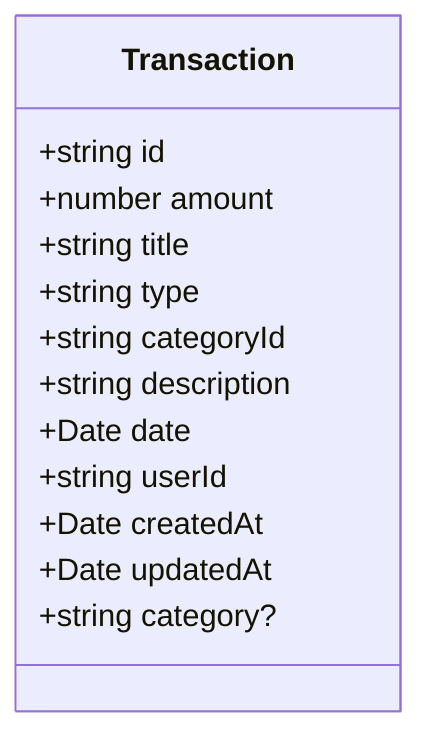
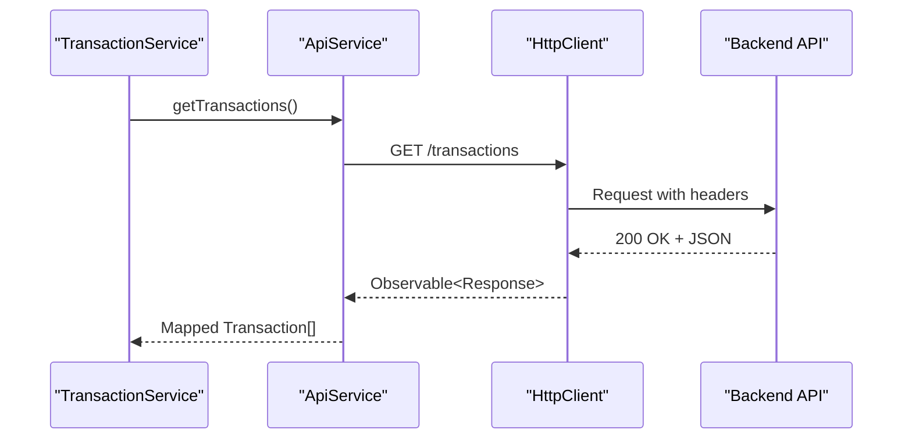

# TransactionService Reference

<cite>
**Referenced Files in This Document**  
- [transaction.service.ts](file://src/app/shared/services/transaction.service.ts)
- [transaction.model.ts](file://src/app/shared/models/transaction.model.ts)
- [api.service.ts](file://src/app/shared/services/api.service.ts)
- [transaction-list.component.ts](file://src/app/transactions/transaction-list/transaction-list.component.ts)
- [transaction-form.component.ts](file://src/app/transactions/transaction-form/transaction-form.component.ts)
</cite>

## Table of Contents
1. [Introduction](#introduction)
2. [Core Methods Overview](#core-methods-overview)
3. [Data Model and Type Safety](#data-model-and-type-safety)
4. [Backend Communication via ApiService](#backend-communication-via-apiservice)
5. [Observable-Based Data Flow](#observable-based-data-flow)
6. [Error Handling and Fallback Strategy](#error-handling-and-fallback-strategy)
7. [Optimistic Updates and User Feedback](#optimistic-updates-and-user-feedback)
8. [Filtering, Sorting, and Pagination in Components](#filtering-sorting-and-pagination-in-components)
9. [Performance Considerations for Large Datasets](#performance-considerations-for-large-datasets)
10. [Export Functionality and Blob Handling](#export-functionality-and-blob-handling)
11. [Extensibility for Bulk Operations and Import/Export](#extensibility-for-bulk-operations-and-import-export)
12. [Conclusion](#conclusion)

## Introduction
The `TransactionService` is a central Angular service responsible for managing financial transactions in the application. It provides a complete set of CRUD operations—create, read, update, and delete—while abstracting backend communication through the `ApiService`. The service ensures type safety using the `Transaction` model and supports observable-based data flow to UI components such as `TransactionListComponent` and `TransactionFormComponent`. It also includes error resilience, user notifications, and export capabilities, making it a robust foundation for transaction management.

**Section sources**
- [transaction.service.ts](file://src/app/shared/services/transaction.service.ts#L1-L128)

## Core Methods Overview
The `TransactionService` exposes the following primary methods:

- **getTransactions()**: Retrieves all transactions from the backend or falls back to mock data if the API is unavailable.
- **getTransaction(id: string)**: Fetches a single transaction by its unique identifier.
- **createTransaction(transaction)**: Submits a new transaction to the backend.
- **updateTransaction(id, transaction)**: Updates an existing transaction with partial data.
- **deleteTransaction(id)**: Removes a transaction permanently.
- **exportTransactions(fileType)**: Exports transaction data in a specified format (e.g., Excel).

These methods return `Observable` instances, enabling reactive data handling in components.

**Section sources**
- [transaction.service.ts](file://src/app/shared/services/transaction.service.ts#L20-L128)

## Data Model and Type Safety
The `Transaction` interface, defined in `transaction.model.ts`, enforces strict typing across the application. It includes essential fields such as `id`, `amount`, `type` (`income` or `expense`), `categoryId`, `date`, and metadata like `createdAt` and `updatedAt`. The optional `category` field allows enriched data binding in components.

All service methods map raw API responses to this model, ensuring consistent date parsing and field normalization. This type-safe approach prevents runtime errors and improves developer experience through IDE support.



**Diagram sources**
- [transaction.model.ts](file://src/app/shared/models/transaction.model.ts#L1-L12)

## Backend Communication via ApiService
`TransactionService` depends on `ApiService` to handle HTTP communication. `ApiService` abstracts the base URL, headers, and authentication logic, including automatic attachment of Bearer tokens from `localStorage`.

All transaction operations use standard RESTful endpoints under the `/transactions` route:
- `GET /transactions` → `getTransactions()`
- `GET /transactions/:id` → `getTransaction(id)`
- `POST /transactions` → `createTransaction()`
- `PUT /transactions/:id` → `updateTransaction(id, data)`
- `DELETE /transactions/:id` → `deleteTransaction(id)`

The `ApiService` also supports blob responses for file exports, used in `exportTransactions()`.



**Diagram sources**
- [transaction.service.ts](file://src/app/shared/services/transaction.service.ts#L20-L35)
- [api.service.ts](file://src/app/shared/services/api.service.ts#L30-L50)

## Observable-Based Data Flow
The service uses RxJS observables to enable reactive data flow. Components like `TransactionListComponent` subscribe to `getTransactions()` to receive real-time updates. The use of `map`, `tap`, and `catchError` operators allows transformation, side effects, and error handling without breaking the observable chain.

For example, `TransactionListComponent` refreshes its transaction list after every create, update, or delete operation by re-calling `loadTransactions()`.

**Section sources**
- [transaction.service.ts](file://src/app/shared/services/transaction.service.ts#L20-L128)
- [transaction-list.component.ts](file://src/app/transactions/transaction-list/transaction-list.component.ts#L100-L120)

## Error Handling and Fallback Strategy
The `getTransactions()` method includes a robust error handling mechanism using `catchError`. If the API call fails (e.g., network error or service down), the service gracefully falls back to `MockDataService.getMockTransactions()`.

This ensures the application remains functional during development or backend outages. Other methods do not currently implement fallbacks but propagate errors to the caller, where components handle them via error callbacks.

```mermaid
flowchart TD
A[getTransactions()] --> B{API Call Success?}
B --> |Yes| C[Return mapped transactions]
B --> |No| D[Log warning]
D --> E[Use mock data via MockDataService]
E --> F[Return mock transactions]
```

**Diagram sources**
- [transaction.service.ts](file://src/app/shared/services/transaction.service.ts#L20-L35)

## Optimistic Updates and User Feedback
While the service does not implement optimistic updates (immediate UI update before server confirmation), it provides immediate user feedback via `NotificationService`. After a successful `createTransaction`, a notification is shown with the transaction type, title, and amount.

This enhances user experience by confirming actions without requiring manual UI refresh. Future enhancements could include optimistic updates with rollback on failure.

**Section sources**
- [transaction.service.ts](file://src/app/shared/services/transaction.service.ts#L60-L75)

## Filtering, Sorting, and Pagination in Components
Although the `TransactionService` does not currently support server-side pagination or filtering, `TransactionListComponent` implements client-side filtering and sorting. Users can filter by:
- Search term
- Category
- Transaction type
- Date range

Sorting is supported by `date`, `amount`, `title`, and `type`, with ascending or descending order. For large datasets, this client-side approach may impact performance, suggesting a need for server-side enhancements.

**Section sources**
- [transaction-list.component.ts](file://src/app/transactions/transaction-list/transaction-list.component.ts#L150-L250)

## Performance Considerations for Large Datasets
Currently, all transactions are loaded at once, which may lead to performance degradation as the dataset grows. To improve scalability:
- Implement server-side pagination (e.g., `getTransactions(page, limit)`)
- Add filtering and sorting parameters in API calls
- Introduce caching using `BehaviorSubject` or `ngrx/store`
- Use virtual scrolling in `TransactionListComponent`

These changes would reduce memory usage and improve rendering speed.

**Section sources**
- [transaction.service.ts](file://src/app/shared/services/transaction.service.ts#L20-L35)
- [transaction-list.component.ts](file://src/app/transactions/transaction-list/transaction-list.component.ts#L100-L120)

## Export Functionality and Blob Handling
The `exportTransactions(fileType)` method enables users to export transaction data. It calls the backend endpoint `/transactions/export?fileType=excel` and returns a `Blob` response, which is then downloaded as a file.

The component handles the blob by creating a temporary URL and triggering a download, ensuring seamless user experience without navigating away.

**Section sources**
- [transaction.service.ts](file://src/app/shared/services/transaction.service.ts#L120-L128)
- [transaction-list.component.ts](file://src/app/transactions/transaction-list/transaction-list.component.ts#L350-L378)

## Extensibility for Bulk Operations and Import/Export
The current API supports single transaction operations. To extend functionality:
- Add `createBulkTransactions(transactions[])` for importing multiple transactions
- Implement `importTransactions(file: File)` to parse CSV/Excel uploads
- Support `deleteBulk(ids[])` for batch deletion
- Enhance `exportTransactions()` with format options (PDF, CSV, JSON)

These features would improve usability for users managing large volumes of financial data.

**Section sources**
- [transaction.service.ts](file://src/app/shared/services/transaction.service.ts#L20-L128)

## Conclusion
The `TransactionService` provides a solid foundation for managing financial transactions with clean separation of concerns, type safety, and reactive data flow. While it currently relies on client-side processing and lacks pagination, it is well-structured for future enhancements. By extending it with bulk operations, server-side filtering, and improved caching, the service can scale effectively for enterprise use.